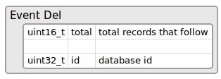
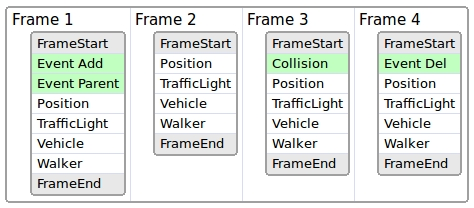

# Recorder Binary File Format

The recorder system saves all the info needed to replay the simulation in a binary file,
using little endian byte order for the multibyte values.

*   [__1- Strings in binary__](#1-strings-in-binary)  
*   [__2- Info header__](#2-info-header)  
*   [__3- Packets__](#3-packets)  
	*   [Packet 0 - Frame Start](#packet-0-frame-start)  
	*   [Packet 1 - Frame End](#packet-1-frame-end)  
	*   [Packet 2 - Event Add](#packet-2-event-add)  
	*   [Packet 3 - Event Del](#packet-3-event-del)  
	*   [Packet 4 - Event Parent](#packet-4-event-parent)  
	*   [Packet 5 - Event Collision](#packet-5-event-collision)  
	*   [Packet 6 - Position](#packet-6-position)  
	*   [Packet 7 - TrafficLight](#packet-7-trafficlight)  
	*   [Packet 8 - Vehicle Animation](#packet-8-vehicle-animation)  
	*   [Packet 9 - Walker Animation](#packet-9-walker-animation)  
*   [__4- Frame Layout__](#4-frame-layout)  
*   [__5- File Layout__](#5-file-layout)  

In the next image representing the file format, we can get a quick view of all the detailed
information. Each part that is visualized in the image will be explained in the following sections:

In summary, the file format has a small header with general info
(version, magic string, date and the map used) and a collection of packets of different types
(currently we use 10 types, but that will continue growing up in the future).

---
## 1- Strings in binary

Strings are encoded first with the length of it, followed by its characters without null
character ending. For example, the string 'Town06' will be saved
as hex values: 06 00 54 6f 77 6e 30 36

---
## 2- Info header

The info header has general information about the recorded file. Basically, it contains the version
and a magic string to identify the file as a recorder file. If the header changes then the version
will change also. Furthermore, it contains a date timestamp, with the number of seconds from the
Epoch 1900, and also it contains a string with the name of the map that has been used for recording.

A sample info header is:

---
## 3- Packets

Each packet starts with a little header of two fields (5 bytes):

* **id**: The packet type
* **size**: Size of packet data

Header information is then followed by the **data**.
The **data** is optional, a **size** of 0 means there is no **data** in the packet.
If the **size** is greater than 0 it means that the packet has **data** bytes. Therefore,
the **data** needs to be reinterpreted depending on the type of the packet.

The header of the packet is useful because we can just ignore those packets we are not interested
in when doing playback. We only need to read the header (first 5 bytes) of the packet and jump to
the next packet just skipping the data of the packet:

The types of packets are:

We suggest to use **id** over 100 for user custom packets, because this list will keep growing in
the future.

### Packet 0 - Frame Start

This packet marks the start of a new frame, and it will be the first one to start each frame.
All packets need to be placed between a **Frame Start** and a **Frame End**.

So, elapsed + durationThis = elapsed time for next frame

### Packet 1 - Frame End

This frame has no data and it only marks the end of the current frame. That helps the replayer
to know the end of each frame just before the new one starts.
Usually, the next frame should be a Frame Start packet to start a new frame.

### Packet 2 - Event Add

This packet says how many actors we need to create at current frame.

The field **total** says how many records follow. Each record starts with the **id** field,
that is the id the actor has when it was recorded (on playback that id could change internally,
but we need to use this id ). The **type** of actor can have these possible values:

  * 0 = Other
  * 1 = Vehicle
  * 2 = Walker
  * 3 = TrafficLight
  * 4 = INVALID

After that, the **location** and the **rotation** where we want to create the actor is proceeded.

Right after we have the **description** of the actor. The description **uid** is the numeric id of
the description and the **id** is the textual id, like 'vehicle.seat.leon'.

Then comes a collection of its **attributes** like color, number of wheels, role, etc.
The number of attributes is variable and should look similar to this:

* number_of_wheels = 4
* sticky_control = true
* color = 79,33,85
* role_name = autopilot

### Packet 3 - Event Del

This packet says how many actors need to be destroyed this frame.

It has the **total** of records, and each record has the **id** of the actor to remove.

For example, this packet could be like this:

The number 3 identifies the packet as (Event Del). The number 16 is the size of the data of
the packet (4 fields of 4 bytes each). So if we don't want to process this packet, we could skip
the next 16 bytes and will be directly to the start of the next packet.
The next 3 says the total records that follows, and each record is the id of the actor to remove.
So, we need to remove at this frame the actors 100, 101 and 120.

### Packet 4 - Event Parent

This packet says which actor is the child of another (the parent).

The first id is the child actor, and the second one will be the parent actor.

### Packet 5 - Event Collision

If a collision happens between two actors, it will be registered in this packet. Currently only
actors with a collision sensor will report collisions, so currently only hero vehicles have that
sensor attached automatically.

The **id** is just a sequence to identify each collision internally.
Several collisions between the same pair of actors can happen in the same frame, because physics
frame rate is fixed and usually there are several physics substeps in the same rendered frame.

### Packet 6 - Position

This packet records the position and orientation of all actors of type **vehicle** and
**walker** that exist in the scene.

### Packet 7 - TrafficLight

This packet records the state of all **traffic lights** in the scene. Which means that it
stores the state (red, orange or green) and the time it is waiting to change to a new state.

### Packet 8 - Vehicle animation

This packet records the animation of the vehicles, bikes and cycles. This packet stores the
**throttle**, **sterring**, **brake**, **handbrake** and **gear** inputs, and then set them at playback.

### Packet 9 - Walker animation

This packet records the animation of the walker. It just saves the **speed** of the walker
that is used in the animation.

---
## 4- Frame Layout

A frame consists of several packets, where all of them are optional, except the ones that
have the **start** and **end** in that frame, that must be there always.

**Event** packets exist only in the frame where they happen.

**Position** and **traffic light** packets should exist in all frames, because they are
required to move all actors and set the traffic lights to its state.
They are optional but if they are not present then the replayer will not be able to move
or set the state of traffic lights.

The **animation** packets are also optional, but by default they are recorded. That way the walkers
are animated and also the vehicle wheels follow the direction of the vehicles.

---
## 5- File Layout

The layout of the file starts with the **info header** and then follows a collection of packets in
groups. The first in each group is the **Frame Start** packet, and the last in the group is
the **Frame End** packet. In between, we can find the rest of packets as well.

Usually, it is a good idea to have all packets regarding events first, and then the packets
regarding position and state later.

The event packets are optional, since they appear when they happen, so we could have a layout
like this one:

In **frame 1** some actors are created and reparented, so we can observe its events in the image.
In **frame 2** there are no events. In **frame 3** some actors have collided so the collision event
appears with that info. In **frame 4** the actors are destroyed.
