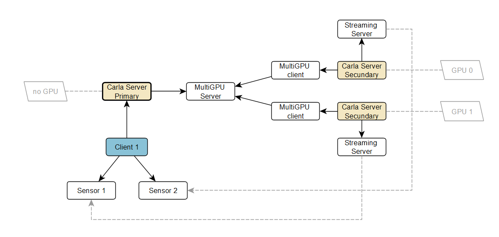

# Carla 멀티 GPU 기능

Carla에서 멀티 GPU란 사용자가 여러 서버(보조 서버라고 함)를 시작하여 시스템의 전용 GPU를 사용해 메인 서버(기본 서버라고 함)의 렌더링 작업을 수행할 수 있다는 것을 의미합니다. 기본 서버는 사용자가 생성한 센서들을 사용 가능한 여러 보조 서버에 분산시킵니다.

먼저 기본 서버를 시작해야 합니다(일반적으로 GPU 사용을 피하기 위한 플래그와 함께). 이 서버는 모든 물리 연산을 처리하고 장면 데이터를 다른 보조 서버들과 동기화합니다. 그런 다음 원하는 만큼의 보조 서버를 시작할 수 있습니다(일반적으로 시스템의 전용 GPU당 하나씩). 이후 클라이언트는 (항상 기본 서버에) 연결하여 평소와 같이 진행할 수 있습니다.
이 모든 시스템은 사용자에게 투명하게 작동하며, 사용자는 어느 서버에서 센서 데이터가 오는지 알 필요가 없이 보조 서버로부터 직접 데이터를 받기만 하면 됩니다.

## 기본 서버

첫 번째 단계는 렌더링 기능 없이 기본 서버를 시작하는 것입니다.
사용할 수 있는 매개변수는 다음과 같습니다:
* `-nullrhi`: 모든 렌더링 기능을 비활성화합니다 (GPU 미사용)
* `-carla-primary-port`: 보조 서버의 연결을 대기하는 TCP 포트 (기본값 2002)

예시:

**./CarlaUE4.sh -nullrhi**

기본 서버는 기본적으로 포트 2002를 사용하여 보조 서버의 연결을 대기합니다. 다른 포트에서 대기해야 하는 경우 다음과 같이 플래그를 사용하여 변경할 수 있습니다.

**./CarlaUE4.sh -nullrhi -carla-primary-port=3002**

## 보조 서버

그 다음 원하는 만큼의 서버를 시작할 수 있지만, 이상적으로는 GPU 수만큼의 보조 서버를 갖는 것이 좋습니다. 매개변수를 통해 서버가 사용할 GPU와 기본 서버가 대기 중인 호스트/포트를 지정해야 합니다. 사용할 수 있는 플래그는 다음과 같습니다:
  * `-carla-rpc-port`: 클라이언트 연결을 수락하는 TCP 포트 (보조 서버에는 필요하지 않지만, 포트는 사용 가능해야 함)
  * `-carla-primary-host`: 연결할 기본 서버의 IP
  * `-carla-primary-port`: 연결할 기본 서버의 TCP 포트
  * `-ini:[/Script/Engine.RendererSettings]:r.GraphicsAdapter`: 이 보조 서버가 사용할 GPU 장치를 지정

예를 들어, 기본 서버가 보조 서버와 같은 컴퓨터에서 기본 포트로 실행 중인 경우 다음과 같이 사용할 수 있습니다:

**./CarlaUE4.sh -carla-rpc-port=3000 -carla-primary-host=127.0.0.1 -ini:[/Script/Engine.RendererSettings]:r.GraphicsAdapter=0**

여기서 보조 서버는 다른 포트와의 충돌을 피하기 위해 RPC 서버로 포트 3000을 사용하고(하지만 실제로는 사용되지 않음), 기본 포트(2002)의 IP 127.0.0.1(localhost)에 위치한 기본 서버에 연결하며, GPU 장치 0을 사용합니다.

같은 기계에서 다른 GPU를 사용하여 또 다른 보조 서버를 시작하려면 다음 명령을 사용할 수 있습니다:

**./CarlaUE4.sh -carla-rpc-port=4000 -carla-primary-host=127.0.0.1 -carla-primary-port=2002 -ini:[/Script/Engine.RendererSettings]:r.GraphicsAdapter=1**

이 보조 서버는 다른 포트와의 충돌을 피하기 위해 RPC 서버로 포트 4000을 사용하고, 포트 2002의 IP 127.0.0.1에 위치한 기본 서버에 연결하며, GPU 장치 1을 사용합니다.

## 동기 모드

첫 번째 보조 서버가 기본 서버에 연결되면, 시스템은 자동으로 1/20 델타 초의 기본값으로 동기 모드로 설정됩니다.