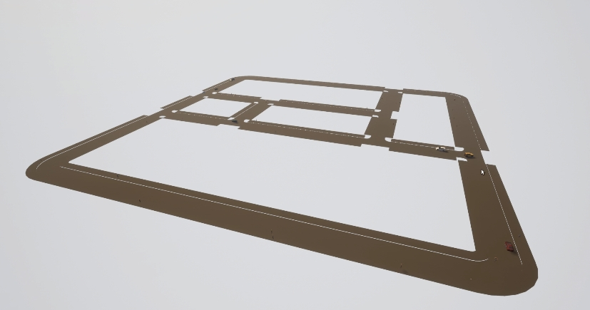
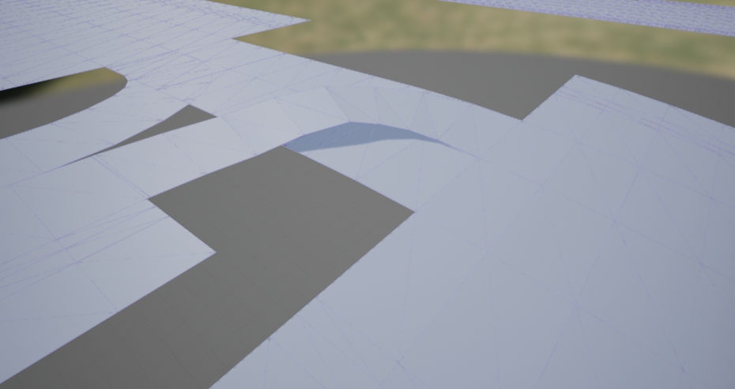

# ASAM OpenDRIVE 단독 모드

이 기능을 통해 사용자는 모든 ASAM OpenDRIVE 파일을 즉시 CARLA 맵으로 사용할 수 있습니다. 이를 위해 시뮬레이터는 액터가 탐색할 수 있는 도로 메시를 자동으로 생성합니다.

*   [__개요__](#개요)  
*   [__단독 맵 실행__](#단독-맵-실행)  
*   [__메시 생성__](#메시-생성)  

---
## 개요

이 모드는 추가 기하학이나 에셋 없이 OpenDRIVE 파일만을 사용하여 완전한 시뮬레이션을 실행합니다. 이를 위해 시뮬레이터는 OpenDRIVE 파일을 가져와서 시뮬레이션을 실행할 임시 3D 메시를 절차적으로 생성합니다.

생성된 메시는 도로 정의를 최소한으로 설명합니다. 모든 요소는 OpenDRIVE 파일과 일치하지만, 그 외에는 빈 공간만 있습니다. 차량이 도로에서 떨어지는 것을 방지하기 위해 두 가지 조치가 취해졌습니다.

*   차량의 흐름이 가장 복잡한 교차로에서는 차선이 약간 더 넓습니다.
*   도로 경계에 가시적인 벽이 만들어져 최후의 안전 조치 역할을 합니다.

신호등, 정지 표지판, 양보 표지판이 즉시 생성됩니다. 보행자는 맵에 나타나는 보도와 횡단보도 위를 이동합니다. 이러한 모든 요소와 도로의 모든 세부 사항은 OpenDRIVE 파일을 기반으로 합니다. 단독 모드는 `.xodr`을 직접 사용하므로 파일의 문제가 시뮬레이션에 전파됩니다. 이는 특히 많은 차선이 혼합되는 교차로에서 문제가 될 수 있습니다.

!!! 중요
    OpenDRIVE 파일을 재차 확인하는 것이 특히 중요합니다. 파일의 모든 문제는 시뮬레이션 실행 시 전파됩니다.



---
## 단독 맵 실행

ASAM OpenDRIVE 파일을 열려면 API를 통해 [`client.generate_opendrive_world()`](python_api.md#carla.Client.generate_opendrive_world)를 호출하기만 하면 됩니다. 이는 새로운 맵을 생성하고 준비될 때까지 시뮬레이션을 차단합니다. 이 메서드에는 두 개의 매개변수가 필요합니다.

*   __`opendrive`__ 는 문자열로 파싱된 ASAM OpenDRIVE 파일의 내용입니다.
*   __`parameters`__ 는 메시 생성을 위한 설정이 포함된 [carla.OpendriveGenerationParameters](python_api.md#carla.OpendriveGenerationParameters)입니다. __이 인수는 선택사항입니다__.

	*   __`vertex_distance`__ *(기본값 2.0 미터)* — 메시 정점 사이의 거리. 거리가 클수록 메시가 부정확해집니다. 하지만 거리가 너무 작으면 결과 메시가 작업하기에 너무 무거워집니다.
	*   __`max_road_length`__ *(기본값 50.0 미터)* — 메시 부분의 최대 길이. 메시는 렌더링 오버헤드를 줄이기 위해 부분으로 나뉩니다. 부분이 보이지 않으면 UE는 이를 렌더링하지 않습니다. 부분이 작을수록 폐기될 가능성이 높습니다. 하지만 부분이 너무 작으면 UE가 관리할 객체가 너무 많아져 성능도 영향을 받습니다.
	*   __`wall_height`__ *(기본값 1.0 미터)* — 도로 경계에 생성되는 추가 벽의 높이. 이는 차량이 빈 공간으로 떨어지는 것을 방지합니다.
	*   __`additional_width`__ *(기본값 0.6 미터, 각 측면에 0.3)* — 교차로 차선에 적용되는 작은 폭 증가. 이는 차량이 떨어지는 것을 방지하기 위한 안전 조치입니다.
	*   __`smooth_junctions`__ *(기본값 True)* — __True__인 경우, 교차로에서 최종 메시를 부드럽게 만들기 위해 OpenDRIVE의 일부 정보가 재해석됩니다. 이는 여러 차선이 만나는 곳에서 발생할 수 있는 부정확성을 방지하기 위해 수행됩니다. __False__로 설정하면 메시는 OpenDRIVE에 설명된 대로 정확히 생성됩니다.
	*   __`enable_mesh_visibility`__ *(기본값 True)* — __False__인 경우, 메시가 렌더링되지 않아 시뮬레이터의 렌더링 작업을 많이 절약할 수 있습니다.


이 기능을 쉽게 테스트하기 위해 `PythonAPI/util/`의 `config.py` 스크립트에 새로운 인수 `-x` 또는 `--xodr-path`가 추가되었습니다. 이 인수는 `path/example.xodr`와 같이 `.xodr` 파일의 경로를 포함하는 문자열을 기대합니다. 이 스크립트로 메시를 생성하면 항상 기본 매개변수가 사용됩니다.

이 기능은 CARLA에서 제공하는 새로운 __TownBig__으로 테스트할 수 있습니다.

```sh
python3 config.py -x opendrive/TownBig.xodr
```

!!! 중요
    __[client.generate_opendrive_world()](python_api.md#carla.Client.generate_opendrive_world)__ 는 __문자열로 파싱된 OpenDRIVE 파일의 내용__을 사용합니다. 반면 __`config.py`__ 스크립트는 __`.xodr` 파일의 경로__가 필요합니다.

!!! 참고
	`opendrive could not be correctly parsed` 오류가 발생하면 `CarlaUE4/Content/Carla/Maps/OpenDrive/` 디렉토리에 쓰기 권한이 있는지 확인하세요. 이는 서버가 `xodr` 파일을 올바르게 파싱하는 데 필요합니다.

---
## 메시 생성

메시의 생성은 이 모드의 핵심 요소입니다. 결과 메시가 부드럽고 정의와 완벽하게 일치해야만 이 기능이 성공할 수 있습니다. 이러한 이유로 이 단계는 지속적으로 개선되고 있습니다. 최근 반복에서는 특히 불균일한 차선이 만나는 곳에서 발생하는 부정확성을 피하기 위해 교차로를 개선했습니다.


<div style="text-align: right"><i>교차로 메시를 생성할 때 높은 차선이 아래 차선을 막는 경향이 있습니다. <br><code>smooth_junctions</code> 매개변수는 이러한 종류의 문제를 방지합니다.</i></div>

또한 전체 맵을 하나의 메시로 만드는 대신 다른 부분들이 생성됩니다. 메시를 나눔으로써 시뮬레이터는 보이지 않는 부분의 렌더링을 피하고 비용을 절약할 수 있습니다. 작은 단위로 작업하면 큰 맵을 생성하고 메시의 작은 부분에서 발생할 수 있는 문제를 제한할 수도 있습니다.

메시 생성의 현재 상태와 관련하여 몇 가지 고려 사항을 염두에 두어야 합니다.

*   __교차로 스무딩__. 기본 스무딩은 위에서 설명한 기울어진 교차로의 문제를 방지합니다. 하지만 이 과정에서 원본 메시가 수정됩니다. 선호하는 경우 `smooth_junctions`를 __False__로 설정하여 스무딩을 비활성화할 수 있습니다.
*   __측면 경사__. 이 기능은 현재 CARLA에 통합되어 있지 않습니다.
*   __보도 높이__. 현재 모든 보도에 대해 동일한 값이 하드코딩되어 있습니다. 충돌이 감지되려면 보도가 도로 레벨보다 높아야 하지만 RoadRunner는 이 값을 OpenDRIVE 파일로 내보내지 않습니다. 충돌을 보장하기 위해 높이가 하드코딩되어 있습니다.
---

지금까지 OpenDRIVE 단독 모드에 대해 알아야 할 모든 내용을 다루었습니다. 이 기회를 활용하여 모든 OpenDRIVE 맵을 CARLA에서 테스트해보세요.

궁금한 점이나 제안 사항은 포럼에서 논의하세요.

<div class="build-buttons">
<p>
<a href="https://github.com/carla-simulator/carla/discussions/" target="_blank" class="btn btn-neutral" title="CARLA 포럼으로 이동">
CARLA 포럼</a>
</p>
</div>