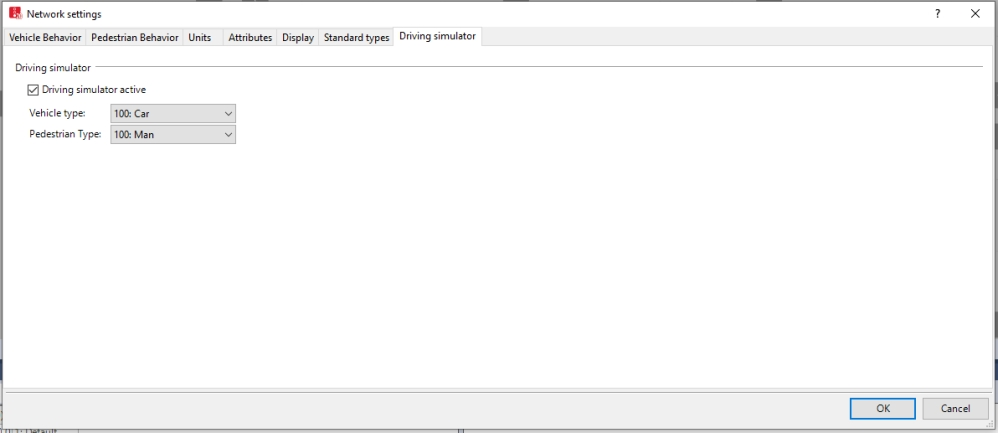

# PTV-Vissim 코시뮬레이션

CARLA는 PTV-Vissim과의 코시뮬레이션 기능을 개발했습니다. 이를 통해 작업을 원하는 대로 분산하고 각 시뮬레이션의 기능을 사용자에게 유리하게 활용할 수 있습니다.

*   [__필수 요구사항__](#필수-요구사항)  
*   [__코시뮬레이션 실행__](#코시뮬레이션-실행)  
    *   [새 네트워크 생성](#새-네트워크-생성)  

---
## 필수 요구사항

코시뮬레이션을 실행하기 위해서는 두 가지가 필요합니다.

*   [__PTV-Vissim 시뮬레이터__](https://www.ptvgroup.com/en/solutions/products/ptv-vissim/) 라이센스 구매. Driving Simulator Interface 애드온을 구매해야 합니다.
*   PTV-Vissim 설치 폴더에서 `DrivingSimulatorProxy.dll`을 찾아 `C:\Windows\System32`로 이동시킵니다.

---
## 코시뮬레이션 실행

이 기능과 관련된 모든 것은 `Co-Simulation/PTV-Vissim`에서 찾을 수 있습니다. CARLA는 __Town01__과 __Town03__에 대한 네트워크가 포함된 몇 가지 예제를 제공합니다.

코시뮬레이션을 실행하려면 `PTV-Vissim/run_synchronization.py` 스크립트를 사용하세요. 이 스크립트에는 PTV-Vissim 네트워크를 포함하는 하나의 필수 인수와 몇 가지 선택적 인수가 있습니다.

*   `vissim_network` — Vissim 네트워크 파일. 예제이거나 직접 만든 PTV-Vissim 네트워크일 수 있습니다.
*   `--carla-host` *(기본값: 127.0.0.1)* — CARLA 호스트 서버의 IP.
*   `--carla-port` *(기본값: 2000)* — 수신할 TCP 포트.
*   `--vissim-version` *(기본값: 2020)* — PTV-Vissim 버전.
*   `--step-length` *(기본값: 0.05s)* — 시뮬레이션 타임스텝의 고정 델타 초를 설정.
*   `--simulator-vehicles` *(기본값: 1)* — CARLA에서 스폰되어 PTV-Vissim으로 전달될 차량의 수.

```sh
python3 run_synchronization.py examples/Town03/Town03.inpx
```
!!! 경고
    코시뮬레이션을 중지하려면 스크립트를 실행한 터미널에서 `Ctrl+C`를 누르세요.

두 시뮬레이션은 동기적으로 실행됩니다. 한 시뮬레이터에서 발생하는 행동이나 이벤트는 다른 시뮬레이터로 전파됩니다. 현재까지 이 기능은 차량 이동과 스폰만을 포함합니다. 스폰은 PTV-Vissim 유형으로 인해 제한됩니다.
*   CARLA에서 차량이 스폰되고 PTV-Vissim의 *Vehicle Type*이 `car`로 설정된 경우, 자동차가 스폰됩니다. CARLA에서 오토바이였더라도 상관없습니다. 제공된 예제에서 차량 유형은 `car`로 설정되어 있습니다.
*   PTV-Vissim에서 차량이 스폰되면 CARLA는 동일한 유형의 차량을 사용합니다. 크기와 특성은 비슷하지만 정확히 동일하지는 않습니다.

### 새 네트워크 생성 

새로운 PTV-Vissim 네트워크를 CARLA와 함께 실행하기 위해서는 몇 가지 설정이 필요합니다.

* __주행 시뮬레이터 활성화__. `Base Data/Network settings/Driving simulator`로 이동하여 옵션을 활성화합니다.
* __차량 및 보행자 유형 지정__. 이는 CARLA에서 수행된 스폰과 동기화하기 위해 PTV-Vissim에서 사용될 유형입니다. 기본적으로 비어 있습니다.
* __네트워크를 `.inpx`로 내보내기__. 네트워크를 만들고, 내보낸 다음, `run_synchronization.py`로 코시뮬레이션을 실행합니다.


<div style="text-align: right"><i>CARLA에서 스폰되는 모든 차량은 이러한 유형을 사용하여 PTV-Vissim에서 스폰됩니다.</i></div>

!!! 경고
    보행자와 차량 유형이 비어 있으면 PTV-Vissim이 충돌합니다.

---

지금까지 CARLA와의 PTV-Vissim 코시뮬레이션에 대해 알아보았습니다.

CARLA를 열고 잠시 실험해보세요. 궁금한 점이 있다면 포럼에 자유롭게 게시하세요.

<div class="build-buttons">
<p>
<a href="https://github.com/carla-simulator/carla/discussions/" target="_blank" class="btn btn-neutral" title="CARLA 포럼으로 이동">
CARLA 포럼</a>
</p>
</div>