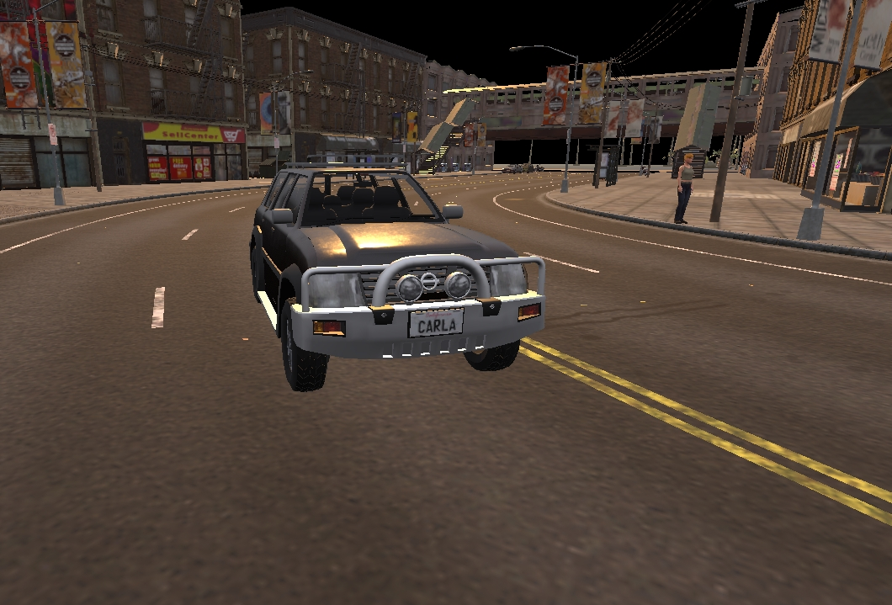

# 렌더링 옵션

이 가이드에서는 CARLA에서 사용 가능한 다양한 렌더링 옵션을 설명합니다. 품질 레벨, 렌더링 없는 모드, 오프스크린 모드를 포함하며, CARLA 버전 0.9.12가 이전 버전과 어떻게 다른지도 설명합니다.

- [__그래픽 품질__](#graphics-quality)
    - [Vulkan 그래픽 API](#vulkan-graphics-api)
    - [품질 레벨](#quality-levels)
- [__렌더링 없는 모드__](#no-rendering-mode)
- [__오프스크린 모드__](#off-screen-mode)
    - [오프스크린과 렌더링 없는 모드 비교](#off-screen-vs-no-rendering)
    - [오프스크린 모드 설정 (버전 0.9.12+)](#setting-off-screen-mode-version-0912)
    - [오프스크린 모드 설정 (0.9.12 이전 버전)](#setting-off-screen-mode-versions-prior-to-0912)

!!! Important
    아래의 일부 명령 옵션은 CARLA 패키지 릴리스에서 동일하지 않습니다. 이에 대해 자세히 알아보려면 [명령줄 옵션](start_quickstart.md#command-line-options) 섹션을 참조하세요.

---
## 그래픽 품질

### Vulkan 그래픽 API

버전 0.9.12부터 CARLA는 Vulkan 그래픽 API만 지원하는 언리얼 엔진 4.26에서 실행됩니다. 이전 버전의 CARLA는 OpenGL을 사용하도록 구성할 수 있었습니다. 이전 버전의 CARLA를 사용하고 계시다면, 화면 오른쪽 하단에서 해당 문서 버전을 선택하여 자세한 정보를 확인하세요.

### 품질 레벨

CARLA에는 두 가지 그래픽 품질 레벨이 있습니다. __Epic__이 기본값이며 가장 상세한 수준입니다. __Low__는 모든 후처리와 그림자를 비활성화하고 그리기 거리를 무한대 대신 50m로 설정합니다.

시뮬레이션은 __Low__ 모드에서 훨씬 더 빠르게 실행됩니다. 이는 기술적 제한이 있거나, 정밀도가 중요하지 않은 상황, 또는 더 단순한 데이터나 가까운 요소만 포함하는 조건에서 에이전트를 훈련할 때 유용합니다.
아래 이미지들은 두 모드를 비교합니다. 사용되는 플래그는 Windows와 Linux에서 동일합니다. 빌드 작업 시에는 동일한 옵션이 없지만, UE 에디터에는 자체 품질 설정이 있습니다. 원하는 품질을 더 세밀하게 사용자 지정하려면 `Settings/Engine Scalability Settings`로 이동하세요.

#### Epic 모드
`./CarlaUE4.sh -quality-level=Epic`


*Epic 모드 스크린샷*

#### Low 모드
`./CarlaUE4.sh -quality-level=Low`


*Low 모드 스크린샷*

<br>

!!! Important
    Epic 모드에서 비정상적인 백색도를 보이던 문제는 수정되었습니다. 문제가 계속되면 `GameUserSettings.ini`를 삭제하세요. 이 파일은 이전 설정을 저장하고 있으며, 다음 실행 시 다시 생성됩니다. __Ubuntu 경로:__ `~/.config/Epic/CarlaUE4/Saved/Config/LinuxNoEditor/` __Windows 경로:__ `<Package folder>\WindowsNoEditor\CarlaUE4\Saved\Config\WindowsNoEditor\`

---
## 렌더링 없는 모드

이 모드는 렌더링을 비활성화합니다. 언리얼 엔진은 그래픽과 관련된 모든 것을 건너뜁니다. 이 모드는 렌더링 오버헤드를 방지합니다. 매우 높은 빈도로 교통 시뮬레이션과 도로 동작을 쉽게 수행할 수 있습니다. 렌더링 없는 모드를 활성화하거나 비활성화하려면 월드 설정을 변경하거나 `/PythonAPI/util/config.py`에 제공된 스크립트를 사용하세요.

아래는 스크립트를 통해 이를 활성화한 다음 비활성화하는 예시입니다:

```py
settings = world.get_settings()
settings.no_rendering_mode = True
world.apply_settings(settings)
...
settings.no_rendering_mode = False
world.apply_settings(settings)
```

명령줄을 통해 렌더링을 비활성화하고 활성화하려면 다음 명령을 실행하세요:

```sh
cd PythonAPI/util && python3 config.py --no-rendering
```
```sh
cd PythonAPI/util && python3 config.py --rendering
```
`PythonAPI/examples/no_rendering_mode.py` 스크립트는 렌더링 없는 모드를 활성화하고 __Pygame__을 사용하여 간단한 그래픽으로 공중 뷰를 생성합니다:

```sh
cd PythonAPI/examples && python3 no_rendering_mode.py
```

!!! Warning
    렌더링 없는 모드에서는 카메라와 GPU 센서가 빈 데이터를 반환합니다. GPU는 사용되지 않습니다. 언리얼 엔진이 어떤 장면도 그리지 않습니다.

---
## 오프스크린 모드

버전 0.9.12부터 CARLA는 오프스크린 렌더링을 지원하는 언리얼 엔진 4.26에서 실행됩니다. 이전 버전의 CARLA에서는 오프스크린 렌더링이 사용하는 그래픽 API에 따라 달라졌습니다.

### 오프스크린 vs 렌더링 없는 모드

__렌더링 없는 모드__와 __오프스크린 모드__ 사이의 차이를 이해하는 것이 중요합니다:

- __렌더링 없는 모드:__ 언리얼 엔진이 아무것도 렌더링하지 않습니다. 그래픽이 계산되지 않습니다. GPU 기반 센서는 빈 데이터를 반환합니다.
- __오프스크린 모드:__ 언리얼 엔진이 평소처럼 작동하며, 렌더링은 계산되지만 디스플레이가 없습니다. GPU 기반 센서는 데이터를 반환합니다.

### 오프스크린 모드 설정 (버전 0.9.12+)

CARLA를 오프스크린 모드로 시작하려면 다음 명령을 실행하세요:

```sh
./CarlaUE4.sh -RenderOffScreen
```

### 오프스크린 모드 설정 (0.9.12 이전 버전)

오프스크린 모드 사용은 OpenGL 또는 Vulkan을 사용하는지에 따라 다릅니다.

__OpenGL__을 사용할 때는 Linux에서 다음 명령을 실행하여 오프스크린 모드로 실행할 수 있습니다:

```sh
# Linux
DISPLAY= ./CarlaUE4.sh -opengl
```
__Vulkan__은 제대로 작동하기 위해 X11 네트워크 프로토콜을 사용하여 디스플레이 X 서버와 통신해야 하므로 추가 단계가 필요합니다. 다음 단계들은 CARLA가 Vulkan과 함께 실행될 수 있도록 디스플레이가 없는 Ubuntu 18.04 머신을 설정하는 방법을 안내합니다.

__1. 최신 NVIDIA 드라이버 가져오기:__

```sh
wget http://download.nvidia.com/XFree86/Linux-x86_64/450.57/NVIDIA-Linux-x86_64-450.57.run
```

__2. 드라이버 설치:__

```sh
sudo /bin/bash NVIDIA-Linux-x86_64-450.57.run --accept-license --no-questions --ui=none
```

__3. xserver 관련 의존성 설치:__

```sh
sudo apt-get install -y xserver-xorg mesa-utils libvulkan1
```

__4. xserver 구성:__

```sh
sudo nvidia-xconfig --preserve-busid -a --virtual=1280x1024
```

__5. SDL_VIDEODRIVER 변수 설정:__

```sh
ENV SDL_VIDEODRIVER=x11
```

__6. xserver 실행:__

```sh
sudo X :0 &
```

__7. CARLA 실행:__

```sh
DISPLAY=:0.GPU ./CarlaUE4.sh -vulkan
```

CARLA는 위의 모든 단계를 수행하는 Dockerfile을 [여기](https://github.com/carla-simulator/carla/blob/0.9.12/Util/Docker/Release.Dockerfile)에서 제공합니다.

---

이 주제와 관련된 모든 문제나 의문사항은 CARLA 포럼에 게시할 수 있습니다.

<div class="build-buttons">
<p>
<a href="https://github.com/carla-simulator/carla/discussions/" target="_blank" class="btn btn-neutral" title="CARLA 포럼으로 이동">
CARLA 포럼</a>
</p>
</div>