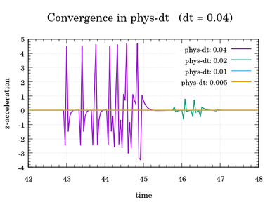

# 동기화와 시간 단계

이 섹션에서는 CARLA의 두 가지 기본 개념을 다룹니다. 이들의 구성은 시뮬레이션에서 시간이 어떻게 흐르고, 서버가 어떻게 시뮬레이션을 진행시키는지를 정의합니다.

* [__시뮬레이션 시간 단계__](#simulation-time-step)
    * [가변 시간 단계](#variable-time-step)
    * [고정 시간 단계](#fixed-time-step)
    * [시뮬레이션 녹화 시 팁](#tips-when-recording-the-simulation)
    * [물리 서브스테핑](#physics-substepping)
* [__클라이언트-서버 동기화__](#client-server-synchrony)
    * [동기 모드 설정](#setting-synchronous-mode)
    * [동기 모드 사용](#using-synchronous-mode)
* [__가능한 구성__](#possible-configurations)
* [__물리 결정론__](#physics-determinism)

---
## 시뮬레이션 시간 단계

실제 시간과 시뮬레이션 시간 사이에는 차이가 있습니다. 시뮬레이션 세계는 서버에 의해 진행되는 자체 시계와 시간을 가지고 있습니다. 두 시뮬레이션 단계를 계산하는 데는 실제 시간이 걸립니다. 하지만, 그 두 시뮬레이션 순간 사이에 경과한 시간인 시간 단계도 있습니다.

명확히 하자면, 서버는 시뮬레이션의 두 단계를 계산하는 데 몇 밀리초가 걸릴 수 있습니다. 하지만, 이 두 시뮬레이션 순간 사이의 시간 단계는 예를 들어 항상 1초가 되도록 구성할 수 있습니다.

시간 단계는 사용자 선호도에 따라 고정되거나 가변적일 수 있습니다.

!!! Note
    시간 단계와 동기화는 서로 연관된 개념입니다. CARLA가 어떻게 작동하는지 완전히 이해하려면 두 섹션을 모두 읽어보세요.
### 가변 시간 단계

CARLA의 기본 모드입니다. 단계 사이에 흐르는 시뮬레이션 시간은 서버가 이를 계산하는 데 걸리는 시간이 됩니다.

```py
settings = world.get_settings()
settings.fixed_delta_seconds = None # 가변 시간 단계 설정
world.apply_settings(settings)
```

`PythonAPI/util/config.py`는 인자를 사용하여 시간 단계를 설정합니다. 0은 가변 시간 단계를 의미합니다.
```sh
cd PythonAPI/util && python3 config.py --delta-seconds 0
```

### 고정 시간 단계

단계 사이의 경과 시간이 일정하게 유지됩니다. 0.5초로 설정하면 시뮬레이션된 1초당 2개의 프레임이 있게 됩니다. 각 단계에서 동일한 시간 증분을 사용하는 것은 시뮬레이션에서 데이터를 수집하는 가장 좋은 방법입니다. 물리와 센서 데이터는 시뮬레이션의 이해하기 쉬운 순간에 해당하게 됩니다. 또한 서버가 충분히 빠르다면, 더 적은 실제 시간으로 더 긴 시간 기간을 시뮬레이션하는 것이 가능합니다.

고정 델타 초는 월드 설정에서 설정할 수 있습니다. 0.05초의 고정 시간 단계로 시뮬레이션을 실행하려면 다음 설정을 적용하세요. 이 경우 시뮬레이터는 시뮬레이션된 세계의 1초를 재현하기 위해 20단계(1/0.05)를 수행합니다.

```py
settings = world.get_settings()
settings.fixed_delta_seconds = 0.05
world.apply_settings(settings)
```

이는 제공된 스크립트 `PythonAPI/util/config.py`를 사용하여 설정할 수도 있습니다.

```sh
cd PythonAPI/util && python3 config.py --delta-seconds 0.05
```
### 시뮬레이션 녹화 시 팁

CARLA에는 시뮬레이션을 녹화하고 재연할 수 있게 해주는 [recorder 기능](adv_recorder.md)이 있습니다. 하지만 정밀도를 추구할 때는 몇 가지 고려해야 할 사항이 있습니다.

* ___고정 시간 단계___를 사용하면 재연하기가 쉽습니다. 서버를 원본 시뮬레이션에서 사용된 것과 동일한 시간 단계로 설정할 수 있습니다.

* ___가변 시간 단계___를 사용하면 상황이 조금 더 복잡해집니다.

    * __서버가 가변 시간 단계로 실행되는 경우__, 로직 사이클이 매번 다르기 때문에 시간 단계가 원본과 다를 것입니다. 그러면 정보는 기록된 데이터를 사용하여 보간됩니다.

    * __서버가 정확히 동일한 시간 단계를 재현하도록 강제되는 경우__, 시뮬레이션되는 단계는 동일하지만 그 사이의 실제 시간은 변경됩니다. 시간 단계는 하나씩 전달되어야 합니다. 이러한 원본 시간 단계는 원본 시뮬레이션이 가능한 한 빠르게 실행된 결과였습니다. 이를 표현하는 데 걸리는 시간이 대부분 다르기 때문에, 시뮬레이션은 이상한 시간 변동과 함께 재현될 수밖에 없습니다.

    * 가변 시간 단계가 도입하는 __부동 소수점 산술 오류__도 있습니다. 시뮬레이션은 실제 시간과 동일한 시간 단계로 실행됩니다. 실제 시간은 시뮬레이션에서 `float` 값으로 표현되는 연속 변수이며, 이는 소수점 제한이 있습니다. 각 단계에서 잘리는 시간이 누적되어 시뮬레이션이 발생한 일을 정확하게 반복하는 것을 방해합니다.

### 물리 서브스테핑

물리는 정확성을 위해 매우 낮은 시간 단계 내에서 계산되어야 합니다. 이는 센서 렌더링과 같이 각 프레임에서 여러 계산을 수행하는 시뮬레이션의 델타 타임을 선택할 때 문제가 될 수 있습니다. 이 제한은 물리 시뮬레이션으로 인해서만 발생하므로, 물리적 계산에만 서브스텝을 적용할 수 있습니다. 이는 기본적으로 활성화되어 있으며 최대 물리적 델타 타임 0.01로 최대 10개의 물리 서브스텝을 갖도록 설정되어 있습니다.
이러한 옵션은 API를 통해 월드 설정에서 다음과 같이 변경할 수 있습니다:

```py
settings = world.get_settings()
settings.substepping = True
settings.max_substep_delta_time = 0.01
settings.max_substeps = 10
world.apply_settings(settings)
```

동기 모드를 설정하고 고정 시간 단계를 사용하는 경우 서브스테핑 옵션이 fixed_delta_seconds 값과 일관성이 있어야 한다는 점에 주의하세요. 다음 조건을 충족해야 합니다:
```py
fixed_delta_seconds <= max_substep_delta_time * max_substeps
```

최적의 물리 시뮬레이션을 위해서는 서브스텝 델타 타임이 최소한 `0.01666` 미만이어야 하며, 이상적으로는 `0.01` 미만이어야 합니다.

최적의 물리 서브스테핑의 효과를 보여주기 위해 다음 그래프들을 살펴보세요. 아래의 첫 번째 그래프는 서로 다른 고정 시뮬레이션 시간 단계를 가진 시뮬레이션에서의 시간에 따른 속도를 보여줍니다. 물리적 델타 타임은 모든 시뮬레이션에서 기본값인 `0.01`로 일정합니다. 속도가 시뮬레이션 시간 단계의 차이에만 영향을 받지 않는다는 것을 볼 수 있습니다.

>>>>>

두 번째 그래프는 `0.04`의 고정 시뮬레이션 시간 단계를 가진 시뮬레이션에서의 시간에 따른 속도를 보여줍니다. 물리적 델타 타임이 `0.01`을 초과하면 속도의 일관성에서 편차가 발생하기 시작하며, 물리적 델타 타임이 증가할수록 심각성이 증가하는 것을 볼 수 있습니다.

>>>>>

물리적 델타 타임이 `0.01` 이하일 때만 수렴이 일어나는 z-가속도 측정에서 고정 시뮬레이션 시간 단계에서 동일한 물리적 델타 타임의 차이 효과를 다시 보여줄 수 있습니다.

>>>>>
---
## 클라이언트-서버 동기화

CARLA는 클라이언트-서버 아키텍처를 기반으로 구축되었습니다. 서버는 시뮬레이션을 실행합니다. 클라이언트는 정보를 검색하고 월드의 변경을 요청합니다. 이 섹션에서는 클라이언트와 서버 간의 통신을 다룹니다.

기본적으로 CARLA는 __비동기 모드__로 실행됩니다. 서버는 클라이언트를 기다리지 않고 가능한 한 빠르게 시뮬레이션을 실행합니다. __동기 모드__에서는 서버가 다음 시뮬레이션 단계로 업데이트하기 전에 클라이언트의 틱(tick), 즉 "준비 완료" 메시지를 기다립니다.

!!! Note
    멀티클라이언트 아키텍처에서는 오직 하나의 클라이언트만 틱을 보내야 합니다. 서버는 모든 틱을 같은 클라이언트에서 온 것처럼 처리합니다. 많은 클라이언트 틱은 서버와 클라이언트 사이에 불일치를 만들 것입니다.

### 동기 모드 설정

동기 모드와 비동기 모드 사이의 전환은 단순한 불리언 상태의 문제입니다.
```py
settings = world.get_settings()
settings.synchronous_mode = True # 동기 모드 활성화
world.apply_settings(settings)
```

!!! Warning
    동기 모드가 활성화되어 있고 Traffic Manager가 실행 중인 경우, 이것도 동기 모드로 설정되어야 합니다. 방법을 알아보려면 [이 문서](adv_traffic_manager.md#synchronous-mode)를 읽어보세요.

동기 모드를 비활성화하려면 변수를 false로 설정하거나 스크립트 `PythonAPI/util/config.py`를 사용하세요.
```sh
cd PythonAPI/util && python3 config.py --no-sync # 동기 모드 비활성화
```

동기 모드는 스크립트를 사용하여 활성화할 수 없고, 오직 비활성화만 할 수 있습니다. 동기 모드를 활성화하면 서버가 클라이언트 틱을 기다리게 됩니다. 이 스크립트를 사용하면 사용자가 원하는 때에 틱을 보낼 수 없습니다.
### 동기 모드 사용

동기 모드는 특히 느린 클라이언트 애플리케이션과, 센서와 같은 다른 요소들 간의 동기화가 필요할 때 매우 중요해집니다. 클라이언트가 너무 느리고 서버가 기다리지 않으면 정보가 넘쳐날 것입니다. 클라이언트가 모든 것을 관리할 수 없어서 정보가 손실되거나 섞일 것입니다. 비슷한 맥락에서, 많은 센서가 있고 비동기화된 상태에서는 모든 센서가 시뮬레이션의 동일한 순간의 데이터를 사용하고 있는지 알 수 없을 것입니다.

다음 코드 조각은 이전의 것을 확장합니다. 클라이언트는 카메라 센서를 생성하고, 현재 단계의 이미지 데이터를 큐에 저장한 다음, 큐에서 이를 검색한 후 서버에 틱을 보냅니다. 여러 센서와 관련된 더 복잡한 예제는 [여기][syncmodelink]에서 찾을 수 있습니다.

```py
settings = world.get_settings()
settings.synchronous_mode = True
world.apply_settings(settings)

camera = world.spawn_actor(blueprint, transform)
image_queue = queue.Queue()
camera.listen(image_queue.put)

while True:
    world.tick()
    image = image_queue.get()
```
[syncmodelink]: https://github.com/carla-simulator/carla/blob/master/PythonAPI/examples/synchronous_mode.py

!!! Important
    GPU 기반 센서, 주로 카메라에서 오는 데이터는 일반적으로 몇 프레임의 지연으로 생성됩니다. 여기서는 동기화가 필수적입니다.

월드에는 클라이언트가 서버 틱을 기다리거나 틱을 받았을 때 무언가를 수행하도록 하는 비동기 메서드가 있습니다.

```py
# 다음 틱을 기다리고 틱의 스냅샷을 검색합니다.
world_snapshot = world.wait_for_tick()

# 새로운 스냅샷을 받을 때마다 호출될 콜백을 등록합니다.
world.on_tick(lambda world_snapshot: do_something(world_snapshot))
```
---
## 가능한 구성

시간 단계와 동기화의 구성은 다양한 설정으로 이어집니다. 여기에 가능성들에 대한 간단한 요약이 있습니다.

|                                                                        | **고정 시간 단계**                                                    | **가변 시간 단계**                                                 |
| ---------------------------------------------------------------------- | ---------------------------------------------------------------------- | ---------------------------------------------------------------------- |
| **동기 모드**                                                   | 클라이언트가 시뮬레이션과 그 정보를 완전히 제어합니다.    | 신뢰할 수 없는 시뮬레이션의 위험이 있습니다.                                      |
| **비동기 모드**                                                  | 정보에 대한 좋은 시간 참조. 서버는 가능한 한 빠르게 실행됩니다. | 쉽게 반복할 수 없는 시뮬레이션.                                     |

<br>

* __동기 모드 + 가변 시간 단계.__ 이는 거의 확실히 바람직하지 않은 상태입니다. 시간 단계가 0.1초보다 클 때는 물리가 제대로 실행될 수 없습니다. 서버가 클라이언트의 단계 계산을 기다려야 한다면 이런 일이 발생할 가능성이 높습니다. 시뮬레이션 시간과 물리가 동기화되지 않을 것입니다. 시뮬레이션은 신뢰할 수 없을 것입니다.

* __비동기 모드 + 가변 시간 단계.__ 이는 CARLA의 기본 상태입니다. 클라이언트와 서버가 비동기식입니다. 시뮬레이션 시간은 실제 시간에 따라 흐릅니다. 시뮬레이션을 재연할 때는 부동 소수점 산술 오류와 서버 간의 시간 단계의 가능한 차이를 고려해야 합니다.

* __비동기 모드 + 고정 시간 단계.__ 서버는 가능한 한 빠르게 실행됩니다. 검색된 정보는 시뮬레이션의 정확한 순간과 쉽게 연관될 수 있습니다. 이 구성은 서버가 충분히 빠르다면 긴 시간을 훨씬 적은 실제 시간으로 시뮬레이션하는 것을 가능하게 합니다.

* __동기 모드 + 고정 시간 단계.__ 클라이언트가 시뮬레이션을 제어합니다. 시간 단계는 고정됩니다. 서버는 클라이언트가 틱을 보낼 때까지 다음 단계를 계산하지 않습니다. 이는 동기화와 정밀도가 중요할 때, 특히 느린 클라이언트나 정보를 검색하는 여러 요소들을 다룰 때 가장 좋은 모드입니다.

!!! Warning
    __동기 모드에서는 항상 고정 시간 단계를 사용하세요__. 서버가 사용자를 기다려야 하고 가변 시간 단계를 사용하고 있다면, 시간 단계가 너무 커질 것입니다. 물리가 신뢰할 수 없을 것입니다. 이 문제는 __시간 단계 제한__ 섹션에서 더 자세히 설명됩니다.
---
## 물리 결정론

CARLA는 특정 조건에서 물리 및 충돌 결정론을 지원합니다:

- __동기 모드와 고정 델타 초가 활성화되어야 합니다:__ 결정론은 명령이 올바르게 적용되고 정확하고 재현 가능한 결과를 생성하도록 하기 위해 클라이언트가 서버와 완벽하게 동기화되어야 합니다. `fixed_delta_seconds`를 설정하여 일정한 시간 단계를 강제해야 합니다. 이것이 설정되지 않으면, 시간 단계는 시뮬레이션 성능에 따라 각 단계에서 자동으로 계산됩니다.
- __월드를 로드하거나 다시 로드하기 전에 동기 모드가 활성화되어야 합니다:__ 처음부터 월드가 동기 모드가 아니면 타임스탬프가 달라질 수 있습니다. 이는 물리 시뮬레이션과 신호등과 같은 객체의 수명 주기에 작은 차이를 발생시킬 수 있습니다.
- __새로운 반복마다 월드를 다시 로드해야 합니다:__ 시뮬레이션을 재현하고 싶을 때마다 월드를 다시 로드하세요.
- __명령은 하나씩 실행하는 대신 배치로 처리되어야 합니다:__ 드물지만, 바쁜 시뮬레이션이나 과부하된 서버에서는 단일 발행 명령이 손실될 수 있습니다. 명령이 [`apply_batch_sync`](python_api.md/#carla.Client.apply_batch_sync) 명령으로 배치 처리되면, 명령이 실행되거나 실패 응답을 반환하는 것이 보장됩니다.

다음은 위에서 언급한 단계들의 예시입니다:

```py
client = carla.Client(HOST, PORT) # 서버에 연결
client.set_timeout(10.0)
world = client.get_world()

# 원하는 맵 로드
client.load_world("Town10HD_Opt")

# 동기 모드 설정
new_settings = world.get_settings()
new_settings.synchronous_mode = True
new_settings.fixed_delta_seconds = 0.05
world.apply_settings(new_settings)

client.reload_world(False) # 월드 설정을 유지하면서 맵 다시 로드

# Traffic Manager 설정
traffic_manager = client.get_trafficmanager(TM_PORT)
traffic_manager.set_synchronous_mode(True)
traffic_manager.set_random_device_seed(SEED) # 결정론을 위한 TM 시드 정의

# 차량, 보행자 등을 스폰

# 시뮬레이션 루프
while True:
    # 당신의 코드
    world.tick()
```
그리고 재생 기능에 대한 특별한 예시입니다:

```py
client = carla.Client(HOST, PORT) # 서버에 연결
client.set_timeout(10.0)
world = client.get_world()

# 원하는 맵 로드
client.load_world("Town10HD_Opt")

# 동기 모드 설정
new_settings = world.get_settings()
new_settings.synchronous_mode = True
new_settings.fixed_delta_seconds = 0.05
world.apply_settings(new_settings)

client.reload_world(False) # 월드 설정을 유지하면서 맵 다시 로드

client.replay_file(FILE_TO_PLAY, 0, 0, 0, False)
world.tick() # 서버가 replay_file 명령을 처리하기 위해 틱이 필요합니다

# 시뮬레이션 루프
while True:
    # 당신의 코드
    world.tick()
```

이러한 단계들을 실행하면 모든 시뮬레이션 실행에서 동일한 결과를 보장할 것입니다.

---

이것이 CARLA에서 시뮬레이션 시간과 클라이언트-서버 동기화의 역할에 대해 알아야 할 모든 것입니다.

CARLA를 열고 잠시 실험해보세요. 모든 제안이나 의문사항은 포럼에서 환영합니다.

<div class="build-buttons">
<p>
<a href="https://github.com/carla-simulator/carla/discussions/" target="_blank" class="btn btn-neutral" title="CARLA 포럼으로 이동">
CARLA 포럼</a>
</p>
</div>