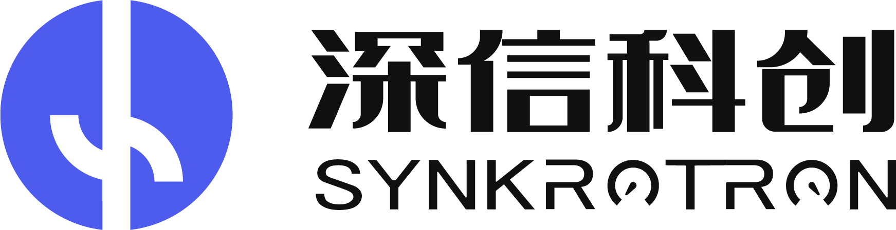
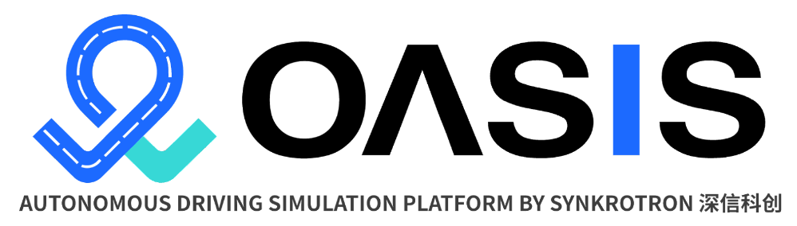

# Synkrotron 시뮬레이션 솔루션  

Synkrotron은 CARLA를 기반으로 한 첨단 자율주행 시뮬레이션 솔루션을 제공합니다. Synkrotron의 제품군 **OASIS**는 시나리오 생성, 센서 모델링, 교통 시뮬레이션, 데이터 관리 등 다양한 응용 프로그램을 지원합니다. 유연한 아키텍처를 기반으로 OASIS는 대규모 클라우드 환경이나 개발자의 로컬 환경에서 프로토타이핑 용도로 배포할 수 있습니다.

---

    <iframe src="https://www.youtube.com/embed/YRI67aar3S0" frameborder="0" allowfullscreen style="position: absolute; top: 0; left: 0; width: 100%; height: 100%;"></iframe>

  

 

## [__OASIS 시뮬레이션 플랫폼__](https://www.synkrotron.ai/sim.html)  

OASIS Sim은 CARLA를 핵심으로 하는 완전 확장 가능한 시뮬레이션 플랫폼으로, 자율주행 시뮬레이션의 전체 생애 주기를 지원합니다.  

- 시나리오 가져오기 및 편집 (GUI 제공)  
- 센서 구성  
- 분산 태스크 관리  
- 풍부한 시뮬레이션 데이터 및 로그를 통한 진단  

OASIS는 컨테이너형 패키징을 통해 클라우드 및 로컬 배포를 모두 지원합니다. 또한 DevOps 통합을 위한 포괄적인 API도 제공합니다. Synkrotron에서 [체험판 요청](https://synkrotron.ai/contact.html)이 가능합니다.  

---

## [__OASIS 데이터 플랫폼__](https://www.synkrotron.ai/data.html)  

OASIS Data는 자율주행 연구개발 파이프라인에서 생성되는 대량의 데이터를 관리하는 플랫폼입니다. OASIS Data는 다음 기능을 통해 데이터 기반 개발을 가능하게 합니다:  

- 데이터 수집 및 익명화  
- 구조적 데이터(CAN 버스 신호, 액티브 세이프티 트리거링 등) 및 비구조적 데이터(센서 판독값)를 기반으로 한 다단계 필터링  
- LIDAR 및/또는 비전 전용 전략을 사용한 정보 매핑 및 환경 재구성  
- 사전 학습된 인식 모델을 사용한 데이터 자동 레이블링  
- OpenX 형식 출력으로 시나리오 태깅 및 재구성  

처리된 데이터는 OASIS Sim에서의 시나리오 재시뮬레이션, 새로운 레이블링 데이터로 인식 모델 재훈련, 운영 차량 관리 등 후속 응용 프로그램을 지원합니다.  

---

## __Synkrotron 도구 및 서비스__  

Synkrotron은 위의 통합 솔루션 외에도 AD(자율주행) 시뮬레이션 개발을 지원하는 다음과 같은 도구와 서비스를 제공합니다.  

| 제품/서비스                 | 설명                                                                                     |  
|-------------------------|----------------------------------------------------------------------------------------|  
| __센서 모델__: 어안 카메라      | 왜곡 매개변수를 구성할 수 있는 어안 카메라 모델                                           |  
| __센서 모델__: 라이다          | 셔터 모드 및 재질 반사를 구성할 수 있는 고급 라이다 모델                                      |  
| __SOTIF 시나리오 생성 도구__    | 사용자가 제공한 ODD(운영 설계 도메인) 설명을 기반으로 중요한 시나리오 요소를 식별하고, 온톨로지 기반 방법 및 최적화를 통해 잠재적 위험 시나리오 생성 |  
| __맵 생성__                  | LIDAR 스캔 데이터를 사용하여 HD 맵 생성 및 OpenDrive 파일 출력 (도로 테스트 데이터 수집 장비 및 서비스 제공 가능) |  
| __센서 모델__: 물리적 카메라 모델 | CMOS 시뮬레이션 지원 및 12비트 원시 센서 데이터 출력 (ISP 알고리즘 개발 또는 ECU 원시 데이터 사용 고객용)          |  
| __정적 장면 생성__            | HD 매핑, 3D 자산 개발 및 절차적 모델링을 결합하여 디지털 트윈/3D 정적 장면 제작                             |  
| __동적 시나리오 재구성__        | 정적 장면 위에 도로 테스트 데이터에서 교통 참가자 탐지 및 추적, 복원된 궤적/행동을 OpenScenario 1.0 파일로 변환하여 CARLA에서 재시뮬레이션 가능 |  