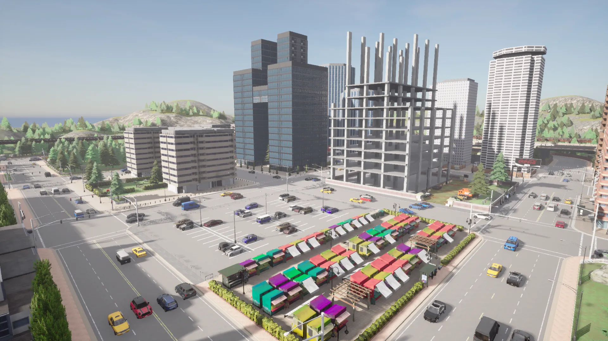
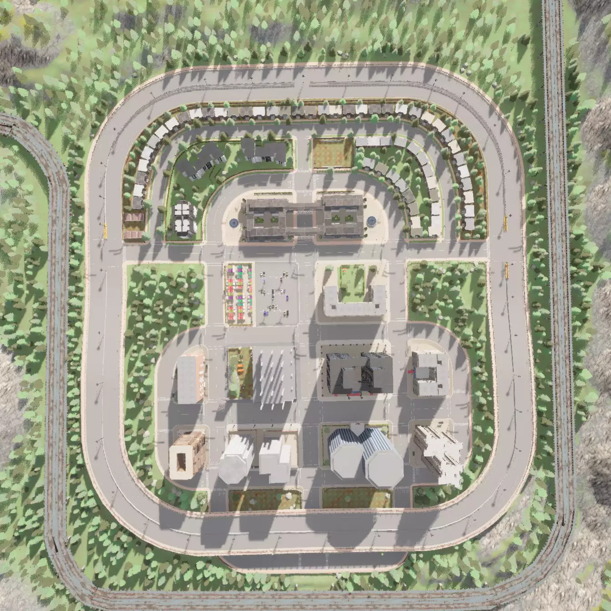
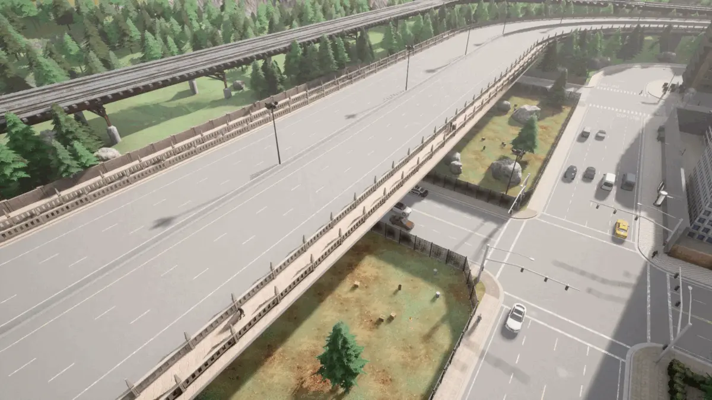
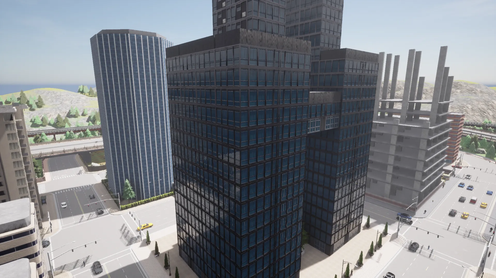
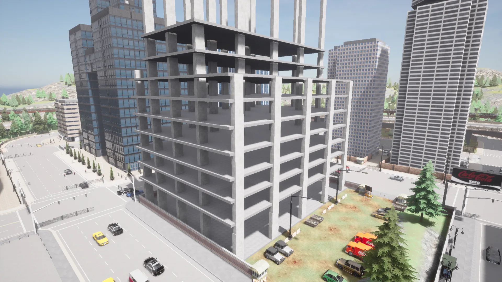
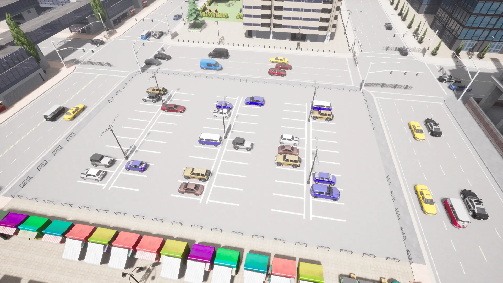

# Town 5

Town 5는 침엽수로 덮인 언덕을 배경으로 하는 도시 환경으로, 고가 고속도로와 대형 다차선 도로 및 교차로가 있습니다.

## 도로망

도로는 여러 개의 대형 교차로에서 교차하는 수많은 복선 도시 도로로 구성되어 있습니다.

도시 각 측면의 교차로는 순환도로 역할을 하는 고가 고속도로로의 접근을 가능하게 합니다.

## 특징

도시에는 다수의 상업용 건물이 있습니다.

도시 중심부에는 건설 중인 건물도 있습니다.

한 도시 블록을 차지하는 주차장이 있습니다.

한 곳에서는 도로가 상업용 건물 아래로 지나갑니다.

