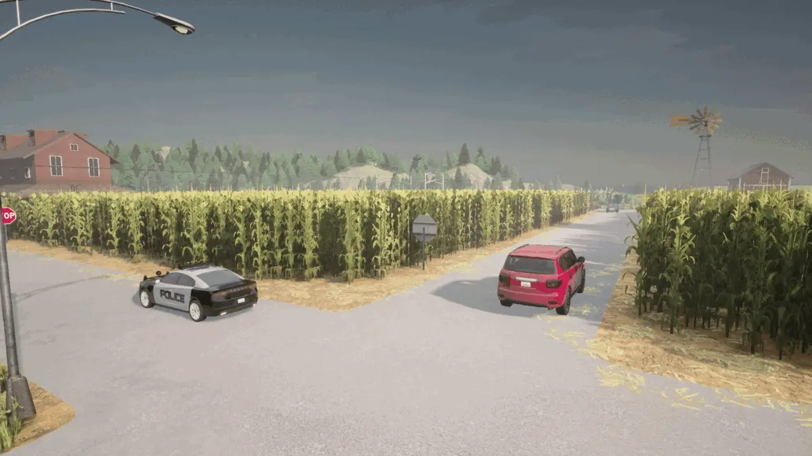
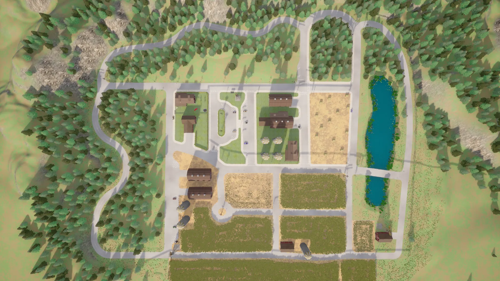
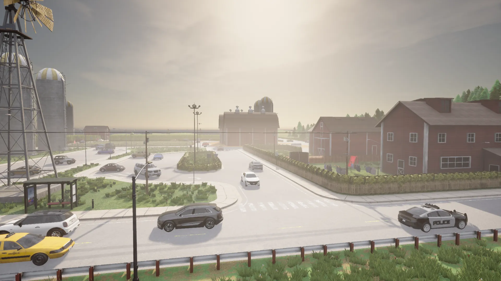
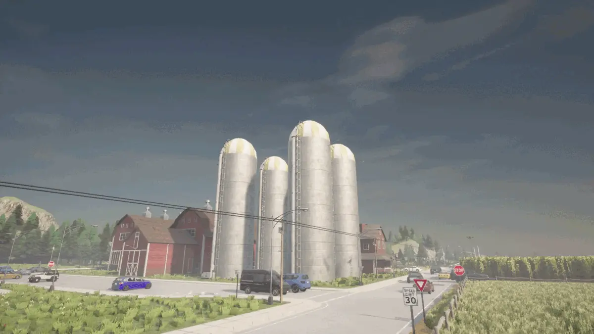
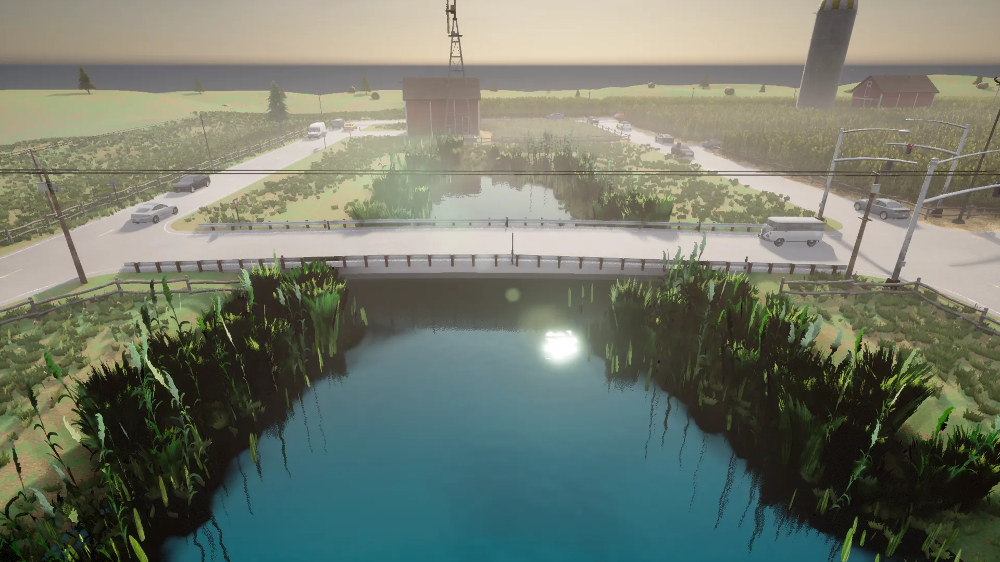
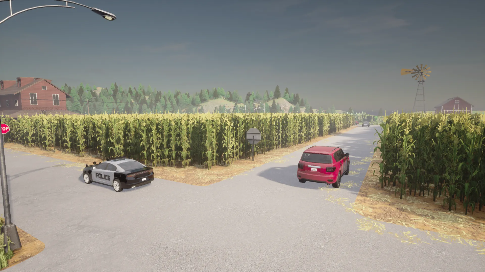

# Town 7

Town 7은 조용한 시골 공동체를 모방한 것으로, 옥수수 밭, 헛간, 곡물 저장고, 풍차가 있는 녹색 경관으로 가득한 공간입니다.

**Town 7은 추가 맵 패키지의 일부로, [CARLA 패키지와 함께 다운로드](https://github.com/carla-simulator/carla/releases)해야 합니다. 다운로드한 ZIP 파일을 추출된 CARLA 패키지의 *Import* 폴더로 이동한 다음 *ImportAssets* 스크립트를 실행하세요.**

## 도로망

도로망은 작으며 몇 개의 주거 주차 도로가 있는 단순한 교차로와 차선이 표시되지 않은 도로들로 구성되어 있습니다.

## 특징

건물들은 나무로 된 헛간과 농장 건물들을 포함합니다.

곡물 저장고와 풍차 같은 시골 농업 환경에서만 볼 수 있는 구조물들이 있습니다.

또한 짧은 도로 다리가 걸쳐있는 작은 수역도 있습니다.

일부 도로는 옥수수 밭이 늘어서 있습니다.

