# 기록기 이진 파일 형식

기록 시스템은 시뮬레이션을 재생하기 위해 필요한 모든 정보를 이진 파일로 저장합니다.  
멀티바이트 값은 리틀 엔디안(Little Endian) 바이트 순서를 사용합니다.

*   [__1- 이진 문자열__](#1-이진-문자열)  
*   [__2- 정보 헤더__](#2-정보-헤더)  
*   [__3- 패킷__](#3-패킷)  
	*   [패킷 0 - 프레임 시작](#패킷-0---프레임-시작)  
	*   [패킷 1 - 프레임 종료](#패킷-1---프레임-종료)  
	*   [패킷 2 - 이벤트 추가](#패킷-2---이벤트-추가)  
	*   [패킷 3 - 이벤트 삭제](#패킷-3---이벤트-삭제)  
	*   [패킷 4 - 이벤트 부모](#패킷-4---이벤트-부모)  
	*   [패킷 5 - 이벤트 충돌](#패킷-5---이벤트-충돌)  
	*   [패킷 6 - 위치](#패킷-6---위치)  
	*   [패킷 7 - 신호등](#패킷-7---신호등)  
	*   [패킷 8 - 차량 애니메이션](#패킷-8---차량-애니메이션)  
	*   [패킷 9 - 보행자 애니메이션](#패킷-9---보행자-애니메이션)  
*   [__4- 프레임 레이아웃__](#4-프레임-레이아웃)  
*   [__5- 파일 레이아웃__](#5-파일-레이아웃)  

아래 이미지는 파일 형식을 나타내며, 각 부분은 뒤에서 자세히 설명합니다:

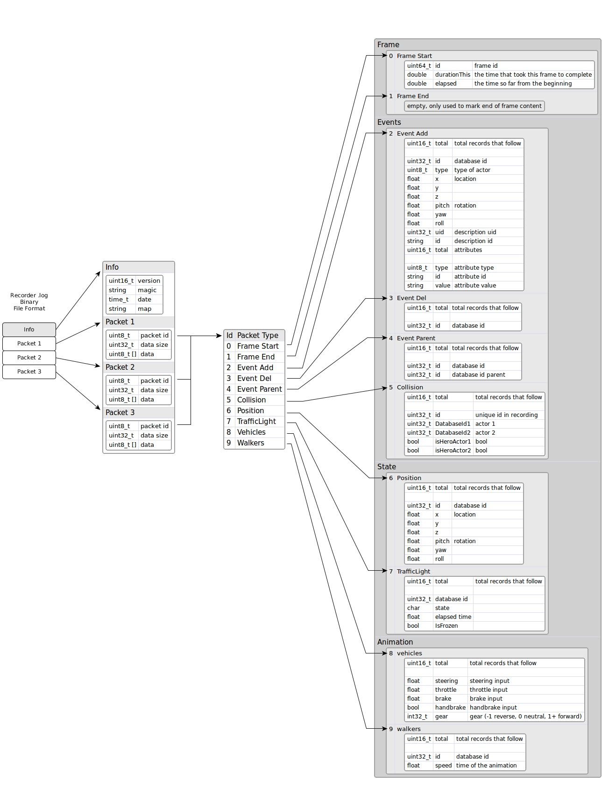

요약하면, 파일 형식은 다음으로 구성됩니다:
- 작은 헤더(버전, 매직 문자열, 날짜 및 사용된 맵 정보 포함)
- 다양한 유형의 패킷(현재 10가지 유형 사용, 앞으로도 추가 예정)

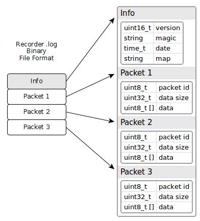

---

## 1- 이진 문자열

문자열은 먼저 길이(2바이트)가 기록되고, 이후 문자열의 문자가 저장됩니다.  
문자열 끝에 null 문자(널 문자)는 포함되지 않습니다.  
예를 들어, 문자열 'Town06'은 다음과 같이 저장됩니다:  
`06 00 54 6f 77 6e 30 36`

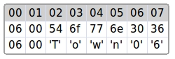

---

## 2- 정보 헤더

정보 헤더는 기록된 파일의 일반 정보를 포함합니다. 주요 내용은 다음과 같습니다:
- **버전**: 파일 형식의 버전.
- **매직 문자열**: 파일이 기록기 파일임을 식별.
- **타임스탬프**: 1900년 Epoch 기준 초 단위로 저장된 시간.
- **맵 이름**: 기록에 사용된 맵의 이름.

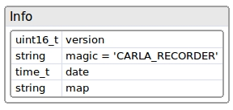

정보 헤더의 예시는 다음과 같습니다:

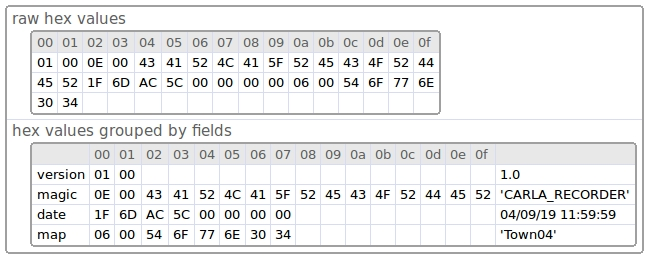

---

## 3- 패킷

각 패킷은 두 개의 필드로 구성된 5바이트 헤더로 시작합니다:

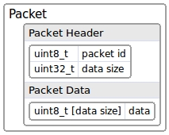

- **id**: 패킷 유형
- **size**: 패킷 데이터 크기

헤더 다음에는 **데이터**가 따라옵니다.  
**데이터**는 선택 사항이며, **size**가 0이면 데이터가 없습니다.  
**size**가 0보다 크면 패킷에 데이터가 포함됩니다. 데이터의 형식은 패킷 유형에 따라 다릅니다.

패킷 헤더는 재생 시 관심 없는 패킷을 무시하는 데 유용합니다.  
헤더(5바이트)만 읽고, 관심 없는 패킷의 데이터를 건너뛰어 다음 패킷으로 이동할 수 있습니다:

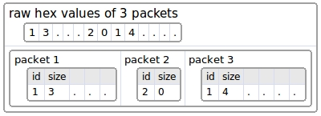

패킷 유형은 다음과 같습니다:

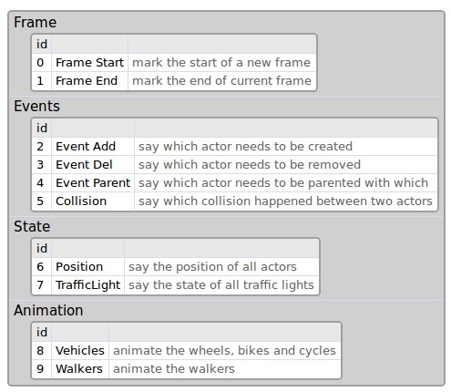

사용자 정의 패킷은 **id** 값을 100 이상으로 설정하는 것이 좋습니다.  
(이 목록은 앞으로 계속 확장될 예정입니다.)

### 패킷 0 - 프레임 시작

이 패킷은 새로운 프레임의 시작을 나타냅니다.  
모든 패킷은 **프레임 시작**과 **프레임 종료** 사이에 위치해야 합니다.

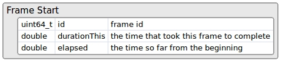

---

### 패킷 1 - 프레임 종료

이 패킷은 데이터가 없으며, 현재 프레임의 종료를 나타냅니다.  
보통 다음 프레임은 **프레임 시작** 패킷으로 시작됩니다.

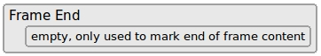

---

### 패킷 2 - 이벤트 추가

이 패킷은 현재 프레임에서 생성해야 할 액터의 수를 나타냅니다.

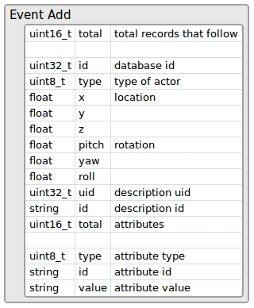

---

### 패킷 3 - 이벤트 삭제

이 패킷은 현재 프레임에서 삭제해야 할 액터의 목록을 나타냅니다.

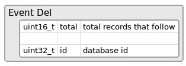

---

### 패킷 4 - 이벤트 부모

이 패킷은 액터 간의 부모-자식 관계를 나타냅니다.

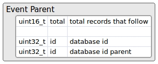

---

### 패킷 5 - 이벤트 충돌

충돌이 발생한 경우, 해당 정보가 이 패킷에 기록됩니다.  
현재는 충돌 센서를 가진 액터만 충돌 정보를 기록합니다.

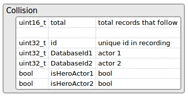

---

### 패킷 6 - 위치

차량 및 보행자와 같은 액터의 위치와 방향을 기록합니다.

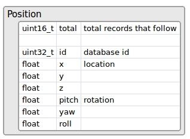

---

### 패킷 7 - 신호등

모든 신호등의 상태(빨강, 주황, 초록)와 다음 상태로 전환되기까지 남은 시간을 기록합니다.

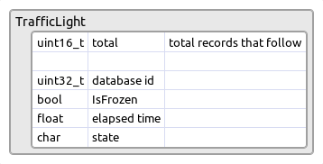

---

### 패킷 8 - 차량 애니메이션

차량의 애니메이션 데이터(가속, 조향, 브레이크 등)를 기록합니다.

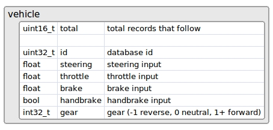

---

### 패킷 9 - 보행자 애니메이션

보행자의 이동 속도 애니메이션 정보를 기록합니다.

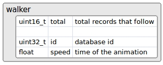

---

## 4- 프레임 레이아웃

프레임은 여러 패킷으로 구성되며, **프레임 시작**과 **프레임 종료** 패킷은 필수입니다.

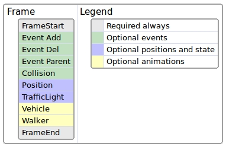

---

## 5- 파일 레이아웃

파일은 **정보 헤더**로 시작하며, 그 뒤로 여러 프레임 그룹이 이어집니다.  
각 프레임 그룹은 **프레임 시작** 패킷으로 시작하고 **프레임 종료** 패킷으로 끝납니다.

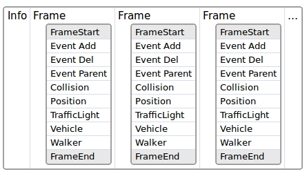

일반적으로 이벤트 관련 패킷은 먼저 나타나고, 위치 및 상태 패킷이 뒤에 옵니다.

---

이 문서는 기록기의 이진 파일 구조를 설명하며, 각 패킷의 구조와 동작을 상세히 다룹니다.
