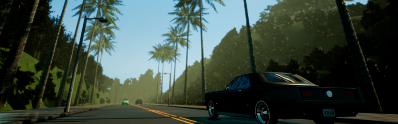
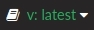
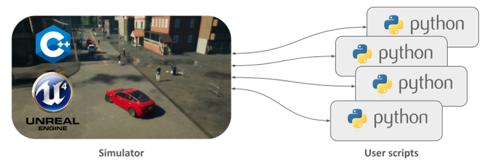

# CARLA

!!! 중요
    이 문서는 CARLA의 최신 버전에 대한 것입니다. 이전 버전의 문서를 보려면 오른쪽 하단에 있는 이 버튼에서 원하는 버전을 선택하세요: 

CARLA는 오픈소스 자율주행 시뮬레이터입니다. 자율주행과 관련된 다양한 과제들을 해결하기 위한 모듈식이고 유연한 API를 제공하기 위해 처음부터 새롭게 개발되었습니다. CARLA의 주요 목표 중 하나는 자율주행 R&D를 대중화하는 것으로, 누구나 쉽게 접근하고 커스터마이즈할 수 있는 도구가 되는 것입니다. 이를 위해 시뮬레이터는 운전이라는 일반적인 문제 안에서 다양한 사용 사례(예: 주행 정책 학습, 인식 알고리즘 훈련 등)의 요구사항을 충족해야 합니다. CARLA는 언리얼 엔진을 기반으로 시뮬레이션을 실행하며, ASAM OpenDRIVE 표준(현재 1.4 버전)을 사용하여 도로와 도시 환경을 정의합니다. 시뮬레이션의 제어는 프로젝트의 성장과 함께 계속 발전하고 있는 Python과 C++ API를 통해 이루어집니다.

주행 시스템의 개발, 훈련, 검증 과정을 원활하게 하기 위해 CARLA는 커뮤니티에 의해 메인 플랫폼을 중심으로 구축된 프로젝트 생태계로 발전했습니다. 이러한 맥락에서 CARLA의 기능을 완전히 이해하기 위해서는 CARLA가 어떻게 작동하는지 이해하는 것이 중요합니다.

---
## 시뮬레이터

CARLA 시뮬레이터는 확장 가능한 클라이언트-서버 아키텍처로 구성되어 있습니다.

서버는 시뮬레이션 자체와 관련된 모든 것을 담당합니다: 센서 렌더링, 물리 연산, 월드 상태와 액터 업데이트 등 많은 작업을 수행합니다. 현실적인 결과를 목표로 하기 때문에, 특히 머신러닝을 다룰 때는 전용 GPU로 서버를 실행하는 것이 가장 적합합니다.

클라이언트 측은 장면의 액터들을 제어하고 월드 조건을 설정하는 여러 클라이언트 모듈로 구성됩니다. 이는 서버와 클라이언트 사이를 중재하는 CARLA API(Python 또는 C++)를 활용하여 이루어지며, 이 API는 새로운 기능을 제공하기 위해 계속 발전하고 있습니다.

이것이 시뮬레이터의 기본 구조입니다. 하지만 CARLA를 이해하는 것은 그 이상입니다. CARLA 내에는 많은 다양한 기능과 요소들이 공존하기 때문입니다. CARLA가 할 수 있는 것들의 관점에서 몇 가지 주요 기능들을 아래에 나열했습니다.

* __교통 관리자(Traffic Manager).__ 학습용 차량 외의 다른 차량들을 제어하는 내장 시스템입니다. 현실적인 행동이 구현된 도시와 같은 환경을 재현하기 위해 CARLA가 제공하는 지휘자 역할을 합니다.
* __센서.__ 차량은 센서를 통해 주변 환경에 대한 정보를 수집합니다. CARLA에서 센서는 차량에 부착되는 특별한 종류의 액터이며, 수집된 데이터는 처리를 쉽게 하기 위해 검색하고 저장할 수 있습니다. 현재 카메라부터 레이더, 라이다 등 다양한 종류의 센서를 지원합니다.
* __레코더.__ 이 기능은 월드의 모든 액터에 대해 시뮬레이션을 단계별로 재현하는 데 사용됩니다. 타임라인의 어느 순간이든 월드의 어느 곳에서나 접근할 수 있어 훌륭한 추적 도구가 됩니다.
* __ROS 브릿지와 Autoware 구현.__ 보편화를 위해 CARLA 프로젝트는 다른 학습 환경 내에서 시뮬레이터를 통합하기 위한 연결고리를 만들고 있습니다.
* __오픈 에셋.__ CARLA는 날씨 조건을 제어할 수 있는 다양한 도시 환경 맵과 광범위한 액터 세트를 포함한 블루프린트 라이브러리를 제공합니다. 하지만 이러한 요소들은 간단한 가이드라인을 따라 커스터마이즈하거나 새로 생성할 수 있습니다.
* __시나리오 러너.__ 차량의 학습 과정을 쉽게 하기 위해 CARLA는 다양한 상황을 설명하는 일련의 경로를 제공합니다. 이는 또한 누구나 자신의 솔루션을 테스트하고 리더보드에 오를 수 있는 [CARLA 챌린지](https://carlachallenge.org/)의 기초가 됩니다.

---
## 프로젝트

CARLA는 빠르고 꾸준하게 성장하며, 제공하는 솔루션의 범위를 넓히고 자율주행에 대한 다양한 접근 방식의 길을 열어가고 있습니다. 이 과정에서 오픈소스라는 본질을 절대 잊지 않습니다. 이 프로젝트는 투명하며, 누구나 도구와 개발 커뮤니티에 접근할 수 있는 화이트박스로 작동합니다. CARLA는 이러한 대중화에서 그 가치를 찾습니다.

CARLA의 성장에 대해 이야기하는 것은 자율주행이라는 심도 있는 질문에 함께 뛰어드는 개발자 커뮤니티에 대해 이야기하는 것입니다. 누구나 CARLA로 자유롭게 탐구하고, 자신만의 솔루션을 찾은 다음 그 성과를 커뮤니티와 공유할 수 있습니다.

이 문서는 여러분의 여정에 동반자가 될 것입니다. 다음 페이지에는 CARLA 릴리스를 설치하고 싶어하는 분들을 위한 __[빠른 시작](start_quickstart.md)__ 지침이 있습니다. Linux와 Windows를 위한 빌드 가이드도 있습니다. 이를 통해 저장소에서 CARLA를 빌드하고 모든 기능을 깊이 있게 살펴볼 수 있습니다.

CARLA에 오신 것을 환영합니다.

<a href="../build_linux" target="_blank" class="btn btn-neutral" title="최신 CARLA 릴리스로 이동">
<b>Linux</b> 빌드</a>

<a href="../build_windows" target="_blank" class="btn btn-neutral" title="최신 CARLA 릴리스로 이동">
<b>Windows</b> 빌드</a>

