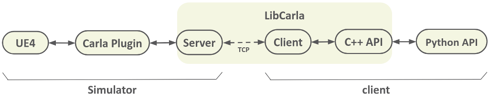
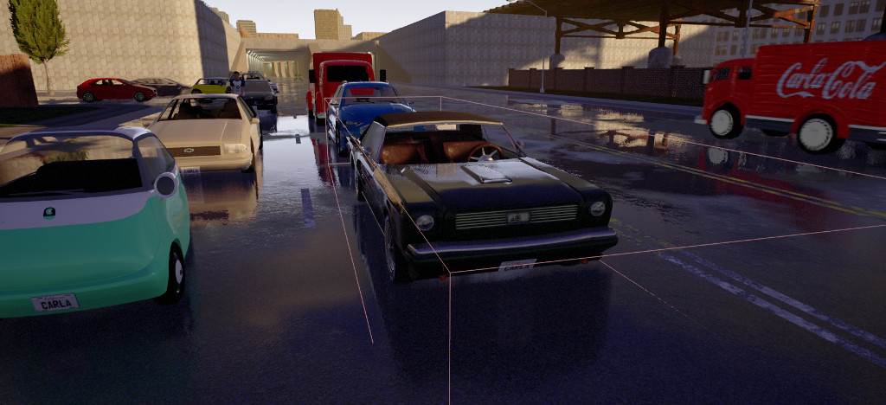

# 새로운 센서 추가하기

이 튜토리얼은 CARLA에 새로운 센서를 추가하는 기본 사항을 설명합니다. 언리얼 엔진 4(UE4)에서 센서를 구현하고 CARLA의 Python API를 통해 데이터를 노출하는 데 필요한 단계를 제공합니다. 새로운 센서를 예시로 만들면서 모든 단계를 따라가보겠습니다.

*   [__전제 조건__](#prerequisites)  
*   [__소개__](#introduction)  
*   [__새로운 센서 만들기__](#creating-a-new-sensor)  
	*   [1. 센서 액터](#1-sensor-actor)  
	*   [2. 센서 데이터 직렬화기](#2-sensor-data-serializer)  
	*   [3. 센서 데이터 객체](#3-sensor-data-object)  
	*   [4. 센서 등록하기](#4-register-your-sensor)  
	*   [5. 사용 예시](#5-usage-example)  
*   [__부록__](#appendix)  
	*   [버퍼 재사용하기](#reusing-buffers)  
	*   [비동기적으로 데이터 보내기](#sending-data-asynchronously)  
	*   [클라이언트 측 센서](#client-side-sensors)  

---
## 전제 조건

새로운 센서를 구현하려면 CARLA 소스 코드를 컴파일해야 합니다. 자세한 방법은 [소스에서 빌드하기](build_linux.md)를 참조하세요.

이 튜토리얼은 독자가 C++ 프로그래밍에 능숙하다고 가정합니다.

---
## 소개

CARLA의 센서는 데이터 스트림을 생성하는 특별한 유형의 액터입니다. 일부 센서는 업데이트될 때마다 연속적으로 데이터를 생성하고, 다른 센서는 특정 이벤트 후에만 데이터를 생성합니다. 예를 들어, 카메라는 매 업데이트마다 이미지를 생성하지만, 충돌 센서는 충돌이 발생했을 때만 트리거됩니다.

대부분의 센서가 서버 측(UE4)에서 측정을 계산하지만, 일부 센서는 클라이언트 측에서만 실행된다는 점에 주목할 가치가 있습니다. 이러한 센서의 예시로는 LaneInvasion이 있는데, 차선 표시를 넘을 때마다 알려줍니다. 자세한 내용은 [부록: 클라이언트 측 센서](#appendix-client-side-sensors)를 참조하세요.

이 튜토리얼에서는 서버 측 센서에 초점을 맞출 것입니다.

UE4 내부에서 실행되는 센서가 Python 클라이언트까지 데이터를 보내려면 전체 통신 파이프라인을 다뤄야 합니다.



따라서 파이프라인의 다른 단계를 다루는 다음과 같은 클래스들이 필요합니다:

  * **센서 액터**<br>
    데이터를 측정하거나 시뮬레이션하는 책임을 가진 액터. UE4 프레임워크를 사용하는 Carla 플러그인에서 실행됩니다. 사용자는 센서 액터로 접근할 수 있습니다.

  * **직렬화기**<br>
    센서에서 생성된 데이터를 직렬화하고 역직렬화하는 메서드를 포함하는 객체. LibCarla의 서버와 클라이언트 모두에서 실행됩니다.

  * **센서 데이터**<br>
    센서에서 생성된 데이터를 나타내는 객체. 이는 C++와 Python API 모두에서 최종 사용자에게 전달될 객체입니다.

!!! 참고
    최상의 성능을 보장하기 위해, 센서는 템플릿 메타 프로그래밍을 기반으로 한 일종의 "컴파일 타임 플러그인 시스템"을 사용하여 등록되고 디스패치됩니다. 모든 부분이 존재할 때까지 코드가 컴파일되지 않을 가능성이 높습니다.
## 새로운 센서 만들기

[**소스 코드**](https://gist.github.com/nsubiron/011fd1b9767cd441b1d8467dc11e00f9)를 참조하세요.

우리는 차량 주변의 다른 액터들을 감지하는 센서를 만들 것입니다. 이를 위해 물체를 감지하는 트리거 박스를 만들고, 차량이 트리거 박스 안에 있을 때마다 클라이언트에 상태를 보고할 것입니다. 이것을 _안전 거리 센서_라고 부르겠습니다.



_간단하게 하기 위해 모든 엣지 케이스를 고려하지 않을 것이며, 가장 효율적인 방식으로 구현하지도 않을 것입니다. 이는 단순히 설명을 위한 예시입니다._

### 1. 센서 액터

이것은 우리가 만들 가장 복잡한 클래스입니다. 여기서는 언리얼 엔진 프레임워크 내에서 실행되며, UE4 API에 대한 지식이 매우 도움이 되지만 필수적이지는 않습니다. 독자가 UE4를 처음 사용한다고 가정하겠습니다.

UE4 내에서는 클라이언트 측과 비슷한 계층 구조를 가지고 있으며, `ASensor`는 `AActor`에서 파생됩니다. 액터는 대략적으로 월드에 배치할 수 있는 모든 객체입니다. `AActor`는 시뮬레이터가 업데이트될 때마다 센서를 업데이트하는 데 사용할 수 있는 `Tick`이라는 가상 함수를 가지고 있습니다. 계층 구조의 상위에는 대부분의 UE4 클래스의 기본 클래스인 `UObject`가 있습니다. `UObject`에서 파생된 객체들은 포인터를 통해 처리되며 더 이상 참조되지 않을 때 가비지 컬렉션된다는 점을 아는 것이 중요합니다. `UObject`를 가리키는 클래스 멤버들은 가비지 컬렉션되지 않도록 `UPROPERTY` 매크로로 표시되어야 합니다.

시작해보겠습니다.

이 클래스는 Carla 플러그인 내에 위치해야 합니다. 새로운 C++ 클래스를 위해 두 개의 파일을 만들 것입니다:

  * `Unreal/CarlaUE4/Plugins/Carla/Source/Carla/Sensor/SafeDistanceSensor.h`
  * `Unreal/CarlaUE4/Plugins/Carla/Source/Carla/Sensor/SafeDistanceSensor.cpp`

최소한 센서는 `ASensor`를 상속받고 정적 메서드 `GetSensorDefinition`을 제공해야 합니다. 하지만 우리는 또한 `Set`, `SetOwner`, `Tick` 메서드도 오버라이드할 것입니다. 이 센서는 주변의 다른 액터들을 감지할 트리거 박스도 필요합니다. 이와 함께 필요한 UE4 보일러플레이트 코드를 포함하면, 헤더 파일은 다음과 같습니다:

```cpp
#pragma once

#include "Carla/Sensor/Sensor.h"

#include "Carla/Actor/ActorDefinition.h"
#include "Carla/Actor/ActorDescription.h"

#include "Components/BoxComponent.h"

#include "SafeDistanceSensor.generated.h"

UCLASS()
class CARLA_API ASafeDistanceSensor : public ASensor
{
  GENERATED_BODY()

public:

  ASafeDistanceSensor(const FObjectInitializer &ObjectInitializer);

  static FActorDefinition GetSensorDefinition();

  void Set(const FActorDescription &ActorDescription) override;

  void SetOwner(AActor *Owner) override;

  void Tick(float DeltaSeconds) override;

private:

  UPROPERTY()
  UBoxComponent *Box = nullptr;
};
```

cpp 파일에서는 먼저 몇 가지 include가 필요합니다:

```cpp
#include "Carla.h"
#include "Carla/Sensor/SafeDistanceSensor.h"

#include "Carla/Actor/ActorBlueprintFunctionLibrary.h"
#include "Carla/Game/CarlaEpisode.h"
#include "Carla/Util/BoundingBoxCalculator.h"
#include "Carla/Vehicle/CarlaWheeledVehicle.h"
```
이제 기능을 구현할 수 있습니다. 생성자는 트리거 박스를 만들고 UE4에 tick 함수를 호출하고 싶다고 알려줍니다. 만약 센서가 tick 함수를 사용하지 않는다면, 불필요한 tick을 피하기 위해 여기서 비활성화할 수 있습니다:

```cpp
ASafeDistanceSensor::ASafeDistanceSensor(const FObjectInitializer &ObjectInitializer)
  : Super(ObjectInitializer)
{
  Box = CreateDefaultSubobject<UBoxComponent>(TEXT("BoxOverlap"));
  Box->SetupAttachment(RootComponent);
  Box->SetHiddenInGame(true); // 디버깅을 위해 비활성화.
  Box->SetCollisionProfileName(FName("OverlapAll"));

  PrimaryActorTick.bCanEverTick = true;
}
```

이제 Carla에 이 센서가 어떤 속성을 가지는지 알려줘야 합니다. 이는 블루프린트 라이브러리에 새로운 블루프린트를 만드는 데 사용되며, 사용자는 이 블루프린트를 사용하여 센서를 구성하고 생성할 수 있습니다. 여기서 트리거 박스의 속성을 정의할 것이며, 이 예시에서는 X와 Y 안전 거리만 노출할 것입니다:

```cpp
FActorDefinition ASafeDistanceSensor::GetSensorDefinition()
{
  auto Definition = UActorBlueprintFunctionLibrary::MakeGenericSensorDefinition(
      TEXT("other"),
      TEXT("safe_distance"));

  FActorVariation Front;
  Front.Id = TEXT("safe_distance_front");
  Front.Type = EActorAttributeType::Float;
  Front.RecommendedValues = { TEXT("1.0") };
  Front.bRestrictToRecommended = false;

  FActorVariation Back;
  Back.Id = TEXT("safe_distance_back");
  Back.Type = EActorAttributeType::Float;
  Back.RecommendedValues = { TEXT("0.5") };
  Back.bRestrictToRecommended = false;

  FActorVariation Lateral;
  Lateral.Id = TEXT("safe_distance_lateral");
  Lateral.Type = EActorAttributeType::Float;
  Lateral.RecommendedValues = { TEXT("0.5") };
  Lateral.bRestrictToRecommended = false;

  Definition.Variations.Append({ Front, Back, Lateral });

  return Definition;
}
```

이렇게 하면 센서 팩토리가 사용자 요청에 따라 **안전 거리 센서**를 만들 수 있습니다. 센서가 생성된 직후, 사용자가 요청한 매개변수와 함께 `Set` 함수가 호출됩니다:

```cpp
void ASafeDistanceSensor::Set(const FActorDescription &Description)
{
  Super::Set(Description);

  float Front = UActorBlueprintFunctionLibrary::RetrieveActorAttributeToFloat(
      "safe_distance_front",
      Description.Variations,
      1.0f);
  float Back = UActorBlueprintFunctionLibrary::RetrieveActorAttributeToFloat(
      "safe_distance_back",
      Description.Variations,
      0.5f);
  float Lateral = UActorBlueprintFunctionLibrary::RetrieveActorAttributeToFloat(
      "safe_distance_lateral",
      Description.Variations,
      0.5f);

  constexpr float M_TO_CM = 100.0f; // 단위 변환.

  float LocationX = M_TO_CM * (Front - Back) / 2.0f;
  float ExtentX = M_TO_CM * (Front + Back) / 2.0f;
  float ExtentY = M_TO_CM * Lateral;

  Box->SetRelativeLocation(FVector{LocationX, 0.0f, 0.0f});
  Box->SetBoxExtent(FVector{ExtentX, ExtentY, 0.0f});
}
```

!!! 참고
    set 함수는 UE4의 `BeginPlay` 이전에 호출됩니다. 여기서는 이 가상 함수를 사용하지 않지만, 다른 센서에서는 중요합니다.

이제 우리가 부착된 액터의 바운딩 박스를 기반으로 박스 볼륨을 확장할 것입니다. 이를 위해 가장 편리한 방법은 `SetOwner` 가상 함수를 사용하는 것입니다. 이 함수는 우리의 센서가 다른 액터에 부착될 때 호출됩니다.

```cpp
void ASafeDistanceSensor::SetOwner(AActor *Owner)
{
  Super::SetOwner(Owner);

  auto BoundingBox = UBoundingBoxCalculator::GetActorBoundingBox(Owner);

  Box->SetBoxExtent(BoundingBox.Extent + Box->GetUnscaledBoxExtent());
}
```

남은 것은 실제 측정을 하는 것뿐입니다. 이를 위해 `Tick` 함수를 사용할 것입니다. 우리의 박스와 현재 겹치는 모든 차량을 찾아서 이 목록을 클라이언트에 보낼 것입니다:

```cpp
void ASafeDistanceSensor::Tick(float DeltaSeconds)
{
  Super::Tick(DeltaSeconds);

  TSet<AActor *> DetectedActors;
  Box->GetOverlappingActors(DetectedActors, ACarlaWheeledVehicle::StaticClass());
  DetectedActors.Remove(GetOwner());

  if (DetectedActors.Num() > 0)
  {
    auto Stream = GetDataStream(*this);
    Stream.Send(*this, GetEpisode(), DetectedActors);
  }
}
```

!!! 참고
    실제 운영에 사용되는 센서에서는 `Tick` 함수가 매우 최적화되어야 합니다. 특히 센서가 큰 데이터 청크를 보내는 경우에는 더욱 그렇습니다. 이 함수는 게임 스레드에서 매 업데이트마다 호출되므로 시뮬레이터의 성능에 상당한 영향을 미칩니다.

자, 아직 언급하지 않은 몇 가지가 있는데, 이 스트림은 무엇일까요?

모든 센서는 연관된 데이터 스트림을 가지고 있습니다. 이 스트림은 데이터를 클라이언트로 보내는 데 사용되며, Python API에서 `sensor.listen(callback)` 메서드를 사용할 때 구독하는 스트림입니다. 여기에 데이터를 보낼 때마다 클라이언트 측의 콜백이 트리거됩니다. 하지만 그 전에 데이터는 여러 계층을 통과해야 합니다. 첫 번째는 다음에 만들어야 할 직렬화기입니다. 다음 섹션에서 `Serialize` 함수를 완성하면 이 부분을 완전히 이해할 수 있을 것입니다.
### 2. 센서 데이터 직렬화기

이 클래스는 실제로 꽤 단순합니다. `Serialize`와 `Deserialize` 두 개의 정적 메서드만 있으면 됩니다. LibCarla에 두 개의 파일을 추가하겠습니다:

  * `LibCarla/source/carla/sensor/s11n/SafeDistanceSerializer.h`
  * `LibCarla/source/carla/sensor/s11n/SafeDistanceSerializer.cpp`

먼저 `Serialize` 함수부터 시작하겠습니다. 이 함수는 `Stream.Send(...)`에 전달하는 인자들을 받게 되는데, 첫 번째 인자는 센서여야 하고 버퍼를 반환해야 한다는 조건이 있습니다.

```cpp
static Buffer Serialize(const Sensor &, ...);
```

`carla::Buffer`는 편리한 기능이 있는 동적으로 할당된 원시 메모리 조각일 뿐입니다. 우리는 이것을 사용하여 원시 데이터를 클라이언트로 보낼 것입니다.

이 예시에서는 감지된 액터 목록을 클라이언트 측에서 의미 있게 해석될 수 있는 방식으로 버퍼에 작성해야 합니다. 이것이 우리가 이 함수에 episode 객체를 전달한 이유입니다.

`UCarlaEpisode` 클래스는 시뮬레이터에서 실행 중인 현재 **에피소드**를 나타냅니다. 즉, 마지막으로 맵을 로드한 이후의 시뮬레이션 상태를 의미합니다. 이는 Carla와 관련된 모든 중요한 정보를 포함하고 있으며, 다른 것들 중에서도 액터 ID를 검색할 수 있게 해줍니다. 우리는 이러한 ID를 클라이언트에 보낼 수 있고 클라이언트는 이를 액터로 인식할 수 있습니다:

```cpp
template <typename SensorT, typename EpisodeT, typename ActorListT>
static Buffer Serialize(
    const SensorT &,
    const EpisodeT &episode,
    const ActorListT &detected_actors) {
  const uint32_t size_in_bytes = sizeof(ActorId) * detected_actors.Num();
  Buffer buffer{size_in_bytes};
  unsigned char *it = buffer.data();
  for (auto *actor : detected_actors) {
    ActorId id = episode.FindActor(actor).GetActorId();
    std::memcpy(it, &id, sizeof(ActorId));
    it += sizeof(ActorId);
  }
  return buffer;
}
```

> **참고**: LibCarla 내에서 UE4 클래스 포함을 피하기 위해 클래스들을 템플릿화합니다.

우리가 반환하는 이 버퍼는 다시 우리에게 돌아올 것입니다. 단, 이번에는 클라이언트 측에서 `RawData` 객체에 담겨 `Deserialize` 함수로 돌아옵니다:

```cpp
static SharedPtr<SensorData> Deserialize(RawData &&data);
```

이 메서드는 cpp 파일에서 구현할 것이며, 꽤 단순합니다:

```cpp
SharedPtr<SensorData> SafeDistanceSerializer::Deserialize(RawData &&data) {
  return SharedPtr<SensorData>(new data::SafeDistanceEvent(std::move(data)));
}
```

단, 아직 `SafeDistanceEvent`가 무엇인지 정의하지 않았다는 점만 제외하면 말입니다.

### 3. 센서 데이터 객체

이 센서의 사용자를 위한 데이터 객체를 만들어야 합니다. **안전 거리 이벤트**의 데이터를 나타내는 객체입니다. 다음 파일을 추가하겠습니다:

  * `LibCarla/source/carla/sensor/data/SafeDistanceEvent.h`

이 객체는 액터 ID 목록과 동일할 것입니다. 이를 위해 Array 템플릿에서 파생시킬 것입니다:

```cpp
#pragma once

#include "carla/rpc/ActorId.h"
#include "carla/sensor/data/Array.h"

namespace carla {
namespace sensor {
namespace data {

  class SafeDistanceEvent : public Array<rpc::ActorId> {
  public:

    explicit SafeDistanceEvent(RawData &&data)
      : Array<rpc::ActorId>(std::move(data)) {}
  };

} // namespace data
} // namespace sensor
} // namespace carla
```

Array 템플릿은 `Serialize` 메서드에서 만든 버퍼를 액터 ID의 배열로 재해석할 것이며, 새로운 메모리를 할당하지 않고 받은 버퍼에서 직접 이 작업을 수행할 수 있습니다. 이 작은 예시에서는 약간 과도해 보일 수 있지만, 이 메커니즘은 큰 데이터 청크에도 사용됩니다. HD 이미지를 보내는 경우를 생각해보면, 원시 메모리를 재사용함으로써 많은 것을 절약할 수 있습니다.
이제 이 클래스를 Python에 노출해야 합니다. 우리 예시에서는 추가 메서드를 추가하지 않았기 때문에 Array 관련 메서드만 노출하면 됩니다. Boost.Python 바인딩을 사용하여 이 작업을 수행하며, _PythonAPI/carla/source/libcarla/SensorData.cpp_에 다음을 추가합니다:

```cpp
class_<
    csd::SafeDistanceEvent,                    // 실제 타입
    bases<cs::SensorData>,                     // 부모 타입
    boost::noncopyable,                        // 복사 비활성화
    boost::shared_ptr<csd::SafeDistanceEvent>  // shared_ptr로 사용
  >("SafeDistanceEvent", no_init)              // 이름, 생성자 비활성화
  .def("__len__", &csd::SafeDistanceEvent::size)
  .def("__iter__", iterator<csd::SafeDistanceEvent>())
  .def("__getitem__", +[](const csd::SafeDistanceEvent &self, size_t pos) -> cr::ActorId {
    return self.at(pos);
  })
;
```

> **참고**: `csd`는 `carla::sensor::data` 네임스페이스의 별칭입니다.

여기서 우리는 몇 가지 C++ 메서드를 Python에 노출시키고 있습니다. 이렇게만 하면 Python API가 우리의 새로운 이벤트를 인식할 수 있고, 수정은 할 수 없지만 Python에서 배열처럼 동작할 것입니다.

### 4. 센서 등록하기

이제 파이프라인이 완성되었으니 새로운 센서를 등록할 준비가 되었습니다. **LibCarla/source/carla/sensor/SensorRegistry.h**에서 이 작업을 수행합니다. 이 헤더 파일의 지침에 따라 다양한 include와 전방 선언을 추가하고, 레지스트리에 다음 쌍을 추가합니다:

```cpp
std::pair<ASafeDistanceSensor *, s11n::SafeDistanceSerializer>
```

이렇게 하면 센서 레지스트리가 올바른 데이터를 올바른 직렬화기로 디스패치할 수 있습니다.

이제 CARLA를 다시 컴파일하세요. 희망적으로 모든 것이 잘 되고 오류가 없을 것입니다. 불행하게도, 여기서 발생하는 대부분의 오류는 템플릿과 관련되어 있어 오류 메시지가 약간 난해할 수 있습니다.

```
make rebuild
```

### 5. 사용 예시

마침내 센서를 포함시키고 다시 컴파일을 완료했으니, 이제 우리의 센서는 Python에서 사용 가능해야 합니다.

이 센서를 생성하려면 블루프린트 라이브러리에서 찾기만 하면 됩니다. 모든 것이 제대로 되었다면 센서 팩토리가 우리의 센서를 라이브러리에 추가했을 것입니다:

```py
blueprint = blueprint_library.find('sensor.other.safe_distance')
sensor = world.spawn_actor(blueprint, carla.Transform(), attach_to=vehicle)
```

그리고 이제 콜백 함수를 등록하여 이벤트 수신을 시작할 수 있습니다:

```py
world_ref = weakref.ref(world)

def callback(event):
    for actor_id in event:
        vehicle = world_ref().get_actor(actor_id)
        print('Vehicle too close: %s' % vehicle.type_id)

sensor.listen(callback)
```

이 콜백은 다른 차량이 우리의 안전 거리 박스 안에 있을 때마다 매 업데이트마다 실행됩니다. 예를 들면:

```
Vehicle too close: vehicle.audi.a2
Vehicle too close: vehicle.mercedes-benz.coupe
```

그게 전부입니다. 새로운 센서가 작동합니다!
## 부록 

### 버퍼 재사용하기

메모리 사용을 최적화하기 위해, 각 센서가 비슷한 크기의 버퍼를 보낸다는 사실을 활용할 수 있습니다. 특히 카메라의 경우 실행 중에 이미지 크기가 일정하게 유지됩니다. 이러한 경우, 프레임 간에 할당된 메모리를 재사용함으로써 많은 리소스를 절약할 수 있습니다.

각 스트림에는 불필요한 메모리 할당을 피하는 데 사용할 수 있는 '버퍼 풀'이 포함되어 있습니다. 각 센서는 연관된 스트림을 가지고 있으므로 각 센서는 자체 버퍼 풀을 가집니다.

다음과 같이 풀에서 버퍼를 검색할 수 있습니다:

```cpp
auto Buffer = Stream.PopBufferFromPool();
```

풀이 비어 있으면 빈 버퍼를 반환합니다. 즉, 메모리가 할당되지 않은 버퍼를 반환합니다. 이 경우 버퍼의 크기를 조정할 때 새 메모리가 할당됩니다. 이는 처음 몇 프레임 동안 발생할 것입니다. 그러나 풀에서 버퍼를 가져온 경우, 버퍼가 범위를 벗어나면 해당 메모리는 풀로 돌아갑니다. 다음에 풀에서 다른 버퍼를 가져올 때, 이전 버퍼의 할당된 메모리 조각이 포함될 것입니다. 보시다시피, 버퍼 객체는 실제로 연속된 원시 메모리 조각에 대한 스마트 포인터처럼 작동합니다. 현재 할당된 것보다 더 많은 메모리를 요청하지 않는 한 버퍼는 메모리를 재사용합니다. 더 많이 요청하면 현재 메모리를 삭제하고 더 큰 청크를 할당해야 합니다.

다음 코드는 버퍼가 어떻게 작동하는지 보여줍니다:

```cpp
Buffer buffer;
buffer.reset(1024u); // (크기 1024 바이트, 용량 1024 바이트) -> 할당
buffer.reset(512u);  // (크기  512 바이트, 용량 1024 바이트)
buffer.reset(2048u); // (크기 2048 바이트, 용량 2048 바이트) -> 할당
```

### 비동기적으로 데이터 보내기

일부 센서는 성능을 위해 또는 데이터가 다른 스레드에서 생성되기 때문에 데이터를 비동기적으로 보내야 할 수 있습니다. 예를 들어 카메라 센서는 렌더 스레드에서 이미지를 보냅니다.

데이터 스트림을 비동기적으로 사용하는 것은 완벽하게 괜찮습니다. 단, 스트림 자체는 게임 스레드에서 생성되어야 합니다. 예를 들어:

```cpp
void MySensor::Tick(float DeltaSeconds)
{
  Super::Tick(DeltaSeconds);

  auto Stream = GetDataStream(*this);

  std::async(std::launch::async, [Stream=std::move(Stream)]() {
    auto Data = ComputeData();
    Stream.Send(*this, Data);
  });
}
```

### 클라이언트 측 센서

일부 센서는 측정을 위해 시뮬레이터가 필요하지 않습니다. 이러한 센서는 시뮬레이터의 추가 계산을 줄이기 위해 완전히 클라이언트 측에서 실행될 수 있습니다. 그러한 센서의 예시로는 _LaneInvasion_ 센서가 있습니다.

일반적인 접근 방식은 서버 측에 "더미" 센서를 만드는 것입니다. 이는 시뮬레이터가 해당 액터가 존재한다는 것을 인식하게 하기 위함입니다. 그러나 이 더미 센서는 tick하지도 않고 어떤 종류의 데이터도 보내지 않습니다. 반면 클라이언트 측의 대응되는 부분은 새로운 업데이트마다 일부 코드를 실행하기 위해 "on tick" 콜백을 등록합니다. 예를 들어, LaneInvasion 센서는 차선 표시를 가로질렀을 때마다 알림을 주는 콜백을 등록합니다.

클라이언트 측의 "on tick" 콜백이 동시에 실행된다는 점을 고려하는 것이 매우 중요합니다. 즉, 동일한 메서드가 서로 다른 스레드에 의해 동시에 실행될 수 있습니다. 접근되는 모든 데이터는 뮤텍스를 사용하거나, 아토믹을 사용하거나, 더 나은 방법으로는 접근되는 모든 멤버가 상수로 유지되도록 하여 적절하게 동기화되어야 합니다.

---

이것으로 새로운 센서 추가하기 가이드를 마쳤습니다. 과정에 대해 궁금한 점이 있다면 [포럼](https://github.com/carla-simulator/carla/discussions)에서 질문할 수 있습니다.
