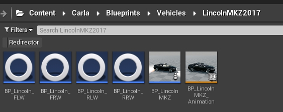
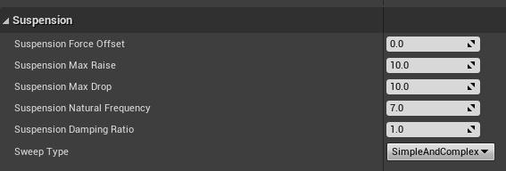

# 차량 서스펜션 커스터마이즈

이 튜토리얼은 CARLA 차량의 서스펜션 시스템의 기본 사항과 사용 가능한 다양한 차량에 대한 구현 방법을 다룹니다. 이 정보를 사용하여 언리얼 엔진에서 차량의 서스펜션 매개변수에 접근하고 원하는 대로 커스터마이즈할 수 있습니다.

*   [__서스펜션 시스템의 기초__](#basics-of-the-suspension-system)  
*   [__서스펜션 그룹__](#suspension-groups)  
	*   [쿠페](#coupe)  
	*   [오프로드](#off-road)  
	*   [트럭](#truck)  
	*   [도시형](#urban)  
	*   [밴](#van)  

---
## 서스펜션 시스템의 기초

차량의 서스펜션 시스템은 해당 차량의 바퀴에 의해 정의됩니다. 각 바퀴는 서스펜션 시스템을 포함한 일부 매개변수가 있는 독립적인 블루프린트를 가지고 있습니다.

이러한 블루프린트는 `Content/Carla/Blueprints/Vehicles/<vehicle_name>`에서 찾을 수 있습니다. `BP_<vehicle_name>_<F/R><R/L>W`와 같은 형식으로 이름이 지정됩니다.

*   `F` 또는 `R`은 각각 앞바퀴 또는 뒷바퀴를 나타냅니다.
*   `R` 또는 `L`은 각각 오른쪽 또는 왼쪽 바퀴를 나타냅니다.

<i>이 예시에서 Audi A2의 앞 왼쪽 바퀴 블루프린트는 <code>BP_AudiA2_FLW</code>로 명명되어 있습니다.</i>

바퀴가 도로 위에 떠있거나 안으로 들어가지 않고 놓여있도록 `shape_radius`를 설정합니다.

블루프린트 내부에는 바퀴의 서스펜션과 관련된 매개변수 섹션이 있습니다. 다음은 언리얼 엔진에서 설명하는 정의들입니다.

*   `Suspension Force Offset` — 서스펜션 힘이 적용되는 수직 오프셋(Z축을 따라).
*   `Suspension Max Raise` — 바퀴가 정지 위치 위로 갈 수 있는 최대 거리.
*   `Suspension Max Drop` — 바퀴가 정지 위치 아래로 떨어질 수 있는 최대 거리.
*   `Suspension Natural Frequency` — 서스펜션의 진동 주파수. 일반 자동차는 `5`에서 `10` 사이의 값을 가집니다.
*   `Suspension Damping Ratio` — 스프링에서 에너지가 소멸되는 비율. 일반 자동차는 `0.8`에서 `1.2` 사이의 값을 가집니다. `1` 미만의 값은 더 느슨하고, `1` 초과의 값은 더 민감합니다.
*   `Sweep Type` — 바퀴 서스펜션이 단순, 복잡 또는 둘 다를 고려하는지 여부.

<i>바퀴 블루프린트 내의 서스펜션 패널.</i>

!!! 참고
    기본적으로 CARLA에서 차량의 모든 바퀴는 동일한 매개변수를 가집니다. 따라서 다음 설명은 바퀴별이 아닌 차량별로 다룰 것입니다.
## 서스펜션 그룹

서스펜션 시스템에 따라 CARLA의 차량은 다섯 개의 그룹으로 분류될 수 있습니다. 각 그룹의 모든 차량은 도로에서 비슷한 동작을 보일 것으로 예상되기 때문에 동일한 매개변수를 가집니다. 차량의 서스펜션은 원하는 대로 수정할 수 있으며 이 다섯 그룹에 제한되지 않습니다. 하지만 이러한 그룹을 이해하고 시뮬레이션에서의 동작을 관찰하는 것은 사용자 정의 서스펜션을 정의하는 데 매우 유용할 수 있습니다.

다섯 개의 그룹은 다음과 같습니다: *쿠페*, *오프로드*, *트럭*, *도시형*, *밴*. 자세히 살펴보면, 이러한 그룹의 매개변수화는 특정한 패턴을 따릅니다.

| 단단한 서스펜션 | 쿠페 | 도시형 | 밴 | 오프로드 | 트럭 | 부드러운 서스펜션 |
| ---------------- | ---------------- | ---------------- | ---------------- | ---------------- | ---------------- | ---------------- |

 

부드러운 서스펜션에서 단단한 서스펜션으로 이동할 때 매개변수화에 몇 가지 명확한 경향이 있습니다.

*   __Suspension Max Raise와 Suspension Max Drop의 감소__ — 단단한 차량은 평평한 도로에서 범프 없이 주행하도록 설계되었습니다. 공기역학을 위해 섀시는 크게 움직이지 않고 지속적으로 지면에 가깝게 유지되어야 합니다.
*   __Suspension Damping Ratio의 증가__ — 단단한 차량은 댐퍼에 의한 바운싱 흡수가 더 큽니다.

### 쿠페

가장 단단한 서스펜션을 가진 차량들입니다.

| 매개변수화 | 차량 |
| -------------------------------------------------------------------------------------------------- | -------------------------------------------------------------------------------------------------- |
| `Suspension Force Offset` — `0.0` `Suspension Max Raise` — `7.5` `Suspension Max Drop` — `7.5` `Suspension Natural Frequency` — `9.5` `Suspension Damping Ratio` — `1.0` `Sweep Type` — `SimpleAndComplex`  | `vehicle.audi.tt` `vehicle.lincoln.mkz2017` `vehicle.mercedes-benz.coupe` `vehicle.seat.leon` `vehicle.tesla.model3`  |

### 오프로드

부드러운 서스펜션을 가진 차량들입니다.

| 매개변수화 | 차량 |
| -------------------------------------------------------------------------------------------------- | -------------------------------------------------------------------------------------------------- |
| `Suspension Force Offset` — `0.0` `Suspension Max Raise` — `15.0` `Suspension Max Drop` — `15.0` `Suspension Natural Frequency` — `7.0` `Suspension Damping Ratio` — `0.5` `Sweep Type` — `SimpleAndComplex`  | `vehicle.audi.etron` `vehicle.jeep.wrangler_rubicon` `vehicle.nissan.patrol` `vehicle.tesla.cybertruck`  |
### 트럭

가장 부드러운 서스펜션을 가진 차량들입니다.

| 매개변수화 | 차량 |
| -------------------------------------------------------------------------------------------------- | -------------------------------------------------------------------------------------------------- |
| `Suspension Force Offset` — `0.0` `Suspension Max Raise` — `17.0` `Suspension Max Drop` — `17.0` `Suspension Natural Frequency` — `6.0` `Suspension Damping Ratio` — `0.4` `Sweep Type` — `SimpleAndComplex`  | `vehicle.carlamotors.carlacola`  |

 

### 도시형

부드러운 서스펜션을 가진 차량들입니다.

| 매개변수화 | 차량 |
| -------------------------------------------------------------------------------------------------- | -------------------------------------------------------------------------------------------------- |
| `Suspension Force Offset` — `0.0` `Suspension Max Raise` — `8.0` `Suspension Max Drop` — `8.0` `Suspension Natural Frequency` — `9.0` `Suspension Damping Ratio` — `0.8` `Sweep Type` — `SimpleAndComplex`  | `vehicle.audi.a2` `vehicle.bmw.grandtourer` `vehicle.chevrolet.impala` `vehicle.citroen.c3` `vehicle.dodge_charger.police` `vehicle.mini.cooperst` `vehicle.mustang.mustang` `vehicle.nissan.micra` `vehicle.toyota.prius`  |

 

### 밴

중간 정도의 서스펜션을 가진 차량들입니다.

| 매개변수화 | 차량 |
| -------------------------------------------------------------------------------------------------- | -------------------------------------------------------------------------------------------------- |
| `Suspension Force Offset` — `0.0` `Suspension Max Raise` — `9.0` `Suspension Max Drop` — `9.0` `Suspension Natural Frequency` — `8.0` `Suspension Damping Ratio` — `0.8` `Sweep Type` — `SimpleAndComplex`  | `vehicle.volkswagen.t2`  |

---

이 주제에 대한 질문, 문제 또는 제안사항이 있다면 포럼을 이용하세요.

<a href="https://github.com/carla-simulator/carla/discussions/" target="_blank" class="btn btn-neutral" title="CARLA 포럼으로 이동">
CARLA 포럼</a>

다음은 이 문서 이후에 읽어보면 좋을 내용들입니다.

<a href="../tuto_G_control_vehicle_physics" target="_blank" class="btn btn-neutral" title="차량 물리 특성에 대한 런타임 변경을 설정합니다.">
차량 물리 제어</a>

<a href="../tuto_G_add_friction_triggers" target="_blank" class="btn btn-neutral" title="바퀴를 위한 동적 박스 트리거를 정의합니다.">
마찰 트리거 추가</a>

<a href="../tuto_D_generate_colliders" target="_blank" class="btn btn-neutral" title="차량을 위한 상세한 충돌체를 만듭니다">
상세 충돌체 생성</a>

