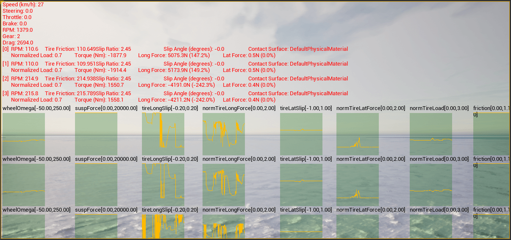

# 차량 물리 제어 및 모니터링

차량과 바퀴의 물리적 속성을 조정할 수 있습니다.
이러한 변경사항은 **실행 중에만** 적용되며, 실행이 종료되면 값들은 기본값으로 되돌아갑니다.

이러한 속성들은 [carla.VehiclePhysicsControl](python_api.md#carla.VehiclePhysicsControl) 객체를 통해 제어되며,
이 객체는 [carla.WheelPhysicsControl](python_api.md#carla.WheelPhysicsControl) 객체를 통해
각 바퀴의 물리적 특성도 제어할 수 있게 합니다.

- [__차량 제어 코드 예제__](#차량-제어-코드-예제)
- [__차량 텔레메트리 보기__](#차량-텔레메트리-보기)

---
## 차량 제어 코드 예제

```py
import carla
import random

def main():
    # 클라이언트 연결
    client = carla.Client('127.0.0.1', 2000)
    client.set_timeout(2.0)

    # 월드와 액터 가져오기
    world = client.get_world()
    actors = world.get_actors()

    # 월드에서 무작위 차량 선택 (최소 하나는 있어야 함)
    vehicle = random.choice([actor for actor in actors if 'vehicle' in actor.type_id])

    # 바퀴 물리 제어 생성
    front_left_wheel  = carla.WheelPhysicsControl(tire_friction=2.0, damping_rate=1.5, max_steer_angle=70.0, long_stiff_value=1000)
    front_right_wheel = carla.WheelPhysicsControl(tire_friction=2.0, damping_rate=1.5, max_steer_angle=70.0, long_stiff_value=1000)
    rear_left_wheel   = carla.WheelPhysicsControl(tire_friction=3.0, damping_rate=1.5, max_steer_angle=0.0,  long_stiff_value=1000)
    rear_right_wheel  = carla.WheelPhysicsControl(tire_friction=3.0, damping_rate=1.5, max_steer_angle=0.0,  long_stiff_value=1000)

    wheels = [front_left_wheel, front_right_wheel, rear_left_wheel, rear_right_wheel]

    # 차량의 물리 제어 매개변수 변경
    physics_control = vehicle.get_physics_control()

    physics_control.torque_curve = [carla.Vector2D(x=0, y=400), carla.Vector2D(x=1300, y=600)]
    physics_control.max_rpm = 10000
    physics_control.moi = 1.0
    physics_control.damping_rate_full_throttle = 0.0
    physics_control.use_gear_autobox = True
    physics_control.gear_switch_time = 0.5
    physics_control.clutch_strength = 10
    physics_control.mass = 10000
    physics_control.drag_coefficient = 0.25
    physics_control.steering_curve = [carla.Vector2D(x=0, y=1), carla.Vector2D(x=100, y=1), carla.Vector2D(x=300, y=1)]
    physics_control.use_sweep_wheel_collision = True
    physics_control.wheels = wheels

    # 차량에 물리 제어 적용
    vehicle.apply_physics_control(physics_control)
    print(physics_control)

if __name__ == '__main__':
    main()
```

---

## 차량 텔레메트리 보기

차량 텔레메트리는 [`Actor.enable_debug_telemetry`](python_api.md#carla.Actor.enable_debug_telemetry) 메서드를 호출하여 시각화할 수 있습니다. 이를 통해 서버 창에 여러 지표의 그래프 뷰가 표시되며, 시뮬레이션 창에는 차량 기준점이 표시됩니다.



`PythonAPI/examples`에 있는 `manual_control.py` 예제 스크립트에서 텔레메트리 시각화 도구를 시험해볼 수 있습니다. `T` 키를 눌러 텔레메트리 뷰를 활성화할 수 있습니다.