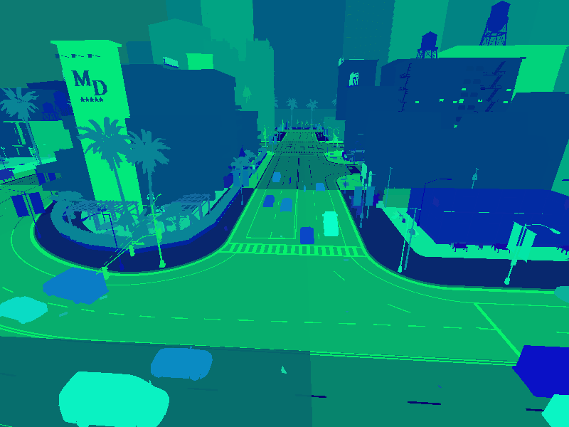

# 인스턴스 분할 센서

*인스턴스 분할*은 장면 내의 모든 객체에 대해 고유한 픽셀 값을 생성하는 새로운 유형의 카메라 센서입니다. 이는 예를 들어 차량과 같은 동일한 객체 클래스의 인스턴스에 대해 동일한 ID를 가지는 의미론적 분할 센서와는 대조적입니다.

의미론적 분할 카메라를 생성하려면 `sensor.camera.instance_segmentation` 블루프린트가 필요합니다:

```py
instance_camera_bp = world.get_blueprint_library().find('sensor.camera.instance_segmentation')
```

# 예제

인스턴스 분할 카메라로 월드를 설정하고 장면에 다수의 차량을 생성하는 것부터 시작하겠습니다.

서버에 연결하고 동기 모드로 설정합니다.

```py
import carla
import random
import time
import queue

# 클라이언트에 연결하고 CARLA 서버를 동기 모드로 설정
client = carla.Client('localhost', 2000)
world = client.get_world()
settings = world.get_settings()
settings.synchronous_mode = True
world.apply_settings(settings) 
```

인스턴스 분할 센서를 설정하고 원하는 맵 위치에 생성합니다.

```py
# 맵 생성 지점과 관전자를 가져옴
spawn_points = world.get_map().get_spawn_points()
spectator = world.get_spectator()

# 카메라를 맵의 특정 위치에 설정
cam_location = carla.Location(x=-46., y=152, z=18)
cam_rotation = carla.Rotation(pitch=-21, yaw=-93.4, roll=0)
camera_transform = carla.Transform(location=cam_location, rotation=cam_rotation)
spectator.set_transform(camera_transform)

# 의미론적 카메라 블루프린트를 가져오고 카메라 생성
instance_camera_bp = world.get_blueprint_library().find('sensor.camera.instance_segmentation')
instance_camera = world.try_spawn_actor(instance_camera_bp, camera_transform)
```

카메라 주변에 차량을 생성하여 장면에 다수의 객체 인스턴스를 배치합니다.

```py
# 카메라 반경 80m 내에 차량 생성
vehicle_bp_library = world.get_blueprint_library().filter('*vehicle*')
radius = 80
for spawn_point in spawn_points:
    vec = [spawn_point.location.x - cam_location.x, spawn_point.location.y - cam_location.y]
    if vec[0]*vec[0] + vec[1]*vec[1] < radius*radius:
        world.try_spawn_actor(random.choice(vehicle_bp_library), spawn_point)
world.tick()
```

이제 이미지를 생성합니다.

```py
# 이미지를 디스크에 저장
instance_image_queue = queue.Queue()
instance_camera.listen(instance_image_queue.put)
world.tick()
instance_image=instance_image_queue.get()
instance_image.save_to_disk('instance_segmentation.png')
```

## 이미지 출력

디스크에 저장된 인스턴스 분할 이미지는 RGB 이미지 파일의 G와 B 채널에 인스턴스 ID가 인코딩되어 있습니다. R 채널에는 표준 의미론적 ID가 포함되어 있습니다.

