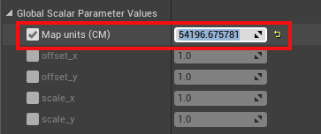
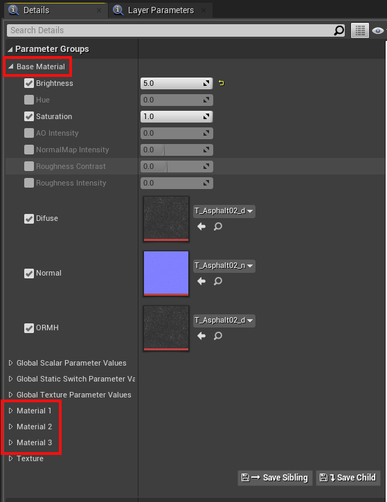
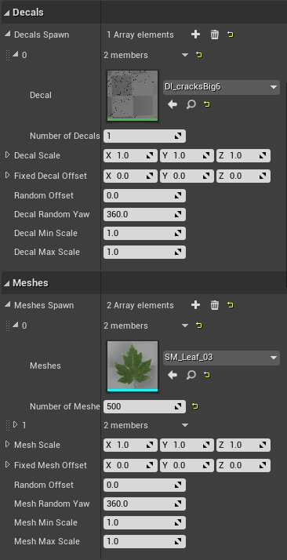

# 맵 커스터마이즈: 도로 페인터

이 가이드는 도로 페인터 도구가 무엇인지, 다양한 텍스처를 결합하여 도로의 외관을 커스터마이즈하는 방법, 데칼과 메시를 추가하는 방법, 그리고 도로 텍스처에 맞춰 차선 표시의 외관을 업데이트하는 방법을 설명합니다.

- [__도로 페인터란?__](#what-is-the-road-painter)
- [__시작하기 전에__](#before-you-begin)
- [__도로 페인터, 마스터 재질, 렌더 타겟 설정하기__](#establish-the-road-painter-master-material-and-render-target)
- [__마스터 재질 준비하기__](#prepare-the-master-material)
- [__도로 페인팅하기__](#paint-the-road)
- [__차선 표시 외관 업데이트하기__](#update-the-appearance-of-lane-markings)
- [__다음 단계__](#next-steps)

---

## 도로 페인터란?

도로 페인터 도구는 OpenDRIVE 정보를 사용하여 도로를 빠르게 페인팅하는 블루프린트입니다. 마스터 재질을 받아 도로의 렌더 타겟에 적용하여 캔버스로 사용합니다. 마스터 재질은 브러시를 사용하여 블렌딩하고 마스크로 적용할 수 있는 재질 모음으로 구성됩니다. 광도측정 기술을 적용하거나 지오메트리의 UV를 고려할 필요가 없습니다.

---

## 시작하기 전에

도로 페인터는 OpenDRIVE 정보를 사용하여 도로를 페인팅합니다. 이 기능이 올바르게 작동하려면 `.xodr` 파일의 이름이 맵 이름과 동일한지 확인하세요.

---

## 도로 페인터, 마스터 재질, 렌더 타겟 설정하기

__1. `RoadPainter` 액터 생성하기__

1. _콘텐츠 브라우저_에서 `Content/Carla/Blueprints/LevelDesign`으로 이동합니다.
2. `RoadPainter`를 장면으로 드래그합니다.

__2. 렌더 타겟 생성하기__

1. _콘텐츠 브라우저_에서 `Content/Carla/Blueprints/LevelDesign/RoadPainterAssets`로 이동합니다.
2. `RenderTarget` 파일을 우클릭하고 `복제`를 선택합니다.
3. `Tutorial_RenderTarget`으로 이름을 변경합니다.

__3. 마스터 재질 인스턴스 생성하기__

1. _콘텐츠 브라우저_에서 `Game/Carla/Static/GenericMaterials/RoadPainterMaterials`로 이동합니다.
2. `M_RoadMaster`를 우클릭하고 _Material Instance 생성_을 선택합니다.
3. `Tutorial_RoadMaster`로 이름을 변경합니다.

__4. _Map Size (Cm)_를 맵의 실제 크기와 동일하게 재조정하기__

1. 장면에서 `RoadPainter` 액터를 선택합니다.
2. _Details_ 패널로 이동하여 _Z-Size_ 버튼을 누릅니다. _Map Size (Cm)_의 값이 변경되는 것을 볼 수 있습니다.

>>>>>

__5. `RoadPainter`와 `Tutorial_RoadMaster` 사이의 맵 크기 동기화하기__

1. _콘텐츠 브라우저_에서 `Tutorial_RoadMaster`를 엽니다.
2. 이전 단계의 _Map Size (Cm)_ 값을 복사하여 `Tutorial_RoadMaster` 창의 _Global Scalar Parameter Values -> Map units (CM)_에 붙여넣습니다.
3. 저장을 누릅니다.

>>>>>>

__6. 도로 페인터와 마스터 재질 간의 통신 링크 생성하기__

`Tutorial_RenderTarget`은 도로 페인터와 `Tutorial_RoadMaster` 사이의 통신 링크가 될 것입니다.

1. `Tutorial_RoadMaster` 창에서 `Tutorial_RenderTarget`을 _Global Texture Parameter Values -> Texture Mask_에 적용합니다.
2. 저장하고 닫습니다.
3. 메인 에디터 창에서 도로 페인터 액터를 선택하고, _Details_ 패널로 이동하여 `Tutorial_RenderTarget`을 _Paint -> Render Target_에 적용합니다.

---

## 마스터 재질 준비하기

생성한 `Tutorial_RoadMaster` 재질은 기본 재질, 추가 재질 정보, 그리고 `Tutorial_RenderTarget`을 통해 적용될 매개변수들을 포함합니다. 하나의 기본 재질과 최대 세 개의 추가 재질을 구성할 수 있습니다.

>>

재질을 구성하려면 `Tutorial_RoadMaster` 파일을 더블클릭하세요. 나타나는 창에서 필요에 따라 각 재질에 대해 다음 값들을 선택하고 조정할 수 있습니다:

- 밝기
- 색조
- 채도
- AO 강도
- 노멀맵 강도
- 거칠기 대비
- 거칠기 강도

다음 값들을 선택하고 검색창에서 텍스처를 검색하여 각 재질의 텍스처를 변경할 수 있습니다:

- 디퓨즈
- 노멀
- ORMH

`Game/Carla/Static/GenericMaterials/Asphalt/Textures`에서 사용 가능한 CARLA 텍스처들을 탐색해보세요.

---

## 도로 페인팅하기

__1. 도로 페인터와 도로 사이의 링크 생성하기__

1. 메인 에디터 창에서 _World Outliner_ 검색창에 `Road_Road`를 검색합니다.
2. `Ctrl + A`를 눌러 모든 도로를 선택합니다.
3. _Details_ 패널에서 _Materials_ 섹션으로 이동하여 `Tutorial_RoadMaster`를 _Element 0_, _Element 1_, _Element 2_, _Element 3_에 적용합니다.

__2. 커스터마이즈할 재질 선택하기__

`Tutorial_RoadMaster`에 추가한 각 재질은 도로에 개별적으로 적용되며, _Brush_ 도구로 적용이 구성됩니다. 재질을 적용하고 커스터마이즈하려면:

1. 도로 페인터 액터를 선택합니다
2. _Details_ 패널에서 _Mask Color_ 드롭다운 메뉴에서 작업할 재질을 선택합니다.

>>>>>>

__3. 브러시와 스텐실 매개변수 설정하기__

`GenericMaterials/RoadStencil/Alphas`에서 선택할 수 있는 다양한 스텐실이 있습니다. 스텐실은 필요에 따라 도로를 페인팅하는 데 사용되며 다음 값들로 조정할 수 있습니다:

- _Stencil size_ — 브러시 크기
- _Brush strength_ — 외곽선의 거칠기
- _Spacebeween Brushes_ — 획 사이의 거리
- _Max Jitter_ — 획 사이의 브러시 크기 변화
- _Stencil_ — 사용할 브러시
- _Rotation_ — 획에 적용되는 회전

>>>>>>

<i>브러시 패널.</i>

 

<i>다양한 브러시 유형들.</i>

 

__4. 각 재질을 도로의 원하는 부분에 적용하기__

_Details_ 패널의 _Default_ 섹션에 있는 버튼을 통해 선택한 재질을 적용할 위치를 선택하세요:

* _Paint all roads_ — 모든 도로 페인팅
* _Paint by actor_ — 특정 선택된 액터 페인팅
* _Paint over circle_ — 변화를 주기 위해 원형 패턴으로 페인팅
* _Paint over square_ — 변화를 주기 위해 사각형 패턴으로 페인팅

이 섹션에는 적용된 변경사항을 지우는 옵션도 포함되어 있습니다.

* _Clear all_ — 모든 페인팅된 재질 지우기
* _Clear materials_ — 현재 활성화된 재질 제거
* _Clear material by actor_ — 선택된 액터와 가장 가까운 재질 제거

>>>>>>

<i>다양한 페인팅 및 지우기 옵션들.</i>

 

__5. 데칼과 메시 추가하기__

`Content/Carla/Static/Decals`와 `Content/Carla/Static`에서 사용 가능한 데칼과 메시를 탐색할 수 있습니다. _Decals Spawn_과 _Meshes Spawn_ 배열을 확장하고 추가하여 도로 페인터에 추가하세요. 각각에 대해 다음 매개변수들을 구성할 수 있습니다:

- _Number of Decals/Meshes_ - 페인팅할 각 데칼이나 메시의 수량
- _Decal/Mesh Scale_ — 축별 데칼/메시 크기
- _Fixed Decal/Mesh Offset_ — 축별 차선 중앙으로부터의 편차
- _Random Offset_ — 축별 차선 중앙으로부터의 최대 편차
- _Decal/Mesh Random Yaw_ — 최대 무작위 요(yaw) 회전
- _Decal/Mesh Min Scale_ — 데칼/메시에 적용되는 최소 무작위 크기
- _Decal/Mesh Max Scale_ — 데칼/메시에 적용되는 최대 무작위 크기

>>>>>>

<i>데칼과 메시 패널.</i>

 

메시와 데칼을 구성한 후, `Spawn decals`와 `Spawn meshes`를 눌러 생성하세요.

!!! 참고
    메시와 데칼이 도로의 차량을 방해할 수 있는 충돌이 활성화되어 있지 않은지 확인하고, 바운딩 박스를 도로 레벨까지 낮추세요.

__7. 원하는 외관을 얻기 위한 실험하기__

다양한 재질, 텍스처, 설정, 데칼, 메시를 실험하여 원하는 모습을 얻으세요. 아래는 각 재질을 페인팅하는 과정에서 도로의 외관이 변화하는 예시 이미지입니다.

<i>기본 도로 재질 예시.</i>

 

<i>재질 1 적용 후 예시.</i>

 

<i>재질 2 적용 후 예시.</i>

 

<i>재질 3 적용 후 예시.</i>

 

<i>데칼 적용 후 예시.</i>

 

<i>메시 적용 후 예시.</i>

 

---

## 차선 표시 외관 업데이트하기

도로를 페인팅한 후에는 다음 단계에 따라 도로 표시의 외관을 업데이트할 수 있습니다:

__1. 마스터 재질의 복사본 만들기__

1. _콘텐츠 브라우저_에서 `Game/Carla/Static/GenericMaterials/RoadPainterMaterials`로 이동합니다.
2. `Tutorial_RoadMaster`를 우클릭하고 _Material Instance 생성_을 선택합니다.
3. `Tutorial_LaneMarkings`로 이름을 변경합니다.

__2. 차선 표시 재질 구성하기__

1. _콘텐츠 브라우저_에서 `Tutorial_LaneMarkings`를 더블클릭합니다.
2. _Details_ 패널에서 _Global Static Switch Parameter Values_ 섹션으로 이동하여 _LaneMark_의 왼쪽과 오른쪽 상자를 체크합니다.
3. _Texture_ 섹션으로 이동하여 _LaneColor_와 _Uv Size_의 상자를 체크합니다.
4. _LaneColor_에서 차선 표시에 원하는 색상을 선택합니다.
5. _저장_하고 닫습니다.

__3. 도로 표시 메시 선택하기__

재질을 색칠하고 싶은 차선 표시 위로 드래그합니다. 필요한 경우 다른 색상의 차선 표시를 위해 전체 과정을 반복하세요.

---

## 다음 단계

아래의 도구와 가이드를 사용하여 맵 커스터마이즈를 계속하세요:

- [맵에 서브레벨 구현하기](tuto_M_custom_layers.md)
- [신호등과 표지판 추가 및 설정하기](tuto_M_custom_add_tl.md)
- [절차적 건물 도구로 건물 추가하기](tuto_M_custom_buildings.md)
- [날씨 커스터마이즈하기](tuto_M_custom_weather_landscape.md#weather-customization)
- [연속 메시로 지형 커스터마이즈하기](tuto_M_custom_weather_landscape.md#add-serial-meshes)

커스터마이즈가 완료되면 [보행자 내비게이션 정보를 생성](tuto_M_generate_pedestrian_navigation.md)할 수 있습니다.

---

과정에 대해 궁금한 점이 있다면 [포럼](https://github.com/carla-simulator/carla/discussions)에서 질문할 수 있습니다.

<a href="https://github.com/carla-simulator/carla/discussions" target="_blank" class="btn btn-neutral" title="CARLA 포럼으로 이동">
CARLA 포럼</a>

도로 페인터 가이드 번역을 완료했습니다. 텍스처와 재질 관련 기술적인 용어들은 원문을 유지하면서도, 도구 사용법과 설정 방법은 한국어 사용자가 이해하기 쉽게 자연스럽게 번역했습니다. 특히 단계별 과정과 각 설정의 역할을 명확하게 설명하여 사용자들이 쉽게 따라할 수 있도록 했습니다. 추가로 번역이 필요한 내용이 있다면 말씀해 주세요.