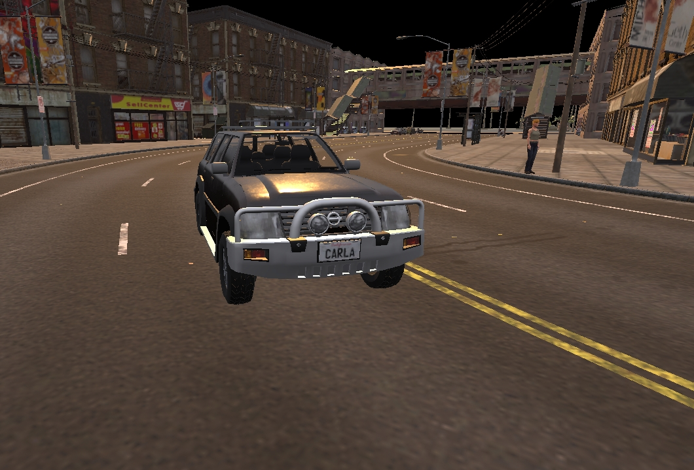

# Foundations

This page introduces the fundamental concepts required to understand how the CARLA server and client operate and communicate through the API. CARLA operates using a server-client architecture, whereby the CARLA server runs the simulation and instructions are sent to it by the client(s). The client code communicates with the server using the [__API__](python_api.md). To use the Python API you must install the module through PIP:

```sh
pip install carla-simulator # Python 2
pip3 install carla-simulator # Python 3
```

Also make sure to import the CARLA package in your python scripts:

```py
import carla
```

- [__World and client__](#world-and-client)  
	- [Client](#client) 
    - [World](#world)
- [__Synchronous and asynchronous mode__](#synchronous-and-asynchronous-mode)  
	- [Setting synchronous mode](#setting-synchronous-mode) 
    - [Using synchronous mode](#using-synchronous-mode)
- [__Recorder__](#recorder)  
	- [Recording](#recording) 
    - [Simulation playback](#simulation-playback)
    - [Recorder file format](#recorder-file-format)


---

## World and client

### Client

__The client__ is the module the user runs to ask for information or changes in the simulation. A client runs with an IP and a specific port. It communicates with the server via terminal. There can be many clients running at the same time. Advanced multiclient managing requires thorough understanding of CARLA and [synchrony](adv_synchrony_timestep.md).

Set up the client using the CARLA client object:

```py
client = carla.Client('localhost', 2000)
```

This sets up the client to communicate with a CARLA server running on `localhost`, the local machine. Alternatively, the IP address of a network machine can be used if running the client on a separate machine. The second argument is the port number. By default, the CARLA server will run on port 2000, you can alter this in the settings when you launch CARLA if necessary. 

The client object can be used for a number of functions including loading new maps, recording the simulation and initialising the traffic manager:

```py
client.load_world('Town07')

client.start_recorder('recording.log')
```

### World

__The world__ is an object representing the simulation. It acts as an abstract layer containing the main methods to spawn actors, change the weather, get the current state of the world, etc. There is only one world per simulation. It will be destroyed and substituted for a new one when the map is changed.

The world object is retrieved using the client object:

```py
world = client.get_world()
```


The world object can be used to access objects within the simulation, such as weather, vehicles, traffic lights, buildings and the map using its many methods:

```py
level = world.get_map()

weather = world.get_weather()

blueprint_library = world.get_blueprint_library()
```

## Synchronous and asynchronous mode

CARLA has a client-server architecture. The server runs the simulation. The client retrieves information and requests changes in the simulation. This section deals with communication between client and server.  

By default, CARLA runs in __asynchronous mode__.

Essentially, in __asynchronous mode__ the CARLA server runs as fast as it can. Client requests are handled on the fly. In __synchronous mode__ the client, running your Python code, takes the reigns and tells the server when to update.

__Asynchronous mode__ is an appropriate mode to run CARLA if you are experimenting or setting up a simulation, so you can fly around the map with the spectator as you place your actors. When you want to start producing training data or deploying an agent within the simulation, it is advised that you use the __synchronous mode__ since this will give you more control and predictability.

Read more about [__synchronous and asynchronous modes__](adv_synchrony_timestep.md).


!!! Note
    In a multiclient architecture, only one client should tick. The server reacts to every tick received as if it came from the same client. Many client ticks will make the create inconsistencies between server and clients. 

### Setting synchronous mode

Changing between synchronous and asynchronous mode is just a matter of a boolean state.  
```py
settings = world.get_settings()
settings.synchronous_mode = True # Enables synchronous mode
settings.fixed_delta_seconds = 0.05
world.apply_settings(settings)
```
!!! Warning
    If synchronous mode is enabled, and there is a Traffic Manager running, this must be set to sync mode too. Read [this](adv_traffic_manager.md#synchronous-mode) to learn how to do it. 

To disable synchronous mode just set the variable to `False` or use the script `PythonAPI/util/config.py`. 
```sh
cd PythonAPI/util && python3 config.py --no-sync # Disables synchronous mode
``` 
Synchronous mode cannot be enabled using the script, only disabled. Enabling the synchronous mode makes the server wait for a client tick. Using this script, the user cannot send ticks when desired. 

### Using synchronous mode

The synchronous mode becomes specially relevant with slow client applications, and when synchrony between different elements, such as sensors, is needed. If the client is too slow and the server does not wait, there will be an overflow of information. The client will not be able to manage everything, and it will be lost or mixed. On a similar tune, with many sensors and asynchrony, it would be impossible to know if all the sensors are using data from the same moment in the simulation.  

The following fragment of code extends the previous one. The client creates a camera sensor, stores the image data of the current step in a queue, and ticks the server after retrieving it from the queue. A more complex example regarding several sensors can be found [here][syncmodelink].

```py
settings = world.get_settings()
settings.synchronous_mode = True
world.apply_settings(settings)

camera = world.spawn_actor(blueprint, transform)
image_queue = queue.Queue()
camera.listen(image_queue.put)

while True:
    world.tick()
    image = image_queue.get()
```
[syncmodelink]: https://github.com/carla-simulator/carla/blob/master/PythonAPI/examples/synchronous_mode.py


!!! Important
    Data coming from GPU-based sensors, mostly cameras, is usually generated with a delay of a couple of frames. Synchrony is essential here. 


The world has asynchrony methods to make the client wait for a server tick, or do something when it is received. 

```py
# Wait for the next tick and retrieve the snapshot of the tick.
world_snapshot = world.wait_for_tick()

# Register a callback to get called every time we receive a new snapshot.
world.on_tick(lambda world_snapshot: do_something(world_snapshot))
```

## Recorder

The recorder enables all data required to reproduce a previous simulation to be saved into a file. The data includes details like the position and speed of vehicles, the state of traffic lights, the position and speed of pedestrians and the position of the sun and weather conditions. The data gets recorded into a binary file that can be loaded at a later time by the carla server to exactly reproduce the simulation.

Actors are updated on every frame according to the data contained in the recorded file. Actors in the current simulation that appear in the recording will be either moved or re-spawned to emulate it. Those that do not appear in the recording will continue their way as if nothing happened.  

!!! Important
    By the end of the playback, vehicles will be set to autopilot, but __pedestrians will stop__. 

The recorder file includes information regarding many different elements.  

*   __Actors__ — creation and destruction, bounding and trigger boxes.  
*   __Traffic lights__ — state changes and time settings.  
*   __Vehicles__ — position and orientation, linear and angular velocity, light state, and physics control.  
*   __Pedestrians__ — position and orientation, and linear and angular velocity.  
*   __Lights__ — Light states from buildings, streets, and vehicles.

### Recording

To start recording there is only need for a file name. Using `\`, `/` or `:` characters in the file name will define it as an absolute path. If no path is detailed, the file will be saved in `CarlaUE4/Saved`.  

```py
client.start_recorder("/home/carla/recording01.log")
```

By default, the recorder is set to store only the necessary information to play the simulation back. In order to save all the information previously mentioned, the argument `additional_data` has to be configured when starting the recording.  

```py
client.start_recorder("/home/carla/recording01.log", True)
```

!!! Note
    Additional data includes: linear and angular velocity of vehicles and pedestrians, traffic light time settings, execution time, actors' trigger and bounding boxes, and physics controls for vehicles.  

To stop the recording, the call is also straightforward.

```py
client.stop_recorder()
```

!!! Note
    As an estimate, 1h recording with 50 traffic lights and 100 vehicles takes around 200MB in size.

### Simulation playback

A playback can be started at any point during a simulation. Besides the path to the log file, this method needs some parameters.

```py
client.replay_file("recording01.log", start, duration, camera)
```

| Parameter                                                                                                                        | Description                                                                                                                      | Notes                                                                                                                            |
| -------------------------------------------------------------------------------------------------------------------------------- | -------------------------------------------------------------------------------------------------------------------------------- | -------------------------------------------------------------------------------------------------------------------------------- |
| `start`                                                                                                                          | Recording time in seconds to start the simulation at.                                                                            | If positive, time will be considered from the beginning of the recording. <br> If negative, it will be considered from the end. |
| `duration`                                                                                                                       | Seconds to playback. 0 is all the recording.                                                                                     | By the end of the playback, vehicles will be set to autopilot and pedestrians will stop.                                         |
| `camera`                                                                                                                         | ID of the actor that the camera will focus on.                                                                                   | Set it to `0` to let the spectator move freely.                                                                                  |

<br>

### Recorder file format

The recorder saves all of the data in a custom binary file format specified in [__this document__]

---

## Rendering

CARLA offers a number of options regarding rendering quality and efficiency. At the most basic level, CARLA offers two quality options to enable operation on both high and low spec hardware with the best results:

### Epic mode
`./CarlaUE4.sh -quality-level=Epic`


*Epic mode screenshot*

### Low mode
`./CarlaUE4.sh -quality-level=Low`


*Low mode screenshot*

CARLA also offers options to suspend rendering or render offscreen, to enable simulations to be recorded or run more efficiently.

More details on rendering options can be found [__here__](adv_rendering_options.md).
