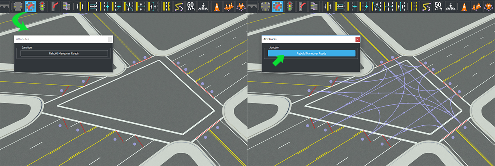
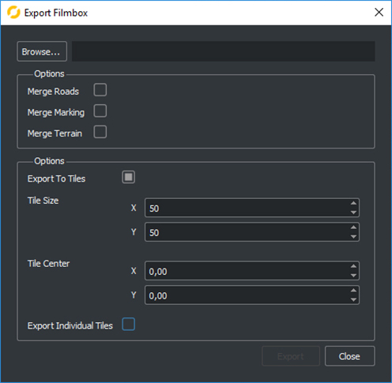
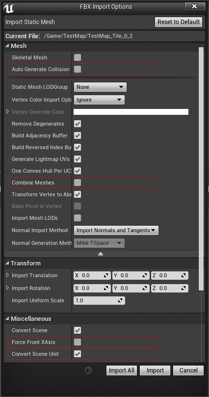

<h1>How to make a new map with RoadRunner</h1>

<h2>RoadRunner</h2>

RoadRunner is a powerful software from Vector Zero to create 3D scenes. Using RoadRunner is easy, in a few steps you will be able to create an impressive scene. You can download
a trial of RoadRunner at:

 [https://www.vectorzero.io/](https://www.vectorzero.io/)

<h2>Step 1 - Create your map in RoadRunner:</h2>

* Start by becoming familiar with the RoadRunner editor. Play with the controllers to define roads, sidewalks, etc. Please, keep in mind the following rules:
  * Create your maps centered arround (0,0). This is required to maintain compatibility with CARLA maps.
  * At the beginning of the map creation select Tools/TransformScene and aply a 180º rotation.
    Currently OpenDrive appears rotated 180 degrees by default --We are working on fixing that.

  

  * Check that all conections and geometries seem correct.

  

  * Visualize the OpenDrive road network by clicking on the "OpenDrivePrevewTool" button.

  

!!! note
    During the creation of the map, junctions (the union between two roads) might yield
    some errors when building the OpenDrive file. Clicking on the
    "OpenDrivePreviewTool" button lets you test the integrity of the current map. If
    errors happen you shoud click on the "ManouverRoadsTool" button and then within the
    details window, under junction, click on the "RebuildManouverRoads" button.
    Even if nothing seems to happen the road should be fixed.

   

<h3>Exporting:</h3>

After verifying that everything is correct it is time to export the map to Unreal. You need export two files to create a map in Unreal.

* OpendDrive (.xodr) Information that cars need to circulate on the
map.

* Binaries (.fbx) All meshes you need to build the map, i.e., roads, lanemarking,
sidewalk, ect.

In order to export these files you need to follow these steps:

1.  Select File - Export - OpenDrive (.xodr)
* Select File - Export - Filmbox (.fbx)
* Choose your export folder and Keep Merge Roads, Merge Marking and Merge
  Terrain _Unchecked_.
* Under Options Check "ExportToTiles" to divide the map into chunks, this keeps
  the render process a bit lighter. Be carefull though, subdividing the map too much
  will also be inefficient. Some experimentation is needed here to get the
  perfect point and it will depend on the map beeing created.

* Leave "Export individual Tiles" _Unchecked_, this will give you only one fbx
  file with all the pieces, making easier to keep track of the map.

<h2>Step 2 - Unreal</h2>

<h2>Importing into Unreal:</h2>

* Start dragging your file from where it is saved to the "content browser" in
  your unreal's project as you would do with any other asset.
* In the Import window make sure the following options are _unchecked_:
  ForcefrontXAxis, Autogenerate collission, combine meshes.
* Make sure that ConvertSceneUnit is _checked_.
* You should Also _check_ "Import Materials" and "Import Textures" if you want
  to use RoadRunner materials or use the method described at the end of the
  next step to change them in batches.

  

<h2>Working with maps in Unreal:</h2>

First of all create a level with the Map name (this will be important later)
and save it inside Game/Carla/Maps/

Once everything is loaded up you should end with several staticMeshes in the folder
you have selected. Drag them all to the level and you will have
your map in Unreal! Congratulations!.

The time taken by the loading process will depend on how many pieces you cut the map into. Be patient! All the pieces share the same center pivot, so if they are positioned
in the same place they should fit as they did in the RoadRunner Editor. When
unreal finish loading the meshes must be centered at point (0, 0, 0).

<h3>Semantic Segmentation Ground Truth</h3>

Once you have loaded the correct map and materials, we will prepare the semantic
segmantation ground truth. In order for the semantic segmentation to work, you will need to  save the different pieces of the map in their corresponding folder. This
is a bit difficult today as with the current version there is no name
identification for the different pieces but this is a just temporal issue from
Roadrunner side. Typically you will need only 3 Folders: ../Content/Static/
1- Road, 2-Terrain, 3- RoadLines.

<h3>How to put meshes in the right folder</h3>

Select the material of the items you want to change into a new folder. Importing the
assets creates a road material, a sidewalk material and so on.

1.  Once selected rightclick and select "Asset Actions/Select actors Using this
    asset". All actors using that material should be highlighted in the viewport.

2.  Rightclick on them in the world and select "Browse to asset". All assets
    using the first material you have chosen should be selected in the Content
    browser.

3.  Move them all to the corresponding folder and repeat for each category until
    every road asset is clasified.

Roadrunner roads come with premade materials, but for CARLA weather to work
properly you will need to change the pavement materials to some of our own (Stored
under Carla/Static/GenericMaterials/WetPavement). To this end you can change the
materials one by one or you could remove the Roadrunner materials. This action will trigger the replace references window in which you can select and change the new material
for the meshes the last one was referencing.

<h2>Step 3 - Loading OpenDrive into CARLA</h2>

- In RoadRunner go into File/Export and choose OpenDrive(.xodr). In the Export
  window choose the save folder and name the file with the same name as the map. Let everything else with the default values and press export.

- Copy the .xodr file inside the Content/Carla/Maps/OpenDrive folder.

- Open Your Unreal level and drag the OpenDriveActor inside the scene. This will
  read the level name, search the Opendrive file with the same name and load
  it.

- If everything goes right you should have your road information loaded into
  your map. Congratulations!

!!! note
    It is possible that the map that Opendrive generates is rotated. Maybe you did not rotate it in RoadRunner when you told you so? If this happens you only need to select all
    map import from RoadRunner and rotate Z: by 180 degrees.

<h2>Setting up the traffic based on OpenDrive:</h2>

!!! Note
    the current version of CARLA needs a CarlaMapGenerator spawned in order to use the server autopilot functionality. From the current version it is also to drive all vehicles using the new client nvaigation stack. However, if you still want to use the server autopilot you will need to create a CarlaMapGenerator for your city --never above or under it.

* You will need to place points for the vehicles to spawn. The actor that sets the
  spawn position of the vehicles is called VehicleSpawnPoint. CARLA vehicles
  must overlap with one of the RoutePlanner's trigger box for them to be
  directed, otherwise they would drive straight until they find an obstacle. We
  suggest placing the spawners 2 to 3 meters avobe each trigger box, not much
  higher as if the spawn is too high it is not able to measure if there is any
  vehicle under it before spawning and they would end up spawning on top of each
  other. Spawning the vehicles a few meters behind the trigger boxes would also
  work but that is a bit trickier.

* Spawners must always be oriented as the road dictates. This must be done by
  hand but we will make some form of automation in the future.

* Traffic lights must be placed in every crossing in which vehicles might
  conflict. These are the childs of "TrafficLightBase" and are stored inside
  Game/Carla/Static/TrafficSigns/Streetlights_01.

Again, remember this is just needed to use the server autopilot. We recommend to start using new the client driving stack provided from 0.9.2 version.

<h2>Working with BP_TrafficLight and BP_TrafficLightGroups:</h2>

* One trafficlight must be placed at every entrance that needs regulation.
  One TrafficLightGroup must be placed in every crossing that has street
  lights. Adjust The triggerbox of each traffic light until it covers the roads
  it affects.

* Once the actors of an Intersection are placed, open the corresponding group
  and under TrafficLights store all TrafficLight actors involved.

* Trafficlight group works by Rotating whitch of the involved traffic light is
  green each moment. You can configure the timing the Lights stays in green
  (GreenTime), the time it stays yellow (YellowTime), and the time it takes
  between one trafficlight goes red and the next one goes green (ChangeTime).

* These last steps are in an early stage and may require a some trial and
  error from users. VehicleSpawner placement, Street light timing and
  Traffic light StopperBoxes might need some tweaking and testing to fit
  perfectly into the built city.
