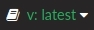

# CARLA Documentation

Welcome to the CARLA documentation. 

This home page contains an index with a brief description of the different sections in the documentation. Feel free to read in whatever order preferred. In any case, here are a few suggestions for newcomers.  

* __Install CARLA.__ Either follow the [Quick start installation](start_quickstart.md) to get a CARLA release or [make the build](build_linux.md) for a desired platform.  
* __Start using CARLA.__ The section titled [First steps](core_concepts.md) is an introduction to the most important concepts.  
* __Check the API.__ there is a handy [Python API reference](python_api.md) to look up the classes and methods available.  

The CARLA forum is available to post any doubts or suggestions that may arise during the reading.  

<a href="https://forum.carla.org/" target="_blank" class="btn btn-neutral" title="Go to the latest CARLA release">
CARLA forum</a>

!!! Warning
    Change the docs version to fit the CARLA version you are using. Use the pannel in the bottom-right side of this window to change to previous versions. 

---

## Getting started
  

    [__Introduction__](start_introduction.md)
        — What to expect from CARLA.  
    [__Quick start__](start_quickstart.md)
        — Get the CARLA releases.  
  

## Building CARLA
  

    [__Linux build__](build_linux.md)
        — Make the build on Linux.  
    [__Windows build__](build_windows.md)
        — Make the build on Windows.  
    [__Update CARLA__](build_update.md)
        — Get up to date with the latest content.  
    [__Build system__](build_system.md)
        — Learn about the build and how it is made.  
    [__Running in a Docker__](build_docker.md)
        — Run CARLA using a container solution.  
    [__F.A.Q.__](build_faq.md)
        — Some of the most frequent installation issues.  
  

## First steps
  

    [__Core concepts__](core_concepts.md)
        — Overview of the basic concepts in CARLA.  
    [__1st. World and client__](core_world.md)
        — Manage and access the simulation.  
    [__2nd. Actors and blueprints__](core_actors.md)
        — Learn about actors and how to handle them.  
    [__3rd. Maps and navigation__](core_map.md)
        — Discover the different maps and how do vehicles move around.  
    [__4th. Sensors and data__](core_sensors.md)
        — Retrieve simulation data using sensors.  
    

## Advanced steps
  

    [__OpenDRIVE standalone mode__](adv_opendrive.md)
        — Use any OpenDRIVE file as a CARLA map.  
    [__PTV-Vissim co-simulation__](adv_ptv.md)
        — Run a synchronous simulation between CARLA and PTV-Vissim.  
    [__Recorder__](adv_recorder.md)
        — Register the events in a simulation and play it again.  
    [__Rendering options__](adv_rendering_options.md)
        — From quality settings to no-render or off-screen modes.  
    [__RSS__](adv_rss.md)
        — An implementation of RSS in the CARLA client library.  
    [__SUMO co-simulation__](adv_sumo.md)
        — Run a synchronous simulation between CARLA and SUMO.  
    [__Synchrony and time-step__](adv_synchrony_timestep.md)
        — Client-server communication and simulation time.  
    [__Traffic Manager__](adv_traffic_manager.md)
        — Simulate urban traffic by setting vehicles to autopilot mode.  
    

## References
  

    [__Python API reference__](python_api.md)
        — Classes and methods in the Python API.  
    [__Blueprint library__](bp_library.md)
        — Blueprints provided to spawn actors.  
    [__C++ reference__](ref_cpp.md)
        — Classes and methods in CARLA C++.  
    [__Recorder binary file format__](ref_recorder_binary_file_format.md)
        — Detailed explanation of the recorder file format.  
    [__Sensors reference__](ref_sensors.md)
        — Everything about sensors and the data they retrieve.  
    

## Plugins
  

    [__carlaviz — web visualizer__](plugins_carlaviz.md)
        — Plugin that listens the simulation and shows the scene and some simulation data in a web browser.  
  

  
## ROS bridge
  

    [__ROS bridge installation__](ros_installation.md)
        — The different ways to install the ROS bridge.  
    [__CARLA messages reference__](ros_msgs.md)
        — Contains explanations and fields for every type of CARLA message available in ROS.  
    [__Launchfiles reference__](ros_launchs.md)
        — Lists the launchfiles and nodes provided, and the topics being consumed and published.  
    

## Tutorials — General
  

    [__Add friction triggers__](tuto_G_add_friction_triggers.md)
        — Define dynamic box triggers for wheels.  
    [__Control vehicle physics__](tuto_G_control_vehicle_physics.md)
        — Set runtime changes on a vehicle physics.  
    [__Control walker skeletons__](tuto_G_control_walker_skeletons.md)
        — Animate walkers using skeletons.  
    [__Retrieve simulation data__](tuto_G_retrieve_data.md)
        — A step by step guide to properly gather data using the recorder.  
    

## Tutorials — Assets
  

    [__Add a new map__](tuto_A_add_map.md)
        — Create and ingest a new map.  
    [__Add a new vehicle__](tuto_A_add_vehicle.md)
        — Prepare a vehicle to be used in CARLA.  
    [__Add new props__](tuto_A_add_props.md)
        — Import additional props into CARLA.  
    [__Create standalone packages__](tuto_A_create_standalone.md)
        — Generate and handle standalone packages for assets.  
    [__Map customization__](tuto_A_map_customization.md)
        — Edit an existing map.  
    [__Material customization__](tuto_A_material_customization.md)
        — Edit vehicle and building materials.  
    [__Vehicle modelling__](tuto_A_vehicle_modelling.md)
        — Create a new vehicle for CARLA.  
    

## Tutorials — Developers
  

    [__Contribute new assets__](tuto_D_contribute_assets.md)
        — Add new content to CARLA.  
    [__Create a sensor__](tuto_D_create_sensor.md)
        — Develop a new sensor to be used in CARLA.  
    [__Create semantic tags__](tuto_D_create_semantic_tags.md)
        — Define new semantic tags for semantic segmentation.  
    [__Customize vehicle suspension__](tuto_D_customize_vehicle_suspension.md)
        — Modify the suspension system of a vehicle.  
    [__Make a release__](tuto_D_make_release.md)
        — For developers who want to publish a release.  
    [__Generate detailed colliders__](tuto_D_generate_colliders.md)
        — Create detailed colliders for vehicles.  
    [__Generate pedestrian navigation__](tuto_D_generate_pedestrian_navigation.md)
        — Obtain the information needed for walkers to move around.  
    

## Contributing
  

    [__Contribution guidelines__](cont_contribution_guidelines.md)
        — The different ways to contribute to CARLA.  
    [__Code of conduct__](cont_code_of_conduct.md)
        — Standard rights and duties for contributors.  
    [__Coding standard__](cont_coding_standard.md)
        — Guidelines to write proper code.  
    [__Documentation standard__](cont_doc_standard.md)
        — Guidelines to write proper documentation.  
    
