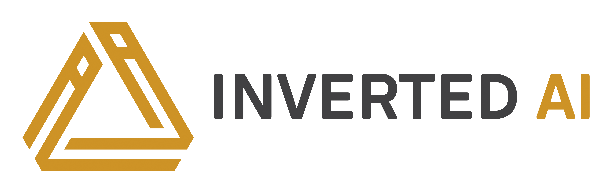

# Inverted AI 

<iframe width="100%" height="400px" src="https://ecosystem.carla.org/video/iai-pipeline.mp4" title="Inverted AI" frameborder="0" allow="accelerometer; autoplay; clipboard-write; encrypted-media; gyroscope; picture-in-picture; web-share" referrerpolicy="strict-origin-when-cross-origin" allowfullscreen></iframe>

 

Inverted AI provides a simulation engine for non-playable characters (NPCs) that simulates realistic, reactive and behaviorally diverse agents to populate your driving simulations. Inverted AI's technology is based on deep generative models providing simulation of complex, natural driving behavior derived from real-world data captured from human drivers. Their technology can be directly integrated with CARLA simulations through a web-based API. This augments the power of CARLA for both development and testing by enhancing the realism of the driving behavior within CARLA's ambient traffic.

Inverted AI presents 4 software products for traffic simulation and analysis:

### [DRIVE](https://www.inverted.ai/apis#DRIVE)

Vastly improve your simulation effort with human-like non-playable character (NPCs) that exhibit driving behaviors that are diverse, realistic, and reactive. Integrating DRIVE into your simulators means letting us take care of the hard work of driving your NPCs for you. We believe that validating and training using the most realistic behavioral distribution possible is essential. That's what DRIVE gives you.

### [INITIALIZE](https://www.inverted.ai/apis#INITIALIZE)

INITIALIZE save simulation time by allowing you to start from a realistic and diverse set of initial conditions including agent density, types, speeds, placements, and orientations. No need to "burn-in" simulations any more. Just INITIALIZE them around your ego and other scenario elements.

### [SCENARIO](https://www.inverted.ai/apis#SCENARIO)

SCENARIO enables a whole-scene guided scenario generation with realistic, reactive, and diverse agents including pedestrians, bikes, cars, buses, and lights. Synthetic logs and/or log fuzzing are the name of the game here. Currently in private beta.

### [BLAME](https://www.inverted.ai/apis#BLAME)

BLAME determines which agent(s) caused a collision and why from logs to efficiently sort through testing, training, and validation simulation run results. Don't waste time looking at infractions that weren't your fault. Currently in private beta.

Visit the [Inverted AI website](https://www.inverted.ai/home) to learn more about their products or [check out the API](https://docs.inverted.ai/en/latest/pythonapi/).

