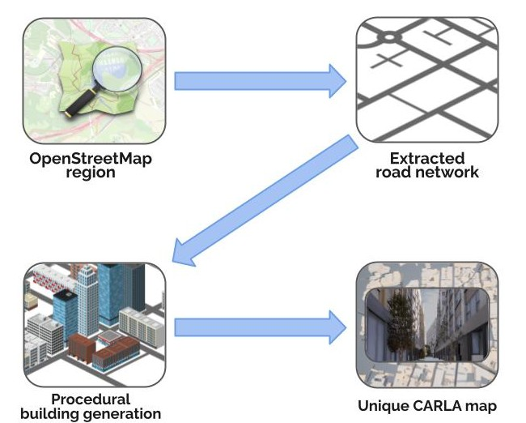
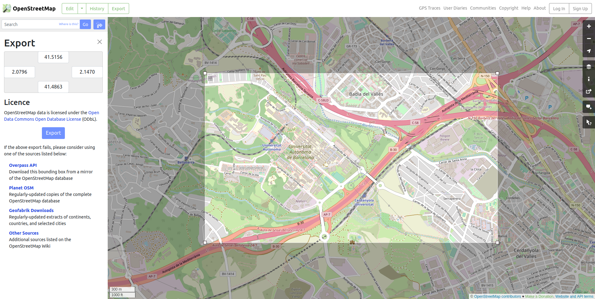
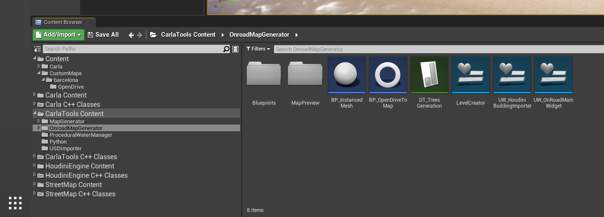
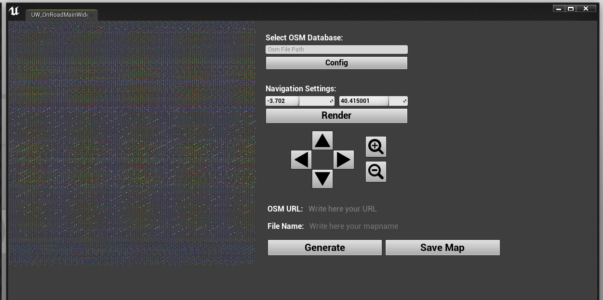
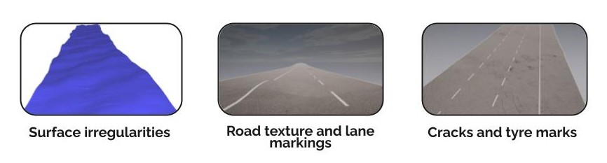
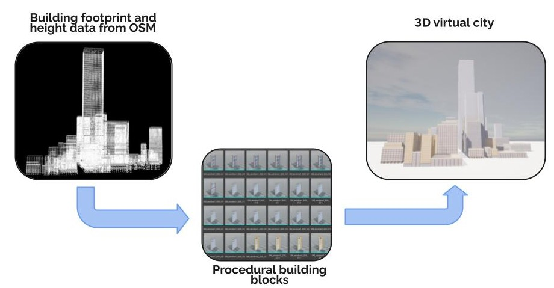
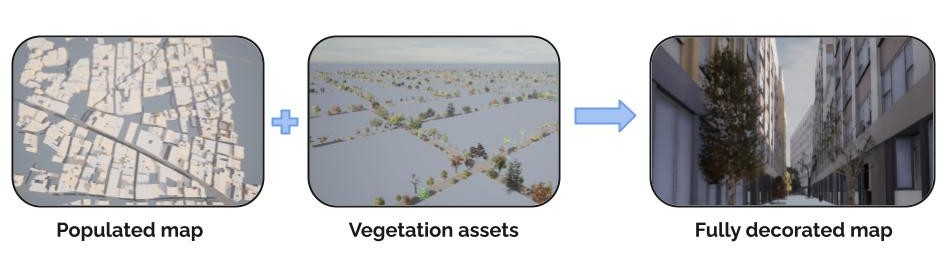
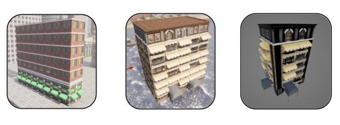

!!! note
    ___디지털 트윈 도구___는 현재 ___실험적 기능___으로, 아직 프로덕션 환경에서 사용할 준비가 되지 않았습니다. 일부 지도 영역이 장식되지 않거나 텍스처가 없을 수 있어, 실험적인 연구 프로젝트에만 사용하시기 바랍니다.

# 디지털 트윈 도구



- [__OSM 지도 데이터 다운로드 및 준비__](#downloading-and-preparing-osm-map-data)
- [__OpenStreetMap 브라우저__](#openstreetmap-browser)
- [__절차적 환경 생성__](#procedural-environment-generation)
    - [도로 장식](#overview)
    - [건물](#alsm)
- [__지도 생성__](#generate-the-map)
- [__지도 저장__](#save-the-map)

__디지털 트윈 도구__를 사용하면 [OpenStreetMap](https://www.openstreetmap.org) (OSM) 서비스에서 가져온 도로망을 기반으로 고유한 3D 환경을 절차적으로 생성할 수 있습니다. CARLA의 언리얼 엔진 에디터에 있는 디지털 트윈 도구 인터페이스를 통해 사용자는 OSM에서 지도의 특정 영역을 선택하고 도로망을 다운로드하여 새로운 CARLA 지도의 기반으로 사용할 수 있습니다. 이 도구는 도로 사이의 공간을 도로 레이아웃에 맞춰 절차적으로 생성된 3D 건물로 채워, 다양성이 높은 현실적인 3D 도로 환경을 만들어냅니다.

<iframe width="100%" height="400px" src="https://www.youtube.com/embed/gTutXdS2UkQ?si=hssM3YRCAjSIzdXM" title="YouTube video player" frameborder="0" allow="accelerometer; autoplay; clipboard-write; encrypted-media; gyroscope; picture-in-picture; web-share" referrerpolicy="strict-origin-when-cross-origin" allowfullscreen></iframe>

## OSM 렌더러 빌드하기

리눅스를 사용하는 경우, CARLA 인터페이스에서 OSM 렌더러를 사용하여 다운로드한 대규모 OSM 지도 영역을 탐색할 수 있습니다. CARLA를 빌드하기 전에 먼저 OSM 렌더러를 빌드해야 합니다. CARLA 루트 디렉토리에서 `make osmrenderer`를 실행하세요. 이 작업을 위해 CMake를 v3.2 이상으로 업그레이드해야 할 수 있습니다. 이 작업은 빌드 디렉토리에 `libosmcout-source`와 `libosmcout-build`라는 두 개의 폴더를 생성합니다. CARLA를 빌드하기 전에, 실행 파일을 찾을 수 있도록 `$CARLA_ROOT/Build/libosmcout-source/maps` 디렉토리의 `Build.sh` 파일을 다음과 같이 수정해야 합니다:

```bash
if [[ -x ../Import/src/Import ]]; then
  importExe=../Import/src/Import
elif [[ -x ../debug/Import/Import ]]; then
  importExe=../debug/Import/Import
elif [[ -x ../build/Import/Import ]]; then
  importExe=../build/Import/Import
###################  이 줄 추가 ####################
elif [ -x ../../libosmscout-build/Import/Import ]; then
  importExe=../../libosmscout-build/Import/Import
#######################################################
else
  echo "Import 실행 파일을 찾을 수 없습니다!"
  exit 1
fi
```

그런 다음 평소와 같이 CARLA 빌드를 진행하시면 됩니다. Windows 사용자는 OSM 렌더러를 사용할 수 없으며 URL을 직접 사용해야 합니다.

## OSM 지도 데이터 다운로드 및 준비



웹 브라우저에서 [OpenStreetMap 웹사이트](https:/www.openstreetmap.org)로 이동하여 사용하고 싶은 지도 영역을 선택하세요. 원하는 영역을 정의한 후 `.osm` 파일로 데이터를 내보내거나, 나중에 설명할 URL을 사용할 수 있습니다. 또는 [GeoFabrik](https://download.geofabrik.de/)와 같은 OpenStreetMap 서비스 기반의 다른 도구를 사용하여 주나 영토와 같은 특정 지도 영역을 OSM 데이터에서 추출할 수 있습니다.

OSM 데이터를 사용하는 방법에는 URL을 사용하는 방법과 OSM 파일을 다운로드하는 방법, 두 가지가 있습니다:

### URL 사용하기

[OpenStreetMap 웹사이트](https:/www.openstreetmap.org)에서 관심 있는 지역으로 이동한 후 `내보내기`를 누르세요. `수동으로 다른 영역 선택` 옵션을 사용할 수도 있습니다. 그런 다음 `Overpass API`를 마우스 오른쪽 버튼으로 클릭하고 컨텍스트 메뉴에서 `링크 복사`를 선택하세요. 파일 크기가 1GB를 넘지 않도록 해야 합니다. 이 링크를 복사하여 인터페이스의 URL 필드에 붙여넣으세요.

### OSM 파일 다운로드 및 인터페이스에서 탐색하기

이 옵션은 리눅스 사용자만 이용할 수 있습니다. 전체 주나 영토와 같은 더 큰 지도 영역을 다운로드한 다음, CARLA의 OSM 인터페이스에서 화살표와 확대/축소 버튼을 사용하여 지도를 탐색할 수 있습니다. 원하는 OSM 데이터 영역을 `.osm` 파일로 다운로드한 후 `{CARLA_ROOT}/Build/libosmcout-source/maps/` 폴더에 저장하세요. 이 폴더에서 터미널을 열고 다음 명령을 실행하세요:

```sh
cd {CARLA_ROOT}/Build/libosmcout-source/maps/
./build.sh <osm_파일_경로>
```
## OpenStreetMap 브라우저

OSM 브라우저를 열려면 콘텐츠 브라우저를 열고 `CarlaToolsContent/OnroadMapGenerator`로 이동하세요. *UW_OnRoadMainWidget*을 마우스 오른쪽 버튼으로 클릭하고 컨텍스트 메뉴에서 *Launch Editor Utility Widget*을 선택하세요. 이렇게 하면 도구의 인터페이스가 열립니다.



이 인터페이스를 통해 OSM 데이터베이스에서 다운로드하고 처리한 OSM 지도 영역을 탐색할 수 있습니다. 먼저 인터페이스의 *Select OSM Database* 필드에 이전 단계에서 처리된 OSM 데이터를 저장한 디렉토리 위치를 입력해야 합니다. URL을 직접 사용하는 경우에는 `OSM URL` 필드에 붙여넣기 하면 되며, 이 경우에는 네비게이터를 사용할 수 없습니다.



방향 화살표와 확대/축소 아이콘을 사용하여 지도를 탐색하고 CARLA 지도로 변환하고 싶은 도로망 부분을 찾으세요. 미리보기에서 보이는 사각형 영역이 지도의 범위가 됩니다. `File Name` 필드에 적절한 이름을 입력한 후 *generate*를 눌러 절차적 생성 프로세스를 시작하세요. 지도 생성 프로세스는 몇 분이 걸릴 수 있으며, 큰 영역을 사용하는 경우 더 오래 걸릴 수 있습니다.

## 절차적 환경 생성

### 도로 장식

이 도구는 OSM 데이터에서 도로망을 추출하여 지도의 기반으로 사용합니다. 도로 표면은 현실적인 표면 불규칙성, 도로 표시 및 텍스처로 장식됩니다.



### 건물

도로 사이의 빈 공간은 도로 사이의 공간을 채우기 위해 형태와 크기가 조정되는 건물이나 개방 공간으로 채워집니다.



절차적 생성 도구는 OSM 데이터에서 건물의 바닥면적과 높이 정보를 추출하여 유사한 크기의 가상 건물을 생성합니다. 창문, 문, 발코니를 시뮬레이션하기 위해 상세한 외장재가 적용됩니다. 건물의 크기에 따라 다른 장식 스타일이 적용되는데, 가장 높은 건물은 사무실 스타일을, 작은 건물은 건물 바닥면적에 따라 상업용 또는 주거용 스타일이 적용됩니다.



다음 단계에서는 추가적인 디테일을 위해 보도에 식물도 추가됩니다.


*디지털 트윈 도구 건물 스타일*

건물들은 도시 전체에 무작위로 분포된 다양한 스타일로 구성되며, 한 지역의 건축 스타일은 OSM 데이터에서 추출한 건물의 특징적인 크기를 기반으로 선택됩니다.

## 지도 생성

생성 단계는 2x2 km<sup>2</sup> 영역의 경우 약 10분이 소요되며, 더 큰 영역은 더 오래 걸립니다. 생성 프로세스가 완료되면 언리얼 엔진 에디터에서 3D로 지도를 검토할 수 있습니다.

## 지도 저장

생성된 지도에 만족한다면 *Save Map* 버튼을 눌러 지도를 저장할 수 있습니다. __이 단계는 상당한 시간이 소요될 것입니다__. 한 시간 이상이 걸릴 수 있으며 몇 시간이 걸릴 수도 있습니다. 이 단계가 완료되는 동안 컴퓨터를 몇 시간 동안 실행 상태로 두어야 할 수 있습니다. 이 단계가 완료되면, 다른 지도와 마찬가지로 언리얼 엔진 에디터나 CARLA API를 통해 지도를 사용할 수 있게 됩니다.