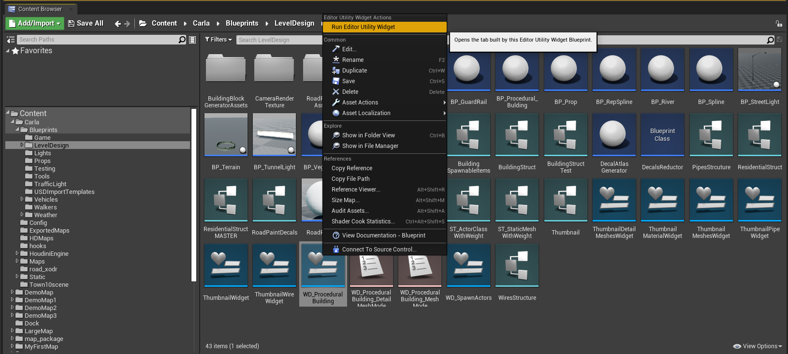
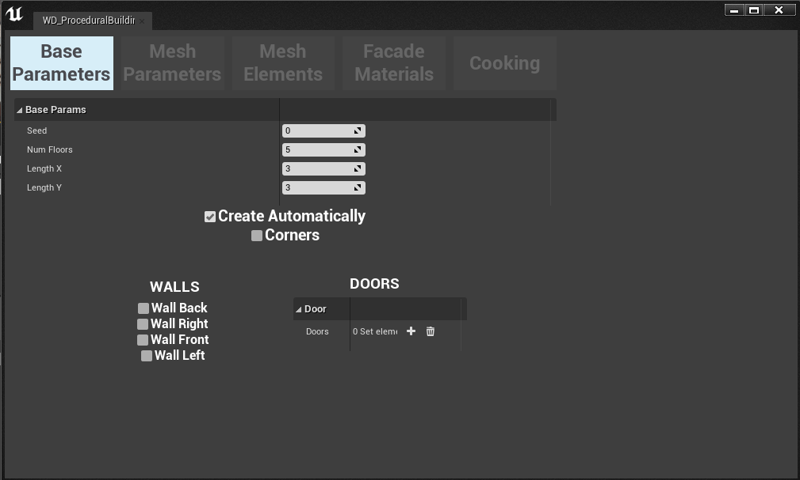
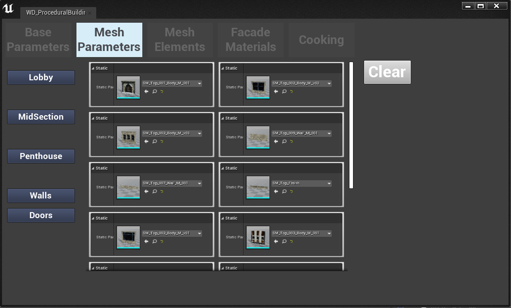
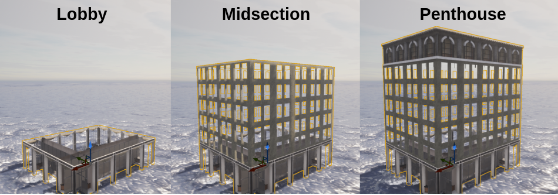
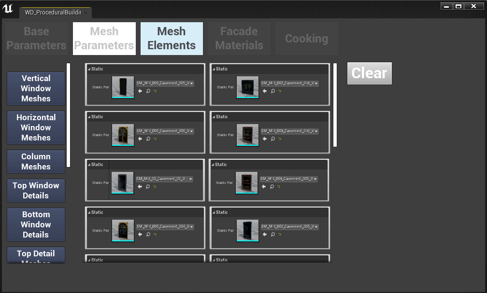
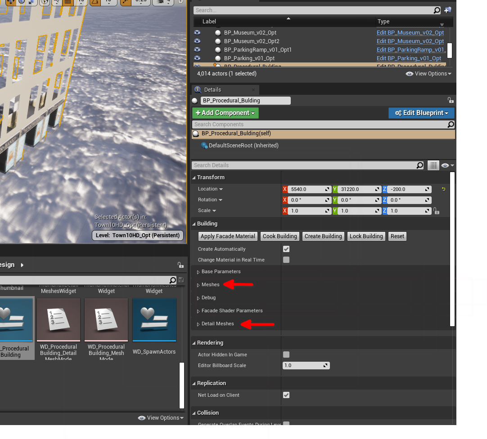
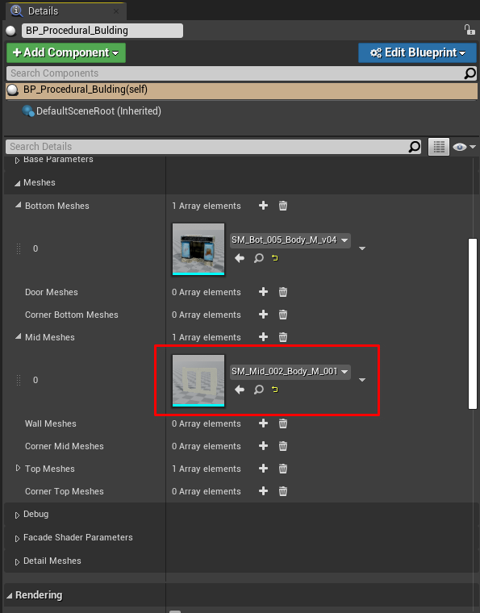
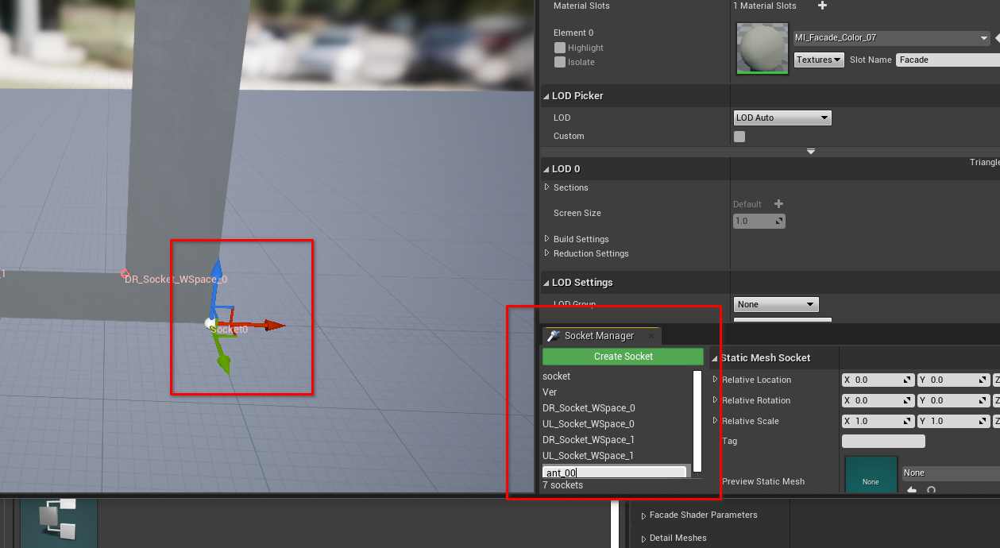
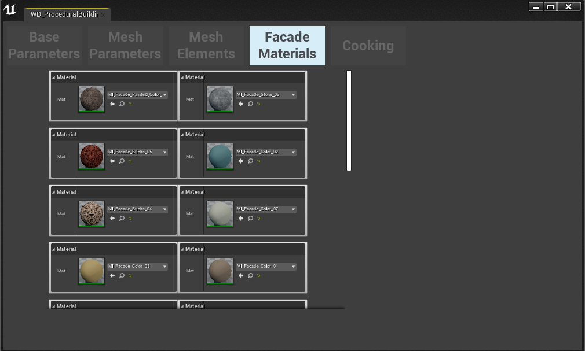
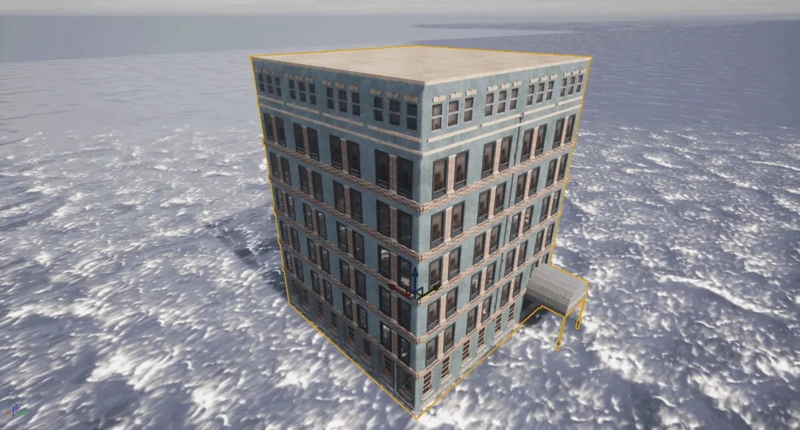

!!! note
    ___절차적 빌딩 도구___는 현재 ___실험적 기능___으로, 아직 프로덕션 환경에서 사용할 준비가 되지 않았습니다. 따라서 실험적인 연구 프로젝트에만 사용해야 합니다.

# 절차적 빌딩 도구

__절차적 빌딩 도구__는 간단한 인터페이스를 통해 크기와 장식 스타일을 조절할 수 있는 가상 3D 건물을 생성할 수 있게 해주며, 이를 통해 거의 무한한 변형을 만들어낼 수 있습니다. 인터페이스를 통해 건물의 바닥면적 크기와 층수를 선택할 수 있습니다. 그런 다음 사용자는 건물의 로비, 본체, 최상층 또는 펜트하우스에 대해 다양한 스타일을 선택할 수 있습니다. CARLA 에셋 라이브러리에서 모서리, 창문, 발코니와 같은 요소에 대해 다양한 외관 요소 스타일을 선택할 수 있습니다.

- [__도구 열기__](#opening-the-procedural-building-tool)
- [__기본 매개변수__](#base-parameters)
- [__메시 매개변수__](#mesh-parameters)
- [__메시 요소__](#mesh-elements)
    - [소켓](#sockets)
- [__외관 재질__](#facade-materials)
- [__쿠킹__](#cooking)

## 절차적 빌딩 도구 열기

먼저 장면에 절차적 빌딩 액터를 추가해야 합니다. `Content>Carla>Blueprints>LevelDesign`으로 이동하여 *BP_ProceduralBuilding* 블루프린트를 맵으로 드래그하세요. 건물을 시각화하고 싶은 위치로 에셋을 이동하세요. 결과를 명확하게 볼 수 있도록 충분한 공간이 있는 곳을 선택하세요. 그런 다음 도구를 열려면 *WD_ProceduralBuilding* 위젯을 마우스 오른쪽 버튼으로 클릭하고 컨텍스트 메뉴에서 *Run editor utility widget*을 선택하여 절차적 빌딩 도구를 실행하세요. 이렇게 하면 도구의 인터페이스가 열립니다.

!!! note
    도구를 열기 전에 이 단계를 완료해야 합니다. 도구가 작동하려면 맵에 *BP_ProceduralBuilding* 블루프린트의 인스턴스가 있어야 합니다. 또한 진행하기 전에 *World outliner*에서 *BP_ProceduralBuilding* 엔티티가 선택되어 있어야 합니다.

## 기본 매개변수

기본 매개변수 섹션에서는 바닥면적과 층수와 같은 건물의 기본적인 속성을 선택합니다.

!!! note
    [메시 매개변수](#mesh-parameters) 섹션에서 메시 조각을 선택하기 전까지는 기본 매개변수를 조정해도 언리얼 엔진 뷰포트에서 변화를 볼 수 없습니다.

사용 가능한 매개변수는 다음과 같습니다:

- __Seed__: 절차적 생성을 위한 랜덤 시드를 설정합니다. 이를 통해 같은 설정으로도 다양한 건물 변형을 만들 수 있습니다.
- __Num floors__: 건물의 층수를 설정하며, 이에 따라 건물의 높이가 정의됩니다.
- __Length X/Y__: X와 Y 차원에서 건물의 바닥면적 크기를 정의합니다. 이 값들은 단위가 없으며, 숫자는 반복되는 섹션의 수를 나타내고, 각 섹션은 창문의 열입니다.
- __Create automatically__: 이 옵션이 선택되면 조정 효과를 볼 수 있도록 뷰포트에서 건물이 자동으로 업데이트됩니다.
- __Corners__: 건물에 모서리 조각을 추가할 수 있습니다. 메시 매개변수 섹션에서 이러한 조각들을 선택할 수 있습니다.
- __Walls__: 건물의 좌/우/전/후면의 중간 조각을 [메시 매개변수](#mesh-parameters) 메뉴를 사용하여 선택할 수 있는 대체 조각으로 교체합니다.
- __Doors__: 로비 층에 문을 배치할 수 있는 배열입니다. 문은 선택한 인덱스 위치에 배치됩니다.
## 메시 매개변수

인터페이스의 메시 매개변수 탭에서 건물의 외관을 장식하는 데 사용할 메시 조각을 선택합니다. 건물의 다른 부분을 위한 5가지 카테고리의 메시 조각이 있습니다:

- __Lobby__: 건물의 로비를 장식하기 위한 메시 조각
- __Midsection__: 건물의 중간 부분(로비와 최상층 사이의 모든 층)을 장식하기 위한 메시 조각
- __Penthouse__: 펜트하우스 층을 장식하기 위한 메시 조각
- __Doors__: 로비에 문을 추가하기 위한 메시 조각
- __Walls__: 건물의 벽을 장식하기 위한 메시 조각

각 카테고리에서 다양한 메시 조각 옵션을 찾을 수 있습니다. 빨간색으로 변할 때까지 하나 이상을 클릭하면, 이들이 건물의 해당 섹션에 추가됩니다. 둘 이상을 선택하면 도구가 선택한 것들 사이에서 무작위로 번갈아가며 사용합니다. 기본 매개변수 섹션에서 *Create automatically*가 선택되어 있다면, 건물의 각 섹션에 대한 메시 조각을 선택하면서 에디터 뷰포트에서 건물이 형성되는 것을 볼 수 있습니다.

## 메시 요소

이 섹션에서는 창문, 기둥, 화분, 에어컨 유닛, 안테나와 같은 건물의 더 상세한 요소들을 선택할 수 있습니다. 각 장식 유형은 약간 다른 속성을 가지고 있습니다.

건물의 세부 사항을 위한 다양한 종류의 장식이 있습니다:

- __Vertical/Horizontal window meshes__: 건물의 창틀 스타일을 정의하는 메시 조각입니다. Vertical window meshes는 높이가 너비보다 큰 창문 공간을, horizontal window meshes는 너비가 높이보다 큰 창문 공간을 차지합니다. 여러 옵션을 선택하면 번갈아가며 사용됩니다.

- __Column meshes__: 건물 높이를 따라 이어지는 벽돌 기둥 디테일을 시뮬레이션합니다.

- __Top/Bottom window details__: 창문 상단을 인방과 차양으로, 하단을 창턱과 화분 상자로 장식하는 메시입니다.

- __Window columns__: 창문을 구분하는 벽돌 기둥입니다.

- __Curtain meshes__: 창문 안쪽에 들어갈 커튼과 블라인드입니다.

- __Pot meshes__: 지정된 소켓 점에서 창턱과 화분 상자에 추가되는 화분입니다.

- __Air conditioner meshes__: 지정된 소켓 점에서 창문에 추가되는 에어컨 유닛입니다.

- __Pipe meshes__: 지붕 배수관을 모방하여 건물을 수직으로 내려가는 파이프입니다.

- __Wire meshes__: TV 안테나 연장선과 낙뢰 접지선을 모방하여 건물을 수직으로 내려가는 전선입니다.

- __Antenna meshes__: 창문에서 돌출되는 TV 안테나입니다.

매개변수는 다음과 같이 작동합니다:

__공통 매개변수__:

* __Percentage__: 건물에 배치될 조각의 양을 제어합니다. 100%는 사용 가능한 모든 공간이 채워짐을 의미합니다
* __Offset__: 조각의 건물 본체로부터의 공간적 오프셋

__블라인드와 커튼__:

* __Min/Max size__: 블라인드나 커튼의 최소/최대 길이를 선택하며 값 사이에서 무작위로 변화합니다. 1.0은 완전히 닫힌 상태, 0.0은 완전히 열린 상태입니다.

__파이프와 전선__:

* __Index__: 파이프가 배치될 건물의 면을 정의합니다
* __Offset side/front__: 건물 면의 중심에서 조각의 공간적 오프셋을 추가합니다

!!! note
    화분, 안테나, 에어컨 유닛과 같은 세부 메시 조각을 선택했을 때 건물에 변화가 보이지 않는 경우가 있을 수 있습니다. 이는 대부분 사용 중인 조각에 선택한 조각을 추가하는 데 필요한 적절한 소켓이 없기 때문입니다. 소켓 사용 방법을 알아보려면 [소켓 섹션](#sockets)을 참조하세요.
### 소켓

소켓은 다른 메시 조각에 세부 메시를 배치할 위치를 정의하는 고정점입니다. 절차적 빌딩의 메시 조각에 소켓을 추가하려면, 절차적 빌딩이 선택된 상태에서 UE 에디터 인터페이스의 일반적으로 오른쪽에 있는 *세부 정보 패널*로 이동하세요. 거기서 *Meshes*와 *Detail meshes* 패널을 찾을 수 있습니다. 소켓을 배치하려는 메시 조각이 있는 관련 섹션을 여세요.

소켓을 배치하려는 메시를 찾아 아이콘을 더블 클릭하여 에디터에서 여세요. *create socket*을 클릭하여 소켓을 추가하고 다음 규칙에 따라 이름을 지정하세요:

* 에어컨 유닛: aa_*
* 안테나: ant_*
* 화분: pot_*

별표를 소켓 수에 따른 인덱스로 바꾸세요(예: aa_0, aa_2, aa_3...)

*Create socket*을 클릭하면 3D 핸들이 있는 소켓이 에디터에 생성됩니다. 소켓을 메시의 원하는 위치로 드래그하세요. 이 위치에 세부 조각이 유닛에 부착되어 나타날 것입니다.

## 외관 재질

외관 재질 탭에서는 건물의 벽을 장식하고 싶은 재질을 탐색하고 미리 볼 수 있습니다.

## 쿠킹

쿠킹 탭에서는 선택한 모든 메시 조각과 재질을 관련 재질과 텍스처가 있는 단일 정적 메시로 결합하는 작업을 시작합니다. LOD를 위한 건물의 LOD 텍스처도 생성됩니다. 인터페이스에서 새 건물의 에셋이 저장될 폴더 이름을 지정하세요.

건물을 쿠킹하고 나면, 다른 CARLA 에셋과 마찬가지로 맵에 건물의 인스턴스를 배치할 수 있게 됩니다.