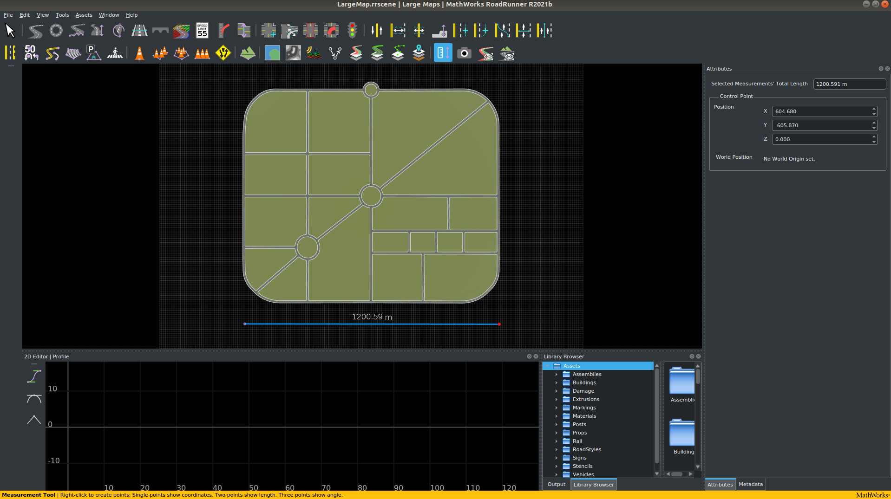
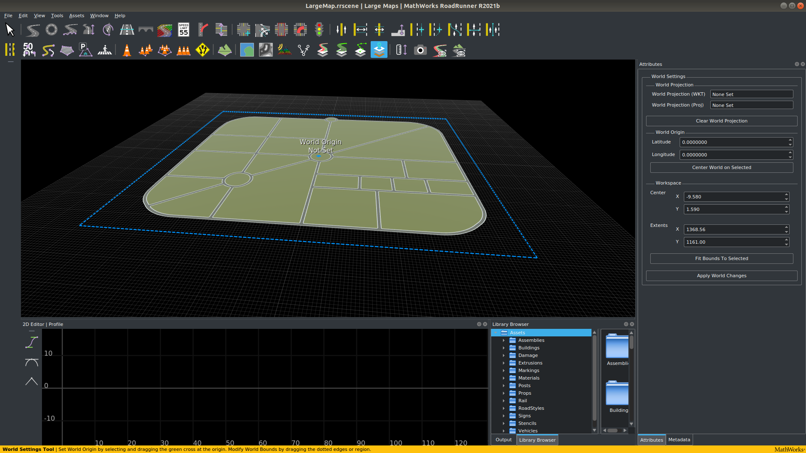
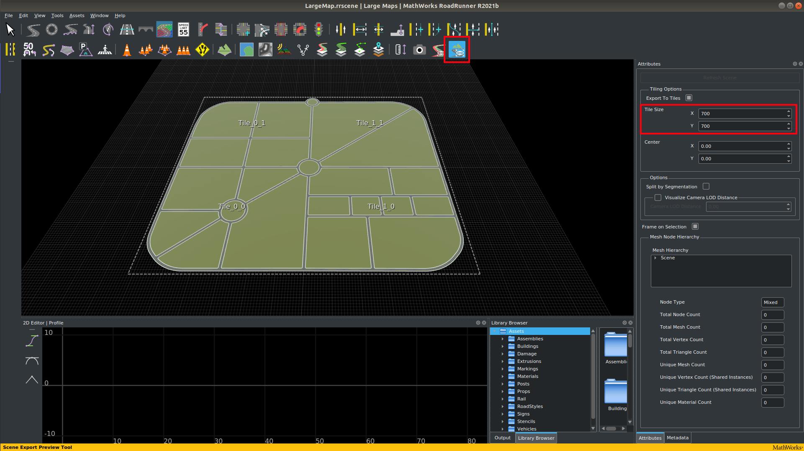
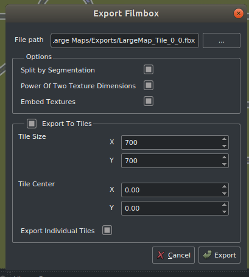
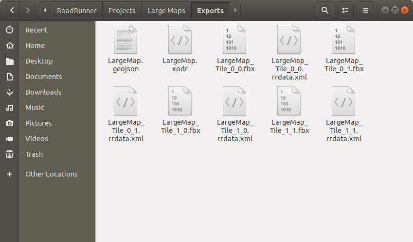
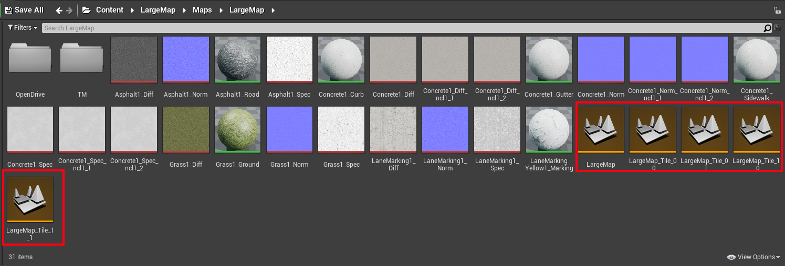
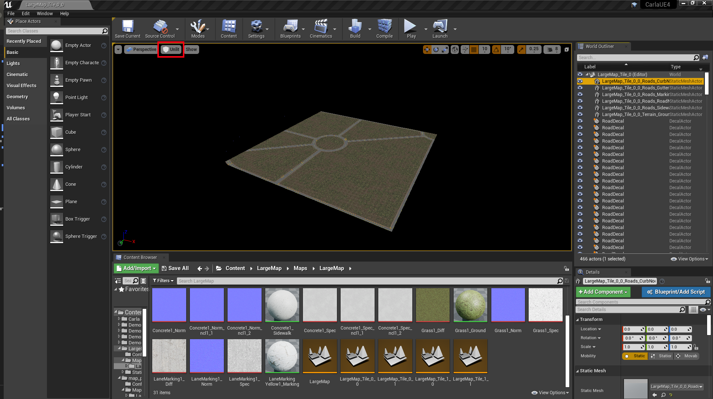

# CARLA용 대형 맵 생성하기

대형 맵(Town 11, 12와 같은)은 CARLA에서 표준 맵(예: Town 10)과는 다르게 작동합니다. 맵은 타일이라고 하는 하위 구역으로 나뉘며, 보통 1~2km 크기로 설정됩니다. 타일은 효율적인 렌더링을 위해 필요한 부분만 그래픽 메모리에 로드되도록 맵을 나눕니다. 필요하지 않은 타일은 휴면 상태로 있다가 필요할 때 로드됩니다. 일반적으로 자율 주행 차량이 위치한 타일 주변의 타일들이 로드되지만, 필요한 경우 더 많은 타일을 로드할 수 있습니다. 이 동작은 CARLA 실행 시 설정에서 수정할 수 있습니다.

# RoadRunner에서 대형 맵 생성하기

RoadRunner는 CARLA로 가져올 대형 맵을 생성하는 데 권장되는 소프트웨어입니다. 이 가이드는 대형 맵 생성을 위한 RoadRunner 사용 방법과 언리얼 엔진 에디터에서 대형 맵을 가져오고 다루는 방법을 설명합니다.

- [__RoadRunner에서 대형 맵 만들기__](#build-a-large-map-in-roadrunner)
- [__RoadRunner에서 대형 맵 내보내기__](#export-a-large-map-in-roadrunner)
- [__CARLA로 대형 맵 가져오기__](#import-a-large-map-into-carla)
    - [파일과 폴더](#files-and-folders)
    - [JSON 설명 생성(선택사항)](#create-the-json-description-optional)
    - [가져오기 실행](#making-the-import)
- [__언리얼 에디터에서 대형 맵 다루기__](#handling-a-large-map-in-the-unreal-editor)
- [__대형 맵 패키징__](#package-a-large-map)

---

## RoadRunner에서 대형 맵 만들기

RoadRunner에서 복잡한 맵을 만드는 구체적인 방법은 이 가이드의 범위를 벗어나지만, [RoadRunner 문서][rr_tutorials]에서 비디오 튜토리얼을 확인할 수 있습니다. 표면적으로는 RoadRunner에서 대형 맵을 만드는 것은 일반 맵을 만드는 것과 거의 동일하며, 단지 규모가 더 클 뿐입니다. 차이점은 주로 맵을 내보내는 방법에 있습니다.



여기에서 약 1.2km 크기의 대형 맵을 만들었습니다. 내보낼 때 이 맵은 타일로 나뉠 것이며, 타일 크기를 700m로 선택할 것이므로 맵은 약 4개의 타일로 나뉠 것입니다.

고도가 있는 대형 맵을 만드는 경우, 맵의 권장 최대 크기는 20x20 km<sup>2</sup>입니다. 이보다 큰 맵은 내보내기 시 RoadRunner가 충돌할 수 있습니다.
## RoadRunner에서 대형 맵 내보내기

아래는 RoadRunner에서 사용자 정의 대형 맵을 내보내기 위한 기본 지침입니다.

[내보내기 링크][exportlink]

[_World settings tool_](https://www.mathworks.com/help/roadrunner/ref/worldsettingstool.html)을 클릭하고 파란색 경계 상자의 가장자리를 내보내고 싶은 전체 영역을 포함하도록 드래그하여 내보내기할 전체 맵이 선택되었는지 확인하세요. 준비가 되면 _Apply World Changes_를 클릭하세요.



맵이 어떻게 타일로 나뉘어 내보내질지 이해하기 위해 장면 내보내기 미리보기 도구를 사용하는 것이 도움이 됩니다. *Tiling Options* 메뉴에서 *Tile Size* 매개변수를 조정하여 맵에 적합한 타일 크기를 찾고, *Refresh Scene*을 눌러 조정 결과를 확인하세요.



!!! Note
    __타일 크기__: 사용할 타일의 크기는 맵이 CARLA에서 효율적으로 작동하도록 하기 위해 필요한 판단입니다. 맵에 건물과 식생 같은 3D 에셋이 밀집되어 있다면, 불필요한 에셋 로딩을 방지하기 위해 더 작은 타일 크기가 유용할 수 있습니다. 하지만 이는 맵 제작에 필요한 작업의 복잡성을 증가시킬 수 있습니다. CARLA 엔진이 지원하는 최대 타일 크기는 2km이며, 약 1km 크기의 타일을 권장합니다.

내보내기 준비가 되었다면:

__1.__ `.fbx` 지오메트리 파일을 내보내세요:

  - 메인 툴바에서 `File` -> `Export` -> `Firebox (.fbx)` 선택

__2.__ 팝업 창에서:

>- 다음 옵션을 체크하세요:
    - _Split by Segmentation_: 메시를 의미론적 분할로 나누고 보행자 탐색을 향상시킵니다.
    - _Power of Two Texture Dimensions_: 성능을 향상시킵니다.
    - _Embed Textures_: 텍스처가 메시에 포함되도록 합니다.
    - _Export to Tiles_: 타일의 크기를 선택합니다. CARLA에서 사용할 수 있는 최대 크기는 2000 x 2000입니다.
    - _Export Individual Tiles_: CARLA에서 대형 맵 스트리밍에 필요한 개별 타일을 생성합니다.

>>>>>>

__3.__ `.xodr` OpenDrive 맵 파일을 내보내세요:

  - 메인 툴바에서 `File` -> `Export` -> `OpendDRIVE (.xodr)` 선택

내보내기를 선택한 폴더에 여러 새 파일이 생성됩니다. 하나의 `.xodr` 파일과 여러 개의 `.fbx` 파일이 있을 것입니다:



!!! Warning
    `.xodr`과 `.fbx` 파일의 이름 루트가 동일한지 확인하세요.

이제 RoadRunner에서 대형 맵을 만들었으니, CARLA로 가져올 준비가 되었습니다. RoadRunner가 생성한 파일들을 CARLA를 빌드하는 데 사용하는 루트 디렉토리 내의 `Import` 디렉토리로 이동해야 합니다.
# CARLA로 대형 맵 가져오기

RoadRunner에서 생성된 대형 맵은 CARLA의 소스 빌드로 가져올 수 있으며, 배포용으로 패키징하여 CARLA 독립 실행형 패키지에서 사용할 수 있습니다. 이 과정은 표준 맵과 매우 비슷하지만, 타일에 대한 특정 명명 규칙과 일괄 가져오기가 추가됩니다.

## 파일과 폴더

가져올 모든 파일은 CARLA 루트 디렉토리의 `Import` 폴더에 위치해야 합니다. 이 파일들은 다음을 포함해야 합니다:

- 맵의 여러 타일을 나타내는 여러 개의 `.fbx` 파일로 된 맵 메시
- 단일 `.xodr` 파일의 OpenDRIVE 정의

!!! Warning
    대형 맵과 표준 맵을 동시에 가져올 수 없습니다.

맵 타일의 명명 규칙은 매우 중요합니다. 각 맵 타일은 다음 규칙에 따라 이름이 지정되어야 합니다:

```
<mapName>_Tile_<x-coordinate>_<y-coordinate>.fbx
```

RoadRunner는 기본적으로 이 명명 규칙을 따르지만, CARLA로 가져오기 전에 다시 한 번 확인하는 것이 좋습니다. 이 단계에서 발생한 문제는 나중에 해결하기가 번거로울 수 있기 때문입니다. 최종 맵의 타일은 다음 다이어그램과 같이 배열됩니다:

>>>>>>

네 개의 타일로 구성된 대형 맵이 포함된 패키지가 있는 `Import` 폴더의 구조는 다음과 유사해야 합니다:

```sh
Import
│
└── Package01
  ├── Package01.json
  ├── LargeMap_Tile_0_0.fbx
  ├── LargeMap_Tile_0_1.fbx
  ├── LargeMap_Tile_1_0.fbx
  ├── LargeMap_Tile_1_1.fbx
  └── LargeMap.xodr

```

!!! Note
    `package.json` 파일은 반드시 필요하지는 않습니다. `package.json` 파일이 없는 경우 자동화된 가져오기 프로세스가 하나를 생성합니다. 자신만의 `package.json`을 구성하는 방법에 대해서는 다음 섹션에서 자세히 알아볼 수 있습니다.
## JSON 설명 생성(선택사항)

`.json` 설명은 가져오기 과정에서 자동으로 생성되지만, 수동으로 생성할 수도 있습니다. 기존의 `.json` 설명은 가져오기 과정에서 인수로 전달된 모든 값을 재정의합니다.

`.json` 파일은 패키지의 루트 폴더에 생성되어야 합니다. 파일 이름은 패키지 배포 이름이 됩니다. 파일의 내용은 각각에 대한 기본 정보가 포함된 __maps__와 __props__의 JSON 배열을 설명합니다.

__Maps__에는 다음 매개변수가 필요합니다:

- __name:__ 맵의 이름. `.fbx`와 `.xodr` 파일과 동일해야 합니다.
- __xodr:__ `.xodr` 파일의 경로.
- __use_carla_materials:__ __True__인 경우 맵은 CARLA 재질을 사용합니다. 그렇지 않으면 RoadRunner 재질을 사용합니다.
- __tile_size:__ 타일의 크기. 기본값은 2000(2kmx2km)입니다.
- __tiles:__ 전체 맵을 구성하는 `.fbx` 타일 파일의 목록.

__Props__는 이 튜토리얼의 일부가 아닙니다. 새로운 소품을 추가하는 방법은 [이 튜토리얼](tuto_A_add_props.md)을 참조하세요.

결과 `.json` 파일은 다음과 유사해야 합니다:

```json
{
  "maps": [
      {
        "name": "LargeMap",
        "xodr": "./LargeMap.xodr",
        "use_carla_materials": true,
        "tile_size": 700,
        "tiles": [ 
        "./LargeMap_Tile_0_0.fbx",
        "./LargeMap_Tile_0_1.fbx",
        "./LargeMap_Tile_1_0.fbx",
        "./LargeMap_Tile_1_1.fbx"
        ]
      }
  ],
  "props": []
}
```
</details>
<br>

---

## 가져오기 실행

모든 파일을 `Import` 폴더에 배치한 후, CARLA 루트 폴더에서 다음 명령어를 실행하세요:

```sh
make import
```

시스템에 따라 언리얼 엔진이 모든 파일을 한 번에 가져오기에는 너무 많은 메모리를 소비할 수 있습니다. 다음 명령어를 실행하여 MB 단위로 파일을 일괄 가져올 수 있습니다:

```sh
make import ARGS="--batch-size=200"
```

`make import` 명령어에는 두 가지 플래그가 더 있습니다:
- `--package=<package_name>`는 패키지의 이름을 지정합니다. 기본값은 `map_package`입니다. 두 개의 패키지가 같은 이름을 가질 수 없으므로, 기본값을 사용하면 이후 가져오기에서 오류가 발생할 것입니다. __패키지 이름을 변경하는 것을 강력히 권장합니다__. 다음 명령어로 이 플래그를 사용하세요:

```sh
make import  ARGS="--package=<package_name>"
```

- `--no-carla-materials`는 기본 CARLA 재질(도로 텍스처 등)을 사용하지 않겠다는 것을 지정합니다. 대신 RoadRunner 재질을 사용하게 됩니다. 이 플래그는 자체 [`.json` 파일](tuto_M_manual_map_package.md)을 제공하지 __않는 경우에만__ 필요합니다. `.json` 파일의 값은 이 플래그를 재정의합니다. 다음 명령어로 이 플래그를 사용하세요:

```sh
make import  ARGS="--no-carla-materials"
```

모든 파일이 가져와지고 언리얼 에디터에서 사용할 수 있도록 준비됩니다. 맵 패키지는 `Unreal/CarlaUE4/Content`에 생성됩니다. 기본 맵 타일인 `<mapName>`이 모든 타일의 스트리밍 레벨로 생성됩니다. 기본 타일에는 하늘, 날씨, 대형 맵 액터가 포함되며 시뮬레이션에서 사용할 준비가 됩니다.

!!! Note
    현재는 언리얼 에디터에서 표준 맵에 제공되는 커스터마이제이션 도구(예: 도로 페인터, 절차적 건물 등)를 사용하는 것을 권장하지 않습니다.

---

## 언리얼 에디터에서 대형 맵 다루기

이제 새 맵을 가져왔으니, 콘텐츠 브라우저에서 기본적으로 `map_package`라고 명명된 폴더에서 맵을 찾을 수 있습니다. 가져오기 명령어에 `"--package=<package_name>"` 인수를 사용한 경우 폴더 이름이 다를 수 있습니다. 이 폴더 안에서 `Maps` 폴더를 열고 그 안의 폴더를 여세요. 안에서 주황색으로 표시된 여러 개의 *레벨* 파일을 찾을 수 있습니다.



전체 맵에 대한 하나의 레벨 파일과 RoadRunner에서 내보낸 각 타일에 대한 레벨 파일이 있을 것입니다. 건물이나 식생과 같은 에셋을 맵에 추가하려면, 작업하고 싶은 타일의 레벨 파일(예: 이 예시에서는 `LargeMap_Tile_0_0`)을 더블 클릭하여 에디터에 로드하세요. 타일에는 기본적으로 조명 설정이 없으므로, 로드한 후 타일을 보려면 뷰 모드를 `Lit`에서 `Unlit`로 변경해야 할 수 있습니다. 이제 [표준 맵과 동일한 절차](tuto_content_authoring_maps.md#importing-assets-and-adding-them-to-the-map)를 따라 맵에 세부 사항을 추가할 수 있습니다. 작업 중인 타일의 수정 사항을 저장하고, 다음 타일을 로드하여 절차를 반복하세요. 전체 맵을 한 번에 작업할 수는 없으므로, 전체 맵에 대한 레벨 파일(접미사 `_Tile_X_Y`가 없는 파일)을 로드하는 것은 맵을 장식하는 데 유용하지 않을 것입니다.


## 전체 맵 로딩 및 시뮬레이션 실행

맵을 로드하고 실험을 위해 시뮬레이션을 시작하려면 전체 맵의 레벨 파일을 로드해야 합니다. 루트 맵 이름을 가진 레벨 파일(접미사 `_Tile_X_Y`가 없는 파일)을 더블 클릭하고 로드될 때까지 기다리세요. 매우 큰 맵의 경우 로딩에 몇 초 또는 몇 분이 걸릴 수 있습니다. 로드가 완료되면 언리얼 에디터 툴바에서 *play* 옵션을 클릭하세요. 이제 새로운 대형 맵으로 시뮬레이션이 시작됩니다.

!!! note
    언리얼 엔진 에디터에서 처음으로 시뮬레이션을 실행하는 경우, 시뮬레이션을 시작하기 전에 먼저 각 타일을 하나씩 (더블 클릭하여) 모두 로드하는 것이 권장됩니다. 이는 타일의 Mesh Distance Fields와 셰이더를 베이킹하는 등의 특정 작업을 *백그라운드*에서 수행합니다. 타일을 하나씩 먼저 로드하지 않으면, 이러한 작업이 런타임에 수행될 수 있으며 이로 인해 언리얼 엔진이 멈추거나 충돌할 수 있습니다.

## 대형 맵 패키징

CARLA 독립 실행형 패키지에서 사용할 수 있도록 대형 맵을 패키징하려면 표준 맵과 동일한 절차를 따르세요 - 다음 명령어를 실행하세요:

```sh
make package ARGS="--packages=<mapPackage>"
```

이는 `.tar.gz` 파일로 압축된 독립 실행형 패키지를 생성합니다. 파일은 Linux에서는 `Dist` 폴더에, Windows에서는 `/Build/UE4Carla/`에 저장됩니다. 이후 배포하여 독립 실행형 CARLA 패키지에서 사용할 수 있습니다.

---

대형 맵 가져오기 및 패키징 프로세스에 대해 궁금한 점이 있다면 [포럼](https://github.com/carla-simulator/carla/discussions)에서 질문할 수 있습니다.

<div class="build-buttons">
<p>
<a href="https://github.com/carla-simulator/carla/discussions" target="_blank" class="btn btn-neutral" title="CARLA 포럼으로 이동">
CARLA 포럼</a>
</p>
</div>