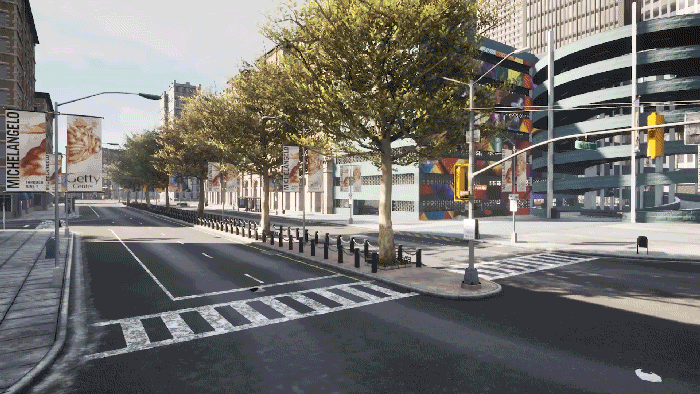

# 맵과 내비게이션

월드와 액터에 대해 알아보았으니, 이제 모든 것을 하나로 모아 맵을 이해하고 액터들이 어떻게 맵을 탐색하는지 알아보겠습니다.

- [__맵__](#맵)
  - [맵 변경하기](#맵-변경하기)
  - [랜드마크](#랜드마크)
  - [차선](#차선)
  - [교차로](#교차로)
  - [웨이포인트](#웨이포인트)
  - [환경 오브젝트](#환경-오브젝트)
- [__CARLA의 내비게이션__](#carla의-내비게이션)
  - [웨이포인트를 통한 내비게이션](#웨이포인트를-통한-내비게이션)
  - [맵 내비게이션 생성](#맵-내비게이션-생성)
- [__CARLA 맵__](#carla-맵)
  - [비계층형 맵](#비계층형-맵)
  - [계층형 맵](#계층형-맵)
- [__커스텀 맵__](#커스텀-맵)
  - [개요](tuto_M_custom_map_overview.md)
  - [도로 페인팅](tuto_M_custom_road_painter.md)
  - [커스텀 건물](tuto_M_custom_buildings.md)
  - [맵 생성](tuto_M_generate_map.md)
  - [맵 패키지 추가](tuto_M_add_map_package.md)
  - [맵 소스 추가](tuto_M_add_map_source.md)
  - [대체 방법](tuto_M_add_map_alternative.md)
- [__추가 맵__](#추가-맵)

---
## 맵

맵은 도시의 3D 모델과 도로 정의를 모두 포함합니다. 맵의 도로 정의는 표준화된 주석이 달린 도로 정의 형식인 OpenDRIVE 파일을 기반으로 합니다. [OpenDRIVE 표준 1.4](http://www.opendrive.org/docs/OpenDRIVEFormatSpecRev1.4H.pdf)가 도로, 차선, 교차로 등을 정의하는 방식이 Python API의 기능과 의사 결정의 근거가 됩니다.

Python API는 이러한 도로들을 탐색하기 위한 고수준 쿼리 시스템 역할을 합니다. 더 넓은 도구 세트를 제공하기 위해 지속적으로 발전하고 있습니다.

### 맵 변경하기

__맵을 변경하려면 월드도 함께 변경해야 합니다__. 시뮬레이션은 처음부터 다시 생성됩니다. 동일한 맵으로 새 월드를 시작하거나 맵과 월드를 모두 변경할 수 있습니다:

- `reload_world()`는 동일한 맵으로 새로운 월드 인스턴스를 생성합니다.
- `load_world()`는 현재 맵을 변경하고 새로운 월드를 생성합니다.

```py
world = client.load_world('Town01')
```

각 맵은 현재 로드된 도시의 이름(예: _Town01_)과 일치하는 `name` 속성을 가지고 있습니다. 사용 가능한 맵 목록을 확인하려면:

```py
print(client.get_available_maps())
```

### 랜드마크

OpenDRIVE 파일에 정의된 교통 표지판은 CARLA에서 API를 통해 쿼리할 수 있는 랜드마크 객체로 변환됩니다. 다음 메서드와 클래스를 사용하여 랜드마크 객체를 조작하고 작업할 수 있습니다:

- __[`carla.Landmark`](https://carla.readthedocs.io/en/latest/python_api/#carla.Landmark)__ 객체는 OpenDRIVE 신호를 나타냅니다. 이 클래스의 속성과 메서드는 랜드마크와 그 영향 영역을 설명합니다.
  - [`carla.LandmarkOrientation`](https://carla.readthedocs.io/en/latest/python_api/#carla.LandmarkOrientation)은 도로의 기하학적 정의와 관련하여 랜드마크의 방향을 나타냅니다.
  - [`carla.LandmarkType`](https://carla.readthedocs.io/en/latest/python_api/#carla.LandmarkType)은 OpenDRIVE 유형으로의 변환을 용이하게 하는 일반적인 랜드마크 유형을 포함합니다.
- __[`carla.Waypoint`](https://carla.readthedocs.io/en/latest/python_api/#carla.Waypoint)__ 는 특정 거리 앞에 위치한 랜드마크를 가져올 수 있습니다. 가져올 랜드마크 유형을 지정할 수 있습니다.
- __[`carla.Map`](https://carla.readthedocs.io/en/latest/python_api/#carla.Map)__ 은 랜드마크 세트를 검색합니다. 맵의 모든 랜드마크를 반환하거나 공통 ID, 유형 또는 그룹을 가진 랜드마크를 반환할 수 있습니다.
- __[`carla.World`](https://carla.readthedocs.io/en/latest/python_api/#carla.World)__ 는 랜드마크와 시뮬레이션에서 이를 나타내는 `carla.TrafficSign` 및 `carla.TrafficLight` 사이의 중개자 역할을 합니다.

```py
my_waypoint.get_landmarks(200.0,True)
```

### 웨이포인트

[`carla.Waypoint`](python_api.md#carla.Waypoint)는 OpenDRIVE 차선에 해당하는 CARLA 월드의 3D 방향성 포인트입니다. 웨이포인트와 관련된 모든 작업은 클라이언트 측에서 이루어집니다. 웨이포인트 정보가 포함된 [맵 객체](python_api.md#carlamap)를 가져오기 위해 서버와의 통신은 한 번만 필요합니다.

각 웨이포인트는 맵상의 위치와 해당 차선의 방향을 나타내는 [`carla.Transform`](python_api.md#carla.Transform)을 포함합니다. `road_id`, `section_id`, `lane_id`, `s` 변수는 OpenDRIVE 도로에 해당합니다. 웨이포인트의 `id`는 이 네 값의 해시 조합으로 구성됩니다.

!!! 참고
    동일한 도로에서 __2cm__ 이내에 있는 웨이포인트는 동일한 `id`를 공유합니다.

웨이포인트는 해당 __차선__에 대한 정보를 포함합니다. 이 정보에는 차선의 좌우 __차선 표시__, 교차로 내부에 있는지 여부를 결정하는 부울 값, 차선 유형, 너비, 차선 변경 권한이 포함됩니다.

```py
# 웨이포인트에서 차선 정보 접근하기
inside_junction = waypoint.is_junction()
width = waypoint.lane_width
right_lm_color = waypoint.right_lane_marking.color
```

### 차선

[OpenDRIVE 표준 1.4](http://www.opendrive.org/docs/OpenDRIVEFormatSpecRev1.4H.pdf)에서 정의된 차선 유형은 [`carla.LaneType`](python_api.md#carla.LaneType)의 열거형 값으로 API에 변환됩니다.

차선을 둘러싼 차선 표시는 [`carla.LaneMarking`](python_api.md#carla.LaneMarking)을 통해 접근합니다. 차선 표시는 일련의 변수로 정의됩니다:

- __color:__ [`carla.LaneMarkingColor`](python_api.md#carla.LaneMarkingColor)는 표시의 색상을 정의하는 열거형 값입니다.
- __lane_change:__ [`carla.LaneChange`](python_api.md#carla.LaneChange)는 차선이 좌회전, 우회전, 양쪽 모두 또는 아무것도 허용하지 않는지를 나타냅니다.
- __type:__ [`carla.LaneMarkingType`](python_api.md#carla.LaneMarkingType)는 OpenDRIVE 표준에 따라 표시 유형을 정의하는 열거형 값입니다.
- __width:__ 표시의 두께를 정의합니다.

아래 예제는 특정 웨이포인트에서 차선 유형, 차선 표시 및 차선 변경 권한에 대한 정보를 얻는 방법을 보여줍니다:

```py
# 웨이포인트의 차선 유형 가져오기
lane_type = waypoint.lane_type

# 왼쪽 차선 표시 유형 가져오기
left_lanemarking_type = waypoint.left_lane_marking.type()

# 이 웨이포인트에서 가능한 차선 변경 가져오기
lane_change = waypoint.lane_change
```

### 교차로

[`carla.Junction`](python_api.md#carla.Junction)은 OpenDRIVE 교차로를 나타냅니다. 이 클래스는 교차로 내의 차선이나 차량을 식별하기 위한 경계 상자가 있는 교차로를 포함합니다.

`carla.Junction` 클래스에는 교차로 내의 모든 차선에 대한 웨이포인트 쌍을 반환하는 `get_waypoints` 메서드가 포함되어 있습니다. 각 쌍은 교차로 경계의 시작점과 끝점에 위치합니다.

```py
waypoints_junc = my_junction.get_waypoints()
```

### 환경 오브젝트

CARLA 맵의 모든 오브젝트에는 [여기][env_obj]에서 찾을 수 있는 관련 변수 세트가 있습니다. 이러한 변수에는 맵에서 해당 오브젝트의 가시성을 [전환][toggle_env_obj]하는 데 사용할 수 있는 [고유 ID][env_obj_id]가 포함됩니다. Python API를 사용하여 [의미 태그][semantic_tag]를 기반으로 각 환경 오브젝트의 ID를 [가져올][fetch_env_obj] 수 있습니다:

```py
# 월드의 건물 가져오기
world = client.get_world()
env_objs = world.get_environment_objects(carla.CityObjectLabel.Buildings)

# 개별 건물 ID에 접근하고 세트에 저장
building_01 = env_objs[0]
building_02 = env_objs[1]
objects_to_toggle = {building_01.id, building_02.id}

# 건물 끄기
world.enable_environment_objects(objects_to_toggle, False)
# 건물 켜기
world.enable_environment_objects(objects_to_toggle, True)
```

다음은 서로 다른 오브젝트가 전환되는 예시입니다:



[env_obj]: https://carla.readthedocs.io/en/latest/python_api/#carla.EnvironmentObject
[env_obj_id]: https://carla.readthedocs.io/en/latest/python_api/#carla.EnvironmentObject.id
[toggle_env_obj]: https://carla.readthedocs.io/en/latest/python_api/#carla.World.enable_environment_objects
[fetch_env_obj]: https://carla.readthedocs.io/en/latest/python_api/#carla.World.get_environment_objects
[semantic_tag]: https://carla.readthedocs.io/en/latest/python_api/#carla.CityObjectLabel

---
## CARLA의 내비게이션

CARLA의 내비게이션은 [`carla.Waypoint`](python_api.md#carla.Waypoint)와 [`carla.Map`](python_api.md#carla.Map)의 메서드 조합인 Waypoint API를 통해 관리됩니다.

클라이언트는 웨이포인트 정보가 포함된 맵 객체를 검색하기 위해 초기에 서버와 통신해야 합니다. 이 통신은 한 번만 필요하며, 이후의 모든 쿼리는 클라이언트 측에서 수행됩니다.

### 웨이포인트를 통한 내비게이션

Waypoint API는 웨이포인트가 서로 연결되어 차량이 이동할 수 있는 도로를 따라 경로를 구성할 수 있게 하는 메서드를 제공합니다:

- `next(d)`는 __차선 방향으로__ 대략적인 거리 `d` 내에 있는 웨이포인트 목록을 생성합니다. 목록에는 가능한 각 분기마다 하나의 웨이포인트가 포함됩니다.
- `previous(d)`는 __차선의 반대 방향으로__ 대략적인 거리 `d` 내에 있는 웨이포인트 목록을 생성합니다. 목록에는 가능한 각 분기마다 하나의 웨이포인트가 포함됩니다.
- `next_until_lane_end(d)`와 `previous_until_lane_start(d)`는 거리 `d`만큼 떨어진 웨이포인트 목록을 반환합니다. 목록은 현재 웨이포인트부터 각각 차선의 끝과 시작까지 이어집니다.
- `get_right_lane()`과 `get_left_lane()`은 인접한 차선에 있는 동등한 웨이포인트를 반환합니다(존재하는 경우). 차선 변경 동작은 오른쪽/왼쪽 차선의 다음 웨이포인트를 찾아 그곳으로 이동하여 수행할 수 있습니다.

```py
# 2미터 앞의 다음 웨이포인트 찾기
waypoint = waypoint.next(2.0)
```

### 맵 내비게이션 생성

클라이언트는 `.xodr` 맵 파일을 가져오고 이를 [`carla.Map`](python_api.md#carla.Map) 객체로 파싱하기 위해 서버에 요청해야 합니다. 이는 한 번만 수행하면 됩니다.

맵 객체를 가져오려면:

```py
map = world.get_map()
```

맵 객체에는 차량 생성을 위한 __권장 스폰 포인트__가 포함되어 있습니다. 아래 메서드를 사용하여 각각 [`carla.Transform`](python_api.md#carlatransform)을 포함하는 이러한 스폰 포인트 목록을 가져올 수 있습니다. 스폰 포인트가 이미 점유되어 있을 수 있어 충돌로 인해 차량 생성이 실패할 수 있다는 점에 유의하세요.

```py
spawn_points = world.get_map().get_spawn_points()
```

특정 위치나 맵의 OpenDRIVE 정의에서 특정 `road_id`, `lane_id`, `s` 값에 가장 가까운 웨이포인트를 __[가져와서](python_api.md#carla.Map.get_waypoint)__ 웨이포인트 작업을 시작할 수 있습니다:

```py
# 주행 또는 보도 차선 중앙에서 가장 가까운 웨이포인트
waypoint01 = map.get_waypoint(vehicle.get_location(),project_to_road=True, lane_type=(carla.LaneType.Driving | carla.LaneType.Sidewalk))

# OpenDRIVE 매개변수를 지정하여 가장 가까운 웨이포인트 찾기
waypoint02 = map.get_waypoint_xodr(road_id,lane_id,s)
```

아래 예제는 도시 차선을 시각화하기 위한 __웨이포인트 컬렉션을 생성__하는 방법을 보여줍니다. 이는 모든 도로와 차선에 대해 맵 전체에 웨이포인트를 생성합니다. 모든 웨이포인트는 약 2미터 간격으로 위치합니다:

```py
waypoint_list = map.generate_waypoints(2.0)
```

__도로 토폴로지의 최소 그래프를 생성__하려면 아래 예제를 사용하세요. 이는 웨이포인트 쌍(튜플) 목록을 반환합니다. 각 쌍의 첫 번째 요소는 두 번째 요소와 연결되며, 둘 다 맵의 각 차선의 시작점과 끝점을 정의합니다. 이 메서드에 대한 자세한 내용은 [PythonAPI](python_api.md#carla.Map.get_topology)에서 찾을 수 있습니다.

```py
waypoint_tuple_list = map.get_topology()
```

아래 예제는 __`carla.Transform`을 지리적 위도와 경도 좌표__로 변환하여 [`carla.GeoLocation`](python_api.md#carla.GeoLocation) 형태로 나타냅니다:

```py
my_geolocation = map.transform_to_geolocation(vehicle.transform)
```

다음 예제를 사용하여 OpenDRIVE 형식의 __도로 정보를 디스크에 저장__할 수 있습니다:

```py
info_map = map.to_opendrive()
```

---
## CARLA 맵

CARLA 생태계에는 8개의 도시가 있으며, 각 도시에는 비계층형과 계층형의 두 가지 종류의 맵이 있습니다. [레이어][layer_api]는 맵 내의 그룹화된 객체를 참조하며 다음과 같이 구성됩니다:

- NONE
- Buildings (건물)
- Decals (데칼)
- Foliage (식물)
- Ground (지면)
- ParkedVehicles (주차된 차량)
- Particles (입자)
- Props (소품)
- StreetLights (가로등)
- Walls (벽)
- All (모두)

[layer_api]: https://carla.readthedocs.io/en/latest/python_api/#carlamaplayer

### 비계층형 맵

아래 표는 비계층형 맵을 보여줍니다(도시 이름을 클릭하면 레이아웃 전체 이미지를 볼 수 있습니다). 이러한 맵에서는 모든 레이어가 항상 존재하며 켜거나 끌 수 없습니다. CARLA 0.9.11까지는 이러한 종류의 맵만 사용할 수 있었습니다.

!!! 참고
    사용자는 맵을 [커스터마이즈](tuto_A_map_customization.md)하거나 CARLA에서 사용할 [새로운 맵을 만들](tuto_M_custom_map_overview.md) 수 있습니다.

| 도시 | 설명 |
| -----------| ------  |
| [__Town01__](map_town01.md) | 강과 여러 개의 다리가 있는 작고 단순한 도시입니다. |
| [__Town02__](map_town02.md) | 주거용과 상업용 건물이 혼합된 작고 단순한 도시입니다. |
| [__Town03__](map_town03.md) | 로터리와 큰 교차로가 있는 더 큰 도시 맵입니다. |
| [__Town04__](map_town04.md) | 산에 둘러싸인 작은 도시로 "8자 모양"의 *무한* 고속도로가 특징입니다. |
| [__Town05__](map_town05.md) | 십자형 교차로와 다리가 있는 격자형 도시입니다. 방향당 여러 차선이 있어 차선 변경 연습에 유용합니다. |
| [__Town06__](map_town06.md) | 많은 진입로와 출구가 있는 긴 다차선 고속도로입니다. [**미시간 좌회전**](<https://en.wikipedia.org/wiki/Michigan_left>)도 포함되어 있습니다. |
| [__Town07__](map_town07.md) | 좁은 도로, 옥수수 밭, 헛간이 있고 신호등이 거의 없는 시골 환경입니다. |
| **Town08** | [리더보드](https://leaderboard.carla.org/) 챌린지에 사용되는 비공개 "미공개" 도시입니다. |
| **Town09** | [리더보드](https://leaderboard.carla.org/) 챌린지에 사용되는 비공개 "미공개" 도시입니다. |
| [__Town10__](map_town10.md) | 고층 빌딩, 주거용 건물, 해변 산책로가 있는 도심 환경입니다. |
| [__Town11__](map_town11.md) | 장식이 없는 대형 맵입니다. 대형 맵 기능의 개념 증명으로 사용됩니다. |
| [__Town12__](map_town12.md) | 고층 빌딩, 주거 지역, 시골 환경을 포함한 다양한 지역이 있는 대형 맵입니다. |

!!! 참고
    Town06과 Town07은 표준 CARLA 패키지에 포함되지 않은 추가 콘텐츠입니다. 이러한 맵을 가져오는 방법에 대한 자세한 내용은 [추가 맵 섹션](#추가-맵)을 참조하세요.

### 계층형 맵

계층형 맵의 레이아웃은 비계층형 맵과 동일하지만 맵의 레이어를 켜고 끌 수 있습니다. 끌 수 없는 최소 레이아웃은 도로, 보도, 신호등, 교통 표지판으로 구성됩니다. 계층형 맵은 접미사 `_Opt`로 구분할 수 있습니다(예: `Town01_Opt`). 이러한 맵에서는 Python API를 통해 레이어를 [로드][load_layer]하고 [언로드][unload_layer]할 수 있습니다:

```py
# 최소 레이아웃에 건물과 주차된 차량이 추가된 Town 01의 계층형 맵 로드
world = client.load_world('Town01_Opt', carla.MapLayer.Buildings | carla.MapLayer.ParkedVehicles)

# 모든 건물 끄기
world.unload_map_layer(carla.MapLayer.Buildings)

# 모든 건물 켜기
world.load_map_layer(carla.MapLayer.Buildings)
```

[load_layer]: https://carla.readthedocs.io/en/latest/python_api/#carla.World.load_map_layer
[unload_layer]: https://carla.readthedocs.io/en/latest/python_api/#carla.World.unload_map_layer

순차적으로 모든 레이어를 로드하고 언로드하는 예시를 확인하세요:


---
## 추가 맵

각 릴리스에는 추가 자산과 맵이 포함된 자체 추가 패키지가 있습니다. 이 추가 패키지에는 __Town06__과 __Town07__ 맵이 포함되어 있습니다. 빌드 크기를 줄이기 위해 이러한 맵은 별도로 저장되므로 메인 패키지 설치 후에만 가져올 수 있습니다.

__1.__ 원하는 CARLA 버전에 맞는 적절한 패키지를 [다운로드](https://github.com/carla-simulator/carla/blob/master/Docs/download.md)하세요.

__2.__ 패키지를 추출하세요:

- __Linux에서__:
    - 패키지를 _Import_ 폴더로 이동하고 다음 스크립트를 실행하여 내용을 추출합니다:

```sh
cd path/to/carla/root

./ImportAssets.sh
```

- __Windows에서__:
    - 내용을 루트 폴더에 직접 추출합니다.