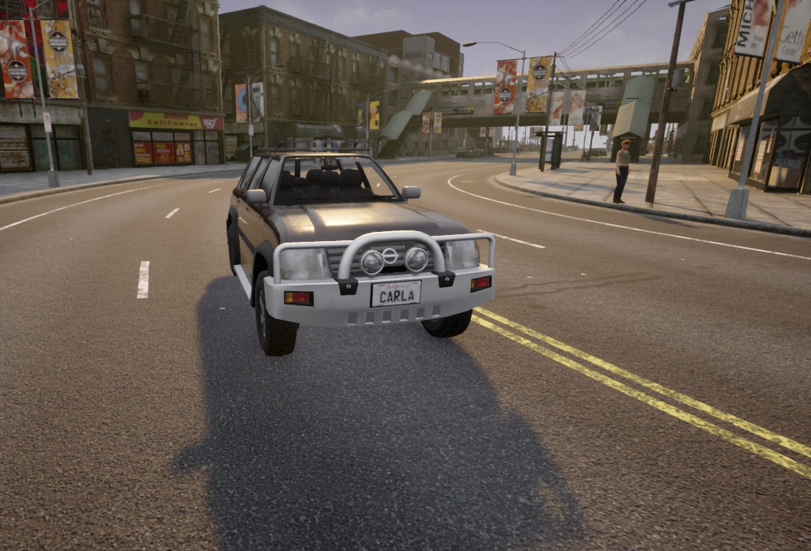
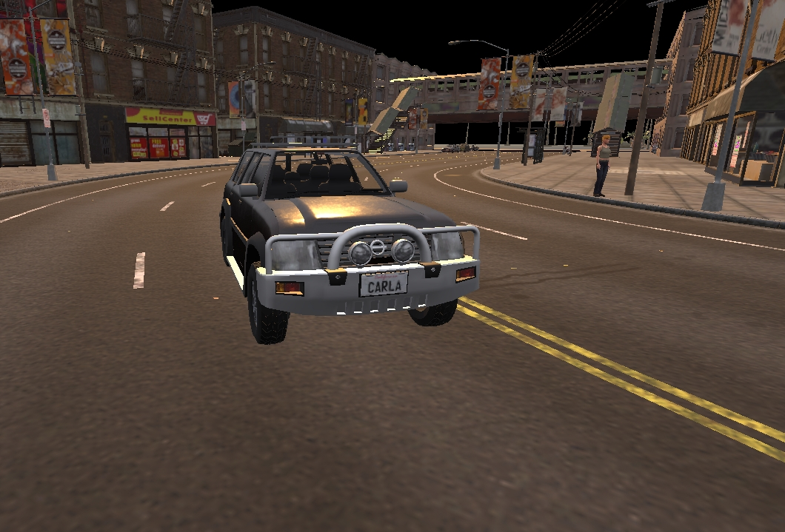

# 기본 개념

이 페이지에서는 CARLA 서버와 클라이언트가 어떻게 작동하고 API를 통해 어떻게 통신하는지 이해하는 데 필요한 핵심 개념들을 소개합니다. CARLA는 서버-클라이언트 구조로 동작합니다. CARLA 서버가 시뮬레이션을 실행하고, 클라이언트가 서버에 지시를 보내는 방식입니다. 클라이언트 코드는 [__API__](python_api.md)를 사용하여 서버와 통신합니다. Python API를 사용하려면 PIP를 통해 모듈을 설치해야 합니다:

```sh
pip install carla-simulator  # Python 2 사용시
pip3 install carla-simulator  # Python 3 사용시
```

Python 스크립트에서 CARLA 패키지를 임포트하는 것도 잊지 마세요:

```py
import carla
```

- [__월드와 클라이언트__](#world-and-client)  
  - [클라이언트](#client) 
  - [월드](#world)
- [__동기 모드와 비동기 모드__](#synchronous-and-asynchronous-mode)  
  - [동기 모드 설정하기](#setting-synchronous-mode) 
  - [동기 모드 사용하기](#using-synchronous-mode)
- [__레코더__](#recorder)  
  - [녹화하기](#recording) 
  - [시뮬레이션 재생](#simulation-playback)
  - [레코더 파일 형식](#recorder-file-format)

---

## 월드와 클라이언트

### 클라이언트

__클라이언트__ 는 사용자가 시뮬레이션의 정보를 요청하거나 변경하기 위해 실행하는 모듈입니다. 클라이언트는 IP 주소와 특정 포트를 사용하여 실행되며, 터미널을 통해 서버와 통신합니다. 동시에 여러 클라이언트를 실행할 수 있습니다. 고급 멀티클라이언트 관리를 위해서는 CARLA와 [동기화](adv_synchrony_timestep.md)에 대한 깊은 이해가 필요합니다.

CARLA 클라이언트 객체를 사용하여 클라이언트를 설정합니다:

```py
client = carla.Client('localhost', 2000)
```

이렇게 하면 로컬 머신(`localhost`)에서 실행 중인 CARLA 서버와 통신하도록 클라이언트가 설정됩니다. 클라이언트를 다른 머신에서 실행하는 경우 네트워크 머신의 IP 주소를 사용할 수도 있습니다. 두 번째 인자는 포트 번호입니다. 기본적으로 CARLA 서버는 2000번 포트를 사용하며, 필요한 경우 CARLA 실행 시 설정에서 변경할 수 있습니다.

클라이언트 객체는 새로운 맵 로드, 시뮬레이션 녹화, 교통 관리자 초기화 등 여러 기능에 사용할 수 있습니다:

```py
client.load_world('Town07')  # 새로운 맵 로드

client.start_recorder('recording.log')  # 녹화 시작
```

### 월드

__월드__ 는 시뮬레이션을 나타내는 객체입니다. 액터 생성, 날씨 변경, 현재 월드 상태 확인 등 주요 메서드를 포함하는 추상화 계층 역할을 합니다. 하나의 시뮬레이션에는 하나의 월드만 존재하며, 맵이 변경되면 현재 월드는 삭제되고 새로운 월드로 대체됩니다.

클라이언트 객체를 사용하여 월드 객체를 가져옵니다:

```py
world = client.get_world()
```

월드 객체를 통해 다양한 메서드를 사용하여 날씨, 차량, 신호등, 건물, 맵 등 시뮬레이션 내의 객체에 접근할 수 있습니다:

```py
level = world.get_map()  # 맵 정보 가져오기

weather = world.get_weather()  # 날씨 정보 가져오기

blueprint_library = world.get_blueprint_library()  # 블루프린트 라이브러리 가져오기
```

## 동기 모드와 비동기 모드

CARLA는 클라이언트-서버 구조를 사용합니다. 서버는 시뮬레이션을 실행하고, 클라이언트는 정보를 조회하거나 시뮬레이션 변경을 요청합니다. 이 섹션에서는 클라이언트와 서버 간의 통신 방식을 설명합니다.

기본적으로 CARLA는 __비동기 모드__ 로 실행됩니다.

__비동기 모드__ 에서는 CARLA 서버가 최대한 빠르게 실행되며, 클라이언트 요청은 실시간으로 처리됩니다. 반면 __동기 모드__ 에서는 Python 코드를 실행하는 클라이언트가 주도권을 가지고 서버에 업데이트 시점을 지시합니다.

시뮬레이션을 실험하거나 설정하는 단계에서는 __비동기 모드__ 가 적합합니다. 관찰자 시점으로 맵을 자유롭게 둘러보면서 액터를 배치할 수 있기 때문입니다. 하지만 학습 데이터를 생성하거나 시뮬레이션 내에서 에이전트를 실행할 때는 더 많은 제어와 예측 가능성을 제공하는 __동기 모드__ 사용을 권장합니다.

자세한 내용은 [__동기 모드와 비동기 모드__](adv_synchrony_timestep.md)를 참고하세요.

!!! 참고
    여러 클라이언트를 사용하는 경우, 오직 하나의 클라이언트만 틱(tick)을 보내야 합니다. 서버는 모든 틱을 동일한 클라이언트에서 온 것처럼 처리하기 때문에, 여러 클라이언트가 틱을 보내면 서버와 클라이언트 간에 불일치가 발생할 수 있습니다.

### 동기 모드 설정하기

동기 모드와 비동기 모드 간의 전환은 간단한 불리언 값 설정으로 가능합니다:
```py
settings = world.get_settings()
settings.synchronous_mode = True  # 동기 모드 활성화
settings.fixed_delta_seconds = 0.05  # 시간 간격 설정
world.apply_settings(settings)
```

!!! 주의
    동기 모드를 활성화하고 Traffic Manager가 실행 중인 경우, Traffic Manager도 동기 모드로 설정해야 합니다. 설정 방법은 [여기](adv_traffic_manager.md#synchronous-mode)를 참고하세요.

동기 모드를 비활성화하려면 변수를 `False`로 설정하거나 `PythonAPI/util/config.py` 스크립트를 사용하면 됩니다:
```sh
cd PythonAPI/util && python3 config.py --no-sync  # 동기 모드 비활성화
```
스크립트로는 동기 모드를 비활성화만 할 수 있고 활성화는 할 수 없습니다. 동기 모드를 활성화하면 서버가 클라이언트의 틱을 기다리게 되는데, 이 스크립트로는 사용자가 원하는 시점에 틱을 보낼 수 없기 때문입니다.

### 동기 모드 사용하기

동기 모드는 특히 클라이언트 애플리케이션이 느리거나 센서 간의 동기화가 필요한 경우에 중요합니다. 클라이언트가 너무 느리고 서버가 기다리지 않으면 정보가 넘쳐나게 됩니다. 클라이언트가 모든 정보를 처리할 수 없어 일부가 손실되거나 섞일 수 있습니다. 비슷한 맥락에서, 여러 센서가 비동기로 동작하면 모든 센서가 시뮬레이션의 같은 시점의 데이터를 사용하고 있는지 확인할 수 없습니다.

다음 코드는 이전 예제를 확장한 것입니다. 클라이언트가 카메라 센서를 생성하고, 현재 스텝의 이미지 데이터를 큐에 저장한 다음, 큐에서 데이터를 가져온 후 서버에 틱을 보냅니다. 여러 센서를 사용하는 더 복잡한 예제는 [여기][syncmodelink]에서 확인할 수 있습니다.

```py
settings = world.get_settings()
settings.synchronous_mode = True
world.apply_settings(settings)

camera = world.spawn_actor(blueprint, transform)
image_queue = queue.Queue()
camera.listen(image_queue.put)

while True:
    world.tick()  # 서버에 틱 보내기
    image = image_queue.get()  # 이미지 데이터 가져오기
```
[syncmodelink]: https://github.com/carla-simulator/carla/blob/master/PythonAPI/examples/synchronous_mode.py

!!! 중요
    카메라와 같은 GPU 기반 센서에서 오는 데이터는 보통 몇 프레임의 지연이 발생합니다. 이 경우 동기화가 매우 중요합니다.

월드는 클라이언트가 서버의 틱을 기다리거나 틱을 받았을 때 특정 작업을 수행할 수 있는 비동기 메서드를 제공합니다:

```py
# 다음 틱을 기다리고 틱의 스냅샷을 가져옵니다
world_snapshot = world.wait_for_tick()

# 새로운 스냅샷을 받을 때마다 호출될 콜백 함수를 등록합니다
world.on_tick(lambda world_snapshot: do_something(world_snapshot))
```

## 레코더

레코더를 사용하면 이전 시뮬레이션을 재현하는 데 필요한 모든 데이터를 파일로 저장할 수 있습니다. 저장되는 데이터에는 차량의 위치와 속도, 신호등 상태, 보행자의 위치와 속도, 태양의 위치와 날씨 조건 등의 상세 정보가 포함됩니다. 데이터는 바이너리 파일로 저장되며, 나중에 CARLA 서버에서 이 파일을 불러와 시뮬레이션을 정확히 재현할 수 있습니다.

액터들은 녹화된 파일에 포함된 데이터에 따라 매 프레임마다 업데이트됩니다. 현재 시뮬레이션에 있는 액터 중 녹화 데이터에 나타나는 액터는 이동되거나 다시 생성되어 녹화된 상태를 재현합니다. 녹화 데이터에 나타나지 않는 액터들은 아무 일도 없었던 것처럼 계속 자신의 경로를 따릅니다.

!!! 중요
    재생이 끝나면 차량은 자율주행 모드로 설정되지만, __보행자들은 멈춥니다__.

레코더 파일에는 다양한 요소에 대한 정보가 포함됩니다:

*   __액터__ — 생성과 제거, 경계 상자와 트리거 상자
*   __신호등__ — 상태 변경과 시간 설정
*   __차량__ — 위치와 방향, 선형 및 각속도, 조명 상태, 물리 제어
*   __보행자__ — 위치와 방향, 선형 및 각속도
*   __조명__ — 건물, 거리, 차량의 조명 상태

### 녹화하기

녹화를 시작하려면 파일 이름만 있으면 됩니다. 파일 이름에 `\`, `/` 또는 `:` 문자를 사용하면 절대 경로로 인식됩니다. 경로를 지정하지 않으면 파일은 `CarlaUE4/Saved` 폴더에 저장됩니다.

```py
client.start_recorder("/home/carla/recording01.log")
```

기본적으로 레코더는 시뮬레이션을 재생하는 데 필요한 정보만 저장하도록 설정되어 있습니다. 앞서 언급한 모든 정보를 저장하려면 녹화 시작 시 `additional_data` 인자를 설정해야 합니다:

```py
client.start_recorder("/home/carla/recording01.log", True)
```

!!! 참고
    추가 데이터에는 차량과 보행자의 선형 및 각속도, 신호등 시간 설정, 실행 시간, 액터의 트리거 및 경계 상자, 차량의 물리 제어 정보가 포함됩니다.

녹화를 중지하는 것도 간단합니다:

```py
client.stop_recorder()
```

!!! 참고
    참고로, 신호등 50개와 차량 100대가 있는 1시간 분량의 녹화 파일은 약 200MB 크기입니다.

### 시뮬레이션 재생

시뮬레이션 중 언제든지 재생을 시작할 수 있습니다. 로그 파일의 경로 외에도 이 메서드에는 몇 가지 매개변수가 필요합니다:

```py
client.replay_file("recording01.log", start, duration, camera)
```

| 매개변수 | 설명 | 참고 |
| --- | --- | --- |
| `start` | 시뮬레이션을 시작할 녹화 시점(초) | 양수면 녹화 시작부터, 음수면 끝에서부터 계산됩니다 |
| `duration` | 재생할 시간(초). 0은 전체 녹화를 의미 | 재생이 끝나면 차량은 자율주행 모드가 되고 보행자는 멈춥니다 |
| `camera` | 카메라가 따라갈 액터의 ID | `0`으로 설정하면 관찰자가 자유롭게 움직일 수 있습니다 |

<br>

### 레코더 파일 형식

레코더는 모든 데이터를 [__이 문서__]에 명시된 사용자 정의 바이너리 파일 형식으로 저장합니다.

---

## 렌더링

CARLA는 렌더링 품질과 효율성에 관한 여러 옵션을 제공합니다. 가장 기본적으로, 고사양과 저사양 하드웨어 모두에서 최상의 결과를 얻을 수 있도록 두 가지 품질 옵션을 제공합니다:

### 에픽 모드
`./CarlaUE4.sh -quality-level=Epic`


*에픽 모드 스크린샷*

### 로우 모드
`./CarlaUE4.sh -quality-level=Low`


*로우 모드 스크린샷*

CARLA는 또한 렌더링을 일시 중지하거나 화면 밖에서 렌더링하는 옵션을 제공하여 시뮬레이션을 더 효율적으로 녹화하거나 실행할 수 있게 합니다.

렌더링 옵션에 대한 자세한 내용은 [__여기__](adv_rendering_options.md)에서 확인할 수 있습니다.