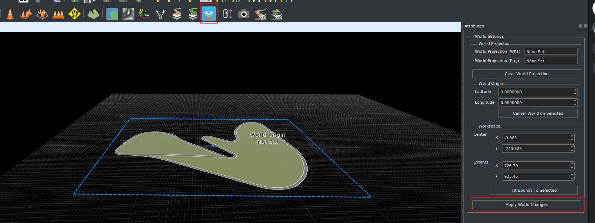
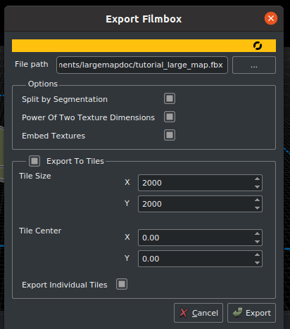

# RoadRunner에서 대형 맵 만들기

RoadRunner는 CARLA로 가져올 대형 맵을 만드는 데 권장되는 소프트웨어입니다. 이 가이드에서는 RoadRunner가 무엇인지, 대형 맵을 만들 때 고려해야 할 사항, 그리고 CARLA로 가져오기 위해 커스텀 대형 맵을 내보내는 방법을 설명합니다.

- [__RoadRunner 소개__](#roadrunner-소개)
- [__시작하기 전에__](#시작하기-전에)
- [__RoadRunner에서 대형 맵 만들기__](#roadrunner에서-대형-맵-만들기)
- [__RoadRunner에서 대형 맵 내보내기__](#roadrunner에서-대형-맵-내보내기)
- [__다음 단계__](#다음-단계)
---
## RoadRunner 소개

RoadRunner는 자율주행 시스템의 시뮬레이션과 테스트를 위한 3D 장면을 설계할 수 있는 대화형 에디터입니다. 도로 레이아웃과 함께 OpenDRIVE 및 기하학적 정보를 만드는 데 사용할 수 있습니다. RoadRunner에 대해 자세히 알아보려면 [여기][rr_home]를 참조하세요.

RoadRunner는 MATLAB Campus-Wide License의 일부이므로 많은 대학에서 무제한 학술 접근이 가능합니다. 귀하의 대학이 접근 권한이 있는지 [확인][rr_eligibility]해보세요. 접근성에 관한 질문이나 문제가 있으면 *automated-driving@mathworks.com*으로 문의하세요. [평가판][rr_trial_version]도 제공됩니다.

CARLA 리더보드 참가자 모두에게도 RoadRunner 라이센스가 제공됩니다. 자세한 정보는 [여기][rr_leaderboard]를 클릭하세요.

[rr_home]: https://www.mathworks.com/products/roadrunner.html
[rr_trial_version]: https://www.mathworks.com/products/roadrunner.html
[rr_eligibility]: https://www.mathworks.com/academia/tah-support-program/eligibility.html
[rr_leaderboard]: https://www.mathworks.com/academia/student-competitions/carla-autonomous-driving-challenge.html

---
## 시작하기 전에 

RoadRunner를 설치해야 합니다. Mathworks 웹사이트의 [설치 가이드][rr_docs]를 따를 수 있습니다.   

[rr_docs]: https://www.mathworks.com/help/roadrunner/ug/install-and-activate-roadrunner.html

---

## RoadRunner에서 대형 맵 만들기

RoadRunner에서 대형 맵을 만드는 구체적인 방법은 이 가이드의 범위를 벗어나지만, [RoadRunner 문서][rr_tutorials]에서 비디오 튜토리얼을 제공합니다.

고도가 있는 대형 맵을 만드는 경우, 권장되는 최대 맵 크기는 20km x 20km입니다. 이보다 큰 맵은 내보내기 시 RoadRunner가 충돌할 수 있습니다.

[rr_tutorials]: https://www.mathworks.com/support/search.html?fq=asset_type_name:video%20category:roadrunner/index&page=1&s_tid=CRUX_topnav

---

## RoadRunner에서 대형 맵 내보내기

아래는 RoadRunner에서 커스텀 대형 맵을 내보내는 기본 지침입니다.

[exportlink]: https://www.mathworks.com/help/roadrunner/ug/Exporting-to-CARLA.html

RoadRunner에서 맵을 만든 후 내보낼 수 있습니다. __도로 레이아웃은 내보낸 후에는 수정할 수 없다는 점__을 유의하세요. 내보내기 전에 다음 사항을 확인하세요:

- 언리얼 엔진에서 맵을 올바르게 시각화할 수 있도록 맵이 (0,0)을 중심으로 위치해 있는지 확인합니다.
- 맵 정의가 올바른지 확인합니다.
- 연결과 기하학적 구조에 특히 주의를 기울여 맵 유효성 검사가 올바른지 확인합니다.

>>>>

맵이 준비되면 `OpenDRIVE Preview Tool` 버튼을 클릭하여 OpenDRIVE 도로 네트워크를 시각화하고 마지막으로 모든 것을 확인합니다.

>>>>

!!! 참고
    _OpenDrive Preview Tool_을 사용하면 맵의 무결성을 쉽게 테스트할 수 있습니다. 교차로에 오류가 있는 경우 `Maneuver Tool`을 클릭하고 `Rebuild Maneuver Roads`를 클릭하세요.

[_World settings tool_](https://www.mathworks.com/help/roadrunner/ref/worldsettingstool.html)을 클릭하고 파란색 경계 상자의 가장자리를 내보내고자 하는 전체 영역을 포함하도록 끌어서 내보내기할 전체 맵이 선택되었는지 확인합니다. 준비되면 _Apply World Changes_를 클릭합니다.

내보낼 준비가 되면:

__1.__ `.fbx` 내보내기:

  - 메인 툴바에서 `File` -> `Export` -> `Firebox (.fbx)` 선택

__2.__ 팝업 창에서:

>- 다음 옵션을 선택합니다:
    - _Split by Segmentation_: 메시를 시맨틱 세분화로 나누고 보행자 내비게이션을 개선합니다.
    - _Power of Two Texture Dimensions_: 성능을 개선합니다.
    - _Embed Textures_: 텍스처가 메시에 포함되도록 합니다.
    - _Export to Tiles_: 타일의 크기를 선택합니다. CARLA에서 사용할 수 있는 최대 크기는 2000 x 2000입니다.
    - _Export Individual Tiles_: CARLA에서 대형 맵 스트리밍에 필요한 개별 타일을 생성합니다.

>>>>>>

__3.__ `.xodr` 내보내기:

  - 메인 툴바에서 `File` -> `Export` -> `OpendDRIVE (.xodr)` 선택

!!! 경고
    `.xodr`과 `.fbx` 파일의 이름이 같은지 확인하세요.

---

## 다음 단계

이제 맵을 CARLA로 가져올 준비가 되었습니다. 자세한 내용은 [__대형 맵 가져오기__](large_map_import.md) 가이드를 참조하세요.

---

프로세스에 대해 질문이 있으시면 [포럼](https://github.com/carla-simulator/carla/discussions)에서 문의할 수 있습니다.

<a href="https://github.com/carla-simulator/carla/discussions" target="_blank" class="btn btn-neutral" title="CARLA 포럼으로 이동">
CARLA 포럼</a>

