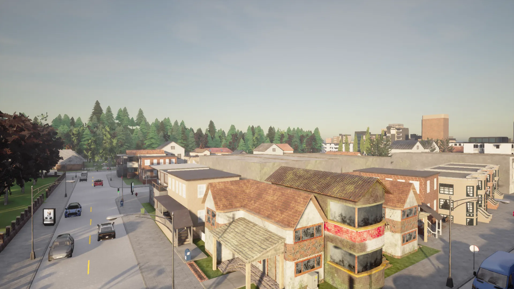
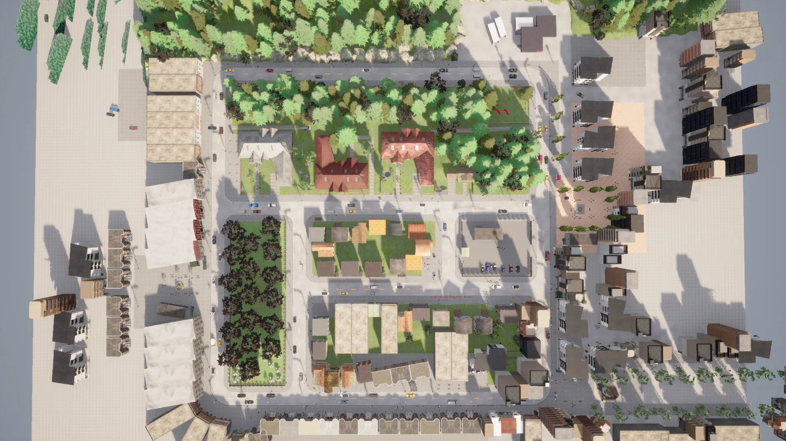
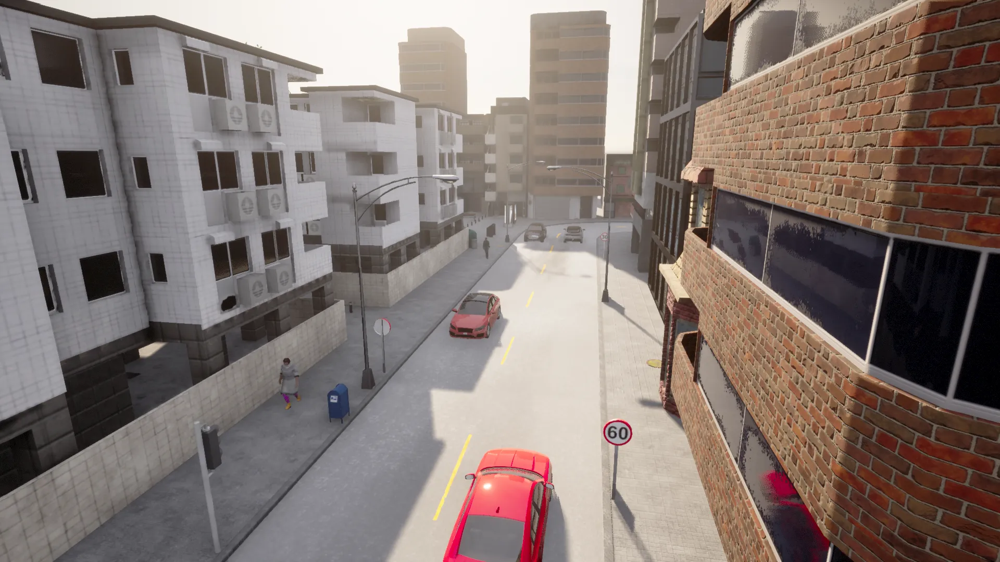
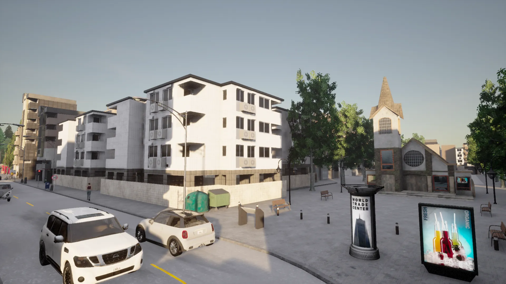
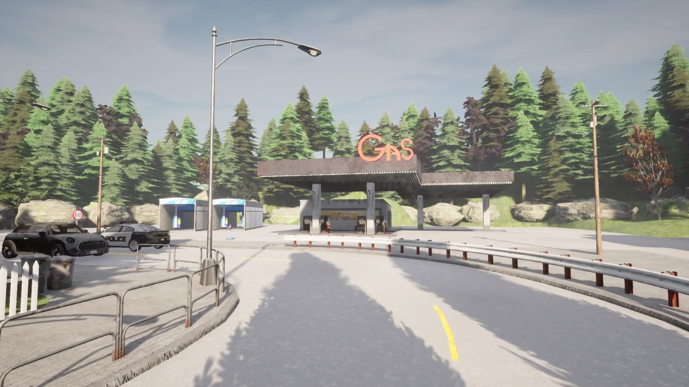
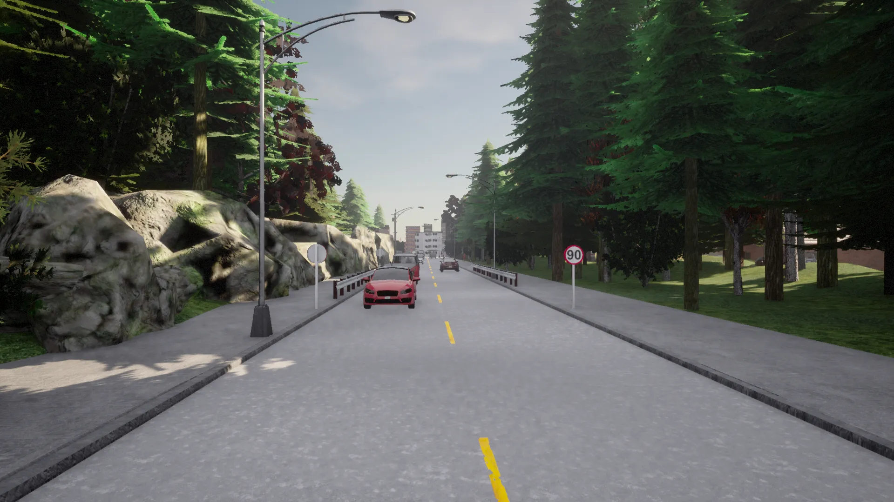

# Town 2

Town 2는 다수의 T자형 교차로와 다양한 건물들이 있는 작은 마을입니다. 곳곳에 침엽수림이 있으며, 공원과 주거 및 상업 지역이 있습니다.

## 도로망

도로망은 다수의 단순한 T자형 교차로로 구성되어 있습니다.

## 특징

이 맵은 상업 지역과 하이스트리트가 특징입니다.

또한 주거용 아파트 건물들과 교회가 있습니다.

주유소가 있습니다.

가로수길도 있습니다.

