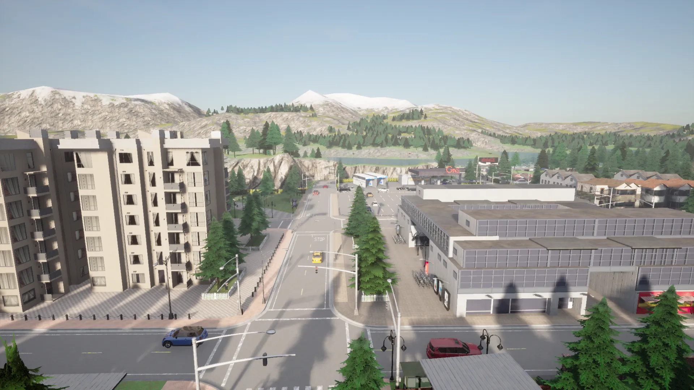
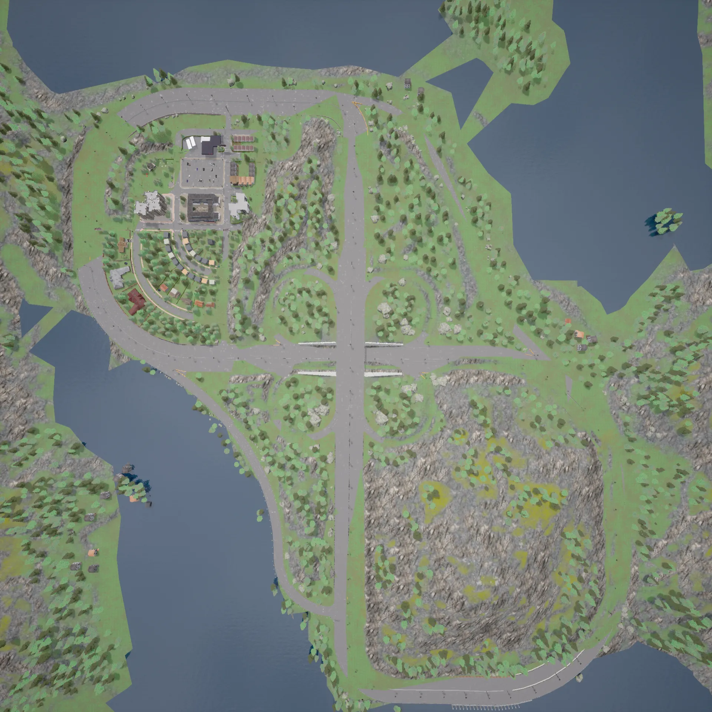
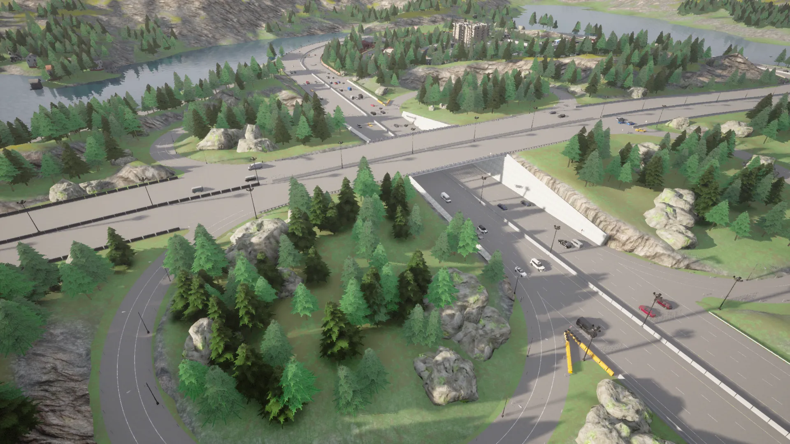
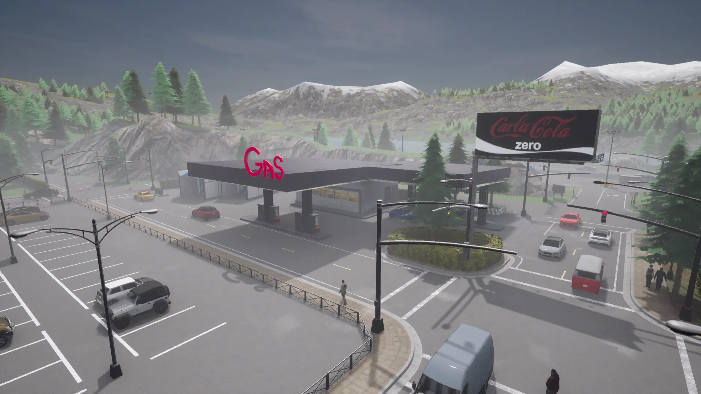
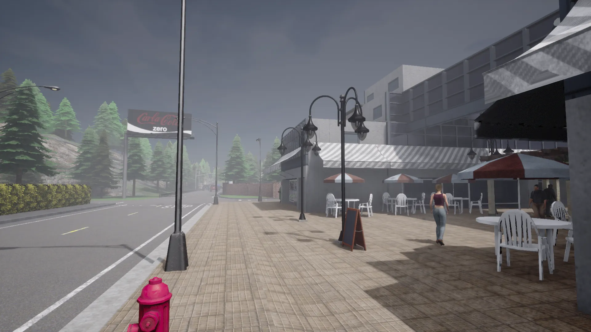
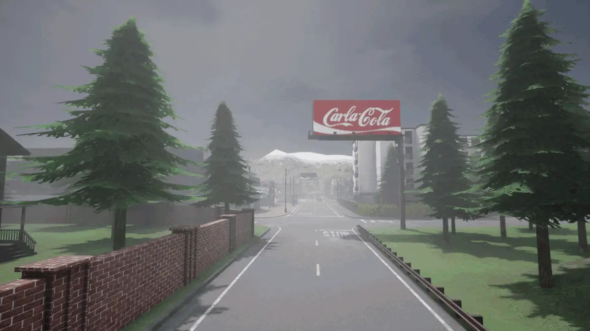

# Town 4

Town 4는 눈 덮인 산맥과 침엽수를 배경으로 하는 작은 마을입니다. 여러 차선으로 된 도로가 "8자 형태"로 마을을 둘러싸고 있습니다.

## 도로망

도로망은 상업용과 주거용 건물들 사이에 위치한 짧은 거리와 교차로들의 작은 네트워크로 구성되어 있으며, "8자 형태"의 순환도로가 건물들과 인근 산을 둘러싸고 있습니다. 8자가 교차하는 지점에는 지하도/고가도로와 원형 진입로가 있습니다.

또한 이 네트워크에는 원형 진입로가 있는 지하도와 고가도로가 있습니다.

## 특징

산악 배경을 배경으로 주유소가 자리잡고 있습니다.

마을 중심부에는 야외 좌석이 있는 보행자 쇼핑 아케이드가 있습니다.

나무와 광고판이 있는 거리를 포함하여 다양한 스타일의 주거용 및 상업용 건물과 거리가 있습니다.

