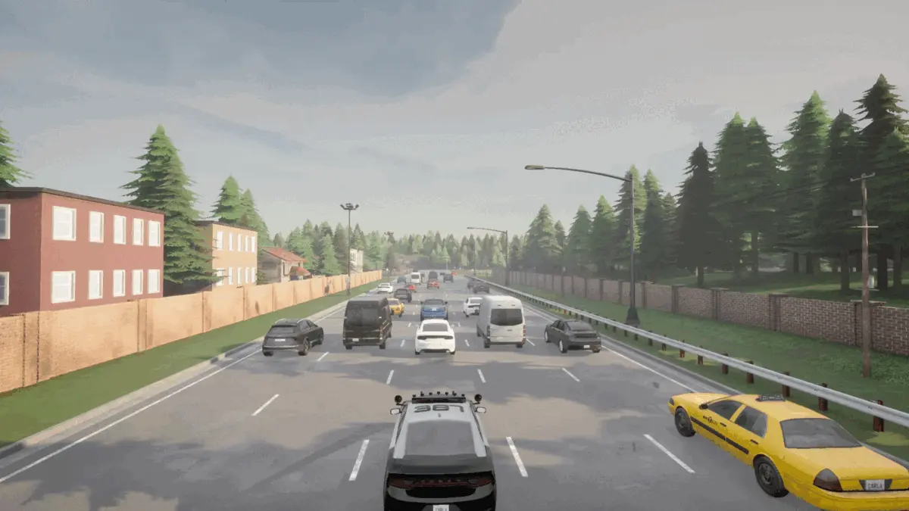
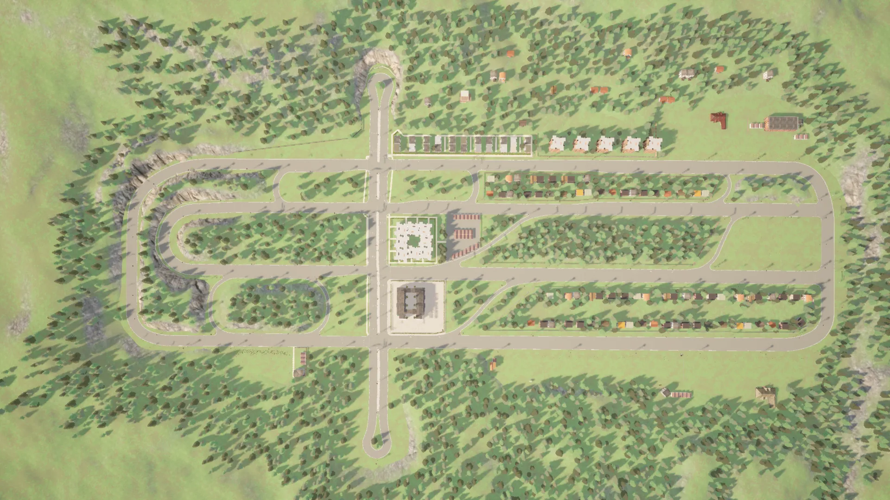
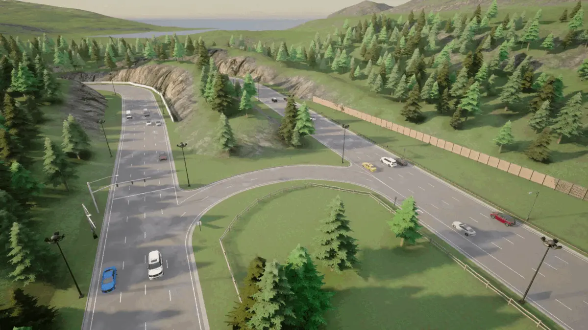

# Town 6

Town 6은 침엽수림 속에 자리 잡은 저밀도 도시로, 4-6차선의 대형 도로들과 [미시간 좌회전](https://en.wikipedia.org/wiki/Michigan_left)과 같은 특수 교차로가 다수 있습니다.

**Town 6은 추가 맵 패키지의 일부로, [CARLA 패키지와 함께 다운로드](https://github.com/carla-simulator/carla/releases)해야 합니다. 다운로드한 ZIP 파일을 추출된 CARLA 패키지의 *Import* 폴더로 이동한 다음 *ImportAssets* 스크립트를 실행하세요.**

## 도로망

도로망은 4~6차선의 4개의 큰 평행 도로로 구성되어 있으며, 여러 진입로와 교차로로 서로 연결되어 있습니다.

Town 6의 수많은 진입로 교차로에는 미시간 좌회전이 포함되어 있습니다.

5차선 도로, 막다른 길, 지정된 회전 차선 등 다양한 도로 시나리오가 구현되어 있습니다.

