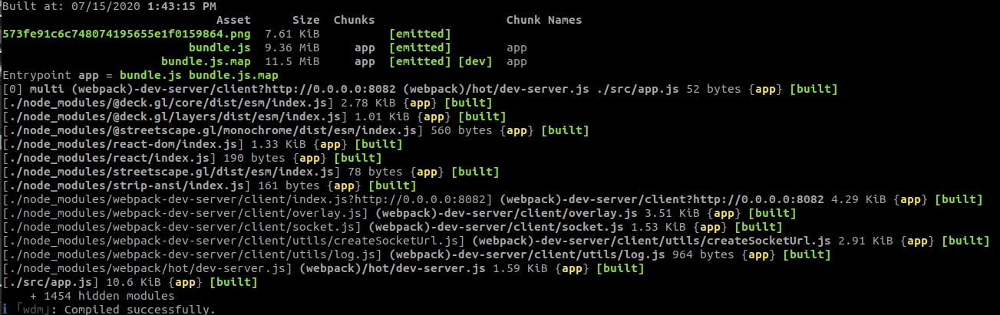
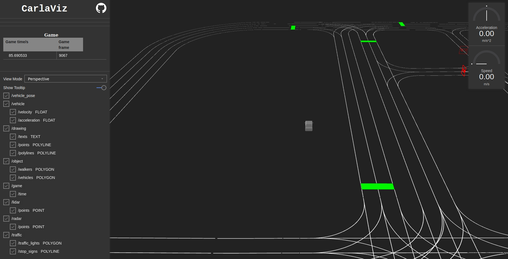
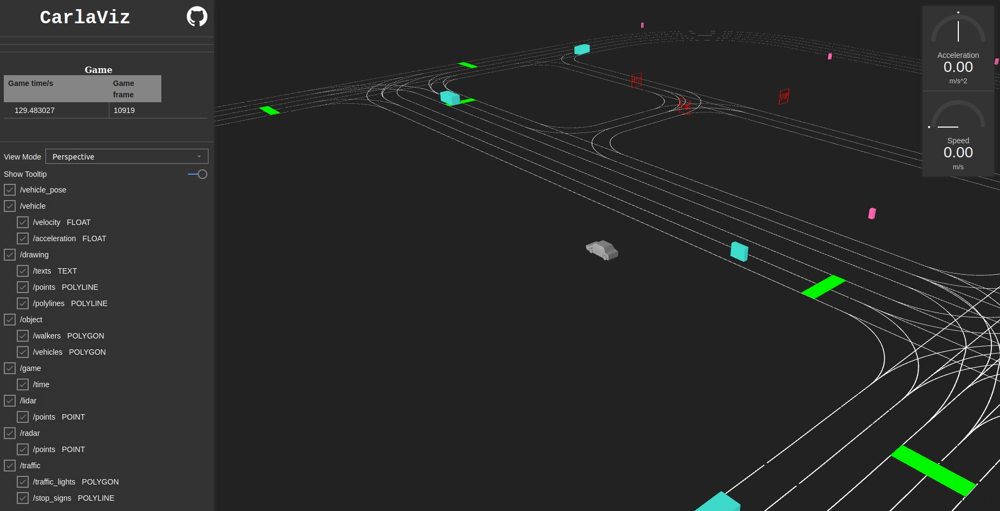
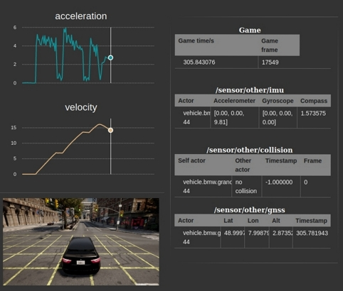
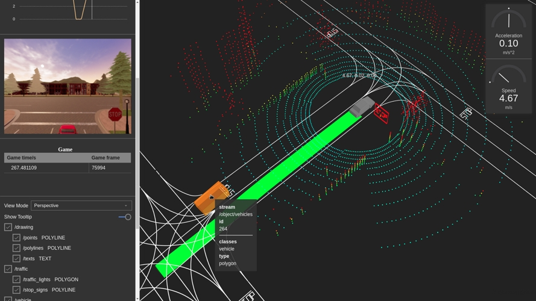

# carlaviz

carlaviz 플러그인은 웹 브라우저에서 시뮬레이션을 시각화하는 데 사용됩니다. 장면의 기본적인 표현이 포함된 창이 생성됩니다. 액터가 실시간으로 업데이트되고, 센서 데이터를 검색할 수 있으며, 추가 텍스트, 선, 폴리라인을 장면에 그릴 수 있습니다.

*   [__일반 정보__](#일반-정보)  
    *   [지원](#지원)  
*   [__carlaviz 가져오기__](#carlaviz-가져오기)  
    *   [전제 조건](#전제-조건)  
    *   [플러그인 다운로드](#플러그인-다운로드)  
*   [__유틸리티__](#유틸리티)  

---
## 일반 정보

*   __기여자__ — [wx9698](https://github.com/wx9698)로도 알려진 Minjun Xu.  
*   __라이센스__ — [MIT](https://en.wikipedia.org/wiki/MIT_License).  

### 지원

*   __Linux__ — CARLA 0.9.6, 0.9.7, 0.9.8, 0.9.9, 0.9.10  
*   __Windows__ — CARLA 0.9.9, 0.9.10  
*   __소스에서 빌드__ — 최신 업데이트  

---
## carlaviz 가져오기

### 전제 조건

*   __Docker__ — 문서를 방문하여 [Docker를 설치](https://docs.docker.com/get-docker/)하세요.  
*   __운영체제__ — CARLA를 실행할 수 있는 모든 OS가 작동해야 합니다.  
*   __Websocket-client__ — ```pip3 install websocket_client```. [pip](https://pip.pypa.io/en/stable/installing/)가 시스템에 없다면 설치하세요.  

### 플러그인 다운로드

터미널을 열고 실행할 CARLA 버전에 맞는 carlaviz Docker 이미지를 가져오세요.

```bash
# 사용 중인 CARLA 패키지와 일치하는 이미지만 가져오기
docker pull mjxu96/carlaviz:0.9.6
docker pull mjxu96/carlaviz:0.9.7
docker pull mjxu96/carlaviz:0.9.8
docker pull mjxu96/carlaviz:0.9.9
docker pull mjxu96/carlaviz:0.9.10

# CARLA 소스 빌드로 작업하는 경우 이 이미지를 가져오기
docker pull mjxu96/carlaviz:latest
```

!!! 중요
    현재 Windows에서는 0.9.9와 0.9.10만 지원됩니다.

CARLA 0.9.9(포함)까지는 단일 스트림으로 설정되어 있습니다. 이후 버전에서는 센서를 위한 멀티 스트리밍이 구현되어 있습니다.

* __단일 스트림에서__, 센서는 하나의 클라이언트만 수신할 수 있습니다. `manual_control.py`를 실행할 때처럼 다른 클라이언트가 이미 센서를 수신하고 있을 때, carlaviz는 데이터를 검색하기 위해 센서를 복제해야 하므로 성능이 저하될 수 있습니다.

* __멀티 스트림에서__, 센서는 여러 클라이언트가 수신할 수 있습니다. carlaviz는 이를 복제할 필요가 없어 성능이 저하되지 않습니다.

!!! 참고
    대안으로 Linux에서는 [여기](https://github.com/carla-simulator/carlaviz/blob/master/docs/build.md)의 지침에 따라 carlaviz를 빌드할 수 있지만, Docker 이미지를 사용하면 훨씬 쉽습니다.

---
## carlaviz 실행

__1. CARLA 실행__

*   __a) CARLA 패키지에서__ — CARLA 폴더로 이동하여 `CarlaUE4.exe`(Windows) 또는 `./CarlaUE4.sh`(Linux)로 시뮬레이션을 시작합니다.

*   __b) 소스 빌드에서__ — CARLA 폴더로 이동하여 `make launch`로 UE 에디터를 실행하고 `Play`를 누릅니다.

__2. carlaviz 실행__ 다른 터미널에서 다운로드한 Docker 이미지에 맞는 다음 명령을 실행합니다.

`<name_of_Docker_image>`를 이전에 다운로드한 이미지 이름(예: `mjxu96/carlaviz:latest` 또는 `mjxu96/carlaviz:0.9.10`)으로 변경하세요.

```sh
# Linux 시스템에서
docker run -it --network="host" -e CARLAVIZ_HOST_IP=localhost -e CARLA_SERVER_IP=localhost -e CARLA_SERVER_PORT=2000 <name_of_Docker_image>

# Windows/MacOS 시스템에서
docker run -it -e CARLAVIZ_HOST_IP=localhost -e CARLA_SERVER_IP=host.docker.internal -e CARLA_SERVER_PORT=2000 -p 8080-8081:8080-8081 -p 8089:8089 <name_of_Docker_image>
```

모든 것이 올바르게 설정되었다면 carlaviz는 다음과 유사한 성공 메시지를 표시합니다.



!!! 경고
    사용 중인 Docker 이미지와 일치하도록 이전 명령을 편집하는 것을 잊지 마세요.

__3. localhost 열기__ 웹 브라우저를 열고 `http://127.0.0.1:8080/`로 이동하세요. carlaviz는 기본적으로 포트 `8080`에서 실행됩니다. 출력은 다음과 유사해야 합니다.



---
## 유틸리티

플러그인이 작동하면 시뮬레이션, 시뮬레이션에 존재하는 액터, 센서가 검색하는 데이터를 시각화하는 데 사용할 수 있습니다. 플러그인은 오른쪽에 장면이 실시간으로 업데이트되는 시각화 창과 왼쪽에 표시할 항목 목록이 있는 사이드바를 보여줍니다. 일부 항목은 시각화 창에 나타나고, 다른 항목(주로 센서 및 게임 데이터)은 항목 목록 바로 위에 나타납니다.
다음은 시각화에 사용할 수 있는 옵션 목록입니다. 추가 요소가 나타날 수 있습니다.

*   __View Mode__ — 시각화 창에서 시점을 변경합니다.
    *   `Top Down` — 공중 시점
    *   `Perspective` — 자유 시점
    *   `Driver` — 1인칭 시점

*   __/vehicle__ — 자아 차량의 속성을 보여줍니다. 시각화 창의 속도계와 가속도계, IMU, GNSS, 충돌 감지기 센서가 검색한 데이터를 포함합니다.
    *   `/velocity` — 자아 차량의 속도
    *   `/acceleration` — 자아 차량의 가속도
*   __/drawing__ — [CarlaPainter](https://github.com/wx9698/carlaviz/blob/master/examples/carla_painter.py)로 그린 추가 요소를 시각화 창에 표시합니다.
    *   `/texts` — 텍스트 요소
    *   `/points` — 점 요소
    *   `/polylines` — 폴리라인 요소
*   __/objects__ — 시각화 창에 액터를 표시합니다.
    *   `/walkers` — 보행자 업데이트
    *   `/vehicles` — 차량 업데이트
*   __/game__ — 게임 데이터를 표시합니다.
    *   `/time` — 현재 시뮬레이션 시간과 프레임
*   __/lidar__ — LIDAR 센서 데이터
    *   `/points` — LIDAR 센서가 감지한 포인트 클라우드
*   __/radar__ — RADAR 센서 데이터
    *   `/points` — RADAR 센서가 감지한 포인트 클라우드
*   __/traffic__ — 랜드마크 데이터
    *   `/traffic_light` — 맵의 신호등을 시각화 창에 표시
    *   `/stop_sign` — 맵의 정지 표지판을 시각화 창에 표시

액터를 스폰해보세요. 이들은 시각화 창에서 자동으로 업데이트됩니다.
```sh
cd PythonAPI/examples
# 동기 모드 시뮬레이션에서 액터를 스폰합니다
python3 generate_traffic.py -n 10 -w 5
```



수동 제어로 자아 차량을 스폰하고 움직여보면서 플러그인이 센서 데이터를 어떻게 업데이트하는지 확인해보세요.
```sh
cd PythonAPI/examples
python3 manual_control.py
```



기여자([wx9698](https://github.com/wx9698))는 사용자가 시각화 창에 표시할 요소를 그릴 수 있게 해주는 추가 클래스인 [CarlaPainter](https://github.com/wx9698/carlaviz/blob/master/examples/carla_painter.py)를 만들었습니다. 여기에는 텍스트, 점, 폴리라인이 포함됩니다. LIDAR가 장착된 자아 차량을 스폰하고 LIDAR 데이터, 차량의 궤적 및 속도를 그리는 [이 예제](https://github.com/carla-simulator/carlaviz/blob/master/examples/example.py)를 따라해보세요.



---

지금까지 carlaviz 플러그인에 대해 알아야 할 모든 내용을 다루었습니다. 궁금한 점이 있다면 포럼에 자유롭게 게시하세요.

<div class="build-buttons">
<p>
<a href="https://github.com/carla-simulator/carla/discussions/" target="_blank" class="btn btn-neutral" title="CARLA 포럼으로 이동">
CARLA 포럼</a>
</p>
</div>