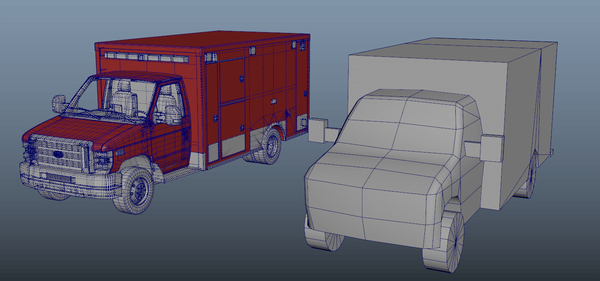
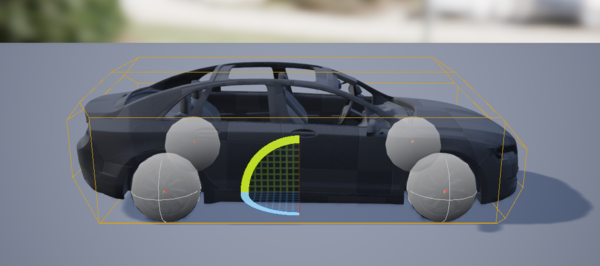
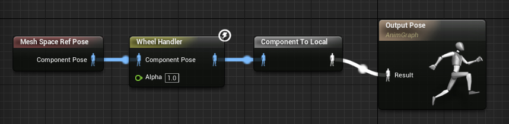
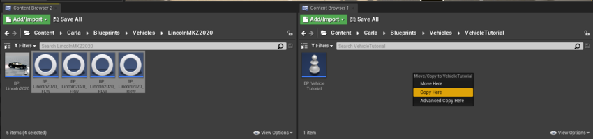
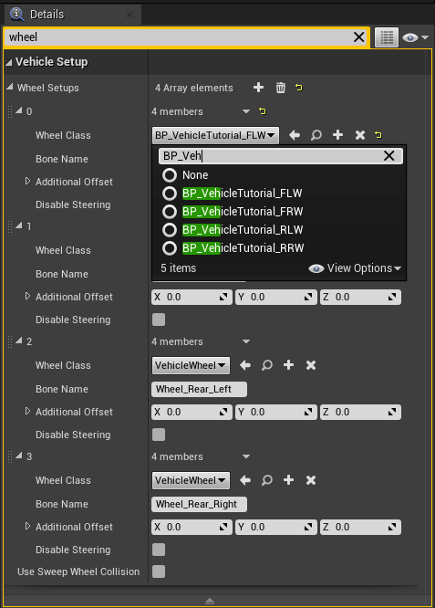
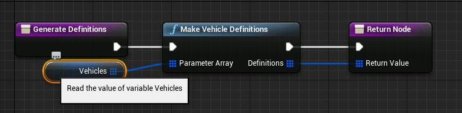
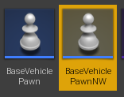
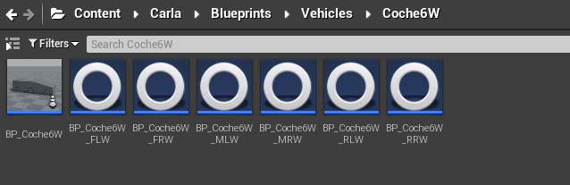
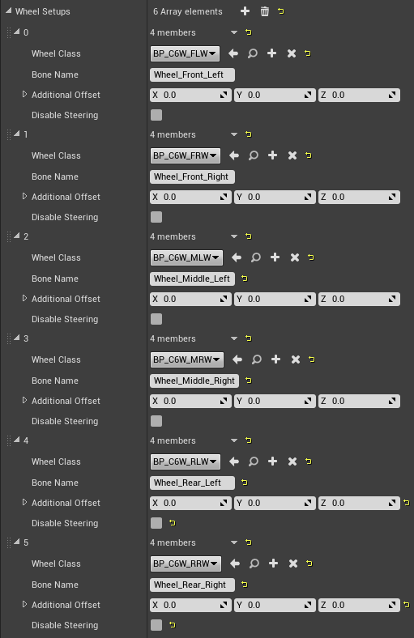
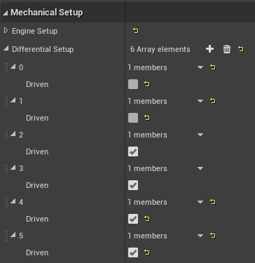

# 새로운 차량 추가하기

이 튜토리얼에서는 CARLA에 새로운 차량을 추가하는 방법을 자세히 설명합니다. 4륜 차량과 2륜 차량에 대한 두 섹션으로 구성되어 있습니다. CARLA에서 차량이 잘 작동하도록 하기 위해 모델링 시 충족해야 할 기본 요구사항과 언리얼 엔진에 차량을 가져온 후 필요한 설정에 대한 설명이 포함되어 있습니다.

* [__4륜 차량 추가하기__](#4륜-차량-추가하기)
  * [차량 바인딩 및 모델링](#차량-바인딩-및-모델링)
  * [차량 가져오기 및 구성](#차량-가져오기-및-구성)
* [__2륜 차량 추가하기__](#2륜-차량-추가하기)

!!! 중요
    이 튜토리얼은 소스에서 빌드하여 작업하고 언리얼 엔진 에디터에 접근할 수 있는 사용자에게만 적용됩니다.

---
## 4륜 차량 추가하기

CARLA에 추가되는 차량은 [__여기__](https://carla-assets.s3.us-east-005.backblazeb2.com/fbx/VehicleSkeleton.rar)에서 찾을 수 있는 __공통 기본 스켈레톤__을 사용해야 합니다. 이 링크를 클릭하면 `VehicleSkeleton.rar`라는 폴더가 다운로드되며, 이 폴더에는 ASCII와 바이너리 두 가지 다른 `.fbx` 형식으로 된 기본 스켈레톤이 포함되어 있습니다. 사용할 형식은 3D 모델링 소프트웨어 요구사항에 따라 달라집니다.

__스켈레톤 뼈의 위치는 변경할 수 있지만 회전, 새로운 뼈 추가, 또는 현재 계층 구조 변경과 같은 다른 조작은 오류를 발생시킵니다.__

---

### 차량 바인딩 및 모델링

이 섹션에서는 차량을 CARLA에서 성공적으로 사용할 수 있도록 하기 위한 모델링 단계의 최소 요구사항을 설명합니다. 이 과정에는 차량의 베이스와 바퀴에 스켈레톤을 올바르게 바인딩하고, Physical Asset과 레이캐스트 센서 메시를 생성하며, 올바른 형식으로 내보내는 작업이 포함됩니다.

__1. 기본 스켈레톤 가져오기.__

선호하는 3D 모델링 소프트웨어에 기본 스켈레톤을 가져옵니다. 일반적인 에디터로는 Maya와 Blender가 있습니다.

__2. 뼈 바인딩하기.__

아래의 명명 규칙에 따라 차량 메시의 해당 부분에 뼈를 바인딩합니다. 바퀴의 뼈를 메시 중앙에 위치시키도록 하세요.

* __전방 좌측 바퀴:__ `Wheel_Front_Left`
* __전방 우측 바퀴:__ `Wheel_Front_Right`
* __후방 좌측 바퀴:__ `Wheel_Rear_Left`
* __후방 우측 바퀴:__ `Wheel_Rear_Right`
* __나머지 메시:__ `VehicleBase`

!!! 경고
    뼈의 이름이나 계층 구조를 변경하거나 새로운 뼈를 추가하지 마세요.

__3. 차량 모델링하기.__

차량은 약 50,000 - 100,000 tris를 가져야 합니다. 우리는 실제 자동차의 크기와 비율을 사용하여 차량을 모델링합니다.

다음과 같이 차량을 여러 재질로 나누는 것을 권장합니다:

>1. __Bodywork__: 차량의 금속 부분. 이 재질은 언리얼 엔진 재질로 변경됩니다. 로고와 세부 사항을 추가할 수 있지만, 보이게 하려면 언리얼 엔진 에디터의 알파 채널을 사용하여 다른 색상으로 칠해야 합니다.
- __Glass_Ext__: 차량 외부에서 내부를 볼 수 있게 하는 유리층.
- __Glass_Int__: 차량 내부에서 외부를 볼 수 있게 하는 유리층.
- __Lights__: 헤드라이트, 방향 지시등 등.
- __LightGlass_Ext__: 외부에서 조명 내부를 볼 수 있게 하는 유리층.
- __LightGlass_Int__: 조명 내부에서 외부를 볼 수 있게 하는 유리층.
- __LicensePlate__: 29x12 cm의 직사각형 평면. 최상의 결과를 위해 [여기](https://carla-assets.s3.us-east-005.backblazeb2.com/fbx/LicensePlate.rar)에서 CARLA에서 제공하는 `.fbx`를 사용할 수 있습니다. 텍스처는 언리얼 엔진에서 자동으로 할당됩니다.
- __Interior__: 위 섹션에 맞지 않는 다른 세부 사항들은 _Interior_에 포함될 수 있습니다.

재질은 `M_CarPart_CarName` 형식으로 이름을 지정해야 합니다(예: `M_Bodywork_Mustang`).

텍스처는 `T_CarPart_CarName` 형식으로 이름을 지정해야 합니다(예: `T_Bodywork_Mustang`). 텍스처 크기는 2048x2048이어야 합니다.

언리얼 엔진은 자동으로 LOD를 생성하지만 3D 에디터에서 수동으로 생성할 수도 있습니다. Tri 수는 다음과 같습니다:

- __LOD 0__: 100,000 tris
- __LOD 1__: 80,000 tris
- __LOD 2__: 60,000 tris
- __LOD 3__: 30,000 tris

__4. Physical Asset 메시 생성하기.__

Physical Asset 메시는 언리얼 엔진이 차량의 물리를 계산할 수 있게 하는 추가 메시입니다. 가능한 한 단순해야 하며, 폴리곤 수가 적고, 바퀴를 제외한 차량 전체를 커버해야 합니다. 아래 이미지를 예시로 참조하세요.

>>

Physical Asset 메시는 별도의 `.fbx` 파일로 내보내야 합니다. 최종 파일은 다음 요구사항을 충족해야 합니다:

- 베이스 메시가 있어야 합니다. 이는 Physical Asset 메시의 복사본이어야 합니다. 원본 차량과 동일한 이름을 가져야 합니다.
- Physical Asset 메시는 `UCX_<vehicle_name>_<number_of_mesh>` 형식으로 이름을 지정해야 합니다. __그렇지 않으면 언리얼 엔진이 인식하지 못합니다.__
- 메시는 원본 모델의 경계를 넘어서지 않아야 합니다.
- 메시는 원본 모델과 동일한 위치에 있어야 합니다.

>>

최종 메시를 `SMC_<vehicle_name>.fbx` 이름으로 내보냅니다.

__5. 레이캐스트 센서 메시 생성하기.__

레이캐스트 센서 메시는 레이캐스트 센서(RADAR, LiDAR, Semantic LiDAR)가 감지할 차량의 형태를 설정합니다. 이 메시는 센서 시뮬레이션의 현실성을 높이기 위해 Physical Asset 메시보다 약간 더 정의된 geometry를 가져야 하지만, 성능을 위해 차량 메시만큼 상세하지는 않아야 합니다.

레이캐스트 센서 메시를 생성할 때 다음 사항을 고려하세요:

- 메시는 바퀴, 사이드미러, 그릴을 포함한 차량의 모든 측면을 커버해야 합니다.
- 바퀴는 16개의 루프를 넘지 않는 실린더여야 합니다.
- 필요한 경우 여러 메시를 결합할 수 있습니다.
- 메시는 원본 모델의 경계를 넘어서지 않아야 합니다.
- 메시는 원본과 동일한 위치에 있어야 합니다.

>>

최종 메시를 `SM_sc_<vehicle_name>.fbx` 이름으로 내보냅니다.

__5. 차량 메시 내보내기.__

모든 주요 차량 메시와 스켈레톤 베이스를 선택하고 `.fbx`로 내보냅니다.

---

### 차량 가져오기 및 구성

이 섹션에서는 CARLA에서 사용하기 위해 차량을 언리얼 엔진으로 가져오는 과정을 설명합니다. 언리얼 엔진 에디터에서 다음 단계를 수행하세요.

__1. 차량 폴더 생성하기.__

`Content/Carla/Static/Vehicles/4Wheeled`에 `<vehicle_name>` 이름의 새 폴더를 생성합니다.

__2. `.fbx` 가져오기.__

새로운 차량 폴더 내에서 **_Content Browser_**에서 우클릭하고 **_Import into Game/Carla/Static/Vehicles/4Wheeled/<vehicle_name\>_**을 선택하여 메인 차량 스켈레톤 `.fbx`를 가져옵니다.

팝업 대화 상자에서:

- **_Import Content Type_**을 `Geometry and Skinning Weights`로 설정합니다.
- **_Normal Import Method_**를 `Import Normals`로 설정합니다.
- 선택적으로 **_Material Import Method_**를 `Do not create materials`로 설정합니다. 언리얼 엔진이 기본 재질을 생성하지 않도록 **_Import Textures_**를 체크 해제합니다.

Skeletal Mesh가 나타나고 `<vehicle_name>_PhysicsAssets`와 `<vehicle_name>_Skeleton`이라는 두 개의 새 파일이 생성됩니다.

메인 차량 스켈레톤 `.fbx` 파일과 별도로 나머지 `.fbx` 파일들을 가져옵니다.

__3. Physical Asset 메시 설정하기.__

>1. **_Content Browser_**에서 `<vehicle_name>_PhysicsAssets`를 엽니다.
- **_Skeleton Tree_** 패널에서 `Vehicle_Base` 메시를 우클릭하고 **_Copy Collision from StaticMesh_**로 이동합니다.
- `SMC_<vehicle_name>` 파일을 검색하여 선택합니다. 뷰포트에 Physical Asset 메시의 윤곽이 나타나야 합니다.
- `Vehicle_Base`에서 기본 캡슐 형태를 삭제합니다.
- 모든 바퀴를 선택합니다:
    - **_Tools_** 패널로 이동하여 **_Primitive Type_**을 `Sphere`로 변경합니다.
    - **_Details_** 패널로 이동하여 **_Physics Type_**을 `Kinematic`으로 변경합니다.
    - **_Linear Damping_**을 `0`으로 설정합니다. 이렇게 하면 바퀴의 추가 마찰이 제거됩니다.
- 모든 메시에 대해 **_Simulation Generates Hit Event_**를 활성화합니다.
- **_Re-generate Bodies_**를 클릭합니다.
- 바퀴 구체를 바퀴 크기에 맞게 조정합니다.
- 저장하고 창을 닫습니다.

>

__4. Animation Blueprint 생성하기.__

>1. **_Content Browser_**에서 차량 폴더 내부를 우클릭하고 **_Animation -> Animation Blueprint_**를 선택합니다.
- **_Parent Class_**
- - **_Parent Class_**에서 `VehicleAnimInstance`를 검색하여 선택합니다.
- **_Target Skeleton_**에서 `<vehicle_name>_Skeleton`을 검색하여 선택합니다.
- **_OK_**를 누르고 블루프린트 이름을 `AnimBP_<vehicle_name>`으로 변경합니다.

__5. Animation Blueprint 구성하기.__

Animation Blueprint 구성 과정을 용이하게 하기 위해, 기존 CARLA 차량의 것을 복사하겠습니다:

>1. `Content/Carla/Static/Vehicle`로 이동하여 아무 CARLA 차량 폴더를 선택합니다. 해당 Animation Blueprint를 엽니다.
- **_My Blueprint_** 패널에서 **_AnimGraph_**를 더블 클릭합니다. 뷰포트에 그래프가 나타날 것입니다.
- **_Mesh Space Ref Pose_**, **_Wheel Handler_**, **_Component To Local_** 컴포넌트를 클릭하고 드래그하여 선택합니다. 우클릭하고 **_Copy_**를 선택합니다.
- 자신의 차량 Animation Blueprint로 돌아가서 복사한 내용을 그래프 영역에 붙여넣습니다.
- **_Component To Local_** 컴포넌트의 서 있는 인물 아이콘에서 **_Output Pose_**의 인물 아이콘으로 드래그하여 컴포넌트들을 연결합니다.
- 좌측 상단의 **_Compile_**을 클릭합니다. 이제 전체 시퀀스를 통해 맥박치는 선이 보여야 합니다.
- 저장하고 창을 닫습니다.

>>

__6. 차량 및 바퀴 블루프린트 준비하기.__

>1. **_Content Browser_**에서 `Content/Carla/Blueprints/Vehicles`로 이동하여 `<vehicle_name>` 새 폴더를 생성합니다.
- 폴더 내에서 우클릭하고 **_Blueprint Class_**로 이동합니다. 팝업의 **_All Classes_** 섹션을 엽니다.
- `BaseVehiclePawn`을 검색하고 **_Select_**를 누릅니다.
- 파일 이름을 `BP_<vehicle_name>`으로 변경합니다.
- `Carla/Blueprints/Vehicles`의 기본 CARLA 차량 폴더로 이동합니다. **_Content Browser_**에서 네 개의 바퀴 블루프린트를 자신의 차량 블루프린트 폴더에 복사합니다. 파일 이름에서 이전 차량 이름을 자신의 차량 이름으로 바꿉니다.

>>

__7. 바퀴 블루프린트 구성하기.__

>1. 차량 블루프린트 폴더에서 네 개의 바퀴 블루프린트를 모두 엽니다.
- **_Class Defaults_** 패널에서 **_Collision Mesh_**를 `Wheel_Shape`로 설정합니다. __이 단계를 생략하면 차량 바퀴가 지면으로 가라앉게 됩니다__.
- 차량 사양에 따라 바퀴 형상 반경, 너비, 질량, 댐핑 비율 값을 조정합니다.
- **_Tire Config_**를 `CommonTireConfig`로 설정합니다.
- 전륜에서는 선호도에 따라 **_Steer Angle_**을 설정합니다(기본값은 `70`). **_Affected by Handbrake_**를 체크 해제합니다.
- 후륜에서는 **_Steer Angle_**을 `0`으로 설정합니다. **_Affected by Handbrake_**를 체크합니다.
- 서스펜션 값을 설정할 때는 [여기](tuto_D_customize_vehicle_suspension.md)의 값을 가이드로 사용할 수 있습니다.
- 컴파일하고 저장합니다.

>>

__8. 차량 블루프린트 구성하기.__

>1. **_Content Browser_**에서 `BP_<vehicle_name>`을 엽니다.
- **_Components_** 패널에서 **_Mesh (VehicleMesh) (Inherited)_**를 선택합니다.
- **_Details_** 패널에서 **_Skeletal Mesh_**로 이동하여 차량의 기본 스켈레톤 파일(`Carla/Static/Vehicles/4Wheeled/<vehicle_name>` 폴더에 있음)을 검색하여 선택합니다.
- **_Details_** 패널에서 **_Anim Class_**로 이동합니다. `AnimBP_<vehicle_name>` 파일을 검색하여 선택합니다.
- **_Components_** 패널에서 **_Custom Collision (Inherited)_**를 선택합니다.
- **_Details_** 패널에서 **_Static Mesh_**를 선택하고 `SM_sc_<vehicle_name>` 레이캐스트 센서 메시를 검색합니다.
- **_Components_** 패널에서 **_VehicleMovement (MovementComp) (Inherited)_**를 선택합니다.
- **_Details_** 패널에서 `wheel`을 검색합니다. 각 바퀴에 대한 설정을 찾을 수 있습니다. 각각에 대해 **_Wheel Class_**를 클릭하고 해당 바퀴 위치에 맞는 `BP_<vehicle_name>_<wheel_name>` 파일을 검색합니다.

>>>>

베이스 메시와 별도로 차량에 대한 추가 메시(도어, 조명 등)가 있는 경우:

>1. **_Components_** 패널의 **_Mesh (VehicleMesh) (Inherited)_** 계층 구조로 드래그합니다.
- 계층 구조에서 추가 메시를 선택하고 **_Details_** 패널에서 `Collision`을 검색합니다.
- **_Collision Presets_**를 `NoCollision`으로 설정합니다.
- 계층 구조에서 조명 메시를 선택합니다. **_Details_** 패널에서 `Tag`를 검색하고 `emissive` 태그를 추가합니다.

**_Save_**와 **_Compile_**을 클릭합니다.

__9. Blueprint Library에 차량 추가하기.__

>1. `Content/Carla/Blueprint/Vehicle`에서 `VehicleFactory` 파일을 엽니다.
- **_Generate Definitions_** 탭에서 **_Vehicles_**를 더블 클릭합니다.
- **_Details_** 패널에서 **_Default Value_** 섹션을 확장하고 vehicles 배열에 새 요소를 추가합니다.
- 차량의 **_Make_**와 **_Model_**을 입력합니다.
- **_Class_** 값에 `BP_<vehicle_name>` 파일을 입력합니다.
- 선택적으로 차량에 대한 권장 색상 세트를 제공합니다.
- 컴파일하고 저장합니다.

>

__10. 차량 테스트하기.__

CARLA를 실행하고, `PythonAPI/examples`에서 터미널을 열어 다음 명령을 실행합니다:

```sh
python3 manual_control.py --filter <model_name> # 9단계에서 정의한 제조사 또는 모델
```

!!! 참고
    제조사와 모델에 대문자를 사용했더라도 필터에 전달할 때는 소문자로 변환해야 합니다.
## N 휠 차량 추가하기

N 휠 차량을 추가하는 것은 위의 4륜 차량과 동일한 가져오기 과정을 따르지만 몇 가지 다른 단계가 있습니다.

__5.__ __N 휠 차량을 위한 Animation Blueprint 구성하기__

`BaseVehiclePawnNW`를 검색하여 **_Select_**를 누릅니다.



__6.__ __차량 및 바퀴 블루프린트 준비하기__

Carla/Blueprints/Vehicles에 있는 기본 CARLA 차량 폴더로 이동합니다. Content Browser에서 네 개의 바퀴 블루프린트를 자신의 차량 블루프린트 폴더로 복사합니다. 파일 이름의 이전 차량 이름을 자신의 차량 이름으로 바꿉니다.

네 개의 바퀴를 복사하고 추가 바퀴를 위해 다시 복사합니다. 6륜 차량의 경우, 6개의 다른 바퀴가 필요합니다: FLW(전방 좌측), FRW(전방 우측), MLW(중앙 좌측), MRW(중앙 우측), RLW(후방 좌측), RRW(후방 우측).



__7.__ __바퀴 블루프린트 구성하기__

위의 4륜 차량의 __7__ 섹션을 따릅니다. N 휠 차량의 경우 핸드브레이크와 스티어링 매개변수의 영향을 받는 바퀴가 다릅니다. 일부 차량(예: 긴 축거의 트럭)에서는 앞쪽 2쌍의 바퀴가 조향하며, 한 세트가 다른 세트보다 더 많이 조향할 수 있습니다. 가장 뒤쪽 쌍이 핸드브레이크의 영향을 받을 수 있으며, 구체적인 내용은 모델링하는 차량에 따라 달라집니다.

__8.__ __차량 블루프린트 구성하기__

Details 패널에서 `wheel`을 검색합니다. 각 바퀴에 대한 설정을 찾을 수 있습니다. 각각에 대해 Wheel Class를 클릭하고 해당 바퀴 위치에 맞는 BP_<vehicle_name>_<wheel_name> 파일을 검색합니다.

이는 맞지만, N 휠 차량의 경우 모든 바퀴를 설정해야 한다는 점을 명시하겠습니다. 다음은 6륜 차량의 예시입니다:



마지막으로, 디퍼렌셜 설정에 대한 추가 고려사항이 있습니다. 4륜 차량의 경우 디퍼렌셜의 다양한 프리셋(Limited Slip, Open 4W 등)이 있지만, N 휠 차량에서는 어떤 바퀴에 토크를 적용할지 선택해야 합니다. 이 예시에서는 중앙과 후방 바퀴에만 토크가 있고 전방 바퀴에는 없지만, 다른 구성도 지정할 수 있습니다. 숫자는 위 이미지와 동일합니다(예: 0은 위에 지정된 대로 전방 좌측 바퀴입니다).



엔진, 트랜스미션, 스티어링 커브와 같은 다른 매개변수는 4륜 차량과 동일합니다.

---
## 2륜 차량 추가하기

2륜 차량을 추가하는 것은 4륜 차량 추가와 비슷하지만, 애니메이션의 복잡성으로 인해 운전자 애니메이션을 안내하기 위한 추가 뼈를 설정해야 합니다. [여기](https://carla-assets.s3.us-east-005.backblazeb2.com/fbx/BikeSkeleton.rar)에서 2륜 차량용 참조 스켈레톤 링크를 찾을 수 있습니다.

4륜 차량과 마찬가지로, 모델을 양의 "x" 방향으로 향하게 하고 모든 뼈 축을 양의 x 방향으로, z축은 위쪽을 향하게 합니다.

```yaml
Bone Setup:
  - Bike_Rig:                   # 메시의 원점. 장면의 0점에 배치
    - BikeBody:                 # 모델의 몸체 중심
      - Pedals:                 # 차량이 자전거인 경우 페달을 이 뼈에 바인딩하면 자전거 가속에 따라 회전합니다
        - RightPedal:           # 운전자의 발 위치를 설정하고 차량이 자전거인 경우 페달과 함께 회전합니다
        - LeftPedal:            # ^
      - RearWheel:              # 차량의 후륜
      - Handler:                # 차량의 전륜과 함께 회전하며 차량 핸들러를 여기에 바인딩
        - HandlerMidBone:       # 핸들을 바퀴와 함께 정렬하기 위해 전륜 뼈 위에 위치
        - HandlerRight:         # 운전자의 손 위치를 설정, 아무것에도 바인딩할 필요 없음
        - HandlerLeft:          # ^
      - Frontwheel:             # 차량의 전륜
      - RightHelperRotator:     # 이 네 개의 추가 뼈는 추가 보이지 않는 바퀴를 사용하여 자전거를 안정화하는 구식 시스템을 위한 것입니다
        - RightHelprWheel:      # ^
      - LeftHelperRotator:      # ^
        - LeftHelperWheel:      # ^
      - Seat:                   # 운전자의 엉덩이 뼈 위치를 설정. 아무것에도 바인딩할 필요 없지만 신중하게 배치해야 함
```

__1.__ `Content/Carla/Static/Vehicles/2Wheeled` 내부의 고유 폴더에 Skeletal Mesh로 fbx를 가져옵니다. 가져올 때 "General2WheeledVehicleSkeleton"을 스켈레톤으로 선택합니다. Physics asset이 자동으로 생성되고 연결되어야 합니다.

__2.__ Physics asset을 조정합니다. 자동으로 생성된 것을 삭제하고 `BikeBody` 뼈에 상자를 추가하여 가능한 한 형태와 일치하도록 합니다. generate hit events가 활성화되어 있는지 확인하세요.
  각 바퀴에 구를 추가하고 "Physics Type"을 "Kinematic"으로 설정합니다.

__3.__ `Content/Blueprints/Vehicles/<vehicle-model>` 폴더를 생성합니다.

__4.__ 해당 폴더 내에서 "VehicleWheel" 클래스에서 파생된 두 개의 블루프린트 클래스를 생성합니다. `<vehicle-model>_FrontWheel`과 `<vehicle-model>_RearWheel`이라고 부릅니다. "Shape Radius"를 메시 바퀴 반경과 정확히 일치하도록 설정합니다(주의, 지름이 아닌 반경입니다). "Tire Config"를 "CommonTireConfig"로 설정합니다. 전륜에서는 "Affected by Handbrake"를 체크 해제하고 후륜에서는 "Steer Angle"을 0으로 설정합니다.

__5.__ 같은 폴더 내에서 `Base2WheeledVehicle`에서 파생된 블루프린트 클래스를 생성하고 `<vehicle-model>`이라고 부릅니다. 편집을 위해 열고 "Mesh" 컴포넌트를 선택한 다음, "Skeletal Mesh"와 "Anim Class"를 해당하는 것으로 설정합니다. 그런 다음 VehicleBounds 컴포넌트를 선택하고 위에서 본 차량의 영역을 커버하도록 크기를 설정합니다.

__6.__ "VehicleMovement" 컴포넌트를 선택하고, "Vehicle Setup" 아래에서 "Wheel Setups"를 확장하여 각 바퀴를 설정합니다.

* __0:__ Wheel Class=`<vehicle-model>_FrontWheel`, Bone Name=`FrontWheel`
* __1:__ Wheel Class=`<vehicle-model>_FrontWheel`, Bone Name=`FrontWheel`
* __2:__ Wheel Class=`<vehicle-model>_RearWheel`, Bone Name=`RearWheel`
* __3:__ Wheel Class=`<vehicle-model>_RearWheel`, Bone Name=`RearWheel`
(각 뼈에 기본적으로 두 개의 바퀴를 배치한다는 것을 알 수 있습니다. 언리얼이 제공하는 차량 클래스는 4개가 아닌 바퀴 수를 지원하지 않기 때문에 차량이 4개의 바퀴를 가지고 있다고 생각하게 만들어야 합니다)

__7.__ "is bike" 변수를 선택하고 모델이 자전거인 경우 체크합니다. 이렇게 하면 페달 회전이 활성화됩니다. 모터사이클을 설정하는 경우에는 체크하지 않습니다.

__8.__ back Rotation 변수를 찾아 가장 잘 맞는 대로 설정하고 SkeletalMesh 컴포넌트(운전자)를 선택한 다음 시트 위치에 올 때까지 x축을 따라 이동합니다.

__9.__ 테스트하기 위해 CarlaGameMode 블루프린트로 이동하여 "Default Pawn Class"를 새로 생성한 자전거 블루프린트로 변경합니다.