# 재질 커스터마이제이션

CARLA 팀은 모든 에셋이 특정 기본 설정에서 실행되도록 준비합니다. 하지만 소스에서 빌드하여 작업하는 사용자는 자신의 필요에 맞게 이를 수정할 수 있습니다.

* [__차량 재질__](#차량-재질)
* [__차량 재질 커스터마이즈__](#차량-재질-커스터마이즈)
  * [외부 속성](#외부-속성)
* [__건물 재질__](#건물-재질)
* [__건물 재질 커스터마이즈__](#건물-재질-커스터마이즈)

!!! 중요
    이 튜토리얼은 소스에서 빌드하여 작업하고 언리얼 에디터에 접근할 수 있는 사용자에게만 적용됩니다.

---
## 차량 재질

CARLA에는 차량의 다양한 부분에 대한 템플릿으로 사용되는 마스터 재질 세트가 있습니다. 각 차량 모델에 대해 이러한 재질의 인스턴스가 생성되고, 원하는 결과로 변경됩니다. 마스터 재질은 `Content/Carla/Static/GenericMaterials/Vehicles`에서 찾을 수 있으며, 다음과 같습니다.

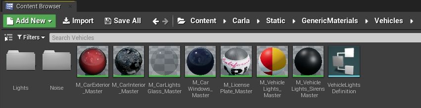

<i>차량에 적용된 마스터 재질.</i>

* __M_CarExterior_Master__ — 차량 차체에 적용되는 재질.
* __M_CarInterior_Master__ — 차량 내부에 적용되는 재질.
* __M_CarLightsGlass_Master__ — 차량 조명을 덮는 유리에 적용되는 재질.
* __M_CarWindows_Master__ — 창문에 적용되는 재질.
* __M_LicensePlate_Master__ — 번호판에 적용되는 재질.
* __M_VehicleLights_Master__ — 발광 텍스처로 차량 조명에 적용되는 재질.
* __M_VehicleLights_Sirens_Master__ — 해당되는 경우 사이렌에 적용되는 재질.

---
## 차량 재질 커스터마이즈

마스터 재질의 인스턴스를 생성하고 새 모델의 해당 폴더에 저장합니다. 다음은 블루프린트 라이브러리에서 사용 가능한 경찰차 *vehicle.dodge_charger.police*에 대해 생성된 인스턴스의 예시입니다.

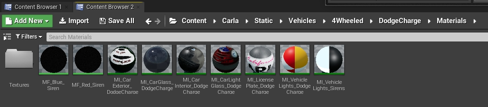

<i>경찰차 블루프린트용 인스턴스 재질.</i>

재질과 그 사용 방법에 대한 일반적인 문서는 [UE 문서](https://docs.unrealengine.com/en-US/Engine/Rendering/Materials/index.html)에서 찾을 수 있습니다. 모든 재질은 크게 수정할 수 있지만, 외부 재질만이 언급할 만한 속성을 가지고 있습니다. 다른 재질들은 유리 재질의 투명도와 색상과 같은 특정 속성을 변경할 수 있지만, 특별한 목적이 아니라면 이를 변경하는 것은 권장되지 않습니다.

### 외부 속성

외부 재질은 차량의 차체에 적용되며, 가장 많이 커스터마이즈할 수 있습니다.

* __Base color__ — 차체의 기본 색상.
* __Tint shade__ — 시각화 각도에 따라 가시성이 달라지는 색조 색상.

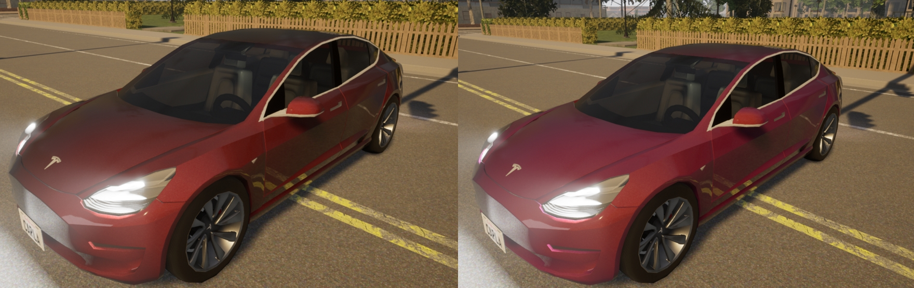

<i>분홍색 틴트가 있는 빨간 차. 왼쪽은 틴트가 비활성화되었고, 오른쪽은 활성화되었습니다.</i>

* __Dust__ — 차량에 적용되는 먼지 텍스처. 먼지는 geometry 위에 쌓이도록 되어있으며, 하단 부분에서는 거의 눈에 띄지 않습니다. geometry가 회전하면 차량의 상단 부분에 먼지가 나타납니다.
  * `Amount` — 텍스처의 불투명도.
  * `Color` — 먼지 텍스처의 기본 색상.
  * `Tiling` — 먼지 텍스처 패턴의 크기와 반복.
  * `Thickness` — 먼지의 밀도.
  * `Roughness` — 먼지로 인한 차량의 금속성 반사 감소.

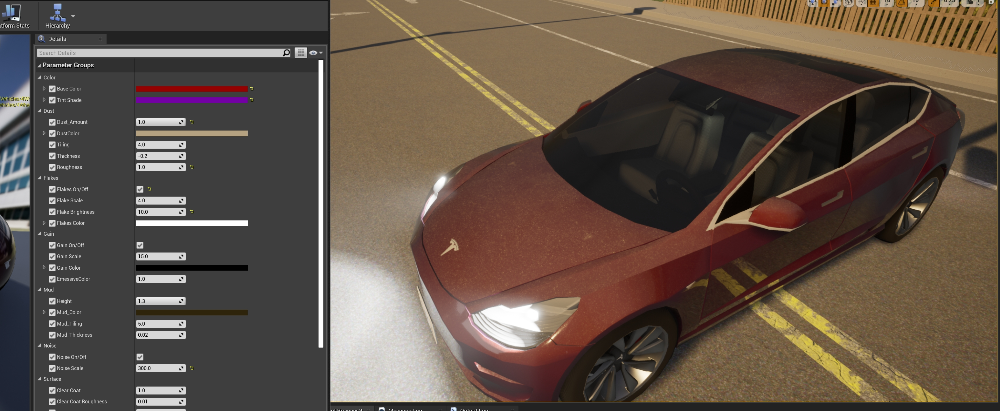

<i>차량 재질의 먼지 속성.</i>

* __Flakes__ — 차량의 금속성 도장에 반짝이는 플레이크 추가.
  * `On/Off` — 기능을 활성화 또는 비활성화.
  * `Scale` — 플레이크의 크기.
  * `Brightness` — 반짝임의 강도.
  * `Color` — 입자의 기본 색상.

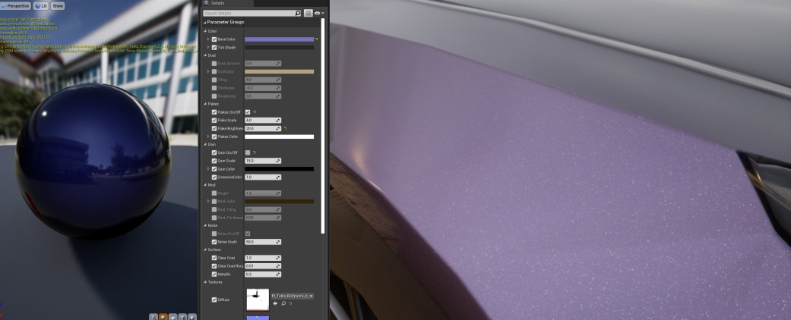

<i>차량 재질의 플레이크 속성.</i>

* __Gain__ — 차량의 기본 도장에 노이즈 추가.
  * `On/Off` — 기능을 활성화 또는 비활성화.
  * `Scale` — 게인의 크기.
  * `Color` — 게인의 기본 색상.

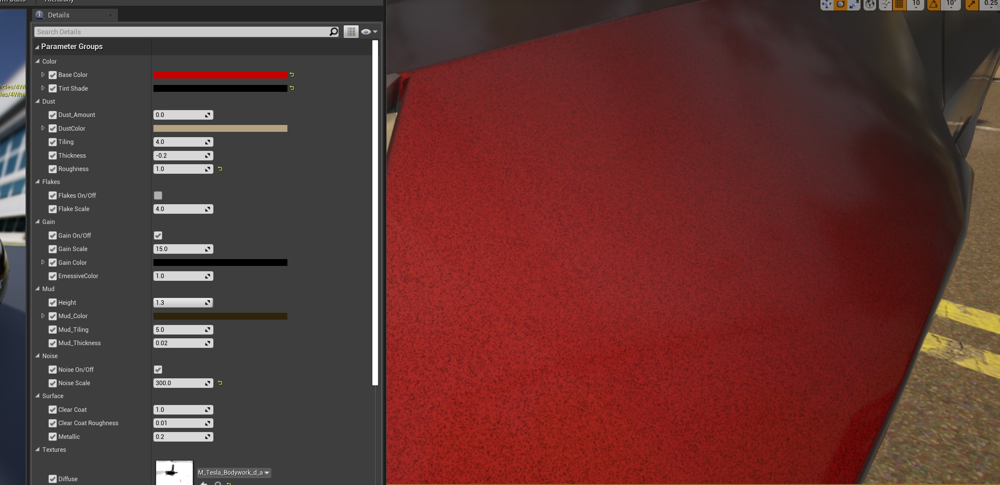

<i>차량 재질의 게인 속성.</i>

* __Mud__ — 차량에 적용되는 진흙 텍스처. 진흙은 차량의 아래에서 위로 나타납니다.
  * `Height` — 진흙이 나타나는 차량의 부분.
  * `Mud_Color` — 진흙 텍스처의 기본 색상.
  * `Mud_Tiling` — 진흙 텍스처 패턴의 크기와 반복.
  * `Mud_Thickness` — 진흙의 밀도.

<i>차량 재질의 진흙 속성.</i>

* __Noise__ — 재질의 노말에 적용되는 노이즈. 오렌지 필 효과를 생성합니다.
  * `On/Off` — 기능을 활성화 또는 비활성화.
  * `Scale` — 노말 맵의 변경으로 생성되는 범프의 크기.

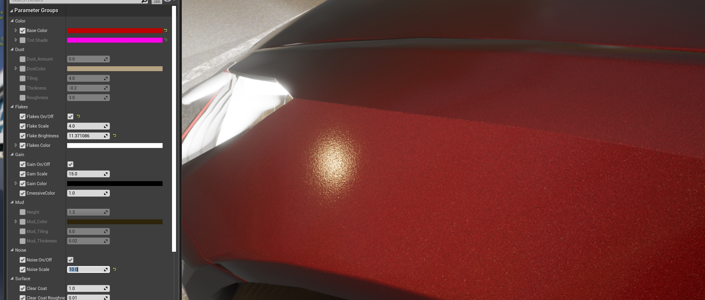

<i>차량 재질의 노이즈 속성.</i>

* __Surface__ — 차량 도장에 적용되는 광택과 투명 코팅. 이는 [자동차 도장](https://en.wikipedia.org/wiki/Automotive_paint)의 마지막 단계입니다.
  * `ClearCoat` — 코팅의 불투명도.
  * `ClearCoat_Brightness` — 결과 재질의 광택도.
  * `ClearCoat_Metallic` — 결과 재질의 반사도.

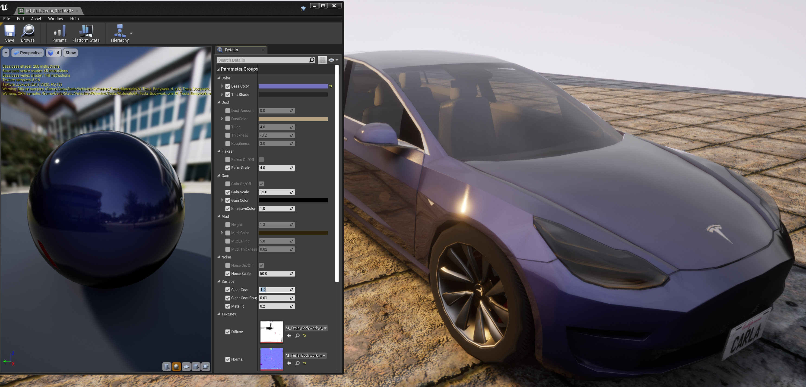

<i>재질에 적용된 Surface 코팅의 시각화.</i>

---
## 건물 재질

건물에 적용되는 재질은 재질의 기본 속성을 결정하는 네 가지 기본 텍스처의 조합으로 만들어집니다.

* __Diffuse__ — 재질의 기본 페인팅을 포함합니다.
  * `RGB` — 기본 색상이 포함된 채널.
  * `Alpha` — 이 채널은 흰색 부분의 색상을 수정할 수 있게 하는 마스크를 정의합니다. 이는 동일한 재질에서 변형을 만드는 데 유용합니다.

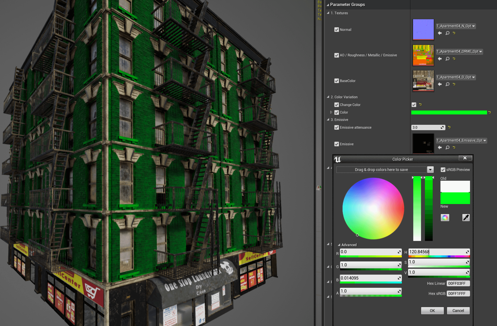

* __ORME__ — 특정 채널을 사용하여 재질의 다양한 속성을 매핑합니다.
  * `Ambient occlusion` — `R` 채널에 포함.
  * `Roughness` — `G` 채널에 포함.
  * `Metallic map` — `B` 채널에 포함.
  * `Emissive mask` — `Alpha` 채널에 포함. 이 마스크는 흰색 부분의 발광 색상과 강도를 변경할 수 있게 합니다.

* __Normal__ — 재질의 노말 맵을 포함합니다.
  * `RGB` — 노말 맵 정보.

* __Emissive__ — 해당되는 경우, 이 텍스처는 텍스처의 발광 기본 색상을 설정하는 데 사용됩니다.
  * `RGB` — 텍스처의 발광 요소에 대한 색상 정보.

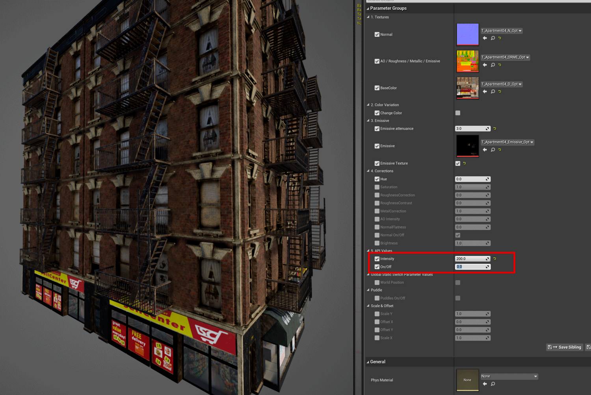

---
## 건물 재질 커스터마이즈

차량 재질과 마찬가지로, 건물 재질도 원하는 경우 크게 변경할 수 있지만, 사용자가 언리얼 엔진에 대한 전문 지식이 있는 경우에만 권장됩니다. 하지만 건물이 사용하는 두 가지 주요 셰이더에 대해 일부 커스터마이제이션이 가능합니다.

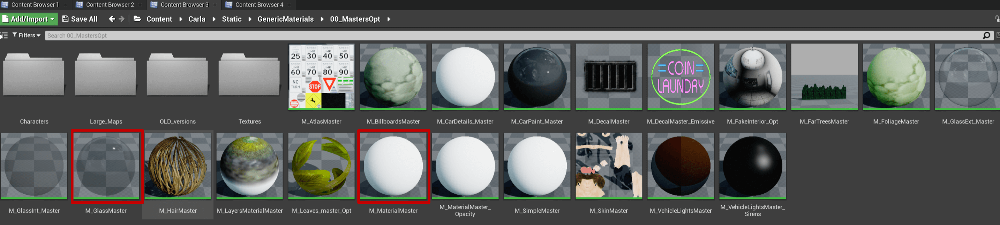

* __Glass shader__ — `M_GlassMaster`.
  * `Opacity` — __Diffuse__ `Alpha` 텍스처의 흰색 영역에서 색상 변경을 활성화.
  * `Color` — __Diffuse__ `Alpha` 텍스처의 흰색 영역을 기반으로 적용될 틴트.

* __Building shader__ — `M_MaterialMaster`
  * `Change Color` — __Diffuse__ `Alpha` 텍스처의 흰색 영역에서 색상 변경을 활성화.
  * `Color` — __Diffuse__ `Alpha` 텍스처의 흰색 영역을 기반으로 적용될 틴트.
  * `Emissive Texture` — __Emissive__ 텍스처 사용을 활성화.
  * `EmissiveColor` — __ORME__ `Emissive mask` 텍스처의 흰색 영역을 기반으로 적용될 틴트.
  * `Emissive attenuance` — 적절한 발광 값을 얻기 위해 __BP_Lights__에 명시된 강도를 나누는 인자.
  * `RoughnessCorrection` — 거칠기 맵의 강도를 변경.
  * `MetallicCorrection` — 금속성 맵의 강도를 변경.
  * `NormalFlatness` — 노말 맵의 강도를 변경.

---

이것으로 사용자가 차량과 건물의 재질을 커스터마이즈할 수 있는 가장 주목할 만한 방법들에 대한 설명을 마칩니다.

질문이 있으시다면 포럼에서 언제든 환영합니다.

<a href="https://github.com/carla-simulator/carla/discussions/" target="_blank" class="btn btn-neutral" title="CARLA 포럼으로 이동">
CARLA 포럼</a>

