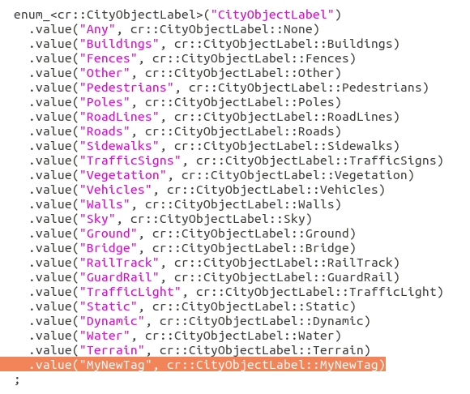

# 시맨틱 태그 생성

시맨틱 세그멘테이션을 위한 사용자 정의 태그를 정의하는 방법을 배워보세요. 이러한 태그들은 [carla.World](python_api.md#carla.World)가 검색하는 바운딩 박스를 필터링하기 위해 [carla.CityObjectLabel](python_api.md#carla.CityObjectLabel)에 추가로 포함될 수 있습니다.

*   [__새로운 시맨틱 태그 생성하기__](#create-a-new-semantic-tag)  
    *   [1. 태그 ID 생성하기](#1-create-the-tag-id)  
    *   [2. 에셋을 위한 UE 폴더 생성하기](#2-create-the-ue-folder-for-assets)  
    *   [3. UE와 코드 태그 간의 양방향 대응 관계 생성하기](#3-create-two-way-correspondence-between-ue-and-the-code-tag)  
    *   [4. 색상 코드 정의하기](#4-define-a-color-code)  
    *   [5. 태그가 지정된 요소 추가하기](#5-add-the-tagged-elements)  
*   [__carla.CityObjectLabel에 태그 추가하기__](#add-a-tag-to-carlacityobjectlabel)  

---

## 새로운 시맨틱 태그 생성하기

### 1. 태그 ID 생성하기

`LibCarla/source/carla/rpc`의 __`ObjectLabel.h`를 엽니다__. 다른 태그들과 동일한 형식을 사용하여 enum 끝에 새 태그를 추가합니다.

!!! 참고
    태그가 순서대로 나타날 필요는 없습니다. 하지만 순서대로 나열하는 것이 좋은 관행입니다.

### 2. 에셋을 위한 UE 폴더 생성하기

__언리얼 엔진 에디터를 열고__ `Carla/Static`으로 이동합니다. 태그와 동일한 이름의 새 폴더를 생성합니다.

!!! 참고
    UE 폴더와 태그의 이름이 반드시 같을 필요는 없습니다. 하지만 동일하게 하는 것이 좋은 관행입니다.

### 3. UE와 코드 태그 간의 양방향 대응 관계 생성하기

__3.1. `Unreal/CarlaUE4/Plugins/Carla/Source/Carla/Game`의 `Tagger.cpp`를 엽니다__. __`GetLabelByFolderName`__으로 이동합니다. 리스트 끝에 태그를 추가합니다. 비교되는 문자열은 [__2.__](#2-create-the-ue-folder-for-assets)에서 사용된 UE 폴더의 이름이므로, 여기에서도 정확히 같은 이름을 사용하세요.

__3.2. 같은 `Tagger.cpp`의 `GetTagAsString`__으로 이동합니다. switch문 끝에 새 태그를 추가합니다.

### 4. 색상 코드 정의하기

`LibCarla/source/carla/image`의 __`CityScapesPalette.h`를 엽니다__. 배열 끝에 새 태그의 색상 코드를 추가합니다.

!!! 경고
    배열에서의 위치는 이 경우 `23u`인 태그 ID와 일치해야 합니다.

### 5. 태그가 지정된 메시 추가하기

이제 새로운 시맨틱 태그를 사용할 준비가 되었습니다. 태그의 UE 폴더 안에 저장된 메시만 해당 태그로 표시됩니다. 해당 메시들을 새 폴더로 이동하거나 가져와서 적절하게 태그가 지정되도록 하세요.

---

## [carla.CityObjectLabel](python_api.md#carla.CityObjectLabel)에 태그 추가하기

이 단계는 시맨틱 세그멘테이션과 직접적인 관련이 없습니다. 하지만 이러한 태그들은 [carla.World](python_api.md#carla.World)의 바운딩 박스 쿼리를 필터링하는 데 사용될 수 있습니다. 이를 위해서는 태그가 PythonAPI의 [carla.CityObjectLabel](python_api.md#carla.CityObjectLabel) enum에 추가되어야 합니다.

`carla/PythonAPI/carla/source/libcarla`의 __`World.cpp`를 열고__ enum 끝에 새 태그를 추가합니다.

---

문제, 의문사항 또는 제안사항이 있으시면 **[F.A.Q.](build_faq.md)** 페이지를 읽거나 [CARLA 포럼](https://github.com/carla-simulator/carla/discussions)에 게시하세요.

다음 단계는?

<a href="../ref_sensors" target="_blank" class="btn btn-neutral" title="CARLA의 센서에 대해 모두 배우기">
센서 참조</a>

<a href="../tuto_A_add_props" target="_blank" class="btn btn-neutral" title="CARLA에 사용자 정의 요소를 가져오는 방법 배우기">
새로운 프롭 추가하기</a>

