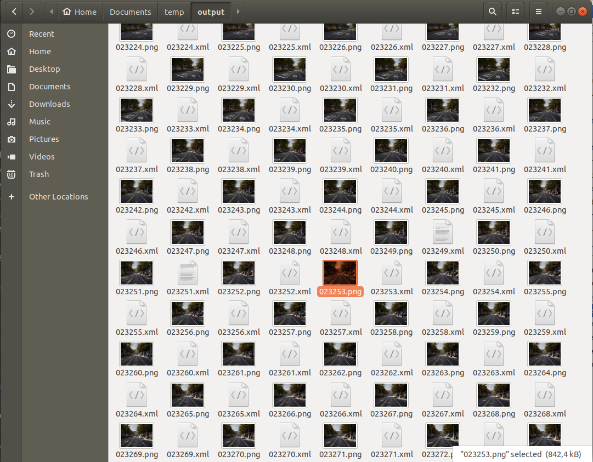

# 경계 상자

자율주행 차량이 주변 환경을 이해하도록 만드는 데 있어 중요한 요소는 차량 주변 객체들의 위치와 방향을 추정하는 것입니다. 이를 위해서는 객체의 경계 상자 위치를 추론하는 것이 필요합니다.

CARLA 시뮬레이션 내의 모든 객체는 경계 상자를 가지고 있으며, CARLA Python API는 각 객체의 경계 상자에 접근하는 함수를 제공합니다. 이 튜토리얼에서는 경계 상자에 접근하고 이를 카메라 평면에 투영하는 방법을 보여줍니다.

## 시뮬레이터 설정

먼저 표준 CARLA 기본 코드를 작성하고, 클라이언트와 월드 객체를 설정한 다음, 차량을 생성하고 카메라를 부착해 보겠습니다:

```py
import carla
import math
import random
import time
import queue
import numpy as np
import cv2

client = carla.Client('localhost', 2000)
world  = client.get_world()
bp_lib = world.get_blueprint_library()

# 차량 생성
vehicle_bp =bp_lib.find('vehicle.lincoln.mkz_2020')
vehicle = world.try_spawn_actor(vehicle_bp, random.choice(spawn_points))

# 카메라 생성
camera_bp = bp_lib.find('sensor.camera.rgb')
camera_init_trans = carla.Transform(carla.Location(z=2))
camera = world.spawn_actor(camera_bp, camera_init_trans, attach_to=vehicle)
vehicle.set_autopilot(True)

# 동기 모드로 시뮬레이터 설정
settings = world.get_settings()
settings.synchronous_mode = True # 동기 모드 활성화
settings.fixed_delta_seconds = 0.05
world.apply_settings(settings)

# 맵의 생성 지점 가져오기
spawn_points = world.get_map().get_spawn_points()

# 센서 데이터를 저장하고 검색할 큐 생성
image_queue = queue.Queue()
camera.listen(image_queue.put)
```

## 기하학적 변환

시뮬레이션의 3D 점들을 카메라의 2D 평면에 투영하고자 합니다. 먼저, 카메라 투영 행렬을 구성해야 합니다:

```py
def build_projection_matrix(w, h, fov, is_behind_camera=False):
    focal = w / (2.0 * np.tan(fov * np.pi / 360.0))
    K = np.identity(3)

    if is_behind_camera:
        K[0, 0] = K[1, 1] = -focal
    else:
        K[0, 0] = K[1, 1] = focal

    K[0, 2] = w / 2.0
    K[1, 2] = h / 2.0
    return K
```

카메라 투영 행렬을 사용하여 3D에서 2D 점으로 투영하려고 합니다. 첫 번째 단계는 월드 좌표의 3D 좌표를 `camera.get_transform().get_inverse_matrix()`를 사용하여 가져올 수 있는 역 카메라 변환을 사용하여 카메라 좌표로 변환하는 것입니다. 이후 카메라 투영 행렬을 사용하여 카메라 좌표의 3D 점을 2D 카메라 평면에 투영합니다:

```py
def get_image_point(loc, K, w2c):
        # 3D 좌표의 2D 투영 계산

        # 입력 좌표 형식 지정(loc는 carla.Position 객체임)
        point = np.array([loc.x, loc.y, loc.z, 1])
        # 카메라 좌표로 변환
        point_camera = np.dot(w2c, point)

        # 이제 UE4의 좌표계를 "표준" 좌표계로 변경해야 합니다
        # (x, y ,z) -> (y, -z, x)
        # 그리고 네 번째 구성요소도 제거합니다
        point_camera = [point_camera[1], -point_camera[2], point_camera[0]]

        # 이제 카메라 행렬을 사용하여 3D->2D 투영
        point_img = np.dot(K, point_camera)
        # 정규화
        point_img[0] /= point_img[2]
        point_img[1] /= point_img[2]

        return point_img[0:2]
```

이제 3D -> 2D 투영을 위한 함수를 가지고 있으므로 카메라 사양을 가져옵니다:

```py
# 월드에서 카메라 행렬 가져오기
world_2_camera = np.array(camera.get_transform().get_inverse_matrix())

# 카메라에서 속성 가져오기
image_w = camera_bp.get_attribute("image_size_x").as_int()
image_h = camera_bp.get_attribute("image_size_y").as_int()
fov = camera_bp.get_attribute("fov").as_float()

# 3D -> 2D 투영을 위한 카메라 투영 행렬 계산
K = build_projection_matrix(image_w, image_h, fov)
K_b = build_projection_matrix(image_w, image_h, fov, is_behind_camera=True)
```
## 경계 상자

CARLA 객체들은 모두 관련된 경계 상자를 가지고 있습니다. CARLA [actors](python_api.md#carla.Actor)는 [carla.BoundingBox](python_api.md#carla.BoundingBox) 객체 유형의 `bounding_box` 속성을 가지고 있습니다. 경계 상자의 정점은 `.get_world_vertices()` 또는 `get_local_vertices()` 게터 함수 중 하나를 통해 검색할 수 있습니다.

월드 좌표에서 경계 상자의 3D 좌표를 얻으려면 다음과 같이 `get_world_vertices()` 메서드에 액터의 transform을 인수로 포함해야 한다는 점을 유의해야 합니다:

```py
actor.get_world_vertices(actor.get_transform())
```

건물, 신호등, 도로 표지판과 같은 맵의 객체들의 경우, 경계 상자는 [carla.World]((python_api.md#carla.World)) 메서드 `get_level_bbs()`를 통해 검색할 수 있습니다. [carla.CityObjectLabel]((python_api.md#carla.CityObjectLabel))을 인수로 사용하여 관련 객체들로 경계 상자 목록을 필터링할 수 있습니다:

```py
# 레벨 내의 신호등에 대한 모든 경계 상자 검색
bounding_box_set = world.get_level_bbs(carla.CityObjectLabel.TrafficLight)

# 반경 50m 내의 경계 상자를 추출하기 위해 목록 필터링
nearby_bboxes = []
for bbox in bounding_box_set:
    if bbox.location.distance(actor.get_transform().location) < 50:
        nearby_bboxes
```

이 목록은 액터 위치를 사용하여 추가로 필터링하여 근처에 있고 따라서 액터에 부착된 카메라의 시야 내에 있을 가능성이 있는 객체들을 식별할 수 있습니다.

카메라 이미지에 경계 상자를 그리기 위해서는 적절한 순서로 정점들을 연결하여 모서리를 만들어야 합니다. 이를 위해 다음과 같은 모서리 쌍 목록이 필요합니다:

```py
edges = [[0,1], [1,3], [3,2], [2,0], [0,4], [4,5], [5,1], [5,7], [7,6], [6,4], [6,2], [7,3]]
```

## 경계 상자 렌더링

이제 기하학적 투영과 시뮬레이션 설정을 마쳤으므로 게임 루프를 생성하고 장면에 경계 상자를 렌더링하는 작업을 진행할 수 있습니다.

```py
# 레벨의 경계 상자 집합 설정
# 신호등과 교통 표지판에 대해 필터링
bounding_box_set = world.get_level_bbs(carla.CityObjectLabel.TrafficLight)
bounding_box_set.extend(world.get_level_bbs(carla.CityObjectLabel.TrafficSigns))

# 모서리 쌍 기억하기
edges = [[0,1], [1,3], [3,2], [2,0], [0,4], [4,5], [5,1], [5,7], [7,6], [6,4], [6,2], [7,3]]
```

경계 상자를 보기 위해 OpenCV 창을 사용하여 카메라 출력을 표시하겠습니다.

```py
# 첫 번째 이미지 검색
world.tick()
image = image_queue.get()

# 원시 데이터를 RGB 배열로 재구성
img = np.reshape(np.copy(image.raw_data), (image.height, image.width, 4)) 

# OpenCV 디스플레이 창에 이미지 표시
cv2.namedWindow('ImageWindowName', cv2.WINDOW_AUTOSIZE)
cv2.imshow('ImageWindowName',img)
cv2.waitKey(1)
```

이제 게임 루프를 시작하겠습니다:

```py
while True:
    # 이미지 검색 및 재구성
    world.tick()
    image = image_queue.get()

    img = np.reshape(np.copy(image.raw_data), (image.height, image.width, 4))

    # 카메라 매트릭스 가져오기
    world_2_camera = np.array(camera.get_transform().get_inverse_matrix())
    
    for bb in bounding_box_set:

        # 자아 차량으로부터의 거리로 필터링
        if bb.location.distance(vehicle.get_transform().location) < 50:

            # 차량의 전방 벡터와 차량과 경계 상자 사이의
            # 벡터 간의 내적을 계산합니다. 이 내적값을 임계값으로 설정하여
            # 카메라 전방에 있는 경계 상자만 그리도록 제한합니다.
            forward_vec = vehicle.get_transform().get_forward_vector()
            ray = bb.location - vehicle.get_transform().location

            if forward_vec.dot(ray) > 0:
                # 정점들을 순회합니다
                verts = [v for v in bb.get_world_vertices(carla.Transform())]
                for edge in edges:
                    # 정점들을 모서리로 연결합니다
                    p1 = get_image_point(verts[edge[0]], K, world_2_camera)
                    p2 = get_image_point(verts[edge[1]], K, world_2_camera)
                    # 모서리들을 카메라 출력에 그립니다
                    cv2.line(img, (int(p1[0]),int(p1[1])), (int(p2[0]),int(p2[1])), (0,0,255, 255), 1)

    # 이제 OpenCV 디스플레이 창에 이미지를 그립니다
    cv2.imshow('ImageWindowName',img)
    # 사용자가 Q 키를 누르면 루프를 중단합니다
    if cv2.waitKey(1) == ord('q'):
        break

# 게임 루프가 멈추면 OpenCV 디스플레이 창을 닫습니다
cv2.destroyAllWindows()
```

이제 3D 경계 상자를 이미지에 렌더링하여 카메라 센서 출력에서 관찰할 수 있습니다.


## 차량 경계 상자

액터들, 특히 차량에 대한 경계 상자도 렌더링하고 싶을 수 있습니다.

먼저, 시뮬레이션에 다른 차량들을 몇 대 추가해 보겠습니다:

```py
for i in range(50):
    vehicle_bp = random.choice(bp_lib.filter('vehicle'))
    npc = world.try_spawn_actor(vehicle_bp, random.choice(spawn_points))
    if npc:
        npc.set_autopilot(True)
```

이전과 마찬가지로 첫 번째 이미지를 검색하고 OpenCV 디스플레이 창을 설정합니다:

```py
# 첫 번째 이미지 검색
world.tick()
image = image_queue.get()

# 원시 데이터를 RGB 배열로 재구성
img = np.reshape(np.copy(image.raw_data), (image.height, image.width, 4)) 

# OpenCV 디스플레이 창에 이미지 표시
cv2.namedWindow('ImageWindowName', cv2.WINDOW_AUTOSIZE)
cv2.imshow('ImageWindowName',img)
cv2.waitKey(1)
```

이제 차량 경계 상자를 그리기 위해 수정된 게임 루프를 사용합니다:

```py
def point_in_canvas(pos, img_h, img_w):
    """점이 캔버스 내에 있는지 확인"""
    if (pos[0] >= 0) and (pos[0] < img_w) and (pos[1] >= 0) and (pos[1] < img_h):
        return True
    return False

while True:
    # 이미지 검색 및 재구성
    world.tick()
    image = image_queue.get()

    img = np.reshape(np.copy(image.raw_data), (image.height, image.width, 4))

    # 카메라 매트릭스 가져오기 
    world_2_camera = np.array(camera.get_transform().get_inverse_matrix())
    
    for npc in world.get_actors().filter('*vehicle*'):

        # 자아 차량 필터링
        if npc.id != vehicle.id:

            bb = npc.bounding_box
            dist = npc.get_transform().location.distance(vehicle.get_transform().location)

            # 50m 내의 차량 필터링
            if dist < 50:

                # 차량의 전방 벡터와 차량과 다른 차량 사이의
                # 벡터 간의 내적을 계산합니다. 이 내적값을 임계값으로 설정하여
                # 카메라 전방에 있는 경계 상자만 그리도록 제한합니다.
                forward_vec = vehicle.get_transform().get_forward_vector()
                ray = npc.get_transform().location - vehicle.get_transform().location

                if forward_vec.dot(ray) > 0:
                    verts = [v for v in bb.get_world_vertices(npc.get_transform())]
                    for edge in edges:
                        p1 = get_image_point(verts[edge[0]], K, world_2_camera)
                        p2 = get_image_point(verts[edge[1]], K, world_2_camera)

                        p1_in_canvas = point_in_canvas(p1, image_h, image_w)
                        p2_in_canvas = point_in_canvas(p2, image_h, image_w)

                        if not p1_in_canvas and not p2_in_canvas:
                            continue

                        ray0 = verts[edge[0]] - camera.get_transform().location
                        ray1 = verts[edge[1]] - camera.get_transform().location
                        cam_forward_vec = camera.get_transform().get_forward_vector()

                        # 정점 중 하나가 카메라 뒤에 있음
                        if not (cam_forward_vec.dot(ray0) > 0):
                            p1 = get_image_point(verts[edge[0]], K_b, world_2_camera)
                        if not (cam_forward_vec.dot(ray1) > 0):
                            p2 = get_image_point(verts[edge[1]], K_b, world_2_camera)

                        cv2.line(img, (int(p1[0]),int(p1[1])), (int(p2[0]),int(p2[1])), (255,0,0, 255), 1)        
        
    cv2.imshow('ImageWindowName',img)
    if cv2.waitKey(1) == ord('q'):
        break
cv2.destroyAllWindows()
```


### 2D 경계 상자

신경망은 위에서 보여준 3D 경계 상자보다는 2D 경계 상자를 감지하도록 훈련되는 것이 일반적입니다. 이전 스크립트는 2D 경계 상자를 생성하도록 쉽게 확장할 수 있습니다. 단순히 3D 경계 상자의 극단점들을 사용하면 됩니다. 렌더링하는 각 경계 상자에 대해 이미지 좌표에서 가장 왼쪽, 가장 오른쪽, 가장 높은, 가장 낮은 투영된 정점을 찾습니다.

```py
while True:
    
    # 이미지 검색 및 재구성
    world.tick()
    image = image_queue.get()

    img = np.reshape(np.copy(image.raw_data), (image.height, image.width, 4))

    # 카메라 매트릭스 가져오기
    world_2_camera = np.array(camera.get_transform().get_inverse_matrix())

    for npc in world.get_actors().filter('*vehicle*'):

        # 자아 차량 필터링
        if npc.id != vehicle.id:

            bb = npc.bounding_box
            dist = npc.get_transform().location.distance(vehicle.get_transform().location)

            # 50m 내의 차량 필터링
            if dist < 50:

                # 차량의 전방 벡터와 차량과 다른 차량 사이의
                # 벡터 간의 내적을 계산합니다. 이 내적값을 임계값으로 설정하여
                # 카메라 전방에 있는 경계 상자만 그리도록 제한합니다.
                forward_vec = vehicle.get_transform().get_forward_vector()
                ray = npc.get_transform().location - vehicle.get_transform().location

                if forward_vec.dot(ray) > 0:
                    p1 = get_image_point(bb.location, K, world_2_camera)
                    verts = [v for v in bb.get_world_vertices(npc.get_transform())]
                    x_max = -10000
                    x_min = 10000
                    y_max = -10000
                    y_min = 10000

                    for vert in verts:
                        p = get_image_point(vert, K, world_2_camera)
                        # 가장 오른쪽 정점 찾기
                        if p[0] > x_max:
                            x_max = p[0]
                        # 가장 왼쪽 정점 찾기
                        if p[0] < x_min:
                            x_min = p[0]
                        # 가장 높은 정점 찾기
                        if p[1] > y_max:
                            y_max = p[1]
                        # 가장 낮은 정점 찾기
                        if p[1] < y_min:
                            y_min = p[1]

                    cv2.line(img, (int(x_min),int(y_min)), (int(x_max),int(y_min)), (0,0,255, 255), 1)
                    cv2.line(img, (int(x_min),int(y_max)), (int(x_max),int(y_max)), (0,0,255, 255), 1)
                    cv2.line(img, (int(x_min),int(y_min)), (int(x_min),int(y_max)), (0,0,255, 255), 1)
                    cv2.line(img, (int(x_max),int(y_min)), (int(x_max),int(y_max)), (0,0,255, 255), 1)

    cv2.imshow('ImageWindowName',img)
    if cv2.waitKey(1) == ord('q'):
        break
cv2.destroyAllWindows()
```


## 경계 상자 내보내기

경계 상자를 렌더링하는 것은 디버깅 목적으로 경계 상자가 올바른지 확인하는 데 유용합니다. 하지만 신경망 훈련에 실제로 활용하고자 한다면 이를 내보내야 할 것입니다. [__KITTI__](http://www.cvlibs.net/datasets/kitti/), [__PASCAL VOC__](http://host.robots.ox.ac.uk/pascal/VOC/) 또는 [__MicroSoft COCO__](https://cocodataset.org/#home)와 같은 자율주행 및 객체 감지에 사용되는 일반적인 데이터 저장소에서 사용하는 여러 다른 형식들이 있습니다.

### Pascal VOC 형식

이러한 데이터셋들은 일반적으로 JSON 또는 XML 형식을 사용하여 주석을 저장합니다. PASCAL VOC 형식을 위한 편리한 Python 라이브러리가 있습니다.

```py
from pascal_voc_writer import Writer

...
...
...

while True:
    # 이미지 검색
    world.tick()
    image = image_queue.get()

    # 카메라 매트릭스 가져오기
    world_2_camera = np.array(camera.get_transform().get_inverse_matrix())
    
    frame_path = 'output/%06d' % image.frame
    
    # 이미지 저장
    image.save_to_disk(frame_path + '.png')
    
    # 내보내기 도구 초기화
    writer = Writer(frame_path + '.png', image_w, image_h)
    
    for npc in world.get_actors().filter('*vehicle*'):
        if npc.id != vehicle.id:
            bb = npc.bounding_box
            dist = npc.get_transform().location.distance(vehicle.get_transform().location)
            if dist < 50:
                forward_vec = vehicle.get_transform().get_forward_vector()
                ray = npc.get_transform().location - vehicle.get_transform().location
                if forward_vec.dot(ray) > 0:
                    p1 = get_image_point(bb.location, K, world_2_camera)
                    verts = [v for v in bb.get_world_vertices(npc.get_transform())]
                    x_max = -10000
                    x_min = 10000
                    y_max = -10000
                    y_min = 10000
                    for vert in verts:
                        p = get_image_point(vert, K, world_2_camera)
                        if p[0] > x_max:
                            x_max = p[0]
                        if p[0] < x_min:
                            x_min = p[0]
                        if p[1] > y_max:
                            y_max = p[1]
                        if p[1] < y_min:
                            y_min = p[1]
        
                    # 객체를 프레임에 추가(이미지 내부에 있는지 확인)
                    if x_min > 0 and x_max < image_w and y_min > 0 and y_max < image_h: 
                        writer.addObject('vehicle', x_min, y_min, x_max, y_max)
    
    # 장면의 경계 상자 저장
    writer.save(frame_path + '.xml')
```

시뮬레이션의 렌더링된 각 프레임에 대해, 이제 프레임의 경계 상자 세부 정보를 포함하는 XML 파일도 함께 내보낼 것입니다.



PASCAL VOC 형식에서 XML 파일들은 동반되는 이미지 파일, 이미지 치수에 대한 정보를 포함하며, 필요한 경우 차량 유형과 같은 세부 정보도 포함할 수 있습니다.

```xml
<!-- PASCAL VOC 형식 파일 예시 -->
<annotation>
    <folder>output</folder>
    <filename>023235.png</filename>
    <path>/home/matt/Documents/temp/output/023235.png</path>
    <source>
        <database>Unknown</database>
    </source>
    <size>
        <width>800</width>
        <height>600</height>
        <depth>3</depth>
    </size>
    <segmented>0</segmented>
    <object>
        <name>vehicle</name>
        <pose>Unspecified</pose>
        <truncated>0</truncated>
        <difficult>0</difficult>
        <bndbox>
            <xmin>503</xmin>
            <ymin>310</ymin>
            <xmax>511</xmax>
            <ymax>321</ymax>
        </bndbox>
    </object>    <object>
        <name>vehicle</name>
        <pose>Unspecified</pose>
        <truncated>0</truncated>
        <difficult>0</difficult>
        <bndbox>
            <xmin>490</xmin>
            <ymin>310</ymin>
            <xmax>498</xmax>
            <ymax>321</ymax>
        </bndbox>
    </object>
</annotation>
```

### Microsoft COCO 형식

또 다른 인기 있는 내보내기 형식은 [__Microsoft COCO__](https://cocodataset.org/#home)입니다. COCO 형식은 JSON 파일을 사용하여 이미지와 주석에 대한 참조를 저장합니다. 이 형식은 데이터셋과 라이선스에 대한 정보와 함께 이미지와 관련된 주석을 단일 JSON 파일의 필드에 포함합니다. 다른 형식과는 대조적으로, 수집된 모든 이미지와 관련된 모든 주석에 대한 참조가 동일한 파일에 들어갑니다.

다음 예시와 유사한 JSON 딕셔너리를 생성해야 합니다:

```py
simulation_dataset = {
    "info": {},

    "licenses": [
    {
        "url": "http://creativecommons.org/licenses/by-nc-sa/2.0/",
        "id": 1,
        "name": "Attribution-NonCommercial-ShareAlike License"
    }],

    "images": [...,
        {
        "license": 1,
        "file_name": "023235.png",
        "height": 600,
        "width": 800,
        "date_captured": "2022-04-14 17:02:52",
        "id": 23235
    },
        ...
    ],

    "categories": [...
        {"supercategory": "vehicle", "id": 10, "name": "vehicle" },
    ...],

    "annotations": [
        ...,
        {
            "segmentation": [],
            "area": 9262.89,
            "iscrowd": 0,
            "image_id": 23235,
            "bbox": [503.3, 310.4, 118.3, 78.3]
        },
        ...
    ]
}
```

info와 licenses 섹션은 적절히 채우거나 비워둘 수 있습니다. 시뮬레이션의 이미지는 딕셔너리의 `images` 필드에 있는 배열에 저장되어야 합니다. 경계 상자는 일치하는 `image_id`와 함께 딕셔너리의 `annotations` 필드에 저장되어야 합니다. 경계 상자는 `[x_min, y_min, width, height]`로 저장됩니다.

그런 다음 Python JSON 라이브러리를 사용하여 딕셔너리를 JSON 파일로 저장할 수 있습니다:

```py
import json

with open('simulation_data.json', 'w') as json_file:
    json.dump(simulation_dataset, json_file)
```

COCO 데이터 형식에 대한 자세한 내용은 [__여기__](https://www.immersivelimit.com/tutorials/create-coco-annotations-from-scratch/#create-custom-coco-dataset)에서 찾을 수 있습니다.

*이 튜토리얼에서는 겹치는 경계 상자를 고려하지 않았다는 점에 유의해야 합니다. 경계 상자가 겹치는 경우 전경 경계 상자를 식별하기 위해서는 추가 작업이 필요할 것입니다.*