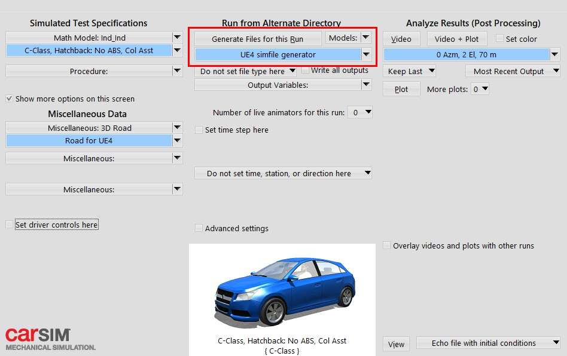
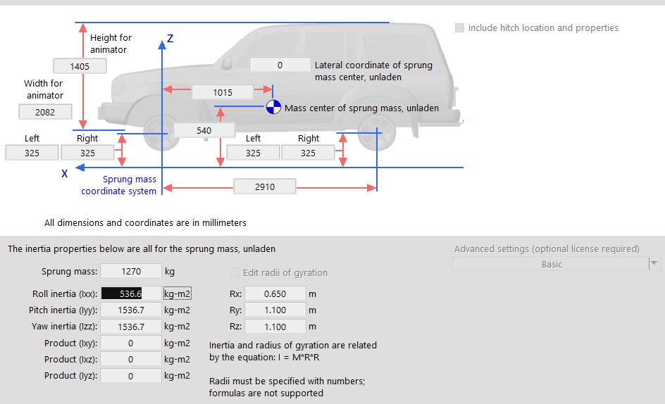
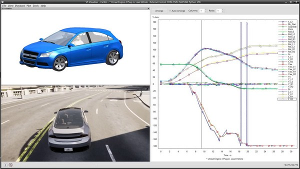

# CarSim 통합

CARLA의 CarSim 통합 기능을 통해 CARLA의 차량 제어를 CarSim으로 전달할 수 있습니다. CarSim은 차량의 모든 물리 연산을 수행하고 새로운 상태를 CARLA로 반환합니다.

이 페이지에서는 `.sim` 파일을 생성하는 방법, CARLA와 CarSim 간의 차량 크기 관계를 설명하고, CarSim 통합을 사용하여 CARLA에서 시뮬레이션을 실행하는 방법을 설명합니다.

* [__시작하기 전에__](#시작하기-전에)
* [__CarSim 설정__](#carsim-설정)
    * [__.sim 파일 생성__](#sim-파일-생성)
        * [__Windows에서__](#windows에서)
        * [__Ubuntu에서__](#ubuntu에서)
    * [__차량 크기__](#차량-크기)
* [__시뮬레이션 실행__](#시뮬레이션-실행)

---
## 시작하기 전에

1. CarSim 라이선스가 필요하며 소프트웨어가 실행 가능한 상태여야 합니다. CarSim 라이선스가 없다면 [여기](https://www.carsim.com/forms/additional_information.php)에서 팀에 연락하여 정보를 얻을 수 있습니다.
2. Unreal Engine과의 통신을 위해 Unreal Engine 4.24용 VehicleSim Dynamics 플러그인(버전 2020.0)을 설치해야 합니다. 플러그인의 특정 버전에 대한 정보는 이 [링크](https://www.carsim.com/products/supporting/unreal/index.php)에서 확인할 수 있습니다. 플러그인 설치는 운영체제에 따라 다릅니다:

    __Windows의 경우__:

    플러그인은 [여기](https://www.unrealengine.com/marketplace/en-US/product/carsim-vehicle-dynamics)에서 받을 수 있습니다.

    __Ubuntu의 경우__:

    1. 플러그인을 [여기](https://www.carsim.com/users/unreal_plugin/unreal_plugin_2020_0.php)에서 다운로드하세요.
    2. Ubuntu용 올바른 솔버를 사용하기 위해 `CarSim.Build.cs` 파일을 [여기](https://carla-assets.s3.us-east-005.backblazeb2.com/Backup/CarSim.Build.cs)에서 찾을 수 있는 파일로 교체하세요.

3. CARLA의 패키지 버전을 사용하는 경우 이 단계는 건너뛸 수 있습니다. 패키지 버전은 이미 이 플래그를 사용하여 컴파일되어 있지만, CARLA를 소스에서 빌드하는 경우 `--carsim` 플래그를 사용하여 서버를 컴파일해야 합니다.

    CARLA를 소스에서 빌드하는 경우, 루트 폴더에서 다음 명령을 실행하여 `--carsim` 플래그로 서버를 컴파일하세요:

```sh
make launch ARGS="--carsim"
```

## CarSim 설정

다음 섹션에서는 시뮬레이션 실행에 필요한 `.sim` 파일을 생성하는 방법을 자세히 설명합니다. 또한 CARLA와 CarSim 간의 차량 크기 관계에 대한 중요한 정보도 설명합니다.

#### .sim 파일 생성

`.sim` 파일은 CARLA와 CarSim 모두에서 실행될 시뮬레이션을 설명합니다. 이 파일은 플러그인이 시뮬레이션을 실행하는 데 필요합니다. 현재 Ubuntu에서는 이 파일을 생성할 방법이 없지만, 아래에서 Ubuntu에서 시뮬레이션을 실행하기 위해 이전에 생성된 파일을 사용하는 방법을 설명하겠습니다.

##### Windows에서

CarSim에서 모든 매개변수를 구성한 후, 아래와 같이 GUI를 사용하여 `.sim` 파일을 생성하세요:



생성된 `.sim` 파일은 다음과 같은 형태여야 합니다:

```
SIMFILE

SET_MACRO $(ROOT_FILE_NAME)$ Run_dd7a828d-4b14-4c77-9d09-1974401d6b25
SET_MACRO $(OUTPUT_PATH)$ D:\carsim\Data\Results
SET_MACRO $(WORK_DIR)$ D:\carsim\Data\
SET_MACRO $(OUTPUT_FILE_PREFIX)$ $(WORK_DIR)$Results\Run_dd7a828d-4b14-4c77-9d09-1974401d6b25\LastRun

FILEBASE $(OUTPUT_FILE_PREFIX)$
INPUT $(WORK_DIR)$Results\$(ROOT_FILE_NAME)$\Run_all.par
INPUTARCHIVE $(OUTPUT_FILE_PREFIX)$_all.par
ECHO $(OUTPUT_FILE_PREFIX)$_echo.par
FINAL $(OUTPUT_FILE_PREFIX)$_end.par
LOGFILE $(OUTPUT_FILE_PREFIX)$_log.txt
ERDFILE $(OUTPUT_FILE_PREFIX)$.vs
PROGDIR D:\carsim\
DATADIR D:\carsim\Data\
GUI_REFRESH_V CarSim_RefreshEvent_7760
RESOURCEDIR D:\carsim\\Resources\
PRODUCT_ID CarSim
PRODUCT_VER 2020.0
ANIFILE D:\carsim\Data\runs\animator.par
VEHICLE_CODE i_i
EXT_MODEL_STEP 0.00050000
PORTS_IMP 0
PORTS_EXP 0

DLLFILE D:\carsim\Programs\solvers\carsim_64.dll
END
```

##### Ubuntu에서

Ubuntu에서는 GUI를 통해 `.sim` 파일을 생성할 방법이 없습니다. 진행하려면 다음 단계를 따르세요:

1. Windows에서 `.sim` 파일을 생성하거나 위의 파일 템플릿을 사용하세요.
2. `.sim` 파일의 `INPUT`, `INPUTARCHIVE`, `LOGFILE` 등의 변수가 Ubuntu 시스템의 해당 파일들을 가리키도록 수정하세요.
3. `DLLFILE` 줄을 CarSim 솔버를 가리키도록 변경하세요. 기본 설치의 경우 `SOFILE /opt/carsim_2020.0/lib64/libcarsim.so.2020.0`가 됩니다.

결과 파일은 다음과 비슷해야 합니다:

```
SIMFILE

FILEBASE /path/to/LastRun
INPUT /path/to/Run_all.par
INPUTARCHIVE /path/to/LastRun_all.par
ECHO /path/to/LastRun_echo.par
FINAL /path/to/LastRun_end.par
LOGFILE /path/to/LastRun_log.txt
ERDFILE /path/to/LastRun.vs
PROGDIR /opt/carsim_2020.0/lib64/
DATADIR .
PRODUCT_ID CarSim
PRODUCT_VER 2020.0
VEHICLE_CODE i_i

SOFILE /opt/carsim_2020.0/lib64/libcarsim.so.2020.0
END
```

#### 차량 크기

CarSim에서 시뮬레이션에 사용할 차량의 크기를 지정할 수 있지만, 현재 CarSim 차량과 CARLA 차량 사이에는 상관관계가 없습니다. 이는 두 프로그램의 차량이 서로 다른 크기를 가진다는 것을 의미합니다. CARLA 차량의 역할은 시뮬레이션 중 자리표시자 역할만 하는 것입니다.



!!! 참고
    CARLA와 CarSim의 차량 크기 사이에는 상관관계가 없습니다. CARLA 차량은 단지 시뮬레이션 자리표시자일 뿐입니다.

## 시뮬레이션 실행

시뮬레이션을 실행할 때 필요한 것은 차량을 생성할 때 CarSim을 활성화하는 것뿐입니다. Python API의 다음 [메서드](https://carla.readthedocs.io/en/latest/python_api/#carla.Vehicle.enable_carsim)에 `.sim` 파일의 경로를 전달하여 수행할 수 있습니다:

```sh
vehicle.enable_carsim(<path_to_ue4simfile.sim>)
```

차량으로 전송되는 모든 입력 제어는 CarSim으로 전달됩니다. CarSim은 물리를 업데이트하고 차량의 상태(변환)를 CARLA 차량으로 다시 전송합니다.

시뮬레이션이 완료되면 CarSim에서 평소와 같이 모든 데이터를 분석할 수 있습니다.

