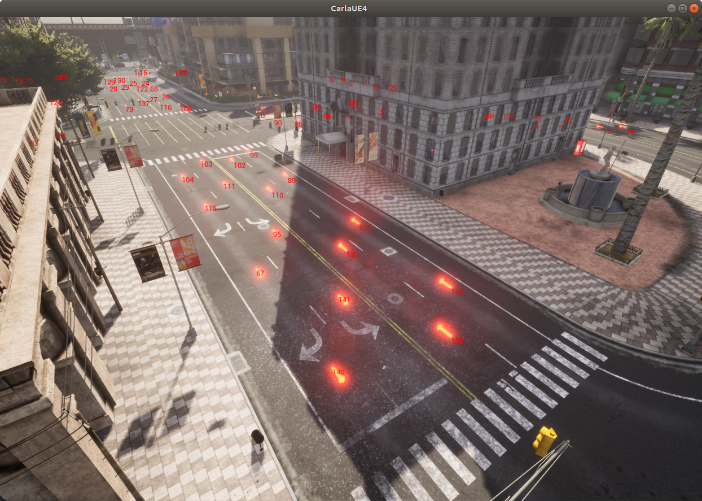
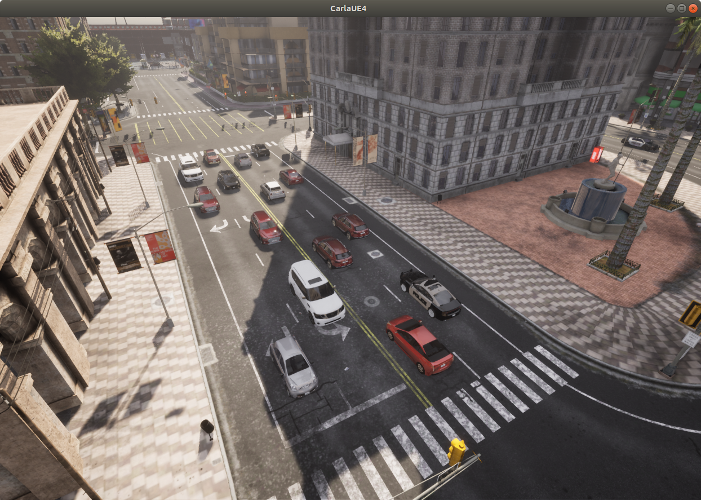

# CARLA 시작하기

CARLA 시뮬레이터는 자율주행(AD) 및 기타 로봇공학 애플리케이션을 위한 종합적인 학습 데이터 생성 솔루션입니다. CARLA는 실제 마을, 도시, 고속도로와 그 안의 차량 및 기타 객체들을 매우 사실적으로 구현한 환경을 시뮬레이션합니다.

CARLA 시뮬레이터는 평가와 테스트 환경으로도 매우 유용합니다. 학습된 자율주행 에이전트를 시뮬레이션 환경에 배포하여 성능과 안전성을 테스트하고 평가할 수 있으며, 이 모든 것을 하드웨어나 다른 도로 사용자에게 어떤 위험도 없이 안전한 가상 환경에서 수행할 수 있습니다.

이 튜토리얼에서는 관찰자 시점으로 환경을 탐색하는 것부터 시작하여, 시뮬레이션에 차량과 보행자를 배치하고, 센서와 카메라를 추가하여 신경망 학습이나 테스트에 사용할 시뮬레이션 데이터를 수집하는 등 CARLA의 기본적인 시작 단계들을 다룹니다.

## CARLA 실행과 클라이언트 연결

CARLA는 Windows에서는 실행 파일을, Linux에서는 쉘 스크립트를 사용하여 명령줄에서 실행할 수 있습니다. [__Linux__](start_quickstart.md)와 [__Windows__](start_quickstart.md)의 설치 지침을 따른 후 명령줄에서 [__CARLA를 실행__](start_quickstart.md#running-carla)하세요.

Python API를 통해 CARLA를 제어하려면 열린 포트를 통해 Python 클라이언트를 서버에 연결해야 합니다:

```py
import carla
import random

# 클라이언트에 연결하고 월드 객체 가져오기
client = carla.Client('localhost', 2000)
world = client.get_world()
```

[__client__](python_api#carlaclient) 객체는 클라이언트의 서버 연결을 유지하고 명령을 실행하거나 데이터를 불러오고 내보내는 여러 기능을 제공합니다. client 객체를 사용하여 다른 맵을 불러오거나 현재 맵을 초기 상태로 다시 불러올 수 있습니다:

```py
# 사용 가능한 맵 출력
client.get_available_maps()

# 새로운 맵 불러오기
client.load_world('Town07')

# 현재 맵 다시 불러오고 상태 초기화
client.reload_world()
```
포트는 사용 가능한 아무 포트나 선택할 수 있으며, 기본값은 2000입니다. *localhost* 대신 컴퓨터의 IP 주소를 사용하여 다른 호스트를 선택할 수도 있습니다. 이렇게 하면 CARLA 서버는 네트워크 컴퓨터에서 실행하고 Python 클라이언트는 개인 컴퓨터에서 실행할 수 있습니다. 이는 CARLA 시뮬레이터 실행용 GPU와 신경망 학습용 GPU를 분리하는 데 특히 유용합니다. 두 작업 모두 그래픽 하드웨어에 많은 부하를 주기 때문입니다.

!!! 참고
    이후 내용은 CARLA가 기본 [__비동기__](adv_synchrony_timestep.md) 모드로 실행 중이라고 가정합니다. 동기 모드를 사용하는 경우 다음 섹션의 일부 코드가 예상대로 작동하지 않을 수 있습니다.

## 월드 객체

CARLA API에서 [__world__](python_api#carlaworld) 객체는 맵, 건물, 신호등, 차량, 보행자 등 시뮬레이션의 모든 요소에 접근할 수 있게 해줍니다.

world 객체를 사용하여 시뮬레이션 내의 객체들을 조회하고 접근할 수 있습니다:

```py
# 모든 객체의 이름 가져오기
world.get_names_of_all_objects()

# 이름 목록에서 건물 필터링
filter(lambda x: 'Building' in x, world.get_names_of_all_objects())

# 차량과 보행자 등 모든 액터의 목록 가져오기
world.get_actors()

# 목록에서 차량 필터링
world.get_actors().filter('*vehicle*')
```

world 객체는 spawn 메서드를 통해 차량과 보행자 같은 것들을 시뮬레이션에 추가하는 데 사용됩니다. 차량과 보행자는 CARLA 시뮬레이션에서 특별한 위치를 차지합니다. 이들은 행동을 보이고(즉, 움직이고 다른 객체에 영향을 줄 수 있음) 액터(actors)라고 부릅니다. 이는 건물처럼 단순히 맵의 특징일 뿐인 정적이고 생명이 없는 객체들과 구별됩니다. 신호등과 같은 다른 객체들도 다른 객체에 영향을 주는 행동을 보이므로 액터로 분류됩니다.

객체를 생성하려면 해당 객체의 [__블루프린트__](python_api#carlaactorblueprint)가 필요합니다. 블루프린트는 액터에 필요한 모든 요소를 포함하는 레시피입니다. 시뮬레이션에서 외관을 결정하는 메시, 텍스처, 재질과 함께 시뮬레이션의 다른 객체들과 상호작용하는 방식을 결정하는 행동과 물리 법칙을 관장하는 모든 로직이 포함됩니다. 차량의 블루프린트를 찾아서 생성해보겠습니다:

```py
# 블루프린트 라이브러리에서 차량 블루프린트 필터링
vehicle_bps = world.get_blueprint_library().filter('*vehicle*')

# 생성할 차량 블루프린트를 무작위로 선택
vehicle_bp = random.choice(vehicle_bps)

# 차량을 생성할 적절한 위치가 필요하므로
# 맵에 미리 정의된 생성 지점 중 하나를 무작위로 선택
spawn_point = random.choice(world.get_map().get_spawn_points())

# 이제 차량을 생성
world.spawn_actor(vehicle_bp, spawn_point)
```
여러 가지 이유로 이 생성 시도가 실패할 수 있으므로, 코드가 중단되는 것을 방지하기 위해 오류에 강한 생성 메서드를 사용할 수 있습니다. 생성이 실패하면 NoneType 객체를 반환하고, 성공하면 차량 자체에 대한 참조를 반환합니다. 이 참조를 사용하여 차량을 움직이고 조향하는 제어 입력을 적용하거나, Traffic Manager에 제어권을 넘기거나, 차량을 제거하는 등 다양한 방식으로 제어할 수 있습니다.

```py
vehicle = world.try_spawn_actor(vehicle_bp, spawn_point)
```

선택한 생성 지점이나 그 근처에 이미 차량이나 다른 액터가 있는 경우, 또는 생성 지점이 도로나 보도가 아닌 건물이나 다른 정적 맵 요소 내부와 같이 부적절한 위치에 있는 경우 생성이 실패할 수 있습니다.

## 관찰자(Spectator)

관찰자는 시뮬레이션을 보는 시점입니다. 화면이 있는 컴퓨터에서 CARLA 서버를 실행하면 `-RenderOffScreen` 옵션을 지정하지 않는 한 기본적으로 새 창에서 관찰자 화면이 열립니다.

관찰자는 시뮬레이션을 시각화하는 데 매우 유용합니다. 관찰자를 통해 불러온 맵을 둘러보고, 차량 추가, 날씨 변경, 맵의 여러 레이어 켜고 끄기 등 변경사항을 확인할 수 있으며 디버깅 용도로도 활용할 수 있습니다.

마우스와 QWE-ASD 키를 사용해 관찰자를 자유롭게 움직일 수 있습니다:

- Q - 위로 이동 (창의 위쪽으로)
- E - 아래로 이동 (창의 아래쪽으로)
- W - 앞으로 이동
- S - 뒤로 이동
- A - 왼쪽으로 이동
- D - 오른쪽으로 이동

관찰자 창에서 마우스 왼쪽 버튼을 누른 채 드래그하면 시점을 조절할 수 있습니다:
- 위아래로 드래그: 피치(상하 각도) 조절
- 좌우로 드래그: 요(좌우 각도) 조절


Python API를 통해 관찰자와 그 속성에 접근하고 조작할 수 있습니다:

```py
# 관찰자 객체 가져오기
spectator = world.get_spectator()

# transform을 통해 관찰자의 위치와 회전값 가져오기
transform = spectator.get_transform()

location = transform.location
rotation = transform.rotation

# 빈 transform으로 관찰자 설정
spectator.set_transform(carla.Transform())
# 이렇게 하면 관찰자가 맵의 원점에 위치하며
# 피치, 요, 롤이 모두 0도로 설정됩니다.
# 맵에서 방향을 잡는 데 좋은 방법입니다.
```
## 관찰자를 사용한 커스텀 생성 지점 찾기

관찰자는 액터들이 올바르게 생성되는지 확인하고 생성 위치를 결정하는 데 특히 유용합니다.

생성 지점을 정의하는 방법에는 두 가지가 있습니다. 직접 커스텀 생성 지점을 정의하거나, 각 맵에서 제공하는 미리 정의된 생성 지점을 사용할 수 있습니다.

커스텀 생성 지점을 정의하려면 생성 지점의 좌표를 알아야 합니다. 여기서 관찰자의 위치를 확인할 수 있으므로 관찰자가 도움이 됩니다.

먼저, 위에서 설명한 컨트롤을 사용하여 관찰자를 원하는 지점으로 이동시킵니다.

이제 관찰자가 있는 위치에 차량을 생성해보겠습니다:

```py
vehicle = world.try_spawn_actor(vehicle_bp, spectator.get_transform())
```


이제 관찰자가 있는 지점에 차량이 생성되는 것을 볼 수 있습니다. 차량은 관찰자의 위치와 회전 모두를 그대로 가져가므로, 차량이 향하길 원하는 방향으로 관찰자를 돌려놓았는지 확인하세요. 관찰자가 지면에 너무 가까우면 차량 내부에 위치하게 되거나 생성이 실패할 수 있습니다. 관찰자를 공중 높이 위치시키고 차량을 생성하면 차량은 지면으로 떨어질 것입니다.

이 지점을 나중에 사용하기 위해 수동으로 기록하거나 파일로 출력할 수도 있습니다:

```py
print(spectator.get_transform())

>>> Transform(Location(x=25.761623, y=13.169240, z=0.539901), Rotation(pitch=0.862031, yaw=-2.056274, roll=0.000069))
```

## 맵 생성 지점 사용과 시각화

커스텀 생성 지점은 특별한 시나리오에 유용하지만, 도시 전체를 교통으로 채우려면 시간이 많이 걸릴 수 있습니다. 이러한 이유로, 각 맵은 대량의 NPC 교통을 효율적으로 생성할 수 있도록 맵 전체에 고르게 분포된 미리 정의된 생성 지점 세트를 제공합니다.

```py
# 맵의 생성 지점 가져오기
spawn_points = world.get_map().get_spawn_points()

# 블루프린트 라이브러리에서 차량 블루프린트 필터링
vehicle_bps = world.get_blueprint_library().filter('*vehicle*')

# 맵 전체에 무작위로 50대의 차량 생성
for i in range(0,50):
    world.try_spawn_actor(random.choice(vehicle_bps), random.choice(spawn_points))
```
이는 유용하지만, 차량들이 어디에 배치될지 정확히 알 수 없습니다. 다행히 CARLA의 디버그 도구를 사용하면 맵의 위치를 시각화할 수 있는 몇 가지 방법이 있습니다. 예를 들어, 도시의 특정 구역에 교통 체증을 만들고 싶어서 더 구체적인 생성 지점을 사용하고 싶다면, 시뮬레이션에 새로운 차량을 생성할 생성 지점 세트를 지정할 수 있습니다.

이를 위해 맵의 생성 지점들을 시각화해보겠습니다:

```py
# 맵 생성 지점 가져오기
spawn_points = world.get_map().get_spawn_points()

for i, spawn_point in enumerate(spawn_points):
    # 관찰자 창에 생성 지점 인덱스 표시
    world.debug.draw_string(spawn_point.location, str(i), life_time=100)
    # 생성 지점의 방향을 보기 위해 화살표도 그릴 수 있습니다
    # (차량이 생성될 때 향할 방향)
    world.debug.draw_arrow(spawn_point.location, spawn_point.location + spawn_point.get_forward_vector(), life_time=100)
```



이제 우리가 관심 있는 생성 지점의 인덱스를 기록하고 이 거리에 차량을 채울 수 있습니다:

```py
for ind in [89, 95, 99, 102, 103, 104, 110, 111, 115, 126, 135, 138, 139, 140, 141]:
    world.try_spawn_actor(random.choice(vehicle_bps), spawn_points[ind])
```

또는 맵 전체에 무작위로 생성할 수도 있습니다:

```py
for ind in range(0, 100):
    world.try_spawn_actor(random.choice(vehicle_bps), random.choice(spawn_points))
```



## 액터와 블루프린트

[__액터__](python_api#carlaactor)는 CARLA 시뮬레이션 내에서 다른 객체에 영향을 주거나 *행동*하는 객체입니다. CARLA 액터에는 차량, 보행자, 신호등, 도로 표지판, 장애물, 카메라, 센서가 포함됩니다. 각 액터는 [__블루프린트__](python_api#carlaactorblueprint)가 필요합니다. 블루프린트는 메시, 텍스처, 재질과 같은 에셋과 액터의 행동을 관장하는 데 필요한 모든 로직을 포함하여 액터에 필요한 모든 요소를 정의합니다. 액터를 생성하려면 블루프린트로 정의해야 합니다.

CARLA는 다양한 종류와 모델의 차량, 여러 보행자 모델과 신호등, 상자, 쓰레기통, 쇼핑카트, 교통 신호 등을 포함하는 포괄적인 블루프린트 라이브러리를 제공합니다.

CARLA의 [__블루프린트 라이브러리__](python_api#carlablueprintlibrary)를 사용하여 우리의 필요에 맞는 적절한 블루프린트를 찾고 선택할 수 있습니다:

```py
# 사용 가능한 모든 블루프린트 출력
for actor in world.get_blueprint_library():
    print(actor)
```

블루프린트 라이브러리를 필터링하여 검색 범위를 좁힐 수 있습니다:

```py
# 사용 가능한 모든 차량 블루프린트 출력
for actor in world.get_blueprint_library().filter('vehicle'):
    print(actor)

vehicle_blueprint = world.get_blueprint_library().find('vehicle.audi.tt')
```

이것으로 CARLA 시작하기 가이드가 완성되었습니다. 이 기본적인 내용을 바탕으로 더 많은 기능을 탐험하고 복잡한 시뮬레이션을 구현해보세요.