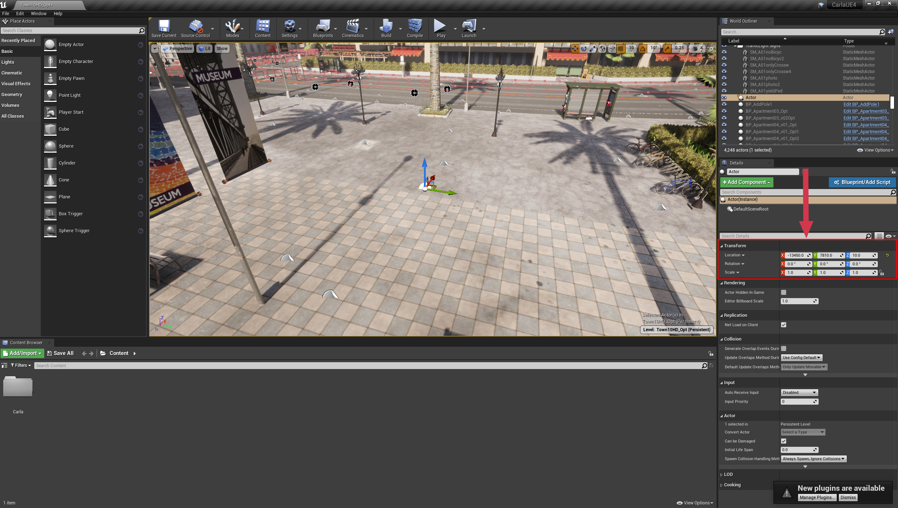

# API를 통한 보행자 뼈대 실측 정보 검색

자율주행 차량을 훈련시킬 때, 건물, 도로, 자동차뿐만 아니라 보도를 이용하고 도로를 건너는 보행자들도 인식하도록 하여 모든 도로 사용자의 안전을 보장하는 것이 필수적입니다. CARLA 시뮬레이터는 AI가 제어하는 보행자들을 제공하여 시뮬레이션과 훈련 데이터에 인간 형태를 채울 수 있습니다. 자율주행을 포함하여 인간의 자세 추정이 중요한 컴퓨터 비전 응용 프로그램이 많이 있으며, 이는 보안, 군중 통제, 다양한 로봇 응용 분야에서도 중요합니다.

CARLA의 API는 시뮬레이션에서 보행자의 실측 골격을 검색하는 기능을 제공합니다. 골격은 루트 노드(또는 정점)와 뼈대의 자세(또는 방향)를 정의하는 벡터를 가진 뼈대들의 집합으로 구성됩니다. 이러한 뼈대들은 시뮬레이션된 보행자의 사지와 신체의 움직임을 제어합니다. 개별 뼈대들을 모아서 가상 인간의 자세 모델을 구축할 수 있으며, 이는 신경망이 추정한 자세 모델과 비교하거나 자세 추정을 위한 신경망을 훈련시키는 데 사용할 수 있습니다.

이 튜토리얼에서는 맵에 보행자를 생성하고, 보행자를 움직이기 위한 AI 컨트롤러를 설정한 다음, 실측 골격을 검색하여 2D 카메라 캡처에 뼈대를 투영하는 단계를 살펴보겠습니다.

## 시뮬레이터 설정

먼저, 독립 실행 모드나 언리얼 에디터 내에서 표준 워크플로우에 따라 CARLA 시뮬레이터를 실행합니다. 수학과 플로팅에 사용할 여러 유틸리티 라이브러리를 임포트할 것입니다. 시뮬레이션을 더 잘 제어하기 위해 이 튜토리얼에서는 [__동기 모드__](adv_synchrony_timestep.md)를 사용할 것입니다. 이는 Python 클라이언트가 시뮬레이터의 시간 진행을 제어한다는 것을 의미합니다.

```py
import carla
import random
import numpy as np
import math
import queue
import cv2 #이미지를 조작하고 저장하기 위한 OpenCV

# 클라이언트에 연결하고 월드 객체 검색
client = carla.Client('localhost', 2000)
world = client.get_world()

# 동기 모드로 시뮬레이터 설정
settings = world.get_settings()
settings.synchronous_mode = True # 동기 모드 활성화
settings.fixed_delta_seconds = 0.05
world.apply_settings(settings)

# 우리가 하는 일을 볼 수 있도록 관전자도 설정할 것입니다
spectator = world.get_spectator()
```

## CARLA 시뮬레이터에서 보행자 생성

먼저, 시뮬레이션에 보행자를 생성하고자 합니다. 이는 `world.get_random_location_from_navigation()`를 사용하여 무작위 위치에 생성하거나, 언리얼 에디터에서 수집한 좌표를 사용하여 선택할 수 있습니다. 언리얼 에디터에서는 보행자를 생성하고 싶은 위치에 빈 액터를 추가한 다음, 오른쪽의 인스펙터를 사용하여 좌표를 조회합니다.



!!! 참고
    언리얼 에디터는 센티미터 단위로 작동하는 반면 CARLA는 미터 단위로 작동하므로 단위를 변환해야 합니다. CARLA 시뮬레이터에서 사용하기 전에 언리얼 에디터 좌표를 100으로 나누어야 합니다.

좌표를 선택했다면, 보행자를 생성할 수 있습니다. 또한 이미지를 수집하기 위한 카메라도 생성할 것입니다. 카메라로부터 데이터를 쉽게 접근할 수 있도록 [`Queue`](#https://docs.python.org/3/library/queue.html) 객체도 필요합니다(카메라 센서는 스크립트를 실행하는 주 Python 스레드와 별개의 자체 스레드에서 작동하기 때문입니다).

보행자를 보기 위해서는 카메라가 생성한 보행자를 향하도록 변환해야 합니다. 이를 위해 카메라를 중앙에 맞추는 데 필요한 이동과 회전을 계산하는 함수를 사용할 것입니다:

```py
def center_camera(ped, rot_offset=0):
    # 카메라를 보행자를 향하도록 회전하고 오프셋 적용
    trans = ped.get_transform()
    offset_radians = 2 * math.pi * rot_offset/360
    x = math.cos(offset_radians) * -2
    y = math.sin(offset_radians) * 2
    trans.location.x += x
    trans.location.y += y
    trans.location.z = 2
    trans.rotation.pitch = -16
    trans.rotation.roll = 0
    trans.rotation.yaw = -rot_offset
    spectator.set_transform(trans)
    return trans
```

이제 보행자, 카메라, 컨트롤러를 생성하고 우리가 한 일을 볼 수 있도록 관전자를 이동시키겠습니다:

```py
# 보행자 블루프린트를 가져와서 생성
pedestrian_bp = random.choice(world.get_blueprint_library().filter('*walker.pedestrian*'))
transform = carla.Transform(carla.Location(x=-134,y=78.1,z=1.18))
pedestrian = world.try_spawn_actor(pedestrian_bp, transform)

# RGB 카메라 생성
camera_bp = world.get_blueprint_library().find('sensor.camera.rgb')
camera = world.spawn_actor(camera_bp, transform)

# 센서 데이터를 저장하고 검색할 큐 생성
image_queue = queue.Queue()
camera.listen(image_queue.put)

world.tick()
image_queue.get()
# 타임스텝과 센서 데이터가 동기화되도록 world.tick()을 호출할 때마다
# image_queue.get()을 호출해야 합니다

# 이제 카메라가 보행자를 향하도록 회전시킵니다
camera.set_transform(center_camera(pedestrian))
# 결과를 보기 위해 관전자 이동
spectator.set_transform(camera.get_transform())

# 보행자를 위한 AI 컨트롤러 설정.... 아래 참조
controller_bp = world.get_blueprint_library().find('controller.ai.walker')
controller = world.spawn_actor(controller_bp, pedestrian.get_transform(), pedestrian)

# 컨트롤러를 시작하고 이동할 무작위 위치를 지정
controller.start()
controller.go_to_location(world.get_random_location_from_navigation())

# 보행자가 생성되도록 월드를 몇 프레임 진행
for frame in range(0,5):
    world.tick()
    trash = image_queue.get() 
```

## 맵 주변을 안내하는 AI 컨트롤러

이전 단계에서 다음 코드를 사용하여 보행자를 지능적으로 맵 주변으로 이동시키는 AI 컨트롤러도 초기화했습니다(반복할 필요 없음):

```py
controller_bp = world.get_blueprint_library().find('controller.ai.walker')
controller = world.spawn_actor(controller_bp, pedestrian.get_transform(), pedestrian)
controller.start()
controller.go_to_location(world.get_random_location_from_navigation())
```

이제 보행자는 시뮬레이션의 각 시간 증분(`world.tick()`)에 따라 자율적으로 이동할 것입니다.

## 카메라 기하학

이제 몇 가지 기하학적 계산을 수행해야 합니다. 먼저, 뼈대의 월드 좌표를 카메라 좌표로 변환하려면 카메라 변환의 역행렬을 사용합니다. 이는 좌표가 원점에 위치하고 x축 양의 방향을 향하는 카메라를 기준으로 변환된다는 것을 의미합니다.

```py
# 월드에서 카메라 좌표로 점을 변환하는 4x4 행렬 얻기
world_2_camera = np.array(camera.get_transform().get_inverse_matrix())
```

그런 다음, 출력 이미지에 오버레이하기 위해 3D 점들을 카메라의 2D 시야각(FOV)에 투영해야 하며, 이때 [__카메라 매트릭스__](#https://en.wikipedia.org/wiki/Camera_matrix) 또는 __투영 매트릭스__를 사용합니다. 다음 함수는 이 3D -> 2D 변환에 필요한 카메라 매트릭스를 생성합니다.

```py
def build_projection_matrix(w, h, fov):
    focal = w / (2.0 * np.tan(fov * np.pi / 360.0))
    K = np.identity(3)
    K[0, 0] = K[1, 1] = focal
    K[0, 2] = w / 2.0
    K[1, 2] = h / 2.0
    return K
```

## 골격 구축

이제 움직이는 부분들을 조합할 수 있습니다. 먼저, `pedestrian.get_bones()`를 사용하여 시뮬레이션에서 뼈대 좌표를 수집한 다음, 골격을 조합하여 카메라 센서의 2D 이미징 평면에 투영합니다. 뼈대들은 [__여기__](https://carla-assets.s3.us-east-005.backblazeb2.com/fbx/skeleton.txt)에서 다운로드할 수 있는 __skeleton.txt__에 정의된 쌍들을 사용하여 완전한 골격으로 연결됩니다.

__skeleton.txt__에 정의된 뼈대 쌍들을 반복하고 뼈대 좌표를 카메라 센서 이미지에 오버레이할 수 있는 선으로 연결하는 함수가 필요합니다.

```py
def get_image_point(bone_trans):
        # 뼈대 좌표의 2D 투영 계산
        
        # 뼈대 루트의 월드 위치 가져오기
        loc = bone_trans.world.location
        bone = np.array([loc.x, loc.y, loc.z, 1])
        # 카메라 좌표로 변환
        point_camera = np.dot(world_2_camera, bone)

        # 이제 UE4의 좌표계를 "표준" 좌표계로 변경해야 합니다
        # (x, y ,z) -> (y, -z, x)
        # 그리고 네 번째 구성요소도 제거합니다
        point_camera = [point_camera[1], -point_camera[2], point_camera[0]]

        # 이제 카메라 매트릭스를 사용하여 3D->2D 투영
        point_img = np.dot(K, point_camera)
        # 정규화
        point_img[0] /= point_img[2]
        point_img[1] /= point_img[2]

        return point_img[0:2]
    
def build_skeleton(ped, sk_links, K):
    ######## 보행자 골격 가져오기 #########
    bones = ped.get_bones()

    # 카메라 출력에 투영할 선들을 저장할 리스트
    lines = []

    # skeleton.txt의 뼈대 쌍들을 순회하며 관절 위치 검색
    for link in sk_links[1:]:
        # 연결할 두 뼈대의 루트 가져오기
        bone_transform_1 = next(filter(lambda b: b.name == link[0], bones.bone_transforms), None)
        bone_transform_2 = next(filter(lambda b: b.name == link[1], bones.bone_transforms), None)
        # 일부 뼈대 이름은 매칭되지 않음
        if bone_transform_1 is not None and bone_transform_2 is not None:
           
            # 3D 뼈대 좌표의 2D 투영 계산
            point_image = get_image_point(bone_transform_1)
    
            # 선의 시작점을 lines 리스트에 추가
            lines.append([point_image[0], point_image[1], 0, 0])
            
            # 3D 뼈대 좌표의 2D 투영 계산
            point_image = get_image_point(bone_transform_2)
            
            # 선의 끝점을 lines 리스트에 추가
            lines[-1][2] = point_image[0]
            lines[-1][3] = point_image[1]
            
    return lines
```

다음으로, __skeleton.txt__에서 뼈대 쌍들을 읽어보겠습니다:

```py
skeleton_links = []
with open('skeleton.txt') as f:
    while True:
        line = f.readline()
        if not line:
            break
        stripped = list(map(str.strip, line.strip().split(',')))
        skeleton_links.append(stripped)

world.tick()
trash = image_queue.get()
```

이제 몇 프레임을 반복하면서 각 프레임에서 골격을 구축하고 카메라 센서 출력에 골격을 투영할 수 있습니다. OpenCV를 사용하여 센서 출력에 골격을 그리고 이미지를 저장합니다:

!!! 참고
    작업 디렉토리에 __out/__ 폴더를 만들어 이미지를 저장할 수 있도록 하세요

```py
for frame in range(0,360):
    
    # 보행자 주위로 카메라 이동
    camera.set_transform(center_camera(pedestrian, frame + 200))
    
    # 프레임을 진행하고 이미지 검색
    world.tick()
    # 큐에서 프레임 검색
    image = image_queue.get()
    
    # 월드에서 카메라 좌표로 점을 변환하는 4x4 행렬 가져오기
    world_2_camera = np.array(camera.get_transform().get_inverse_matrix())

    # 카메라에서 몇 가지 속성 가져오기
    image_w = camera_bp.get_attribute("image_size_x").as_int()
    image_h = camera_bp.get_attribute("image_size_y").as_int()
    fov = camera_bp.get_attribute("fov").as_float()

    # 3D -> 2D 투영을 위한 카메라 매트릭스 계산
    K = build_projection_matrix(image_w, image_h, fov)
    
    # 골격을 표시할 선 목록 구축
    lines = build_skeleton(pedestrian, skeleton_links, K)

    # 데이터를 2D RGBA 배열로 재구성
    img = np.reshape(np.copy(image.raw_data), (image.height, image.width, 4)) 

    # OpenCV를 사용하여 이미지에 선 그리기
    for line in lines:
        l = [int(x) for x in line]
        cv2.line(img, (l[0],l[1]), (l[2],l[3]), (255,0,0, 255), 2)
    
    # 이미지 저장
    cv2.imwrite('out/skeleton%04d.png' % frame, img)
```

__out/__ 폴더에 이제 카메라 센서 출력에 골격이 오버레이된 프레임 시퀀스가 있어야 합니다. 다음 애니메이션은 프레임들을 비디오로 결합하여 재구성할 수 있습니다:


## 요약

이 튜토리얼에서는 AI 컨트롤러가 있는 보행자를 생성하고, 보행자 뼈대의 3D 좌표 실측값을 검색하여 카메라 센서가 캡처한 2D 이미지에 이러한 뼈대를 투영하는 방법을 배웠습니다. 이 튜토리얼에서 배운 기술을 사용하여 CARLA 시뮬레이터를 사용하여 인간 자세 추정 프레임워크의 훈련 및 검증을 설정할 수 있습니다.