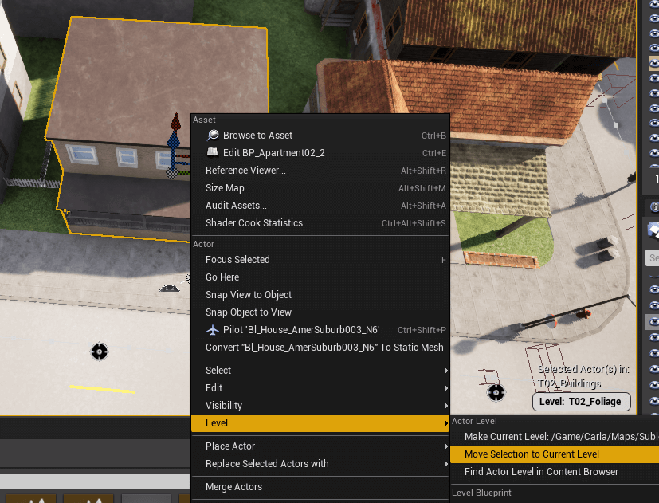
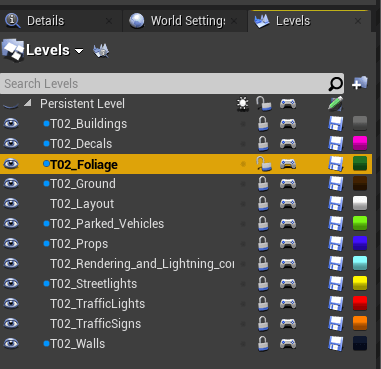

# 맵 커스터마이즈: 레이어드 맵

사용자 정의 맵에서 레벨을 활용하면 여러 사람이 동시에 하나의 맵에서 작업할 수 있습니다. 또한 [레이어드 CARLA 맵](core_map.md#layered-maps)처럼 시뮬레이션 중에 Python API를 사용하여 맵의 레이어를 로드하고 언로드할 수 있습니다.

이 가이드에서는 새로운 레벨을 추가하는 방법, 레벨에 에셋을 추가하는 방법, 그리고 레벨을 항상 로드되도록 또는 그렇지 않도록 구성하는 방법을 설명합니다.

- [__새 레벨 추가하기__](#add-a-new-level)
- [__레벨에 에셋 추가하기__](#add-assets-to-a-level)
- [__레벨 로딩 옵션 구성하기__](#configure-level-loading-options)
- [__다음 단계__](#next-steps)

---

## 새 레벨 추가하기

맵의 모든 새로운 레벨은 _영구 레벨(Persistent Level)_이라고 하는 상위 레벨 내에 중첩됩니다. 새 레벨을 만들려면:

__1. 레벨 패널 열기__

1. 언리얼 엔진 에디터에서 메뉴 바의 _Window_를 엽니다.
2. _Levels_를 클릭합니다.

__2. 새 레벨 만들기__

1. _Levels_ 패널에서 _Levels_를 클릭하고 _Create New..._를 선택합니다.
2. _Empty Level_을 선택합니다.
3. `Content/Carla/Maps/Sublevels/<map_name>/`에 레벨을 저장합니다. CARLA Python API와 통합하려면 `<map_name>_<layer_name>` 형식의 이름 규칙을 사용하세요(예: `TutorialMap_Buildings`). 사용 가능한 레이어 목록은 [여기](core_map.md#carla-maps)에서 확인할 수 있습니다.

>>>>>>

---

## 레벨에 에셋 추가하기

__1. 에셋을 추가할 레벨 선택하기__

_Levels_ 패널에서 에셋을 추가하고 싶은 레벨을 더블클릭합니다. 잠금 아이콘을 토글하여 레벨이 잠금 해제되어 있는지 확인하세요.

__2. 추가할 에셋 선택하기__

1. 레벨에 추가하고 싶은 모든 에셋을 선택합니다.
2. 우클릭하고 **Level**로 이동합니다.
3. **Move Selection to Current Level**을 클릭합니다.

__3. 레벨 저장하기__

레벨에 저장할 변경사항이 있으면 _Levels_ 패널에서 해당 레벨 옆에 연필 아이콘이 표시됩니다. 이를 클릭하여 변경사항을 저장하세요.

---

## 레벨 로딩 옵션 구성하기

레벨은 토글 가능하거나 항상 로드되도록 구성할 수 있습니다. 레벨을 각 옵션으로 구성하려면:

1. _Levels_ 패널에서 레벨을 우클릭하고 **Change Streaming Method**로 이동합니다.
2. 원하는 설정을 선택합니다:
    1. _Always Loaded_: Python API를 통해 레벨을 토글할 수 __없습니다__.
    2. _Blueprint_: Python API를 통해 레벨을 토글할 수 __있습니다__. 레벨 이름 옆에 파란 점이 나타납니다.

설정에 관계없이 에디터에서는 눈 아이콘을 눌러 레벨을 토글할 수 있습니다.

>>>>>>

---

## 다음 단계

아래의 도구와 가이드를 사용하여 맵 커스터마이즈를 계속하세요:

- [신호등과 표지판 추가 및 설정하기](tuto_M_custom_add_tl.md)
- [절차적 건물 도구로 건물 추가하기](tuto_M_custom_buildings.md)
- [도로 페인터 도구로 도로 커스터마이즈하기](tuto_M_custom_road_painter.md)
- [날씨 커스터마이즈하기](tuto_M_custom_weather_landscape.md#weather-customization)
- [연속 메시로 지형 커스터마이즈하기](tuto_M_custom_weather_landscape.md#add-serial-meshes)

커스터마이즈가 완료되면 [보행자 내비게이션 정보를 생성](tuto_M_generate_pedestrian_navigation.md)할 수 있습니다.

---

과정에 대해 궁금한 점이 있다면 [포럼](https://github.com/carla-simulator/carla/discussions)에서 질문할 수 있습니다.

<a href="https://github.com/carla-simulator/carla/discussions" target="_blank" class="btn btn-neutral" title="CARLA 포럼으로 이동">
CARLA 포럼</a>

