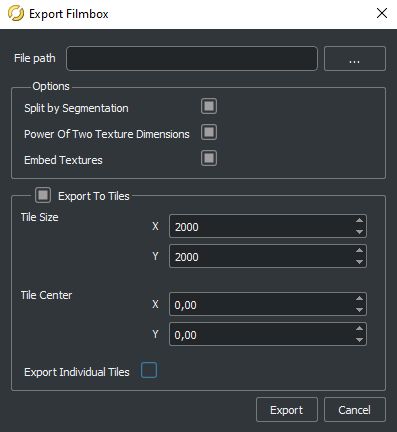

# RoadRunner에서 맵 생성하기

RoadRunner는 CARLA에 가져올 맵을 만드는 데 권장되는 소프트웨어입니다. 이 가이드는 RoadRunner가 무엇인지, 맵을 만들 때 고려해야 할 사항, 그리고 CARLA로 가져오기 위한 사용자 정의 맵을 내보내는 방법을 설명합니다.

- [__RoadRunner 소개__](#introduction-to-roadrunner)
- [__시작하기 전에__](#before-you-start)
- [__RoadRunner에서 맵 만들기__](#build-a-map-in-roadrunner)
- [__RoadRunner에서 맵 내보내기__](#export-a-map-in-roadrunner)
- [__다음 단계__](#next-steps)
---
## RoadRunner 소개

RoadRunner는 자동 주행 시스템을 시뮬레이션하고 테스트하기 위한 3D 장면을 설계할 수 있는 대화형 에디터입니다. 도로 레이아웃과 함께 OpenDRIVE 및 지오메트리 정보를 만드는 데 사용할 수 있습니다. RoadRunner에 대해 자세히 알아보려면 [여기][rr_home]를 참조하세요.

RoadRunner는 MATLAB Campus-Wide License의 일부이므로 많은 대학에서 무제한 학술 접근을 제공할 수 있습니다. 대학이 접근 권한이 있는지 [확인][rr_eligibility]하세요. 접근성에 관한 질문이나 문제가 있으면 *automated-driving@mathworks.com*으로 문의하세요. [평가판][rr_trial_version]도 사용할 수 있습니다.

CARLA Leaderboard에 참가하는 모든 사람에게도 RoadRunner 라이선스가 제공됩니다. 자세한 내용은 [여기][rr_leaderboard]를 클릭하세요.

[rr_home]: https://www.mathworks.com/products/roadrunner.html
[rr_trial_version]: https://www.mathworks.com/products/roadrunner.html
[rr_eligibility]: https://www.mathworks.com/academia/tah-support-program/eligibility.html
[rr_leaderboard]: https://www.mathworks.com/academia/student-competitions/carla-autonomous-driving-challenge.html

---
## 시작하기 전에

RoadRunner를 설치해야 합니다. Mathworks 웹사이트의 [설치 가이드][rr_docs]를 따를 수 있습니다.

[rr_docs]: https://www.mathworks.com/help/roadrunner/ug/install-and-activate-roadrunner.html

---

## RoadRunner에서 맵 만들기

RoadRunner에서 맵을 만드는 구체적인 방법은 이 가이드의 범위를 벗어나지만, [MathWorks 웹사이트][rr_intro_tutorials]에서 입문 튜토리얼 시리즈를 이용할 수 있으며, [RoadRunner 문서][rr_tutorials]에서 특정 작업에 대한 비디오 튜토리얼을 이용할 수 있습니다.

__프롭이 많은 맵은 가져오기 과정을 크게 늦출 수 있다는 점을 명심하세요.__ 이는 언리얼 엔진이 모든 메시를 언리얼 에셋으로 변환해야 하기 때문입니다. 맵을 CARLA 소스 빌드 버전으로 가져올 계획이라면, RoadRunner에서는 도로 레이아웃만 만들고 커스터마이즈는 맵을 언리얼 엔진으로 가져온 후에 하는 것을 강력히 권장합니다. CARLA는 커스터마이즈 과정을 단순화하기 위해 언리얼 엔진 에디터에서 사용할 수 있는 여러 도구를 제공합니다.

---

## RoadRunner에서 맵 내보내기

[rr_tutorials]: https://www.mathworks.com/support/search.html?fq=asset_type_name:video%20category:roadrunner/index&page=1&s_tid=CRUX_topnav
[rr_intro_tutorials]: https://www.mathworks.com/solutions/automated-driving/roadrunner-tutorial.html

아래는 RoadRunner에서 사용자 정의 맵을 내보내는 기본 가이드라인입니다. CARLA로 내보내는 방법에 대한 자세한 정보는 [MathWorks 문서][exportlink]에서 찾을 수 있습니다.

[exportlink]: https://www.mathworks.com/help/roadrunner/ug/Exporting-to-CARLA.html

RoadRunner에서 맵을 만들고 나면 내보낼 수 있습니다. __도로 레이아웃은 내보낸 후에는 수정할 수 없다는 점__을 알아두세요. 내보내기 전에 다음을 확인하세요:

- 맵이 언리얼 엔진에서 올바르게 시각화될 수 있도록 (0,0)에 중심이 맞춰져 있는지
- 맵 정의가 올바른지
- 연결과 지오메트리에 특히 주의를 기울여 맵 유효성 검사가 올바른지

>>>>

맵이 준비되면 `OpenDRIVE Preview Tool` 버튼을 클릭하여 OpenDRIVE 도로 네트워크를 시각화하고 마지막으로 한 번 더 모든 것을 확인하세요.

>>>>

!!! 참고
    _OpenDrive Preview Tool_은 맵의 무결성을 테스트하기 쉽게 만듭니다. 교차로에 오류가 있다면 `Maneuver Tool`을 클릭하고 `Rebuild Maneuver Roads`를 클릭하세요.

내보낼 준비가 되었다면:

__1.__ CARLA 옵션을 사용하여 장면을 내보내세요:

  - 메인 툴바에서 `File` -> `Export` -> `CARLA (.fbx, .xodr, .rrdata.xml)` 선택

__2.__ 팝업 창에서:

>- 다음 옵션들을 체크하세요:
    - _Split by Segmentation_: 시맨틱 세그멘테이션으로 메시를 나눕니다.
    - _Power of Two Texture Dimensions_: 성능을 향상시킵니다.
    - _Embed Textures_: 텍스처가 메시에 내장되도록 합니다.
    - _Export to Tiles_: 타일의 크기를 선택하거나 체크 해제하여 한 조각만 사용합니다.

>- 체크 해제하세요:
    - _Export Individual Tiles_: 모든 맵 조각이 포함된 하나의 `.fbx` 파일을 생성합니다.

>>>>

__3.__ 파일을 내보낼 디렉토리를 선택하고 `Export`를 클릭하세요. 이렇게 하면 `<맵이름>.fbx`와 `<맵이름>.xodr` 파일을 포함한 여러 파일이 생성됩니다.

!!! 경고
    `.xodr`과 `.fbx` 파일의 이름이 같은지 확인하세요.

---

## 다음 단계

이제 맵을 CARLA로 가져올 준비가 되었습니다. 다음 단계는 사용 중인 CARLA 설치 유형에 따라 달라집니다:

* __CARLA 소스 빌드 사용자__는 [__여기__](tuto_M_add_map_source.md)의 가이드를 따르세요.
* __CARLA 패키지(바이너리) 버전 사용자__는 [__여기__](tuto_M_add_map_package.md)의 가이드를 따르세요.

---

과정에 대해 궁금한 점이 있다면 [포럼](https://github.com/carla-simulator/carla/discussions)에서 질문할 수 있습니다.

<a href="https://github.com/carla-simulator/carla/discussions" target="_blank" class="btn btn-neutral" title="CARLA 포럼으로 이동">
CARLA 포럼</a>

