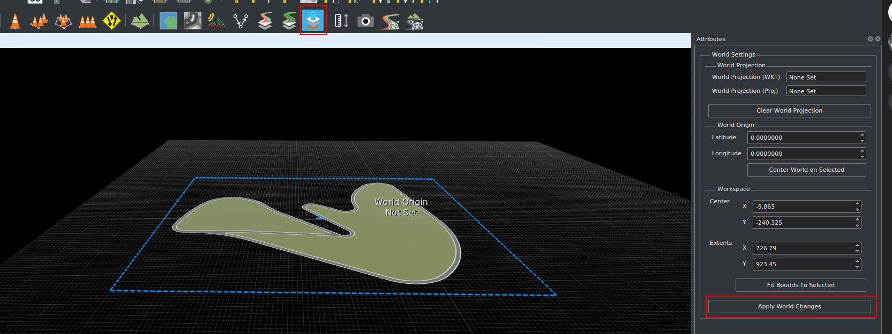

# Create a Large Map in RoadRunner

RoadRunner is the recommended software to create large maps to be imported into CARLA. This guide outlines what RoadRunner is, things to consider when building the large map and how to export custom large maps ready for importing into CARLA. 

- [__Introduction to RoadRunner__](#introduction-to-roadrunner)
- [__Before you start__](#before-you-start)
- [__Build a large map in RoadRunner__](#build-a-large-map-in-roadrunner)
- [__Export a large map in RoadRunner__](#export-a-large-map-in-roadrunner)
- [__Next steps__](#next-steps)
---
## Introduction to RoadRunner

RoadRunner is an interactive editor that lets you design 3D scenes for simulating and testing automated driving systems. It can be used to create road layouts and accompanying OpenDRIVE and geometry information. Find out more about RoadRunner [here][rr_home].

RoadRunner is part of the MATLAB Campus-Wide Licenses, so many universities can provide unlimited academic access. [Check][rr_eligibility] if your university has access. Reach out to *automated-driving@mathworks.com* for any questions or troubles regarding accessibility. There is also a [trial version][rr_trial_version] available.

A license for RoadRunner is also available to everyone participating in the CARLA Leaderboard. Click [here][rr_leaderboard] for more information.

[rr_home]: https://www.mathworks.com/products/roadrunner.html
[rr_trial_version]: https://www.mathworks.com/products/roadrunner.html
[rr_eligibility]: https://www.mathworks.com/academia/tah-support-program/eligibility.html
[rr_leaderboard]: https://www.mathworks.com/academia/student-competitions/carla-autonomous-driving-challenge.html

---
## Before you start 

You will need to install RoadRunner. You can follow the [installation guide][rr_docs] at the Mathworks website.   

[rr_docs]: https://www.mathworks.com/help/roadrunner/ug/install-and-activate-roadrunner.html

---

## Build a large map in RoadRunner

The specifics of how to build a large map in RoadRunner go beyond the scope of this guide, however, there are video tutorials available in the [RoadRunner documentation][rr_tutorials].

If you are building a large map with elevation, the recommended largest size of the map is 20km by 20km. Maps larger than this may cause RoadRunner to crash on export.

[rr_tutorials]: https://www.mathworks.com/support/search.html?fq=asset_type_name:video%20category:roadrunner/index&page=1&s_tid=CRUX_topnav

---

## Export a large map in RoadRunner

Below is a basic guideline to export your custom large map from RoadRunner.

[exportlink]: https://www.mathworks.com/help/roadrunner/ug/Exporting-to-CARLA.html

Once you have made your map in RoadRunner you will be able to export it. Be aware that __the road layout cannot be modified after it has been exported.__ Before exporting, ensure that:

- The map is centered at (0,0) to ensure the map can be visualized correctly in Unreal Engine.
- The map definition is correct.
- The map validation is correct, paying close attention to connections and geometries.

>>>>

Once the map is ready, click on the `OpenDRIVE Preview Tool` button to visualize the OpenDRIVE road network and give everything one last check.

>>>>

!!! note
    _OpenDrive Preview Tool_ makes it easier to test the integrity of the map. If there are any errors with junctions, click on `Maneuver Tool`, and `Rebuild Maneuver Roads`.

Make sure the full map is selected for export by clicking on the [_World settings tool_](https://www.mathworks.com/help/roadrunner/ref/worldsettingstool.html) and dragging the edges of the blue boundary box to encompass the full area you would like to export. when it's ready, click on _Apply World Changes_.

When you are ready to export:

__1.__ Export the `.fbx`:

  - In the main toolbar, select `File` -> `Export` -> `Firebox (.fbx)`

__2.__ In the window that pops up:

>- Check the following options:
    - _Split by Segmentation_: Divides the mesh by semantic segmentation and imroves pedestrian navigation.
    - _Power of Two Texture Dimensions_: Improves performance.
    - _Embed Textures_: Ensures textures are embedded in the mesh.
    - _Export to Tiles_: Choose the size of the tiles. The maximum size that can be used by CARLA is 2000 x 2000.
    - _Export Individual Tiles_: Generates the individual tiles needed for streaming large maps in CARLA.

>>>>>>

__3.__ Export the `.xodr`:

  - In the main toolbar, select `File` -> `Export` -> `OpendDRIVE (.xodr)`

!!! Warning
    Make sure that the `.xodr` and the `.fbx` files have the same name.

---

## Next steps

You are now ready to import your map into CARLA. See the [__Import a Large Map__](large_map_import.md) guide for more details.

---

If you have any questions about the process, then you can ask in the [forum](https://github.com/carla-simulator/carla/discussions).

<a href="https://github.com/carla-simulator/carla/discussions" target="_blank" class="btn btn-neutral" title="Go to the CARLA forum">
CARLA forum</a>

