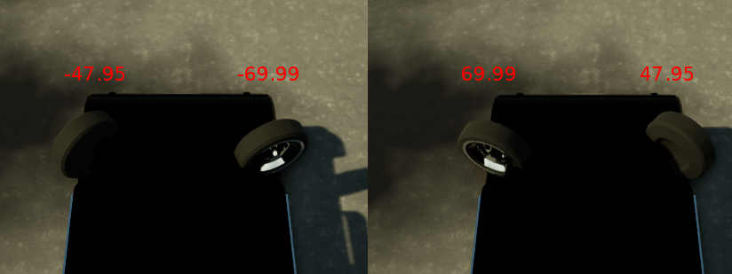
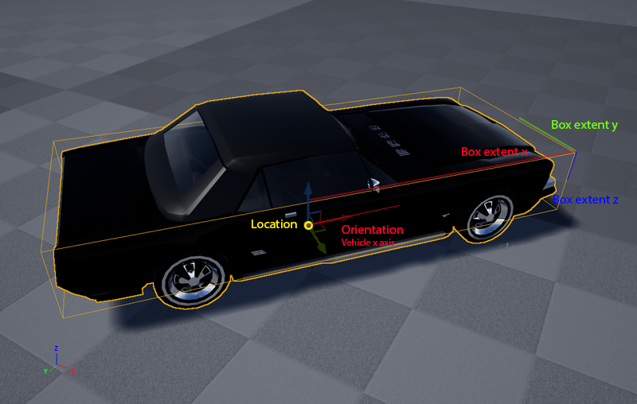

Measurements
============

!!! important
    Since version 0.8.0 the measurements received by the client are in SI
    units. All locations have been converted to `meters` and speeds to
    `meters/second`.

Every frame the server sends a package with the measurements and images gathered
to the client. This document describes the details of these measurements.

Time-stamps
-----------

Since CARLA can be run at fixed-frame rate, we keep track of two different
time-stamps.

Key                        | Type      | Units        | Description
-------------------------- | --------- | ------------ | ------------
platform_timestamp         | uint32    | milliseconds | Time-stamp of the current frame, as given by the OS.
game_timestamp             | uint32    | milliseconds | In-game time-stamp, elapsed since the beginning of the current level.

In real-time mode, the elapsed time between two time steps should be similar
both platform and game time-stamps. When run in fixed-time step, the game
time-stamp increments in constant time steps (delta=1/FPS) while the platform
time-stamp keeps the actual time elapsed.

Player measurements
-------------------

Key                        | Type      | Units  | Description
-------------------------- | --------- | ------ | ------------
transform                  | Transform |        | World transform of the player (contains a locations and a rotation).
acceleration               | Vector3D  | m/s^2  | Current acceleration of the player.
forward_speed              | float     | m/s    | Forward speed of the player.
collision_vehicles         | float     | kg*m/s | Collision intensity with other vehicles.
collision_pedestrians      | float     | kg*m/s | Collision intensity with pedestrians.
collision_other            | float     | kg*m/s | General collision intensity (everything else but pedestrians and vehicles).
intersection_otherlane     | float     |        | Percentage of the car invading other lanes.
intersection_offroad       | float     |        | Percentage of the car off-road.
autopilot_control          | Control   |        | Vehicle's autopilot control that would apply this frame.

###### Transform

The transform contains the location and rotation of the player.

Key                        | Type       | Units   | Description
-------------------------- | ---------- | ------- | ------------
location                   | Vector3D   | m       | World location.
orientation *[deprecated]* | Vector3D   |         | Orientation in Cartesian coordinates.
rotation                   | Rotation3D | degrees | Pitch, roll, and yaw.

###### Collision

Collision variables keep an accumulation of all the collisions occurred during
this episode. Every collision contributes proportionally to the intensity of the
collision (norm of the normal impulse between the two colliding objects).

Three different counts are kept (pedestrians, vehicles, and other). Colliding
objects are classified based on their tag (same as for semantic segmentation).

!!! Bug
    See [#13 Collisions are not annotated when vehicle's speed is low](https://github.com/carla-simulator/carla/issues/13)

Collisions are not annotated if the vehicle is not moving (<1km/h) to avoid
annotating undesired collision due to mistakes in the AI of non-player agents.

###### Lane/off-road intersection

The lane intersection measures the percentage of the vehicle invading the
opposite lane. The off-road intersection measures the percentage of the vehicle
outside the road.

These values are computed intersecting the bounding box of the vehicle (as a 2D
rectangle) against the map image of the city. These images are generated in the
editor and serialized for runtime use. You can find them too in the release
package under the folder "RoadMaps".

###### Autopilot control

The `autopilot_control` measurement contains the control values that the in-game
autopilot system would apply as if it were controlling the vehicle.

This is the same structure used to send the vehicle control to the server.

Key                        | Type      | Description
-------------------------- | --------- | ------------
steer                      | float     | Steering angle between [-1.0, 1.0] (*)
throttle                   | float     | Throttle input between [ 0.0, 1.0]
brake                      | float     | Brake input between [ 0.0, 1.0]
hand_brake                 | bool      | Whether the hand-brake is engaged
reverse                    | bool      | Whether the vehicle is in reverse gear

To activate the autopilot from the client, send this `autopilot_control` back
to the server. Note that you can modify it before sending it back.

```py
measurements, sensor_data = carla_client.read_data()
control = measurements.player_measurements.autopilot_control
# modify here control if wanted.
carla_client.send_control(control)
```

(*) The actual steering angle depends on the vehicle used. The default Mustang
has a maximum steering angle of 70 degrees (this can be checked in the vehicle's
front wheel blueprint).



Non-player agents info
----------------------

To receive info of every non-player agent in the scene every frame you need to
activate this option in the settings file sent by the client at the beginning of
the episode.

```ini
[CARLA/Server]
SendNonPlayerAgentsInfo=true
```

If enabled, the server attaches a list of agents to the measurements package
every frame. Each of these agents has an unique id that identifies it, and
belongs to one of the following classes

  * **Vehicle** Contains its transform, box-extent, and forward speed.
  * **Pedestrian** Contains its transform, box-extent, and forward speed. (*)
  * **Traffic light** Contains its transform and state (green, yellow, red).
  * **Speed-limit sign** Contains its transform and speed-limit.

(*) At this point every pedestrian is assumed to have the same bounding-box
size.

###### Transform and bounding box

The transform defines the location and orientation of the agent. The bounding
box is assumed to be centered at the agent's location. The box extent gives the
radii dimensions of the bounding box of the agent.



!!! important
    As seen in the picture, the Z coordinate of the box is not fitted to
    vehicle's height.
