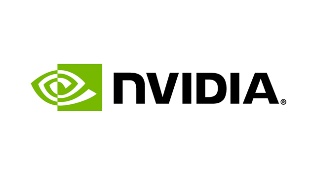

# NVIDIA CARLA Ecosystem

NVIDIA is a multinational technology company and supplier of high-performance GPUs and is a leading developer of artificial intelligence. NVIDIA sponsors the development of the CARLA simulator and supports its advancement through technology contributions useful to the AV simulation community. 

The following sections outline various NVIDIA technologies that have been integrated into CARLA.

# SimReady

SimReady is a 3D standard specification for information and metadata attached to 3D assets intended to be used in simulation. The SimReady standard ensures that a 3D asset is not only a high fidelity visual resource in a digital twin, but also has a well-organized metadata structure to include semantic labelling, dense captions, non-visual sensor information and physical properties. Please refer to the [SimReady documentation](ecosys_simready.md) for details about using SimReady assets in CARLA.

# Neural rendering

NVIDIA's neural rendering technology enables a rich 3D representation of an environment to be learned by neural networks from a sequence of sensor data captured in the real world (such as a sequence of 2D camera images or LIDAR data). Variations and randomizations can then be applied in the 3D representation, such as perturbing the trajectory or adjusting the sensor configuration before re-simulation. This facilitates the generation of a diverse range of perturbations of a scenario using only one sequence of recorded sensor data. Neural rendering is a powerful tool to diversify training data or testing scenarios. Please refer to the [Neural Rendering documentation](nvidia-nurec.md) for details on how to install and use the tool.  

