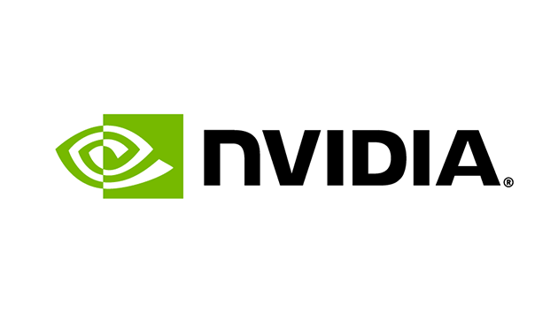

# NVIDIA CARLA Ecosystem

NVIDIA is a multinational technology company and supplier of high-performance GPUs and is a leading developer of artificial intelligence. NVIDIA sponsors the development of the CARLA simulator and supports its advancement through technology contributions useful to the AV simulation community.

The following sections outline the NVIDIA technologies that have been integrated into CARLA UE5.

# [Alpamayo 2 Super](nvidia_alpamayo.md)

The NVIDIA Alpamayo 2 Super example provides closed-loop vision-language-action driving in CARLA. It captures the model's seven-camera input and ego-motion history, displays the predicted trajectory and Chain of Causation reasoning, and tracks the prediction with CARLA vehicle controls. The example attaches to an existing map and preserves traffic initialized by other scripts. Start with the [Alpamayo 2 Super user guide](nvidia_alpamayo.md), then see [architecture and control](nvidia_alpamayo_architecture.md) or [troubleshooting](nvidia_alpamayo_troubleshooting.md) as needed.

# [Neural reconstruction](nvidia_nurec.md)

NVIDIA's neural reconstruction technology (NuRec) enables a rich 3D representation of an environment to be learned by neural networks from a sequence of sensor data captured in the real world (such as a sequence of 2D camera images or LIDAR data). Variations and randomizations can then be applied in the 3D representation, such as perturbing the trajectory, adjusting the sensor configuration or swapping and inserting rendered assets before re-simulation. This facilitates the generation of a diverse range of perturbations of a scenario using only one sequence of recorded sensor data. Neural reconstruction is a powerful tool to diversify training data or testing scenarios. CARLA UE5 integrates NuRec through NVIDIA's Neural Reconstruction Engine (NRE) container and its gRPC API. Please refer to the [Neural reconstruction documentation](nvidia_nurec.md) for details on how to install and use the tool.

# DLSS

NVIDIA's Deep Learning Super Sampling (DLSS) is integrated into the CARLA simulator itself:

*   __DLSS Ray Reconstruction__ denoises the path-traced frames of the [ray-traced lens camera](ref_sensors.md#ray-traced-lens-camera) (`sensor.camera.rt_lens`), enabling real-time path tracing with physically exact lens distortion at low sample counts.
*   __DLSS Super Resolution__ can upscale any camera sensor: the camera renders internally at a fraction of its output resolution and DLSS reconstructs the full-size image, reducing the GPU cost of large multi-camera rigs.

Please refer to the [rendering options documentation](adv_rendering_options.md#nvidia-dlss) for details.
