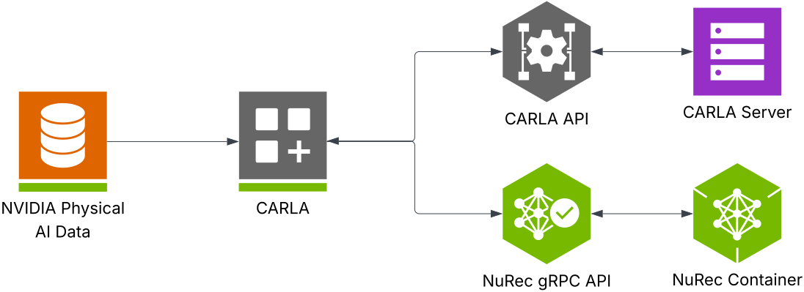

# Use NVIDIA Neural Reconstruction with CARLA

NVIDIA Neural Reconstruction (NuRec) refers to the reconstruction and rendering models and services from NVIDIA that support the seamless ingestion of real-world
data converted to a simulated environment suitable for training and testing Physical AI Agents, including robotics and autononomous driving systems.

With NuRec, developers can convert recorded camera and LIDAR data into 3D scenes. NuRec uses multiple AI networks to create
interactive 3D test environments where developers can modify the scene and see how the world reacts. Developers can change scenarios,
add synthetic objects, and apply randomizations — such as a child following a bouncing ball into the road — making the initial scenarios
even more challenging. With the NuRec gRPC API, developers can bring rendering services directly to their simulation platform of choice, for example, CARLA.

The NuRec gRPC API serves as a conduit of data and rendering between the CARLA replay and the NuRec container, where the scenes are reconstructed and rendered. You can load pre-trained scenes from the NVIDIA Physical AI Dataset for Autonomous Vehicles and define your scenes using the NuRec gRPC API in a python script (`replay_recording.py`). The diagram below further illustrates the relationship between NuRec and CARLA. 



When you run the replay script, CARLA loads the map and actors from the CARLA Server through the CARLA API. Rendering requests in the script return frames from the NuRec container through the NuRec gRPC API. Both APIs serve as a convenient interface to the CARLA and NuRec servers to deliver seamless updates to your simulation.

To use neural rendering in your CARLA simulations, use the NVIDIA Neural Reconstruction API and data from the NVIDIA Physical AI Dataset. Follow the instructions in this guide.

## Before you Begin

Before you get started, make sure you have satisifed the following prerequisites:

- Ubuntu 22.04
- [CARLA 0.9.16 or newer package installed](https://carla.readthedocs.io/en/latest/download/) (use the Nightly Build before the 0.9.16 release)
- [CUDA 12.8 or higher](https://developer.nvidia.com/cuda-downloads)
- Python 3.10+

## Setup

To get started with the sample dataset from NVIDIA, use the installer script. If you'd rather customize your dataset, follow the instructions to get the assets from HuggingFace and set up your environment manually.

The install script will attempt to install the following Ubuntu dependencies. To avoid installation problems, we recommend installing these dependencie before running the NuRec install. 

**Docker**: The NuRec tool uses Docker images, therefore you need Docker installed on your system. The following packages are recommended:

* docker-ce
* docker-ce-cli
* containered.io
* docker-buildx-plugin
* docker-compose-plugin

We recommend to pre-install these Docker requirements with the following commands. Add the Docker repository and install Docker with `apt-get`:

```sh
sudo install -m 0755 -d /etc/apt/keyrings
curl -fsSL https://download.docker.com/linux/ubuntu/gpg | sudo gpg \
--dearmor -o /etc/apt/keyrings/docker.gpg
sudo chmod a+r /etc/apt/keyrings/docker.gpg

sudo apt-get update
sudo apt-get install -y docker-ce docker-ce-cli \
containerd.io docker-buildx-plugin docker-compose-plugin
```

You may need to add your user to the Docker group and then log out and back in order for Docker to function properly. Try the following command to test your Docker installation:

```sh
docker run hello-world
```

If this command produces an error, run the following command:

```sh
sudo usermod -aG docker $USER
```

Then logout and log back in again or reboot. 

**NVIDIA container toolkit**: The NuRec tool renders the neurally reconstructed scenes from within a running Docker container. The NVIDIA container toolkit is required to allow a Docker container to directly connect to the GPU hardware. Follow [these instructions](https://docs.nvidia.com/datacenter/cloud-native/container-toolkit/latest/install-guide.html) to install the container toolkit.

**Create a virtual environment**: To avoid conflicts between different Python or library versions, we recommend using a virtual environment to complete the installation. Run the following commands in the terminal to set up a virtual environment:

```sh
sudo apt install python3.10-venv
python3 -m venv vecarla
source vecarla/bin/activate # Activate the venv
```

Remember to activate the virtual environment in each new terminal session you open. 

### Use the Installer Script

To get started quickly and easily with the curated sample set from the [NVIDIA PhysicalAI-Autonomous-Vehicles-NuRec dataset](https://huggingface.co/datasets/nvidia/PhysicalAI-Autonomous-Vehicles-NuRec), navigate to the CARLA root directory on your machine and run the following launch script:

```bash
cd <CARLA_ROOT>
./PythonAPI/examples/nvidia/nurec/install_nurec.sh
```

The script helps you set your HuggingFace access token (if there isn't one already), sets the required environment variables for the NuRec container, pulls the curated sample dataset from HuggingFace, and installs the required Python packages.

The script will install the following Python packages:

* pygame
* numpy
* scipy
* grpc
* carla
* nvidia-nvimgcodec-cu12

!!! note
    You may need to log your Linux user out and log back in again in order for the NuRec tool to work after installation. 

### Use a Custom Dataset

If you'd rather customize the datasets you use, follow the instructions below to get the assets, launch the NuRec container, and install the required Python packages. 

1. **Get the pre-trained assets** from the [NVIDIA PhysicalAI-Autonomous-Vehicles-NuRec dataset on HuggingFace](https://huggingface.co/datasets/nvidia/PhysicalAI-Autonomous-Vehicles-NuRec).  

2. **Set up your environment.** Download and install the required Python packages by running the following command from the CARLA directory on your machine:  

    ```
    pip install -r requirements.txt
    ```

3. **Set your environment variables.** The replay script takes two environment variables — `NUREC_IMAGE` and `CUDA_VISIBLE_DEVICES`:

    * `NUREC_IMAGE` is required and must be set to the full path of the NuRec image in the CARLA repository. Run the following command to set it:  

        ```
        export NUREC_IMAGE="docker.io/carlasimulator/nvidia-nurec-grpc:0.2.0"
        ```

    * [`CUDA_VISIBLE_DEVICES`](https://docs.nvidia.com/cuda/cuda-c-programming-guide/index.html#env-vars) is optional and you can use it to designate the GPU that runs the replays. If you don't set it to a specific GPU, the script defaults to "0" and runs on GPU 0. If you've already set this environment variable, the script inherits whatever has previously been set.


## Run the CARLA NuRec Replays

**1. Start the CARLA Server:**  From the directory where your CARLA package exists, run the following command:  

```
./CarlaUE4.sh
```

**2. Replay a NuRec Scenario:** Once the CARLA server is running, open a new terminal window and navigate to the directory where your CARLA package exists, then replay a NuRec scenario with one of the following scripts. We recommend using the NuRec version 25.07 datasets, which you will find in the `CARLA_ROOT/PythonAPI/examples/nvidia/nurec/PhysicalAI-Autonomous-Vehicles-NuRec/sample_set/25.07_release` directory.

* **Multi-camera replay:** The script provides a complete, multi-view visualization system, ideal for understanding how to integrate various camera types and create comprehensive monitoring setups. When you run it, it replays simulations with multiple NuRec cameras (front, left cross, right cross) in different camera positions in a Pygame display grid. It also supports additional perspectives pulled from standard CARLA cameras attached to the ego vehicle and multiple camera feeds with different framerates and resolutions. 

```sh
source vecarla/bin/activate # Omit if you are not using a venv
cd PythonAPI/examples/nvidia/
python example_replay_recording.py --usdz-filename \
PhysicalAI-Autonomous-Vehicles-NuRec/sample_set/25.07 \ 
_release/026d6a39-bd8f-4175-bc61-fe50ed0403a3/026d6a39-bd8f-4175-bc61-fe50ed0403a3.usdz

```

!!! note
    If you are using a virtual environment for Python version consistency, remember to activate the virtual environment with: `source vecarla/bin/activate`

* **Custom camera parameters:** If you need to replicate specific camera hardware or match real-world camera calibrations, use this script to configure NuRec cameras with custom intrinsic parameters. The advanced camera configurations available include custom F-Theta configuration, precise intrinsic parameter specification (principal point, distortion polynomials), custom positioning through camera transform matrices, rolling shutter simulation, and real-time visualization using Pygame.  


```sh
source vecarla/bin/activate # Omit if you are not using a venv
cd PythonAPI/examples/nvidia/
python example_custom_camera.py --usdz-filename \
PhysicalAI-Autonomous-Vehicles-NuRec/sample_set/25.07 \
_release/026d6a39-bd8f-4175-bc61-fe50ed0403a3/026d6a39-bd8f-4175-bc61-fe50ed0403a3.usdz
```

!!! note
    If you are using a virtual environment for Python version consistency, remember to activate the virtual environment with: `source vecarla/bin/activate`

* **Image capture:** If you need to export and save images from the scenario replays, use this script. It replays the NuRec scenario and captures images from both NuRec and CARLA cameras, then saves them to the specified output directory. You can customize the framerate and resolution on the NuRec cameras, attach standard CARLA cameras to the ego vehicle, display real-time camera feeds using Pygame, and save the captured images as JPEG (.jpg) files in folders organized by camera type.

```sh
source vecarla/bin/activate # Omit if you are not using a venv
cd PythonAPI/examples/nvidia/
python example_save_images.py --usdz-filename /path/to/scenario.usdz --output-dir ./captured_images
```

Run the replay script with as many sample scenarios as needed.

### Command Line Parameters

The following table explains the available command-line parameters for the scripts:

| Parameter | Long Form | Default | Description |
|-----------|-----------|---------|-------------|
| -h | --host | 127.0.0.1 | IP address of the CARLA host server |
| -p | --port | 2000 | TCP port for the CARLA server |
| -u | --usdz-filename | (required) | Path to the USDZ file containing the NuRec scenario |
| -c | --camera | camera_front_wide_120fov | Name of the camera to use for visualization |
| --move-spectator | | False | Move the spectator camera to follow the ego vehicle |