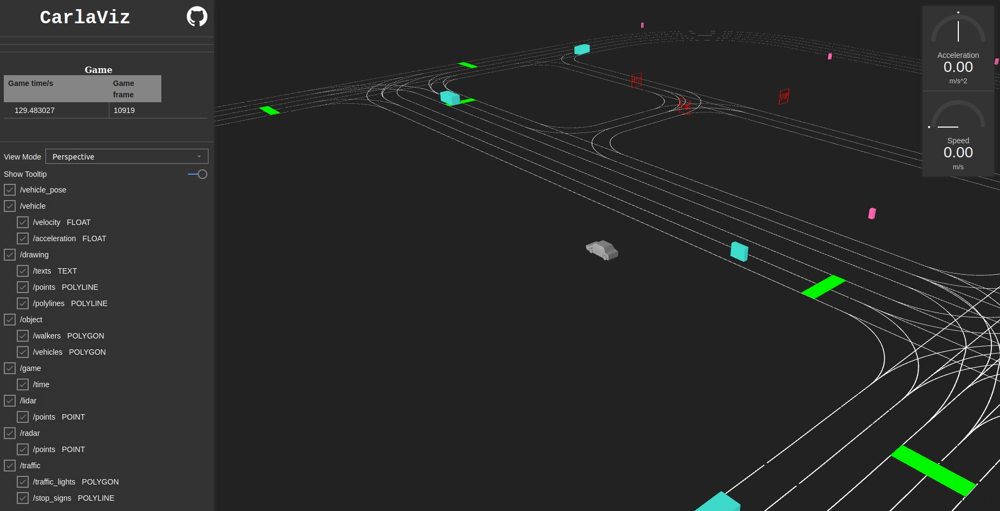
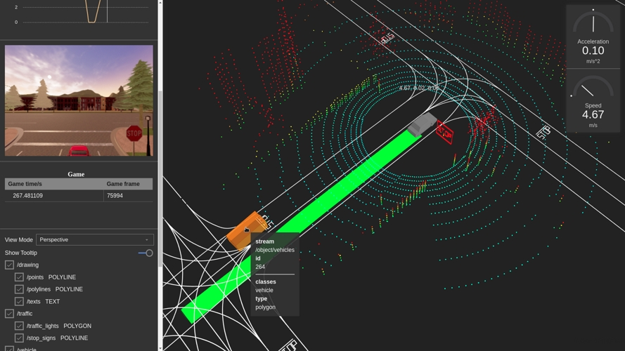

# carlaviz

The carlaviz plugin is used to visualize the simulation in a web browser. A windows with some basic representation of the scene is created. Actors are updated on-the-fly, sensor data can be retrieved, and additional text, lines and polylines can be drawn in the scene.  

*   [__General information__](#general-information)  
	*   [Support](#support)  
*   [__Get carlaviz__](#get-carlaviz)  
	*   [Prerequisites](#prerequisites)  
	*   [Download the plugin](#download-the-plugin)  
*   [__Utilities__](#utilities)  

---
## General information

*   __Contributor__ — Minjun Xu, also known as [wx9698](https://github.com/wx9698).  
*   __License__ — [MIT](https://en.wikipedia.org/wiki/MIT_License).  

### Support

*   __Linux__ — CARLA 0.9.6, 0.9.7, 0.9.8, 0.9.9, 0.9.10.  
*   __Windows__ — CARLA 0.9.9, 0.9.10.  
*   __Build from source__ — Latest updates.  

---
## Get carlaviz

### Prerequisites

*   __Docker__ — Visit the docs and [install Docker](https://docs.docker.com/get-docker/).  
*   __Operative system__ — Any OS able to run CARLA should work.  
*   __Websocket-client__ — ```pip3 install websocket_client```. Install [pip](https://pip.pypa.io/en/stable/installing/) if it is not already in the system.  

### Download the plugin

Open a terminal and pull the Docker image of carlaviz, based on the CARLA version to be run.  

```bash
# Pull only the image that matches the CARLA package being used
docker pull mjxu96/carlaviz:0.9.6
docker pull mjxu96/carlaviz:0.9.7
docker pull mjxu96/carlaviz:0.9.8
docker pull mjxu96/carlaviz:0.9.9
docker pull mjxu96/carlaviz:0.9.10

# Pull this image if working on a CARLA build from source
docker pull mjxu96/carlaviz:latest
```

!!! Important
    Currently in Windows there is only support for 0.9.9 and 0.9.10.  

CARLA up to 0.9.9 (included) is set to be single-stream. For later versions, multi-streaming for sensors is implemented.  

* __In single-stream__, a sensor can only be heard by one client. When a sensor is already being heard by another client, for example when running `manual_control.py`, carlaviz is forced to duplicate the sensor in order to retrieve the data, and performance may suffer.  

* __In multi-stream__, a sensor can be heard by multiple clients. carlaviz has no need to duplicate these and performance does not suffer.  

!!! Note
    Alternatively on Linux, users can build carlaviz following the instructions [here](https://github.com/carla-simulator/carlaviz/blob/master/docs/build.md), but using a Docker image will make things much easier.  

---
## Run carlaviz

__1. Run CARLA.__

*   __a) In a CARLA package__ — Go to the CARLA folder and start the simulation with `CarlaUE4.exe` (Windows) or `./CarlaUE4.sh` (Linux).  

*   __b) In a build from source__ — Go to the CARLA folder, run the UE editor with `make launch` and press `Play`.  

__2. Run carlaviz.__ In another terminal run the following command according to the Docker image that has been downloaded.  

Change `<name_of_Docker_image>` for the name of the image previously downloaded, e.g. `mjxu96/carlaviz:latest` or `mjxu96/carlaviz:0.9.10`.  

```sh
# On Linux system
docker run -it --network="host" -e CARLAVIZ_HOST_IP=localhost -e CARLA_SERVER_IP=localhost -e CARLA_SERVER_PORT=2000 <name_of_Docker_image>

# On Windows/MacOS system
docker run -it -e CARLAVIZ_HOST_IP=localhost -e CARLA_SERVER_IP=host.docker.internal -e CARLA_SERVER_PORT=2000 -p 8080-8081:8080-8081 -p 8089:8089 <name_of_Docker_image>
```

If the everything has been properly set, carlaviz will show a successful message similar to the following.  


!!! Warning
    Remember to edit the previous command to match the Docker image being used.  


__3. Open the localhost__ Open your web browser and go to `http://127.0.0.1:8080/`. carlaviz runs by default in port `8080`. The output should be similar to the following.  


---
## Utilities

Once the plugin is operative, it can be used to visualize the simulation, the actors that live in it, and the data the sensors retrieve. The plugin shows a visualization window on the right, were the scene is updated in real-tme, and a sidebar on the left with a list of items to be shown. Some of these items will appear in the visualization window, others (mainly sensor and game data) appear just above the items list.  
Here is a list of options available for visualization. Additional elements may show, such as  

*   __View Mode__ — Change the point of view in the visualization window.  
	*   `Top Down` — Aerial point of view.  
	*   `Perspective` — Free point of view.  
	*   `Driver` — First person point of view.  

*   __/vehicle__ — Show properties of the ego vehicle. Includes a speedometer and accelerometer in the visualization window, and the data retrieved by IMU, GNSS and collision detector sensors.  
	*   `/velocity` — Velocity of the ego vehicle.  
	*   `/acceleration` — Acceleration of the ego vehicle.  
*   __/drawing__ — Show additional elements in the visualization window drawn with [CarlaPainter](https://github.com/wx9698/carlaviz/blob/master/examples/carla_painter.py).  
	*   `/texts` — Text elements.  
	*   `/points` — Point elements.  
	*   `/polylines` — Polyline elements.  
*   __/objects__  — Show actors in the visualization window.  
	*   `/walkers` — Update walkers.  
	*   `/vehicles` — Update vehicles.  
*   __/game__  — Show game data.  
	*   `/time` — Current simulation time and frame.  
*   __/lidar__ — LIDAR sensor data.  
	*   `/points` — Cloud of points detected by a LIDAR sensor.  
*   __/radar__ — LIDAR sensor data.  
	*   `/points` — Cloud of points detected by a RADAR sensor.  
*   __/traffic__  — Landmark data.  
	*   `/traffic_light` — Show the map's traffic lights in the visualization window.  
	*   `/stop_sign` — Show the map's stop signs in the visualization window.  


Try to spawn some actors. These will be automatically updated in the visualization window.  
```sh
cd PythonAPI/examples
python3 spawn_npc.py -n 10 -w 5
```



Spawn an ego vehicle with manual control and move around, to see how the plugin updates sensor data.  
```sh
cd PythonAPI/examples
python3 manual_control.py
```


The contributor ([wx9698](https://github.com/wx9698)), created an additional class, [CarlaPainter](https://github.com/wx9698/carlaviz/blob/master/examples/carla_painter.py), that allows the user to draw elements to be shown in the visualization window. These include text, points and polylines. Follow [this example](https://github.com/carla-simulator/carlaviz/blob/master/examples/example.py) to spawn an ego vehicle with a LIDAR, and draw the LIDAR data, the trajectory and velocity of the vehicle.  



---

That is all there is to know about the carlaviz plugin. If there are any doubts, feel free to post these in the forum. 

<div class="build-buttons">
<p>
<a href="https://forum.carla.org/" target="_blank" class="btn btn-neutral" title="Go to the CARLA forum">
CARLA forum</a>
</p>
</div>
