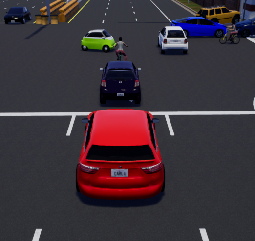
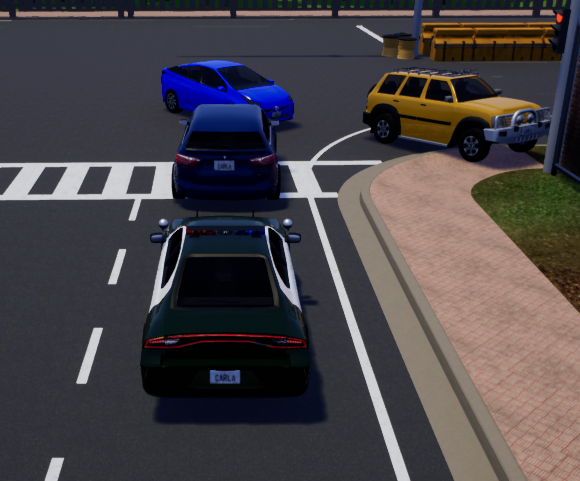

# Recording and Replaying system

CARLA includes now a recording and replaying API, that allows to record a simulation in a file and
later replay that simulation. The file is written on the server side only, and it includes which
**actors are created or destroyed** in the simulation, the **state of the traffic lights** and
the **position** and **orientation** of all vehicles and pedestrians.

All data is written in a binary file on the server. We can use filenames with or without a path.
If we specify a filename without any of `\`, `/` or `:` characters, then it is considered to be
only a filename and will be saved on folder **CarlaUE4/Saved**. If we use any of the previous
characters then the filename will be considered as an absolute filename with path
(for example: `/home/carla/recording01.log` or `c:\records\recording01.log`).

As an estimate, a simulation with about 150 actors (50 traffic lights, 100 vehicles) for 1h
of recording takes around 200 MB in size.

## Recording
To start recording we only need to supply a file name:

```py
client.start_recorder("recording01.log")
```

To stop the recording, we need to call:

```py
client.stop_recorder()
```
## Playback

At any point we can replay a simulation, specifying the filename:

```py
client.replay_file("recording01.log")
```
The replayer replicates the actor and traffic light information of the recording each frame.

When replaying we have some other options that we can use, the full API call is:

```py
client.replay_file("recording01.log", start, duration, camera)
```

* **start**: Time we want to start the simulation from.
  * If the value is positive, it means the number of seconds starting from the beginning.
  E.g. a value of 10 will start the simulation at second 10.
  * If the value is negative, it means the number of seconds starting from the end.
  E.g. a value of -10 will replay only the last 10 seconds of the simulation.
* **duration**: Amount of seconds we want to play. When the simulation reaches the end,
then all actors remaining will have autopilot enabled automatically.
The purpose of this parameter is to allow users to replay a piece of a simulation and then let all
actors start driving in autopilot again.
* **camera**: Id of an actor where the camera will focus on and follow.
To obtain the Ids of the actors, please read right below.

Please note that all vehicles at the end of the playback will be set in autopilot to let them
continue driving by themselves, and all pedestrians will be stopped at their current place
(we plan to set  autopilot for pedestrians also, to walk at random places). This behaviour let's
you for example replay a piece of simulation and test how they continue after some changes
in the environment.

### Playback time factor (speed)

We can specify the time factor (speed) for the replayer at any moment, using the following API call:

```py
client.set_replayer_time_factor(2.0)
```
A value greater than 1.0 will play in fast motion, and a value below 1.0 will play in slow motion,
being 1.0 the default value for normal playback.
As a performance trick, with values over 2.0 the interpolation of positions is disabled.

E.g. With a time factor of 20x we can see traffic flow:


Pedestrians' animations will not be affected by this time factor and will remain at normal speed.
Therefore, animations are not accurate yet.

This API call will not stop the replayer in course, it will just change the speed,
so you can change that several times while the replayer is running.

### Info about the recorded file

We can get details about a recorded simulation, using this API call:

```py
client.show_recorder_file_info("recording01.log")
```

The output result should be similar to this one:

```
Version: 1
Map: Town05
Date: 02/21/19 10:46:20

Frame 1 at 0 seconds
 Create 2190: spectator (0) at (-260, -200, 382.001)
 Create 2191: traffic.traffic_light (3) at (4255, 10020, 0)
 Create 2192: traffic.traffic_light (3) at (4025, 7860, 0)
 Create 2193: traffic.traffic_light (3) at (1860, 7975, 0)
 Create 2194: traffic.traffic_light (3) at (1915, 10170, 0)
 ...
 Create 2258: traffic.speed_limit.90 (0) at (21651.7, -1347.59, 15)
 Create 2259: traffic.speed_limit.90 (0) at (5357, 21457.1, 15)
 Create 2260: traffic.speed_limit.90 (0) at (858, 18176.7, 15)
Frame 2 at 0.0254253 seconds
 Create 2276: vehicle.mini.cooperst (1) at (4347.63, -8409.51, 120)
  number_of_wheels = 4
  object_type =
  color = 255,241,0
  role_name = autopilot
Frame 4 at 0.0758538 seconds
 Create 2277: vehicle.diamondback.century (1) at (4017.26, 14489.8, 123.86)
  number_of_wheels = 2
  object_type =
  color = 50,96,242
  role_name = autopilot
Frame 6 at 0.122666 seconds
 Create 2278: vehicle.seat.leon (1) at (3508.17, 7611.85, 120.002)
  number_of_wheels = 4
  object_type =
  color = 237,237,237
  role_name = autopilot
Frame 8 at 0.171718 seconds
 Create 2279: vehicle.diamondback.century (1) at (3160, 3020.07, 120.002)
  number_of_wheels = 2
  object_type =
  color = 50,96,242
  role_name = autopilot
Frame 10 at 0.219568 seconds
 Create 2280: vehicle.bmw.grandtourer (1) at (-5405.99, 3489.52, 125.545)
  number_of_wheels = 4
  object_type =
  color = 0,0,0
  role_name = autopilot
Frame 2350 at 60.2805 seconds
 Destroy 2276
Frame 2351 at 60.3057 seconds
 Destroy 2277
Frame 2352 at 60.3293 seconds
 Destroy 2278
Frame 2353 at 60.3531 seconds
 Destroy 2279
Frame 2354 at 60.3753 seconds
 Destroy 2280

Frames: 2354
Duration: 60.3753 seconds
```
From the previous log, we can retrieve the information regarding the **date** and the **map**
where the simulation was recorded.
Each frame will display information about any event that could happen
(create or destroy an actor, collisions). When creating actors, it outputs for each of them its
corresponding **Id** together with some other additional information. This **Id** is the one we
need to specify in the **camera** attribute when replaying if we want to follow that actor
during the replay.
At the end, we can see as well the **total time** of the recording and also the number
of **frames** that were recorded.

### Info about collisions

In simulations with a **hero actor**, the collisions are automatically saved,
so we can query a recorded file to see if any **hero actor** had collisions with some other actor.
Currently, the actor types we can use in the query are these:

* **h** = Hero
* **v** = Vehicle
* **w** = Walker
* **t** = Traffic light
* **o** = Other
* **a** = Any

The collision query needs to know the type of actors involved in the collision.
If we do not want to specify it, we can specify **a** (any) for both. These are some examples:

* **a** **a**: Will show all collisions recorded
* **v** **v**: Will show all collisions between vehicles
* **v** **t**: Will show all collisions between a vehicle and a traffic light
* **v** **w**: Will show all collisions between a vehicle and a walker
* **v** **o**: Will show all collisions between a vehicle and other actor, like static meshes
* **h** **w**: Will show all collisions between a hero and a walker

Currently, only **hero actors** record the collisions. Therefore, we have considered that the first
actor will be the hero always.

The API call for querying the collisions is:

```py
client.show_recorder_collisions("recording01.log", "a", "a")
```

The output result should be similar to this one:

```
Version: 1
Map: Town05
Date: 02/19/19 15:36:08

    Time  Types     Id Actor 1                                 Id Actor 2
      16   v v     122 vehicle.yamaha.yzf                     118 vehicle.dodge_charger.police
      27   v o     122 vehicle.yamaha.yzf                       0

Frames: 790
Duration: 46 seconds
```

We can see here that for each collision the **time** when happened, the **type** of
the actors involved, and the **id and description** of each actor.

So, if we want to see what happened on that recording for the first collision where the hero
actor was colliding with a vehicle, we could use this API call. So for example:

```py
client.replay_file("col2.log", 13, 0, 122)
```
We have started the replayer just a bit before the time of the collision, so we can observe
better how it happened.
Also, if the **duration** is set to 0, the entire file will be replayed.

The output result is similar to this:


### Info about blocked actors

There is another API function to get information about actors that have been blocked by an obstacle,
not letting them follow their way. That could be helpful for finding incidences. The API call is:

```py
client.show_recorder_actors_blocked("recording01.log", min_time, min_distance)
```

The input parameters are:
* **min_time**: The minimum time that an actor needs to be stopped to be considered as blocked
(in seconds, by default 30).
* **min_distance**: The minimum distance to consider an actor to be stopped (in cm, by default 10).

Let's say we want to know which actor is stopped (moving less than 1 meter during 60 seconds),
we could do the following:

```py
client.show_recorder_actors_blocked("col3.log", 60, 100)
```

And this is the output format (sorted by duration):

```
Version: 1
Map: Town05
Date: 02/19/19 15:45:01

    Time     Id Actor                                 Duration
      36    173 vehicle.nissan.patrol                      336
      75    104 vehicle.dodge_charger.police               295
      75    214 vehicle.chevrolet.impala                   295
     234     76 vehicle.nissan.micra                       134
     241    162 vehicle.audi.a2                            128
     302    143 vehicle.bmw.grandtourer                     67
     303    133 vehicle.nissan.micra                        67
     303    167 vehicle.audi.a2                             66
     302     80 vehicle.nissan.micra                        67

Frames: 6985
Duration: 374 seconds
```

These lines tell us when an actor was stopped for at least the minimum time specified.
For example, looking at the 6th line, the vehicle 143 was stopped for 67 seconds at time 302 seconds.

We could check what happened at that time by calling the next API command:

```py
client.replay_file("col3.log", 302, 0, 143)
```



As we can observe, there is an obstacle that is actually blocking the actor
(see red vehicle in the image).
Looking at another actor using:

```py
client.replay_file("col3.log", 75, 0, 104)
```



It is worth noting that it is the same incident but with another vehicle involved in it
(i.e. the police car in this case).

The result is sorted by duration, so the actor that is blocked for more time comes first.
By checking the vehicle with Id 173 at time 36 seconds, it is evident that it stopped for 336 seconds.
To check the cause of it , it would be useful to check how it arrived to that situation by replaying
a few seconds before the second 36:

```py
client.replay_file("col3.log", 34, 0, 173)
```


And easily determine the responsible of that incident.

## Sample Python scripts

Here you can find a list of sample scripts you could use:

* **start_recording.py**: This will start recording, and optionally you can spawn several actors and
define how much time you want to record.
    + `-f`: Filename to write
    + `-n`: Vehicles to spawn (optional, 10 by default)
    + `-t`: Duration of the recording (optional)

---

* **start_replaying.py**: This will start a replay of a file. We can define the starting time,
duration and also an actor to follow.
    + `-f`: Filename
    + `-s`: Starting time (optional, by default from start)
    + `-d`: Duration (optional, by default all)
    + `-c`: Actor to follow (id) (optional)

---

* **show_recorder_file_info.py**: This will show all the information recorded in file.
It has two modes of detail, by default it only shows the frames where some event is recorded,
the second is showing info about all frames (all positions and trafficlight states).
    + `-f`: Filename
    + `-a`: Flag to show all details (optional)

---

* **show_recorder_collisions.py**: This will show all the collisions hapenned while recording
(currently only involved by hero actors).
    + `-f`: Filename
    + `-t`: Two letters definning the types of the actors involved, for example: -t aa
        - `h` = Hero
        - `v` = Vehicle
        - `w` = Walker
        - `t` = Traffic light
        - `o` = Other
        - `a` = Any

---

* **show_recorder_actors_blocked.py**: This will show all the actors that are blocked or stopped
in the recorder. We can define the *time* that an actor has not been moving and *travelled* distance
by the actor thresholds to determine if a vehicle is considered as blocked or not.
    + `-f`: Filename
    + `-t`: Minimum seconds stopped to be considered as blocked (optional)
    + `-d`: Minimum distance to be considered stopped (optional)
