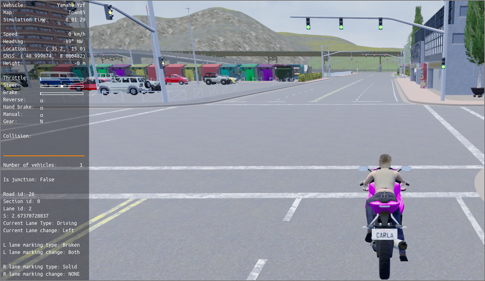
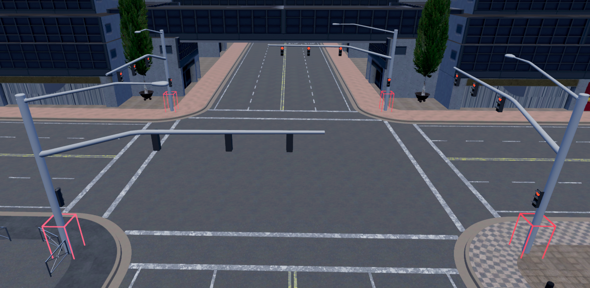
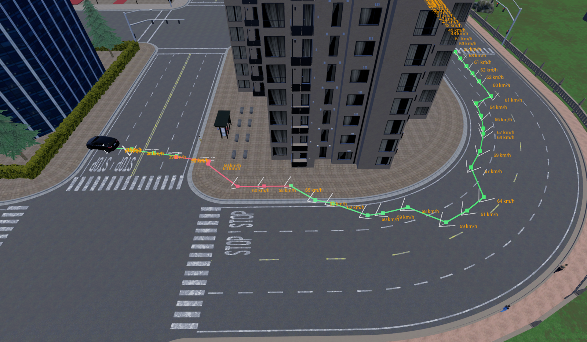

# Code recipes 

This section contains a list of recipes that complement the [first steps](core_concepts.md) section and are used to illustrate the use of Python API methods.

Each recipe has a list of [python API classes](python_api.md),
which is divided into those in which the recipe is centered, and those that need to be used.

There are more recipes to come!

---
## Actor Spectator Recipe

This recipe spawns an actor and the spectator camera at the actor's location.

Focused on:<br>
[`carla.World`](python_api.md#carla.World)<br>
[`carla.Actor`](python_api.md#carla.Actor)

Used:<br>
[`carla.WorldSnapshot`](python_api.md#carla.WorldSnapshot)<br>
[`carla.ActorSnapshot`](python_api.md#carla.ActorSnapshot)

```py
# ...
world = client.get_world()
spectator = world.get_spectator()

vehicle_bp = random.choice(world.get_blueprint_library().filter('vehicle.bmw.*'))
transform = random.choice(world.get_map().get_spawn_points())
vehicle = world.try_spawn_actor(vehicle_bp, transform)

# Wait for world to get the vehicle actor
world.tick()

world_snapshot = world.wait_for_tick()
actor_snapshot = world_snapshot.find(vehicle.id)

# Set spectator at given transform (vehicle transform)
spectator.set_transform(actor_snapshot.get_transform())
# ...
```

---
## Attach Sensors Recipe

This recipe attaches different camera / sensors to a vehicle with different attachments.

Focused on:<br>
[`carla.Sensor`](python_api.md#carla.Sensor)<br>
[`carla.AttachmentType`](python_api.md#carla.AttachmentType)<br>

Used:<br>
[`carla.World`](python_api.md#carla.World)

```py
# ...
camera = world.spawn_actor(rgb_camera_bp, transform, attach_to=vehicle, attachment_type=Attachment.SpringArm)
# Default attachment:  Attachment.Rigid
gnss_sensor = world.spawn_actor(sensor_gnss_bp, transform, attach_to=vehicle)
collision_sensor = world.spawn_actor(sensor_collision_bp, transform, attach_to=vehicle)
lane_invasion_sensor = world.spawn_actor(sensor_lane_invasion_bp, transform, attach_to=vehicle)
# ...
```

---
## Actor Attribute Recipe  

This recipe changes attributes of different type of blueprint actors.

Focused on:<br>
[`carla.ActorAttribute`](python_api.md#carla.ActorAttribute)<br>
[`carla.ActorBlueprint`](python_api.md#carla.ActorBlueprint)<br>

Used:<br>
[`carla.World`](python_api.md#carla.World)<br>
[`carla.BlueprintLibrary`](python_api.md#carla.BlueprintLibrary)<br>

```py
# ...
walker_bp = world.get_blueprint_library().filter('walker.pedestrian.0002')
walker_bp.set_attribute('is_invincible', True)

# ...
# Changes attribute randomly by the recommended value
vehicle_bp = wolrd.get_blueprint_library().filter('vehicle.bmw.*')
color = random.choice(vehicle_bp.get_attribute('color').recommended_values)
vehicle_bp.set_attribute('color', color)

# ...

camera_bp = world.get_blueprint_library().filter('sensor.camera.rgb')
camera_bp.set_attribute('image_size_x', 600)
camera_bp.set_attribute('image_size_y', 600)
# ...
```

---
## Converted Image Recipe

This recipe applies a color conversion to the image taken by a camera sensor,
so it is converted to a semantic segmentation image.

Focused on:<br>
[`carla.ColorConverter`](python_api.md#carla.ColorConverter)<br>
[`carla.Sensor`](python_api.md#carla.Sensor)

```py
# ...
camera_bp = world.get_blueprint_library().filter('sensor.camera.semantic_segmentation')
# ...
cc = carla.ColorConverter.CityScapesPalette
camera.listen(lambda image: image.save_to_disk('output/%06d.png' % image.frame, cc))
# ...
```

---
## Lanes Recipe

This recipe shows the current traffic rules affecting the vehicle. Shows the current lane type and
if a lane change can be done in the actual lane or the surrounding ones.

Focused on:<br>
[`carla.LaneMarking`](python_api.md#carla.LaneMarking)<br>
[`carla.LaneMarkingType`](python_api.md#carla.LaneMarkingType)<br>
[`carla.LaneChange`](python_api.md#carla.LaneChange)<br>
[`carla.LaneType`](python_api.md#carla.LaneType)<br>

Used:<br>
[`carla.Waypoint`](python_api.md#carla.Waypoint)<br>
[`carla.World`](python_api.md#carla.World)

```py
# ...
waypoint = world.get_map().get_waypoint(vehicle.get_location(),project_to_road=True, lane_type=(carla.LaneType.Driving | carla.LaneType.Shoulder | carla.LaneType.Sidewalk))
print("Current lane type: " + str(waypoint.lane_type))
# Check current lane change allowed
print("Current Lane change:  " + str(waypoint.lane_change))
# Left and Right lane markings
print("L lane marking type: " + str(waypoint.left_lane_marking.type))
print("L lane marking change: " + str(waypoint.left_lane_marking.lane_change))
print("R lane marking type: " + str(waypoint.right_lane_marking.type))
print("R lane marking change: " + str(waypoint.right_lane_marking.lane_change))
# ...
```



---
## Debug Bounding Box Recipe

This recipe shows how to draw traffic light actor bounding boxes from a world snapshot.

Focused on:<br>
[`carla.DebugHelper`](python_api.md#carla.DebugHelper)<br>
[`carla.BoundingBox`](python_api.md#carla.BoundingBox)

Used:<br>
[`carla.ActorSnapshot`](python_api.md#carla.ActorSnapshot)<br>
[`carla.Actor`](python_api.md#carla.Actor)<br>
[`carla.Vector3D`](python_api.md#carla.Vector3D)<br>
[`carla.Color`](python_api.md#carla.Color)

```py
# ....
debug = world.debug
world_snapshot = world.get_snapshot()

for actor_snapshot in world_snapshot:
    actual_actor = world.get_actor(actor_snapshot.id)
    if actual_actor.type_id == 'traffic.traffic_light':
        debug.draw_box(carla.BoundingBox(actor_snapshot.get_transform().location,carla.Vector3D(0.5,0.5,2)),actor_snapshot.get_transform().rotation, 0.05, carla.Color(255,0,0,0),0)
# ...
```



---
## Debug Vehicle Trail Recipe

This recipe is a modification of
[`lane_explorer.py`](https://github.com/carla-simulator/carla/blob/master/PythonAPI/util/lane_explorer.py) example.
It draws the path of an actor through the world, printing information at each waypoint.

Focused on:<br>
[`carla.DebugHelper`](python_api.md#carla.DebugHelper)<br>
[`carla.Waypoint`](python_api.md#carla.Waypoint)<br>
[`carla.Actor`](python_api.md#carla.Actor)

Used:<br>
[`carla.ActorSnapshot`](python_api.md#carla.ActorSnapshot)<br>
[`carla.Vector3D`](python_api.md#carla.Vector3D)<br>
[`carla.LaneType`](python_api.md#carla.LaneType)<br>
[`carla.Color`](python_api.md#carla.Color)<br>
[`carla.Map`](python_api.md#carla.Map)

```py
# ...
current_w = map.get_waypoint(vehicle.get_location())
while True:

    next_w = map.get_waypoint(vehicle.get_location(), lane_type=carla.LaneType.Driving | carla.LaneType.Shoulder | carla.LaneType.Sidewalk )
    # Check if the vehicle is moving
    if next_w.id != current_w.id:
        vector = vehicle.get_velocity()
        # Check if the vehicle is on a sidewalk
        if current_w.lane_type == carla.LaneType.Sidewalk:
            draw_waypoint_union(debug, current_w, next_w, cyan if current_w.is_junction else red, 60)
        else:
            draw_waypoint_union(debug, current_w, next_w, cyan if current_w.is_junction else green, 60)
        debug.draw_string(current_w.transform.location, str('%15.0f km/h' % (3.6 * math.sqrt(vector.x**2 + vector.y**2 + vector.z**2))), False, orange, 60)
        draw_transform(debug, current_w.transform, white, 60)

    # Update the current waypoint and sleep for some time
    current_w = next_w
    time.sleep(args.tick_time)
# ...
```

The image below shows how a vehicle loses control and drives on a sidewalk. The trail shows the
path it was following and the speed at each waypoint.



---
## Parse client creation arguments

This recipe shows in every script provided in `PythonAPI/Examples` and it is used to parse the client creation arguments when running the script. 

Focused on:<br>
[`carla.Client`](python_api.md#carla.Client)<br>

Used:<br>
[`carla.Client`](python_api.md#carla.Client)

```py
    argparser = argparse.ArgumentParser(
        description=__doc__)
    argparser.add_argument(
        '--host',
        metavar='H',
        default='127.0.0.1',
        help='IP of the host server (default: 127.0.0.1)')
    argparser.add_argument(
        '-p', '--port',
        metavar='P',
        default=2000,
        type=int,
        help='TCP port to listen to (default: 2000)')
    argparser.add_argument(
        '-s', '--speed',
        metavar='FACTOR',
        default=1.0,
        type=float,
        help='rate at which the weather changes (default: 1.0)')
    args = argparser.parse_args()

    speed_factor = args.speed
    update_freq = 0.1 / speed_factor

    client = carla.Client(args.host, args.port)
```

---
## Traffic lights Recipe

This recipe changes from red to green the traffic light that affects the vehicle.
This is done by detecting if the vehicle actor is at a traffic light.

Focused on:<br>
[`carla.TrafficLight`](python_api.md#carla.TrafficLight)<br>
[`carla.TrafficLightState`](python_api.md#carla.TrafficLightState)

Used:<br>
[`carla.Vehicle`](python_api.md#carla.Vehicle)

```py
# ...
if vehicle_actor.is_at_traffic_light():
    traffic_light = vehicle_actor.get_traffic_light()
    if traffic_light.get_state() == carla.TrafficLightState.Red:
       # world.hud.notification("Traffic light changed! Good to go!")
        traffic_light.set_state(carla.TrafficLightState.Green)
# ...
```


---
## Walker batch recipe

```py
# 0. Choose a blueprint fo the walkers
world = client.get_world()
blueprintsWalkers = world.get_blueprint_library().filter("walker.pedestrian.*")
walker_bp = random.choice(blueprintsWalkers)

# 1. Take all the random locations to spawn
spawn_points = []
for i in range(50):
    spawn_point = carla.Transform()
    spawn_point.location = world.get_random_location_from_navigation()
    if (spawn_point.location != None):
        spawn_points.append(spawn_point)

# 2. Build the batch of commands to spawn the pedestrians
batch = []
for spawn_point in spawn_points:
    walker_bp = random.choice(blueprintsWalkers)
    batch.append(carla.command.SpawnActor(walker_bp, spawn_point))

# 2.1 apply the batch
results = client.apply_batch_sync(batch, True)
for i in range(len(results)):
    if results[i].error:
        logging.error(results[i].error)
    else:
        walkers_list.append({"id": results[i].actor_id})

# 3. Spawn walker AI controllers for each walker
batch = []
walker_controller_bp = world.get_blueprint_library().find('controller.ai.walker')
for i in range(len(walkers_list)):
    batch.append(carla.command.SpawnActor(walker_controller_bp, carla.Transform(), walkers_list[i]["id"]))

# 3.1 apply the batch
results = client.apply_batch_sync(batch, True)
for i in range(len(results)):
    if results[i].error:
        logging.error(results[i].error)
    else:
        walkers_list[i]["con"] = results[i].actor_id

# 4. Put altogether the walker and controller ids
for i in range(len(walkers_list)):
    all_id.append(walkers_list[i]["con"])
    all_id.append(walkers_list[i]["id"])
all_actors = world.get_actors(all_id)

# wait for a tick to ensure client receives the last transform of the walkers we have just created
world.wait_for_tick()

# 5. initialize each controller and set target to walk to (list is [controller, actor, controller, actor ...])
for i in range(0, len(all_actors), 2):
    # start walker
    all_actors[i].start()
    # set walk to random point
    all_actors[i].go_to_location(world.get_random_location_from_navigation())
    # random max speed
    all_actors[i].set_max_speed(1 + random.random())    # max speed between 1 and 2 (default is 1.4 m/s)
```

To **destroy the pedestrians**,  stop them from the navigation, and then destroy the objects (actor and controller):

```py
# stop pedestrians (list is [controller, actor, controller, actor ...])
for i in range(0, len(all_id), 2):
    all_actors[i].stop()

# destroy pedestrian (actor and controller)
client.apply_batch([carla.command.DestroyActor(x) for x in all_id])
```