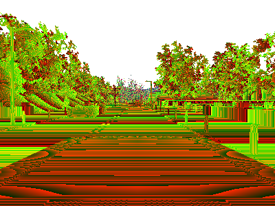
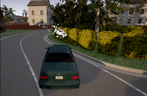
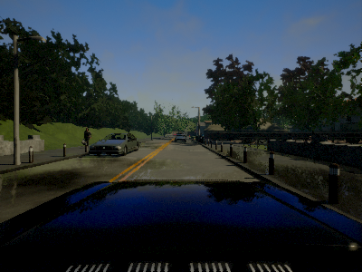
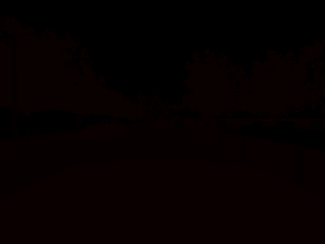

# Sensors reference

  * [__Collision detector__](#collision-detector)  
  * [__Depth camera__](#depth-camera)  
  * [__GNSS sensor__](#gnss-sensor)  
  * [__IMU sensor__](#imu-sensor)  
  * [__Lane invasion detector__](#lane-invasion-sensor)  
  * [__Lidar raycast sensor__](#lidar-sensor)  
  * [__Obstacle detector__](#obstacle-detector)  
  * [__Radar sensor__](#radar-sensor)  
  * [__RGB camera__](#rgb-camera)  
  * [__Semantic segmentation camera__](#semantic-segmentation-camera)  


---
## Collision detector

* __Blueprint:__ sensor.other.collision
* __Output:__ [carla.CollisionEvent](python_api.md#carla.CollisionEvent) per collision.

This sensor registers an event each time its parent actor collisions against something in the world. Several collisions may be detected during a single simulation step.  
To ensure that collisions with any kind of object are detected, the server creates "fake" actors for elements such as buildings or bushes so the semantic tag can be retrieved to identify it.

Collision detectors do not have any configurable attribute.

#### Output attributes

| Sensor data attribute  | Type                                             | Description |
| ---------------------- | -----------                                      | ----------- |
| `frame`                | int                                              | Frame number when the measurement took place. |
| `timestamp`            | double                                           | Simulation time of the measurement in seconds since the beginning of the episode. |
| `transform`            | [carla.Transform](python_api.md#carla.Transform) | Location and rotation in world coordinates of the sensor at the time of the measurement. |
| `actor`                | [carla.Actor](python_api.md#carla.Actor)         | Actor that measured the collision (sensor's parent). |
| `other_actor`          | [carla.Actor](python_api.md#carla.Actor)         | Actor against whom the parent collided. |
| `normal_impulse`       | [carla.Vector3D](python_api.md#carla.Vector3D)   | Normal impulse result of the collision. |

---
## Depth camera

* __Blueprint:__ sensor.camera.depth
* __Output:__ [carla.Image](python_api.md#carla.Image) per step (unless `sensor_tick` says otherwise). 

The camera provides a raw data of the scene codifying the distance of each pixel to the camera (also known as **depth buffer** or **z-buffer**) to create a depth map of the elements.  

The image codifies depth value per pixel using 3 channels of the RGB color space, from less to more significant bytes: _R -> G -> B_. The actual distance in meters can be
decoded with:

```
normalized = (R + G * 256 + B * 256 * 256) / (256 * 256 * 256 - 1)
in_meters = 1000 * normalized
```

The output [carla.Image](python_api.md#carla.Image) should then be saved to disk using a [carla.colorConverter](python_api.md#carla.ColorConverter) that will turn the distance stored in RGB channels into a __[0,1]__ float containing the distance and then translate this to grayscale.  
There are two options in [carla.colorConverter](python_api.md#carla.ColorConverter) to get a depth view: __Depth__ and __Logaritmic depth__. The precision is milimetric in both, but the logarithmic approach provides better results for closer objects. 




#### Basic camera attributes

| Blueprint attribute | Type  | Default | Description |
| ------------------- | ----  | ------- | ----------- |
| `image_size_x`      | int   | 800     | Image width in pixels. |
| `image_size_y`      | int   | 600     | Image height in pixels.  |
| `fov`               | float | 90.0    | Horizontal field of view in degrees. |
| `sensor_tick`       | float | 0.0     | Simulation seconds between sensor captures (ticks). |  

<br>

#### Camera lens distortion attributes

| Blueprint attribute      | Type  | Default | Description |
|--------------------------|-------|---------|-------------|
| `lens_circle_falloff`    | float | 5.0     | Range: [0.0, 10.0] |
| `lens_circle_multiplier` | float | 0.0     | Range: [0.0, 10.0] |
| `lens_k`                 | float | -1.0    | Range: [-inf, inf] |
| `lens_kcube`             | float | 0.0     | Range: [-inf, inf] |
| `lens_x_size`            | float | 0.08    | Range: [0.0, 1.0] |
| `lens_y_size`            | float | 0.08    | Range: [0.0, 1.0] |  

<br>

#### Output attributes

| Sensor data attribute | Type                                             | Description |
| --------------------- | ------------------------------------------------ | ----------- |
| `frame`               | int                                              | Frame number when the measurement took place. |
| `timestamp`           | double                                           | Simulation time of the measurement in seconds since the beginning of the episode. |
| `transform`           | [carla.Transform](python_api.md#carla.Transform) | Location and rotation in world coordinates of the sensor at the time of the measurement. |
| `width`               | int                                              | Image width in pixels. |
| `height`              | int                                              | Image height in pixels. |
| `fov`                 | float                                            | Horizontal field of view in degrees. |
| `raw_data`            | bytes                                            | Array of BGRA 32-bit pixels. |

---
## GNSS sensor

* __Blueprint:__ sensor.other.gnss
* __Output:__ [carla.GNSSMeasurement](python_api.md#carla.GNSSMeasurement) per step (unless `sensor_tick` says otherwise). 

Reports current [gnss position](https://www.gsa.europa.eu/european-gnss/what-gnss) of its parent object. This is calculated by adding the metric position to an initial geo reference location defined within the OpenDRIVE map definition.

#### GNSS attributes

| Blueprint attribute  | Type  | Default | Description |
| -------------------- | ----  | ------- | ----------- |
| `noise_alt_bias`     | float | 0.0     | Mean parameter in the noise model for altitude. |
| `noise_alt_stddev`   | float | 0.0     | Standard deviation parameter in the noise model for altitude. |
| `noise_lat_bias`     | float | 0.0     | Mean parameter in the noise model for latitude. |
| `noise_lat_stddev`   | float | 0.0     | Standard deviation parameter in the noise model for latitude. |
| `noise_lon_bias`     | float | 0.0     | Mean parameter in the noise model for longitude. |
| `noise_lon_stddev`   | float | 0.0     | Standard deviation parameter in the noise model for longitude. |
| `noise_seed`         | int   | 0       | Initializer for a pseudorandom number generator. |
| `sensor_tick`        | float | 0.0     | Simulation seconds between sensor captures (ticks). |  

<br>

#### Output attributes

| Sensor data attribute  | Type                                             | Description |
| ---------------------- | ------------------------------------------------ | ----------- |
| `frame`                | int                                              | Frame number when the measurement took place. |
| `timestamp`            | double                                           | Simulation time of the measurement in seconds since the beginning of the episode. |
| `transform`            | [carla.Transform](python_api.md#carla.Transform) | Location and rotation in world coordinates of the sensor at the time of the measurement. |
| `latitude`             | double                                           | Latitude of the actor. |
| `longitude`            | double                                           | Longitude of the actor. |
| `altitude`             | double                                           | Altitude of the actor. |

---
## IMU sensor

* __Blueprint:__ sensor.other.imu
* __Output:__ [carla.IMUMeasurement](python_api.md#carla.IMUMeasurement) per step (unless `sensor_tick` says otherwise).

Provides measures that accelerometer, gyroscope and compass would retrieve for the parent object. The data is collected from the object's current state.

#### IMU attributes

| Blueprint attribute   | Type  | Default | Description |
| --------------------- | ----  | ------- | ----------- |
| `noise_accel_stddev_x`| float | 0.0     | Standard deviation parameter in the noise model for acceleration (X axis). |
| `noise_accel_stddev_y`| float | 0.0     | Standard deviation parameter in the noise model for acceleration (Y axis). |
| `noise_accel_stddev_z`| float | 0.0     | Standard deviation parameter in the noise model for acceleration (Z axis). |
| `noise_gyro_bias_x`   | float | 0.0     | Mean parameter in the noise model for the gyroscope (X axis). |
| `noise_gyro_bias_y`   | float | 0.0     | Mean parameter in the noise model for the gyroscope (Y axis). |
| `noise_gyro_bias_z`   | float | 0.0     | Mean parameter in the noise model for the gyroscope (Z axis). |
| `noise_gyro_stddev_x` | float | 0.0     | Standard deviation parameter in the noise model for the gyroscope (X axis). |
| `noise_gyro_stddev_y` | float | 0.0     | Standard deviation parameter in the noise model for the gyroscope (Y axis). |
| `noise_gyro_stddev_z` | float | 0.0     | Standard deviation parameter in the noise model for the gyroscope (Z axis). |
| `noise_seed`          | int   | 0       | Initializer for a pseudorandom number generator. |
| `sensor_tick`         | float | 0.0     | Simulation seconds between sensor captures (ticks). |  

<br>

#### Output attributes

| Sensor data attribute | Type                                             | Description |
| --------------------- | ------------------------------------------------ | ----------- |
| `frame`               | int                                              | Frame number when the measurement took place. |
| `timestamp`           | double                                           | Simulation time of the measurement in seconds since the beginning of the episode. |
| `transform`           | [carla.Transform](python_api.md#carla.Transform) | Transform in world. |
| `accelerometer`       | [carla.Vector3D](python_api.md#carla.Vector3D)   | Measures linear acceleration in `m/s^2`. |
| `gyroscope`           | [carla.Vector3D](python_api.md#carla.Vector3D)   | Measures angular velocity in `rad/sec`. |
| `compass`             | float                                            | Orientation in radians. North  is `(0.0, -1.0, 0.0)` in UE. |

---
## Lane invasion detector

* __Blueprint:__ sensor.other.lane_invasion
* __Output:__ [carla.LaneInvasionEvent](python_api.md#carla.LaneInvasionEvent) per crossing.

Registers an event each time its parent crosses a lane marking.  
The sensor uses road data provided by the OpenDRIVE description of the map to determine whether the parent vehicle is invading another lane by considering the space between wheels.  
However there are some things to be taken into consideration:  

* Discrepancies between the OpenDRIVE file and the map will create irregularities such as crossing lanes that are not visible in the map. 
* The output retrieves a list of crossed lane markings: the computation is done in OpenDRIVE and considering the whole space between the four wheels as a whole. Thus, there may be more than one lane being crossed at the same time. 

This sensor does not have any configurable attribute.

!!! Important
    This sensor works fully on the client-side. 

#### Output attributes

| Sensor data attribute   | Type                                                       | Description |
| ----------------------- | ---------------------------------------------------------- | ----------- |
| `frame`                 | int                                                        | Frame number when the measurement took place. |
| `timestamp`             | double                                                     | Simulation time of the measurement in seconds since the beginning of the episode. |
| `transform`             | [carla.Transform](python_api.md#carla.Transform)           | Location and rotation in world coordinates of the sensor at the time of the measurement. |
| `actor`                 | [carla.Actor](python_api.md#carla.Actor)                   | Vehicle that invaded another lane (parent actor). |
| `crossed_lane_markings` | list([carla.LaneMarking](python_api.md#carla.LaneMarking)) | List of lane markings that have been crossed. |


---
## Lidar raycast sensor

* __Blueprint:__ sensor.lidar.ray_cast
* __Output:__ [carla.LidarMeasurement](python_api.md#carla.LidarMeasurement) per step (unless `sensor_tick` says otherwise).

This sensor simulates a rotating Lidar implemented using ray-casting.  
The points are computed by adding a laser for each channel distributed in the vertical FOV. The rotation is simulated computing the horizontal angle that the Lidar rotated in a frame. The point cloud is calculated by doing a ray-cast for each laser in every step:  
`points_per_channel_each_step = points_per_second / (FPS * channels)`

A Lidar measurement contains a packet with all the points generated during a `1/FPS` interval. During this interval the physics are not updated so all the points in a measurement reflect the same "static picture" of the scene.  

This output contains a cloud of simulation points and thus, can be iterated to retrieve a list of their [`carla.Location`](python_api.md#carla.Location):

```py
for location in lidar_measurement:
    print(location)
```

!!! Tip
    Running the simulator at [fixed time-step](adv_synchrony_timestep.md) it is possible to tune the rotation for each measurement. Adjust the step and the rotation frequency to get, for instance, a 360 view each measurement.


#### Lidar attributes

| Blueprint attribute  | Type  | Default | Description |
| -------------------- | ----  | ------- | ----------- |
| `channels`           | int   | 32      | Number of lasers. |
| `range`              | float | 10.0    | Maximum distance to measure/raycast in meters (centimeters for CARLA 0.9.6 or previous). |
| `points_per_second`  | int   | 56000   | Points generated by all lasers per second. |
| `rotation_frequency` | float | 10.0    | Lidar rotation frequency. |
| `upper_fov`          | float | 10.0    | Angle in degrees of the highest laser. |
| `lower_fov`          | float | -30.0   | Angle in degrees of the lowest laser. |
| `sensor_tick`        | float | 0.0     | Simulation seconds between sensor captures (ticks). |  

<br>

#### Output attributes

| Sensor data attribute      | Type                                             | Description |
| -------------------------- | ------------------------------------------------ | ----------- |
| `frame`                    | int                                              | Frame number when the measurement took place. |
| `timestamp`                | double                                           | Simulation time of the measurement in seconds since the beginning of the episode. |
| `transform`                | [carla.Transform](python_api.md#carla.Transform) | Location and rotation in world coordinates of the sensor at the time of the measurement. |
| `horizontal_angle`         | float                                            | Angle (radians) in the XY plane of the lidar this frame. |
| `channels`                 | int                                              | Number of channels (lasers) of the lidar. |
| `get_point_count(channel)` | int                                              | Number of points per channel captured this frame. |
| `raw_data`                 | bytes                                            | Array of 32-bits floats (XYZ of each point). |

---
## Obstacle detector

* __Blueprint:__ sensor.other.obstacle
* __Output:__ [carla.ObstacleDetectionEvent](python_api.md#carla.ObstacleDetectionEvent) per obstacle (unless `sensor_tick` says otherwise). 

Registers an event every time the parent actor has an obstacle ahead.  
In order to anticipate obstacles, the sensor creates a capsular shape ahead of the parent vehicle and uses it to check for collisions.  
To ensure that collisions with any kind of object are detected, the server creates "fake" actors for elements such as buildings or bushes so the semantic tag can be retrieved to identify it.

| Blueprint attribute  | Type  | Default | Description |
| -------------------- | ----  | ------- | ----------- |
| `distance`           | float | 5       | Distance to trace. |
| `hit_radius`         | float | 0.5     | Radius of the trace. |
| `only_dynamics`      | bool  | false   | If true, the trace will only consider dynamic objects. |
| `debug_linetrace`    | bool  | false   | If true, the trace will be visible. |
| `sensor_tick`        | float | 0.0     | Simulation seconds between sensor captures (ticks). |  

<br>

#### Output attributes

| Sensor data attribute  | Type                                             | Description |
| ---------------------- | ------------------------------------------------ | ----------- |
| `frame`                | int                                              | Frame number when the measurement took place. |
| `timestamp`            | double                                           | Simulation time of the measurement in seconds since the beginning of the episode. |
| `transform`            | [carla.Transform](python_api.md#carla.Transform) | Location and rotation in world coordinates of the sensor at the time of the measurement. |
| `actor`                | [carla.Actor](python_api.md#carla.Actor)         | Actor that detected the obstacle (parent actor). |
| `other_actor`          | [carla.Actor](python_api.md#carla.Actor)         | Actor detected as an obstacle. |
| `distance`             | float                                            | Distance from `actor` to `other_actor`. |

---
## Radar sensor

* __Blueprint:__ sensor.other.radar
* __Output:__ [carla.RadarMeasurement](python_api.md#carla.RadarMeasurement) per step (unless `sensor_tick` says otherwise).  

The sensor creates a conic view that is translated to a 2D point map of the elements in sight and their speed regarding the sensor. This can be used to shape elements and evaluate their movement and direction. Due to the use of polar coordinates, the points will concentrate around the center of the view.  

Points measured are contained in [carla.RadarMeasurement](python_api.md#carla.RadarMeasurement) as an array of [carla.RadarDetection](python_api.md#carla.RadarDetection), which specifies their polar coordinates, distance and velocity.  
This raw data provided by the radar sensor can be easily converted to a format manageable by __numpy__:
```py
# To get a numpy [[vel, altitude, azimuth, depth],...[,,,]]:
points = np.frombuffer(radar_data.raw_data, dtype=np.dtype('f4'))
points = np.reshape(points, (len(radar_data), 4))
``` 

The provided script `manual_control.py` uses this sensor to show the points being detected and paint them white when static, red when moving towards the object and blue when moving away: 



| Blueprint attribute   | Type  | Default | Description |
| --------------------- | ----  | ------- | ----------- |
| `horizontal_fov`      | float | 30      | Horizontal field of view in degrees. |
| `points_per_second`   | int   | 1500    | Points generated by all lasers per second. |
| `range`               | float | 100     | Maximum distance to measure/raycast in meters. |
| `sensor_tick`         | float | 0.0     | Simulation seconds between sensor captures (ticks). |
| `vertical_fov`        | float | 30      | Vertical field of view in degrees. |  

<br>

#### Output attributes

| Sensor data attribute  | Type                                                             | Description |
| ---------------------- | ---------------------------------------------------------------- | ----------- |
| raw_data               | list([carla.RadarDetection](python_api.md#carla.RadarDetection)) | The list of points detected |

| RadarDetection attributes | Type  |  Description |
| ------------------------- | ----  | ------------ |
| `altitude`                | float | Altitude angle in radians. |
| `azimuth`                 | float | Azimuth angle in radians. |
| `depth`                   | float | Distance in meters. |
| `velocity`                | float | Velocity towards the sensor. |

---
## RGB camera

* __Blueprint:__ sensor.camera.rgb
* __Output:__ [carla.Image](python_api.md#carla.Image) per step (unless `sensor_tick` says otherwise)..

The "RGB" camera acts as a regular camera capturing images from the scene.  
[carla.colorConverter](python_api.md#carla.ColorConverter)

If `enable_postprocess_effects` is enabled, a set of post-process effects is applied to the image for the sake of realism:  

* __Vignette:__ darkens the border of the screen.  
* __Grain jitter:__ adds some noise to the render.  
* __Bloom:__ intense lights burn the area around them.  
* __Auto exposure:__ modifies the image gamma to simulate the eye adaptation to darker or brighter areas.  
* __Lens flares:__ simulates the reflection of bright objects on the lens.  
* __Depth of field:__ blurs objects near or very far away of the camera.  


The `sensor_tick` tells how fast we want the sensor to capture the data.
A value of 1.5 means that we want the sensor to capture data each second and a half. By default a value of 0.0 means as fast as possible.



#### Basic camera attributes

| Blueprint attribute | Type  | Default | Description |
|---------------------|-------|---------|-------------|
| `fov`               | float | 90.0    | Horizontal field of view in degrees. |
| `fstop`             | float | 1.4     | Opening of the camera lens. Aperture is `1 / fstop` with typical lens going down to f / 1.2 (larger opening). Larger numbers will reduce the Depth of Field effect. |
| `image_size_x`      | int   | 800     | Image width in pixels. |
| `image_size_y`      | int   | 600     | Image height in pixels. |
| `iso`               | float | 1200.0  | The camera sensor sensitivity. |
| `gamma`             | float | 2.2     | Target gamma value of the camera. |
| `sensor_tick`       | float | 0.0     | Simulation seconds between sensor captures (ticks). |
| `shutter_speed`     | float | 60.0    | The camera shutter speed in seconds (1.0 / s). |  

<br>

#### Camera lens distortion attributes

| Blueprint attribute      | Type  | Default | Description |
|--------------------------|-------|---------|-------------|
| `lens_circle_falloff`    | float | 5.0     | Range: [0.0, 10.0] |
| `lens_circle_multiplier` | float | 0.0     | Range: [0.0, 10.0] |
| `lens_k`                 | float | -1.0    | Range: [-inf, inf] |
| `lens_kcube`             | float | 0.0     | Range: [-inf, inf] |
| `lens_x_size`            | float | 0.08    | Range: [0.0, 1.0] |
| `lens_y_size`            | float | 0.08    | Range: [0.0, 1.0] |  

<br>

#### Advanced camera attributes

Since these effects are provided by UE, please make sure to check their documentation:

  * [Automatic Exposure][AutomaticExposure.Docs]
  * [Cinematic Depth of Field Method][CinematicDOFMethod.Docs]
  * [Color Grading and Filmic Tonemapper][ColorGrading.Docs]

[AutomaticExposure.Docs]: https://docs.unrealengine.com/en-US/Engine/Rendering/PostProcessEffects/AutomaticExposure/index.html
[CinematicDOFMethod.Docs]: https://docs.unrealengine.com/en-US/Engine/Rendering/PostProcessEffects/DepthOfField/CinematicDOFMethods/index.html
[ColorGrading.Docs]: https://docs.unrealengine.com/en-US/Engine/Rendering/PostProcessEffects/ColorGrading/index.html

| Blueprint attribute                  | Type | Default     | Description |
|--------------------------------------|------|-------------|-------------|
| `min_fstop`                          | float | 1.2        | Maximum aperture. |
| `blade_count`                        | int   | 5          | Number of blades that make up the diaphragm mechanism. |
| `exposure_mode`                      | str   | `"manual"` | Can be `"manual"` or `"histogram"`. More in [UE4 docs][AutomaticExposure.gamesetting]. |
| `exposure_compensation`              | float | 3.0        | Logarithmic adjustment for the exposure. 0: no adjustment, -1:2x darker, -2:4 darker, 1:2x brighter, 2:4x brighter. |
| `exposure_min_bright`                | float | 0.1        | In `exposure_mode: "histogram"`. Minimum brightness for auto exposure. The lowest the eye can adapt within. Must be greater than 0 and less than or equal to `exposure_max_bright`. |
| `exposure_max_bright`                | float | 2.0        | In `exposure_mode: "histogram"`. Maximum brightness for auto exposure. The highestthe eye can adapt within. Must be greater than 0 and greater than or equal to `exposure_min_bright`. |
| `exposure_speed_up`                  | float | 3.0        | In `exposure_mode: "histogram"`. Speed at which the adaptation occurs from dark to bright environment. |
| `exposure_speed_down`                | float | 1.0        | In `exposure_mode: "histogram"`. Speed at which the adaptation occurs from bright to dark environment. |
| `calibration_constant`               | float | 16.0       | Calibration constant for 18% albedo. |
| `focal_distance`                     | float | 1000.0     | Distance at which the depth of field effect should be sharp. Measured in cm (UE units). |
| `blur_amount`                        | float | 1.0        | Strength/intensity of motion blur. |
| `blur_radius`                        | float | 0.0        | Radius in pixels at 1080p resolution to emulate atmospheric scattering according to distance from camera. |
| `motion_blur_intensity`              | float | 0.45       | Strength of motion blur [0,1]. |
| `motion_blur_max_distortion`         | float | 0.35       | Max distortion caused by motion blur. Percentage of screen width. |
| `motion_blur_min_object_screen_size` | float | 0.1        | Percentage of screen width objects must have for motion blur, lower value means less draw calls. |  
| `slope`                              | float | 0.88       | Steepness of the S-curve for the tonemapper. Larger values make the slope steeper (darker) [0.0, 1.0]. |
| `toe`                                | float | 0.55       | Adjusts dark color in the tonemapper [0.0, 1.0] |
| `shoulder`                           | float | 0.26       | Adjusts bright color in the tonemapper [0.0, 1.0] |
| `black_clip`                         | float | 0.0        | This should NOT be adjusted. Sets where the crossover happens and black tones start to cut off their value [0.0, 1.0]. |
| `white_clip`                         | float | 0.04       | Set where the crossover happens and white tones start to cut off their value. Subtle change in most cases [0.0, 1.0]. |
| `temp`                               | float | 6500.0     | White balance in relation to the temperature of the light in the scene. __White light:__ when this matches light temperature. __Warm light:__ When higher than the light in the scene, it is a yellowish color. __Cool light:__ When lower than the light. Blueish color. |
| `tint`                               | float | 0.0        | White balance temperature tint. Adjusts cyan and magenta color ranges. This should be used along with the white balance Temp property to get accurate colors. Under some light temperatures, the colors may appear to be more yellow or blue. This can be used to balance the resulting color to look more natural. |
| `chromatic_aberration_intensity`     | float | 0.0        | Scaling factor to control color shifting, more noticeable on the screen borders. |
| `chromatic_aberration_offset`        | float | 0.0        | Normalized distance to the center of the image where the effect takes place. |
| `enable_postprocess_effects`         | bool  | True       | Post-process effects activation. |  

<br>

[AutomaticExposure.gamesetting]: https://docs.unrealengine.com/en-US/Engine/Rendering/PostProcessEffects/AutomaticExposure/index.html#gamesetting

#### Output attributes

| Sensor data attribute | Type                                             | Description |
| --------------------- | ------------------------------------------------ | ----------- |
| `frame`               | int                                              | Frame number when the measurement took place. |
| `timestamp`           | double                                           | Simulation time of the measurement in seconds since the beginning of the episode. |
| `transform`           | [carla.Transform](python_api.md#carla.Transform) | Location and rotation in world coordinates of the sensor at the time of the measurement. |
| `width`               | int                                              | Image width in pixels. |
| `height`              | int                                              | Image height in pixels. |
| `fov`                 | float                                            | Horizontal field of view in degrees. |
| `raw_data`            | bytes                                            | Array of BGRA 32-bit pixels. |

---
## Semantic segmentation camera

* __Blueprint:__ sensor.camera.semantic_segmentation
* __Output:__ [carla.Image](python_api.md#carla.Image) per step (unless `sensor_tick` says otherwise).  

This camera classifies every object in sight by displaying it in a different color according to its tags (e.g., pedestrians in a different color than vehicles).  
When the simulation starts, every element in scene is created with a tag. So it happens when an actor is spawned. The objects are classified by their relative file path in the project. For example, meshes stored in `Unreal/CarlaUE4/Content/Static/Pedestrians` are tagged as `Pedestrian`.  
 
The server provides an image with the tag information __encoded in the red channel__: A pixel with a red value of `x` belongs to an object with tag `x`.  
This raw [carla.Image](python_api.md#carla.Image) can be stored and converted it with the help of __CityScapesPalette__  in [carla.ColorConverter](python_api.md#carla.ColorConverter) to apply the tags information and show picture with the semantic segmentation.  
The following tags are currently available:

| Value | Tag          | Converted color |
| -----:|:------------ | --------------- |
|    0  | Unlabeled    | (  0,   0,   0) |
|    1  | Building     | ( 70,  70,  70) |
|    2  | Fence        | (190, 153, 153) |
|    3  | Other        | (250, 170, 160) |
|    4  | Pedestrian   | (220,  20,  60) |
|    5  | Pole         | (153, 153, 153) |
|    6  | Road line    | (157, 234,  50) |
|    7  | Road         | (128,  64, 128) |
|    8  | Sidewalk     | (244,  35, 232) |
|    9  | Vegetation   | (107, 142,  35) |
|   10  | Car          | (  0,   0, 142) |
|   11  | Wall         | (102, 102, 156) |
|   12  | Traffic sign | (220, 220,   0) |  

<br>

!!! Note
    **Adding new tags**:
    It requires some C++ coding. Add a new label to the `ECityObjectLabel` enum in "Tagger.h", and its corresponding filepath check inside `GetLabelByFolderName()` function in "Tagger.cpp".



#### Basic camera attributes

| Blueprint attribute | Type  | Default | Description |
| ------------------- | ----  | ------- | ----------- |
| `fov`               | float | 90.0    | Horizontal field of view in degrees. |
| `image_size_x`      | int   | 800     | Image width in pixels. |
| `image_size_y`      | int   | 600     | Image height in pixels. |
| `sensor_tick`       | float | 0.0     | Simulation seconds between sensor captures (ticks). |  

<br>

#### Camera lens distortion attributes

| Blueprint attribute      | Type  | Default | Description |
|------------------------- |------ |---------|-------------|
| `lens_circle_falloff`    | float | 5.0     | Range: [0.0, 10.0] |
| `lens_circle_multiplier` | float | 0.0     | Range: [0.0, 10.0] |
| `lens_k`                 | float | -1.0    | Range: [-inf, inf] |
| `lens_kcube`             | float | 0.0     | Range: [-inf, inf] |
| `lens_x_size`            | float | 0.08    | Range: [0.0, 1.0] |
| `lens_y_size`            | float | 0.08    | Range: [0.0, 1.0] |  

<br>

#### Output attributes

| Sensor data attribute | Type                                             | Description |
| --------------------- | ------------------------------------------------ | ----------- |
| `fov`                 | float                                            | Horizontal field of view in degrees. |
| `frame`               | int                                              | Frame number when the measurement took place. |
| `height`              | int                                              | Image height in pixels. |
| `raw_data`            | bytes                                            | Array of BGRA 32-bit pixels. |
| `timestamp`           | double                                           | Simulation time of the measurement in seconds since the beginning of the episode. |
| `transform`           | [carla.Transform](python_api.md#carla.Transform) | Location and rotation in world coordinates of the sensor at the time of the measurement. |
| `width`               | int                                              | Image width in pixels. |  

<br> 
