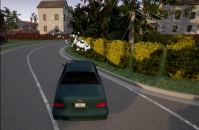

# Sensors reference

- [__Collision detector__](#collision-detector)
- [__Depth camera__](#depth-camera)
- [__GNSS sensor__](#gnss-sensor)
- [__IMU sensor__](#imu-sensor)
- [__Lane invasion detector__](#lane-invasion-detector)
- [__LIDAR sensor__](#lidar-sensor)
- [__Obstacle detector__](#obstacle-detector)
- [__Radar sensor__](#radar-sensor)
- [__RGB camera__](#rgb-camera)
- [__RSS sensor__](#rss-sensor)
- [__Semantic LIDAR sensor__](#semantic-lidar-sensor)
- [__Semantic segmentation camera__](#semantic-segmentation-camera)
- [__Instance segmentation camera__](#instance-segmentation-camera)
- [__DVS camera__](#dvs-camera)
- [__Optical Flow camera__](#optical-flow-camera)

!!! Important
    All the sensors use the UE coordinate system (__x__-*forward*, __y__-*right*, __z__-*up*), and return coordinates in local space. When using any visualization software, pay attention to its coordinate system. Many invert the Y-axis, so visualizing the sensor data directly may result in mirrored outputs.  

---
## Collision detector

* __Blueprint:__ sensor.other.collision
* __Output:__ [carla.CollisionEvent](python_api.md#carla.CollisionEvent) per collision.

This sensor registers an event each time its parent actor collisions against something in the world. Several collisions may be detected during a single simulation step.
To ensure that collisions with any kind of object are detected, the server creates "fake" actors for elements such as buildings or bushes so the semantic tag can be retrieved to identify it.

Collision detectors do not have any configurable attribute.

#### Output attributes

| Sensor data attribute            | Type  | Description        |
| ----------------------- | ----------------------- | ----------------------- |
| `frame`            | int   | Frame number when the measurement took place.      |
| `timestamp`        | double | Simulation time of the measurement in seconds since the beginning of the episode.        |
| `transform`        | [carla.Transform](<../python_api#carlatransform>)  | Location and rotation in world coordinates of the sensor at the time of the measurement. |
| `actor`            | [carla.Actor](<../python_api#carlaactor>)    | Actor that measured the collision (sensor's parent).           |
| `other_actor`      | [carla.Actor](<../python_api#carlaactor>)    | Actor against whom the parent collided.      |
| `normal_impulse`     | [carla.Vector3D](<../python_api#carlavector3d>)    | Normal impulse result of the collision.      |


---
## Depth camera

* __Blueprint:__ sensor.camera.depth
* __Output:__ [carla.Image](python_api.md#carla.Image) per step (unless `sensor_tick` says otherwise).

The camera provides a raw data of the scene codifying the distance of each pixel to the camera (also known as **depth buffer** or **z-buffer**) to create a depth map of the elements.

The image codifies depth value per pixel using 3 channels of the RGB color space, from less to more significant bytes: _R -> G -> B_. The actual distance in meters can be
decoded with:

```
normalized = (R + G * 256 + B * 256 * 256) / (256 * 256 * 256 - 1)
in_meters = 1000 * normalized
```

The output [carla.Image](python_api.md#carla.Image) should then be saved to disk using a [carla.colorConverter](python_api.md#carla.ColorConverter) that will turn the distance stored in RGB channels into a __[0,1]__ float containing the distance and then translate this to grayscale.
There are two options in [carla.colorConverter](python_api.md#carla.ColorConverter) to get a depth view: __Depth__ and __Logaritmic depth__. The precision is milimetric in both, but the logarithmic approach provides better results for closer objects.

```py
...
raw_image.save_to_disk("path/to/save/converted/image",carla.Depth)
```


#### Basic camera attributes


| Blueprint attribute       | Type    | Default | Description   |
| ----------------------------- | ----------------------------- | ----------------------------- | ----------------------------- |
| `image_size_x`            | int     | 800     | Image width in pixels.      |
| `image_size_y`            | int     | 600     | Image height in pixels.     |
| `fov`   | float   | 90\.0   | Horizontal field of view in degrees.    |
| `sensor_tick` | float   | 0\.0    | Simulation seconds between sensor captures (ticks). |


#### Camera lens distortion attributes


| Blueprint attribute      | Type         | Default      | Description  |
| ------------------------- | ------------------------- | ------------------------- | ------------------------- |
| `lens_circle_falloff`    | float        | 5\.0         | Range: [0.0, 10.0]       |
| `lens_circle_multiplier` | float        | 0\.0         | Range: [0.0, 10.0]       |
| `lens_k`     | float        | \-1.0        | Range: [-inf, inf]       |
| `lens_kcube` | float        | 0\.0         | Range: [-inf, inf]       |
| `lens_x_size`            | float        | 0\.08        | Range: [0.0, 1.0]        |
| `lens_y_size`            | float        | 0\.08        | Range: [0.0, 1.0]        |


#### Output attributes


| Sensor data attribute            | Type  | Description        |
| ----------------------- | ----------------------- | ----------------------- |
| `frame`            | int   | Frame number when the measurement took place.      |
| `timestamp`        | double | Simulation time of the measurement in seconds since the beginning of the episode.        |
| `transform`        | [carla.Transform](<../python_api#carlatransform>)  | Location and rotation in world coordinates of the sensor at the time of the measurement. |
| `width`            | int   | Image width in pixels.           |
| `height`           | int   | Image height in pixels.          |
| `fov` | float | Horizontal field of view in degrees.         |
| `raw_data`         | bytes | Array of BGRA 32-bit pixels.     |


---
## GNSS sensor

* __Blueprint:__ sensor.other.gnss
* __Output:__ [carla.GNSSMeasurement](python_api.md#carla.GnssMeasurement) per step (unless `sensor_tick` says otherwise).

Reports current [gnss position](https://www.gsa.europa.eu/european-gnss/what-gnss) of its parent object. This is calculated by adding the metric position to an initial geo reference location defined within the OpenDRIVE map definition.

#### GNSS attributes


| Blueprint attribute      | Type   | Default            | Description        |
| ------------------- | ------------------- | ------------------- | ------------------- |
| `noise_alt_bias`   | float  | 0\.0   | Mean parameter in the noise model for altitude.    |
| `noise_alt_stddev` | float  | 0\.0   | Standard deviation parameter in the noise model for altitude.  |
| `noise_lat_bias`   | float  | 0\.0   | Mean parameter in the noise model for latitude.    |
| `noise_lat_stddev` | float  | 0\.0   | Standard deviation parameter in the noise model for latitude.  |
| `noise_lon_bias`   | float  | 0\.0   | Mean parameter in the noise model for longitude.   |
| `noise_lon_stddev` | float  | 0\.0   | Standard deviation parameter in the noise model for longitude. |
| `noise_seed`       | int    | 0      | Initializer for a pseudorandom number generator.   |
| `sensor_tick`      | float  | 0\.0   | Simulation seconds between sensor captures (ticks).            |

<br>

#### Output attributes


| Sensor data attribute            | Type  | Description        |
| ----------------------- | ----------------------- | ----------------------- |
| `frame`            | int   | Frame number when the measurement took place.      |
| `timestamp`        | double | Simulation time of the measurement in seconds since the beginning of the episode.        |
| `transform`        | [carla.Transform](<../python_api#carlatransform>)  | Location and rotation in world coordinates of the sensor at the time of the measurement. |
| `latitude`         | double | Latitude of the actor.           |
| `longitude`        | double | Longitude of the actor.          |
| `altitude`         | double | Altitude of the actor.           |


---
## IMU sensor

* __Blueprint:__ sensor.other.imu
* __Output:__ [carla.IMUMeasurement](python_api.md#carla.IMUMeasurement) per step (unless `sensor_tick` says otherwise).

Provides measures that accelerometer, gyroscope and compass would retrieve for the parent object. The data is collected from the object's current state.

#### IMU attributes


| Blueprint attribute | Type    | Default             | Description         |
| -------------------------------- | -------------------------------- | -------------------------------- | -------------------------------- |
| `noise_accel_stddev_x`          | float   | 0\.0    | Standard deviation parameter in the noise model for acceleration (X axis).  |
| `noise_accel_stddev_y`          | float   | 0\.0    | Standard deviation parameter in the noise model for acceleration (Y axis).  |
| `noise_accel_stddev_z`          | float   | 0\.0    | Standard deviation parameter in the noise model for acceleration (Z axis).  |
| `noise_gyro_bias_x` | float   | 0\.0    | Mean parameter in the noise model for the gyroscope (X axis).   |
| `noise_gyro_bias_y` | float   | 0\.0    | Mean parameter in the noise model for the gyroscope (Y axis).   |
| `noise_gyro_bias_z` | float   | 0\.0    | Mean parameter in the noise model for the gyroscope (Z axis).   |
| `noise_gyro_stddev_x`           | float   | 0\.0    | Standard deviation parameter in the noise model for the gyroscope (X axis). |
| `noise_gyro_stddev_y`           | float   | 0\.0    | Standard deviation parameter in the noise model for the gyroscope (Y axis). |
| `noise_gyro_stddev_z`           | float   | 0\.0    | Standard deviation parameter in the noise model for the gyroscope (Z axis). |
| `noise_seed`        | int     | 0       | Initializer for a pseudorandom number generator.    |
| `sensor_tick`       | float   | 0\.0    | Simulation seconds between sensor captures (ticks).             |

<br>

#### Output attributes

| Sensor data attribute            | Type  | Description        |
| ----------------------- | ----------------------- | ----------------------- |
| `frame`            | int   | Frame number when the measurement took place.      |
| `timestamp`        | double | Simulation time of the measurement in seconds since the beginning of the episode.        |
| `transform`        | [carla.Transform](<../python_api#carlatransform>)  | Location and rotation in world coordinates of the sensor at the time of the measurement. |
| `accelerometer`      | [carla.Vector3D](<../python_api#carlavector3d>)    | Measures linear acceleration in `m/s^2`.     |
| `gyroscope`        | [carla.Vector3D](<../python_api#carlavector3d>)    | Measures angular velocity in `rad/sec`.      |
| `compass`          | float | Orientation in radians. North is `(0.0, -1.0, 0.0)` in UE.       |


---
## Lane invasion detector

* __Blueprint:__ sensor.other.lane_invasion
* __Output:__ [carla.LaneInvasionEvent](python_api.md#carla.LaneInvasionEvent) per crossing.

Registers an event each time its parent crosses a lane marking.
The sensor uses road data provided by the OpenDRIVE description of the map to determine whether the parent vehicle is invading another lane by considering the space between wheels.
However there are some things to be taken into consideration:

* Discrepancies between the OpenDRIVE file and the map will create irregularities such as crossing lanes that are not visible in the map.
* The output retrieves a list of crossed lane markings: the computation is done in OpenDRIVE and considering the whole space between the four wheels as a whole. Thus, there may be more than one lane being crossed at the same time.

This sensor does not have any configurable attribute.

!!! Important
    This sensor works fully on the client-side.

#### Output attributes

| Sensor data attribute            | Type  | Description        |
| ----------------------- | ----------------------- | ----------------------- |
| `frame`            | int   | Frame number when the measurement took place.      |
| `timestamp`        | double | Simulation time of the measurement in seconds since the beginning of the episode.        |
| `transform`        | [carla.Transform](<../python_api#carlatransform>)  | Location and rotation in world coordinates of the sensor at the time of the measurement. |
| `actor`            | [carla.Actor](<../python_api#carlaactor>)    | Vehicle that invaded another lane (parent actor).  |
| `crossed_lane_markings`          | list([carla.LaneMarking](<../python_api#carlalanemarking>))      | List of lane markings that have been crossed.      |


---
## LIDAR sensor

* __Blueprint:__ sensor.lidar.ray_cast
* __Output:__ [carla.LidarMeasurement](python_api.md#carla.LidarMeasurement) per step (unless `sensor_tick` says otherwise).

This sensor simulates a rotating LIDAR implemented using ray-casting.
The points are computed by adding a laser for each channel distributed in the vertical FOV. The rotation is simulated computing the horizontal angle that the Lidar rotated in a frame. The point cloud is calculated by doing a ray-cast for each laser in every step.
`points_per_channel_each_step = points_per_second / (FPS * channels)`

A LIDAR measurement contains a package with all the points generated during a `1/FPS` interval. During this interval the physics are not updated so all the points in a measurement reflect the same "static picture" of the scene.

This output contains a cloud of simulation points and thus, it can be iterated to retrieve a list of their [`carla.Location`](python_api.md#carla.Location):

```py
for location in lidar_measurement:
    print(location)
```

The information of the LIDAR measurement is enconded 4D points. Being the first three, the space points in xyz coordinates and the last one intensity loss during the travel. This intensity is computed by the following formula.
<br>


`a` — Attenuation coefficient. This may depend on the sensor's wavelenght, and the conditions of the atmosphere. It can be modified with the LIDAR attribute `atmosphere_attenuation_rate`.
`d` — Distance from the hit point to the sensor.

For a better realism, points in the cloud can be dropped off. This is an easy way to simulate loss due to external perturbations. This can done combining two different.

*   __General drop-off__ — Proportion of points that are dropped off randomly. This is done before the tracing, meaning the points being dropped are not calculated, and therefore improves the performance. If `dropoff_general_rate = 0.5`, half of the points will be dropped.
*   __Instensity-based drop-off__ — For each point detected, and extra drop-off is performed with a probability based in the computed intensity. This probability is determined by two parameters. `dropoff_zero_intensity` is the probability of points with zero intensity to be dropped. `dropoff_intensity_limit` is a threshold intensity above which no points will be dropped. The probability of a point within the range to be dropped is a linear proportion based on these two parameters.

Additionally, the `noise_stddev` attribute makes for a noise model to simulate unexpected deviations that appear in real-life sensors. For positive values, each point is randomly perturbed along the vector of the laser ray. The result is a LIDAR sensor with perfect angular positioning, but noisy distance measurement.

The rotation of the LIDAR can be tuned to cover a specific angle on every simulation step (using a [fixed time-step](adv_synchrony_timestep.md)). For example, to rotate once per step (full circle output, as in the picture below), the rotation frequency and the simulated FPS should be equal. <br> __1.__ Set the sensor's frequency `sensors_bp['lidar'][0].set_attribute('rotation_frequency','10')`. <br> __2.__ Run the simulation using `python3 config.py --fps=10`.


#### Lidar attributes


| Blueprint attribute  | Type   | Default    | Description     |
| ----------------------------------------------------------------- | ----------------------------------------------------------------- | ----------------------------------------------------------------- | ----------------------------------------------------------------- |
| `channels`         | int    | 32     | Number of lasers.  |
| `range`            | float  | 10.0  | Maximum distance to measure/raycast in meters (centimeters for CARLA 0.9.6 or previous).  |
| `points_per_second` | int    | 56000  | Points generated by all lasers per second.    |
| `rotation_frequency`            | float  | 10.0  | LIDAR rotation frequency.       |
| `upper_fov`        | float  | 10.0  | Angle in degrees of the highest laser.        |
| `lower_fov`        | float  | -30.0 | Angle in degrees of the lowest laser.         |
| `horizontal_fov`   | float | 360.0 | Horizontal field of view in degrees, 0 - 360. |
| `atmosphere_attenuation_rate`     | float  | 0.004 | Coefficient that measures the LIDAR instensity loss per meter. Check the intensity computation above. |
| `dropoff_general_rate`          | float  | 0.45  | General proportion of points that are randomy dropped.    |
| `dropoff_intensity_limit`       | float  | 0.8   | For the intensity based drop-off, the threshold intensity value above which no points are dropped.    |
| `dropoff_zero_intensity`        | float  | 0.4   | For the intensity based drop-off, the probability of each point with zero intensity being dropped.    |
| `sensor_tick`      | float  | 0.0   | Simulation seconds between sensor captures (ticks). |
| `noise_stddev`     | float  | 0.0   | Standard deviation of the noise model to disturb each point along the vector of its raycast. |


#### Output attributes

| Sensor data attribute            | Type  | Description        |
| ----------------------- | ----------------------- | ----------------------- |
| `frame`            | int   | Frame number when the measurement took place.      |
| `timestamp`        | double | Simulation time of the measurement in seconds since the beginning of the episode.        |
| `transform`        | [carla.Transform](<../python_api#carlatransform>)  | Location and rotation in world coordinates of the sensor at the time of the measurement. |
| `horizontal_angle`   | float | Angle (radians) in the XY plane of the LIDAR in the current frame.           |
| `channels`         | int   | Number of channels (lasers) of the LIDAR.    |
| `get_point_count(channel)`       | int   | Number of points per channel captured this frame.  |
| `raw_data`         | bytes | Array of 32-bits floats (XYZI of each point).      |


<br>

## Obstacle detector

* __Blueprint:__ sensor.other.obstacle
* __Output:__ [carla.ObstacleDetectionEvent](python_api.md#carla.ObstacleDetectionEvent) per obstacle (unless `sensor_tick` says otherwise).

Registers an event every time the parent actor has an obstacle ahead.
In order to anticipate obstacles, the sensor creates a capsular shape ahead of the parent vehicle and uses it to check for collisions.
To ensure that collisions with any kind of object are detected, the server creates "fake" actors for elements such as buildings or bushes so the semantic tag can be retrieved to identify it.


| Blueprint attribute          | Type       | Default    | Description      |
| -------------------------------- | -------------------------------- | -------------------------------- | -------------------------------- |
| `distance` | float      | 5          | Distance to trace.           |
| `hit_radius`     | float      | 0\.5       | Radius of the trace.         |
| `only_dynamics`  | bool       | False      | If true, the trace will only consider dynamic objects. |
| `debug_linetrace` | bool       | False      | If true, the trace will be visible.        |
| `sensor_tick`    | float      | 0\.0       | Simulation seconds between sensor captures (ticks).    |

<br>

#### Output attributes

| Sensor data attribute            | Type  | Description        |
| ----------------------- | ----------------------- | ----------------------- |
| `frame`            | int   | Frame number when the measurement took place.      |
| `timestamp`        | double | Simulation time of the measurement in seconds since the beginning of the episode.        |
| `transform`        | [carla.Transform](<../python_api#carlatransform>)  | Location and rotation in world coordinates of the sensor at the time of the measurement. |
| `actor`            | [carla.Actor](<../python_api#carlaactor>)    | Actor that detected the obstacle (parent actor).   |
| `other_actor`      | [carla.Actor](<../python_api#carlaactor>)    | Actor detected as an obstacle.   |
| `distance`         | float | Distance from `actor` to `other_actor`.      |


<br>

## Radar sensor

* __Blueprint:__ sensor.other.radar
* __Output:__ [carla.RadarMeasurement](python_api.md#carla.RadarMeasurement) per step (unless `sensor_tick` says otherwise).

The sensor creates a conic view that is translated to a 2D point map of the elements in sight and their speed regarding the sensor. This can be used to shape elements and evaluate their movement and direction. Due to the use of polar coordinates, the points will concentrate around the center of the view.

Points measured are contained in [carla.RadarMeasurement](python_api.md#carla.RadarMeasurement) as an array of [carla.RadarDetection](python_api.md#carla.RadarDetection), which specifies their polar coordinates, distance and velocity.
This raw data provided by the radar sensor can be easily converted to a format manageable by __numpy__:
```py
# To get a numpy [[vel, azimuth, altitude, depth],...[,,,]]:
points = np.frombuffer(radar_data.raw_data, dtype=np.dtype('f4'))
points = np.reshape(points, (len(radar_data), 4))
```

The provided script `manual_control.py` uses this sensor to show the points being detected and paint them white when static, red when moving towards the object and blue when moving away:



| Blueprint attribute       | Type    | Default | Description   |
| ----------------------------- | ----------------------------- | ----------------------------- | ----------------------------- |
| `horizontal_fov`          | float   | 30\.0   | Horizontal field of view in degrees.    |
| `points_per_second`       | int     | 1500    | Points generated by all lasers per second.          |
| `range` | float   | 100     | Maximum distance to measure/raycast in meters.      |
| `sensor_tick` | float   | 0\.0    | Simulation seconds between sensor captures (ticks). |
| `vertical_fov`            | float   | 30\.0   | Vertical field of view in degrees.      |

<br>

#### Output attributes

| Sensor data attribute | Type            | Description     |
| ---------------- | ---------------- | ---------------- |
| `raw_data`      | [carla.RadarDetection](<../python_api#carlaradardetection>) | The list of points detected.      |

<br>

| RadarDetection attributes    | Type             | Description      |
| ---------------------------- | ---------------------------- | ---------------------------- |
| `altitude`       | float            | Altitude angle in radians.   |
| `azimuth`        | float            | Azimuth angle in radians.    |
| `depth`          | float            | Distance in meters.          |
| `velocity`       | float            | Velocity towards the sensor. |


---
## RGB camera

* __Blueprint:__ sensor.camera.rgb
* __Output:__ [carla.Image](python_api.md#carla.Image) per step (unless `sensor_tick` says otherwise)..

The "RGB" camera acts as a regular camera capturing images from the scene.
[carla.colorConverter](python_api.md#carla.ColorConverter)

If `enable_postprocess_effects` is enabled, a set of post-process effects is applied to the image for the sake of realism:

* __Vignette:__ darkens the border of the screen.
* __Grain jitter:__ adds some noise to the render.
* __Bloom:__ intense lights burn the area around them.
* __Auto exposure:__ modifies the image gamma to simulate the eye adaptation to darker or brighter areas.
* __Lens flares:__ simulates the reflection of bright objects on the lens.
* __Depth of field:__ blurs objects near or very far away of the camera.


The `sensor_tick` tells how fast we want the sensor to capture the data.
A value of 1.5 means that we want the sensor to capture data each second and a half. By default a value of 0.0 means as fast as possible.


#### Basic camera attributes


<br>

| Blueprint attribute  | Type     | Default  | Description          |
| ----------------------------------------------------- | ----------------------------------------------------- | ----------------------------------------------------- | ----------------------------------------------------- |
| `bloom_intensity`    | float    | 0\.675   | Intensity for the bloom post-process effect, `0.0` for disabling it.         |
| `fov`    | float    | 90\.0    | Horizontal field of view in degrees.   |
| `fstop`  | float    | 1\.4     | Opening of the camera lens. Aperture is `1/fstop` with typical lens going down to f/1.2 (larger opening). Larger numbers will reduce the Depth of Field effect. |
| `image_size_x`       | int      | 800      | Image width in pixels.           |
| `image_size_y`       | int      | 600      | Image height in pixels.          |
| `iso`    | float    | 100\.0   | The camera sensor sensitivity.   |
| `gamma`  | float    | 2\.2     | Target gamma value of the camera.      |
| `lens_flare_intensity`           | float    | 0\.1     | Intensity for the lens flare post-process effect, `0.0` for disabling it.    |
| `sensor_tick`        | float    | 0\.0     | Simulation seconds between sensor captures (ticks).  |
| `shutter_speed`      | float    | 200\.0   | The camera shutter speed in seconds (1.0/s).       |


#### Camera lens distortion attributes


<br>

| Blueprint attribute      | Type         | Default      | Description  |
| ------------------------------------------------------- | ------------------------------------------------------- | ------------------------------------------------------- | ------------------------------------------------------- |
| `lens_circle_falloff`    | float        | 5\.0         | Range: [0.0, 10.0]       |
| `lens_circle_multiplier` | float        | 0\.0         | Range: [0.0, 10.0]       |
| `lens_k`     | float        | \-1.0        | Range: [-inf, inf]       |
| `lens_kcube` | float        | 0\.0         | Range: [-inf, inf]       |
| `lens_x_size`            | float        | 0\.08        | Range: [0.0, 1.0]        |
| `lens_y_size`            | float        | 0\.08        | Range: [0.0, 1.0]        |


#### Advanced camera attributes

Since these effects are provided by UE, please make sure to check their documentation:

  * [Automatic Exposure][AutomaticExposure.Docs]
  * [Cinematic Depth of Field Method][CinematicDOFMethod.Docs]
  * [Color Grading and Filmic Tonemapper][ColorGrading.Docs]

[AutomaticExposure.Docs]: https://docs.unrealengine.com/en-US/Engine/Rendering/PostProcessEffects/AutomaticExposure/index.html
[CinematicDOFMethod.Docs]: https://docs.unrealengine.com/en-US/Engine/Rendering/PostProcessEffects/DepthOfField/CinematicDOFMethods/index.html
[ColorGrading.Docs]: https://docs.unrealengine.com/en-US/Engine/Rendering/PostProcessEffects/ColorGrading/index.html

| Blueprint attribute  | Type           | Default        | Description    |
| ------------------------------------------------------------- | ------------------------------------------------------------- | ------------------------------------------------------------- | ------------------------------------------------------------- |
| `min_fstop`    | float          | 1\.2           | Maximum aperture.    |
| `blade_count`  | int            | 5  | Number of blades that make up the diaphragm mechanism.     |
| `exposure_mode`      | str            | `histogram`    | Can be `manual` or `histogram`. More in [UE4 docs](<https://docs.unrealengine.com/en-US/Engine/Rendering/PostProcessEffects/AutomaticExposure/index.html>).  |
| `exposure_compensation`          | float          | **Linux:** \+0.75<br>**Windows:** 0\.0        | Logarithmic adjustment for the exposure. 0: no adjustment, -1:2x darker, -2:4 darker, 1:2x brighter, 2:4x brighter.   |
| `exposure_min_bright`            | float          | 10\.0           | In `exposure_mode: "histogram"`. Minimum brightness for auto exposure. The lowest the eye can adapt within. Must be greater than 0 and less than or equal to `exposure_max_bright`.  |
| `exposure_max_bright`            | float          | 12\.0           | In \`exposure\_mode: "histogram"\`. Maximum brightness for auto exposure. The highestthe eye can adapt within. Must be greater than 0 and greater than or equal to \`exposure\_min\_bright\`.          |
| `exposure_speed_up`  | float          | 3\.0           | In `exposure_mode: "histogram"`. Speed at which the adaptation occurs from dark to bright environment.  |
| `exposure_speed_down`            | float          | 1\.0           | In `exposure_mode: "histogram"`. Speed at which the adaptation occurs from bright to dark environment.  |
| `calibration_constant`           | float          | 16\.0          | Calibration constant for 18% albedo.           |
| `focal_distance`     | float          | 1000\.0        | Distance at which the depth of field effect should be sharp. Measured in cm (UE units).           |
| `blur_amount`  | float          | 1\.0           | Strength/intensity of motion blur.             |
| `blur_radius`  | float          | 0\.0           | Radius in pixels at 1080p resolution to emulate atmospheric scattering according to distance from camera.           |
| `motion_blur_intensity`          | float          | 0\.45          | Strength of motion blur [0,1].     |
| `motion_blur_max_distortion`       | float          | 0\.35          | Max distortion caused by motion blur. Percentage of screen width.       |
| `motion_blur_min_object_screen_size`           | float          | 0\.1           | Percentage of screen width objects must have for motion blur, lower value means less draw calls.  |
| `slope`        | float          | 0\.88          | Steepness of the S-curve for the tonemapper. Larger values make the slope steeper (darker) [0.0, 1.0].  |
| `toe`          | float          | 0\.55          | Adjusts dark color in the tonemapper [0.0, 1.0].           |
| `shoulder`     | float          | 0\.26          | Adjusts bright color in the tonemapper [0.0, 1.0].         |
| `black_clip`   | float          | 0\.0           | This should NOT be adjusted. Sets where the crossover happens and black tones start to cut off their value [0.0, 1.0].            |
| `white_clip`   | float          | 0\.04          | Set where the crossover happens and white tones start to cut off their value. Subtle change in most cases [0.0, 1.0].             |
| `temp`         | float          | 6500\.0        | White balance in relation to the temperature of the light in the scene. **White light:** when this matches light temperature. **Warm light:** When higher than the light in the scene, it is a yellowish color. **Cool light:** When lower than the light. Blueish color.     |
| `tint`         | float          | 0\.0           | White balance temperature tint. Adjusts cyan and magenta color ranges. This should be used along with the white balance Temp property to get accurate colors. Under some light temperatures, the colors may appear to be more yellow or blue. This can be used to balance the resulting color to look more natural. |
| `chromatic_aberration_intensity`   | float          | 0\.0           | Scaling factor to control color shifting, more noticeable on the screen borders.      |
| `chromatic_aberration_offset`      | float          | 0\.0           | Normalized distance to the center of the image where the effect takes place.          |
| `enable_postprocess_effects`       | bool           | True           | Post-process effects activation.   |

<br>

[AutomaticExposure.gamesetting]: https://docs.unrealengine.com/en-US/Engine/Rendering/PostProcessEffects/AutomaticExposure/index.html#gamesetting

#### Output attributes

| Sensor data attribute            | Type  | Description        |
| ----------------------- | ----------------------- | ----------------------- |
| `frame`            | int   | Frame number when the measurement took place.      |
| `timestamp`        | double | Simulation time of the measurement in seconds since the beginning of the episode.        |
| `transform`        | [carla.Transform](<../python_api#carlatransform>)  | Location and rotation in world coordinates of the sensor at the time of the measurement. |
| `width`            | int   | Image width in pixels.           |
| `height`           | int   | Image height in pixels.          |
| `fov` | float | Horizontal field of view in degrees.         |
| `raw_data`         | bytes | Array of BGRA 32-bit pixels.     |


---
## RSS sensor

*   __Blueprint:__ sensor.other.rss
*   __Output:__ [carla.RssResponse](python_api.md#carla.RssResponse) per step (unless `sensor_tick` says otherwise).

!!! Important
    It is highly recommended to read the specific [rss documentation](adv_rss.md) before reading this.

This sensor integrates the [C++ Library for Responsibility Sensitive Safety](https://github.com/intel/ad-rss-lib) in CARLA. It is disabled by default in CARLA, and it has to be explicitly built in order to be used.

The RSS sensor calculates the RSS state of a vehicle and retrieves the current RSS Response as sensor data. The [carla.RssRestrictor](python_api.md#carla.RssRestrictor) will use this data to adapt a [carla.VehicleControl](python_api.md#carla.VehicleControl) before applying it to a vehicle.

These controllers can be generated by an *Automated Driving* stack or user input. For instance, hereunder there is a fragment of code from `PythonAPI/examples/rss/manual_control_rss.py`, where the user input is modified using RSS when necessary.

__1.__ Checks if the __RssSensor__ generates a valid response containing restrictions.
__2.__ Gathers the current dynamics of the vehicle and the vehicle physics.
__3.__ Applies restrictions to the vehicle control using the response from the RssSensor, and the current dynamics and physicis of the vehicle.

```py
rss_proper_response = self._world.rss_sensor.proper_response if self._world.rss_sensor and self._world.rss_sensor.response_valid else None
if rss_proper_response:
...
        vehicle_control = self._restrictor.restrict_vehicle_control(
            vehicle_control, rss_proper_response, self._world.rss_sensor.ego_dynamics_on_route, self._vehicle_physics)
```


#### The carla.RssSensor class

The blueprint for this sensor has no modifiable attributes. However, the [carla.RssSensor](python_api.md#carla.RssSensor) object that it instantiates has attributes and methods that are detailed in the Python API reference. Here is a summary of them.

| [carla.RssSensor variables](<../python_api#carlarsssensor>)     | Type    | Description         |
| ---------------------------------------- | ---------------------------------------- | ---------------------------------------- |
| `ego_vehicle_dynamics`    | [ad.rss.world.RssDynamics](<https://intel.github.io/ad-rss-lib/ad_rss/Appendix-ParameterDiscussion/>)  | RSS parameters to be applied for the ego vehicle    |
| `other_vehicle_dynamics`  | [ad.rss.world.RssDynamics](<https://intel.github.io/ad-rss-lib/ad_rss/Appendix-ParameterDiscussion/>)  | RSS parameters to be applied for the other vehicles |
| `pedestrian_dynamics`     | [ad.rss.world.RssDynamics](<https://intel.github.io/ad-rss-lib/ad_rss/Appendix-ParameterDiscussion/>)  | RSS parameters to be applied for pedestrians        |
| `road_boundaries_mode`    | [carla.RssRoadBoundariesMode](<../python_api#carlarssroadboundariesmode>)      | Enables/Disables the [stay on road](<https://intel.github.io/ad-rss-lib/ad_rss_map_integration/HandleRoadBoundaries>) feature. Default is **Off**. |

<br>


```py
# Fragment of rss_sensor.py
# The carla.RssSensor is updated when listening for a new carla.RssResponse
def _on_rss_response(weak_self, response):
...
        self.timestamp = response.timestamp
        self.response_valid = response.response_valid
        self.proper_response = response.proper_response
        self.ego_dynamics_on_route = response.ego_dynamics_on_route
        self.rss_state_snapshot = response.rss_state_snapshot
        self.situation_snapshot = response.situation_snapshot
        self.world_model = response.world_model
```

!!! Warning
    This sensor works fully on the client side. There is no blueprint in the server. Changes on the attributes will have effect __after__ the *listen()* has been called.

The methods available in this class are related to the routing of the vehicle. RSS calculations are always based on a route of the ego vehicle through the road network.

The sensor allows to control the considered route by providing some key points, which could be the [carla.Transform](python_api.md#carla.Transform) in a [carla.Waypoint](python_api.md#carla.Waypoint). These points are best selected after the intersections to force the route to take the desired turn.

| [carla.RssSensor methods](<../python_api#carlarsssensor>)     | Description       |
| ----------------------------------------- | ----------------------------------------- |
| `routing_targets` | Get the current list of routing targets used for route.       |
| `append_routing_target` | Append an additional position to the current routing targets. |
| `reset_routing_targets` | Deletes the appended routing targets.             |
| `drop_route`      | Discards the current route and creates a new one. |
| `register_actor_constellation_callback`           | Register a callback to customize the calculations.            |
| `set_log_level`   | Sets the log level.     |
| `set_map_log_level`     | Sets the log level used for map related logs.     |


<br>

---


```py
# Update the current route
self.sensor.reset_routing_targets()
if routing_targets:
    for target in routing_targets:
        self.sensor.append_routing_target(target)
```

!!! Note
    If no routing targets are defined, a random route is created.

#### Output attributes

| [carla.RssResponse attributes](<../python_api#carlarssresponse>)           | Type  | Description       |
| ------------------------------------- | ------------------------------------- | ------------------------------------- |
| `response_valid`  | bool  | Validity of the response data.      |
| `proper_response` | [ad.rss.state.ProperResponse](<https://intel.github.io/ad-rss-lib/doxygen/ad_rss/structad_1_1rss_1_1state_1_1ProperResponse.html>)   | Proper response that the RSS calculated for the vehicle including acceleration restrictions.         |
| `rss_state_snapshot`    | [ad.rss.state.RssStateSnapshot](<https://intel.github.io/ad-rss-lib/doxygen/ad_rss/structad_1_1rss_1_1state_1_1RssStateSnapshot.html>)           | RSS states at the current point in time. This is the detailed individual output of the RSS calclulations.  |
| `situation_snapshot`    | [ad.rss.situation.SituationSnapshot](<https://intel.github.io/ad-rss-lib/doxygen/ad_rss/structad_1_1rss_1_1situation_1_1SituationSnapshot.html>) | RSS situation at the current point in time. This is the processed input data for the RSS calclulations.    |
| `world_model`     | [ad.rss.world.WorldModel](<https://intel.github.io/ad-rss-lib/doxygen/ad_rss/structad_1_1rss_1_1world_1_1WorldModel.html>)           | RSS world model at the current point in time. This is the input data for the RSS calculations.       |
| `ego_dynamics_on_route` | [carla.RssEgoDynamicsOnRoute](<../python_api#carlarssegodynamicsonroute>)    | Current ego vehicle dynamics regarding the route. |


In case a actor_constellation_callback is registered, a call is triggered for:

1. default calculation (`actor_constellation_data.other_actor=None`)
2. per-actor calculation

```py
# Fragment of rss_sensor.py
# The function is registered as actor_constellation_callback
def _on_actor_constellation_request(self, actor_constellation_data):
    actor_constellation_result = carla.RssActorConstellationResult()
    actor_constellation_result.rss_calculation_mode = ad.rss.map.RssMode.NotRelevant
    actor_constellation_result.restrict_speed_limit_mode = ad.rss.map.RssSceneCreation.RestrictSpeedLimitMode.IncreasedSpeedLimit10
    actor_constellation_result.ego_vehicle_dynamics = self.current_vehicle_parameters
    actor_constellation_result.actor_object_type = ad.rss.world.ObjectType.Invalid
    actor_constellation_result.actor_dynamics = self.current_vehicle_parameters

    actor_id = -1
    actor_type_id = "none"
    if actor_constellation_data.other_actor != None:
        # customize actor_constellation_result for specific actor
        ...
    else:
        # default
        ...
    return actor_constellation_result
```


---
## Semantic LIDAR sensor

* __Blueprint:__ sensor.lidar.ray_cast_semantic
* __Output:__ [carla.SemanticLidarMeasurement](python_api.md#carla.SemanticLidarMeasurement) per step (unless `sensor_tick` says otherwise).

This sensor simulates a rotating LIDAR implemented using ray-casting that exposes all the information about the raycast hit. Its behaviour is quite similar to the [LIDAR sensor](#lidar-sensor), but there are two main differences between them.

*   The raw data retrieved by the semantic LIDAR includes more data per point.
	*   Coordinates of the point (as the normal LIDAR does).
	*   The cosine between the angle of incidence and the normal of the surface hit.
	*   Instance and semantic ground-truth. Basically the index of the CARLA object hit, and its semantic tag.
*   The semantic LIDAR does not include neither intensity, drop-off nor noise model attributes.

The points are computed by adding a laser for each channel distributed in the vertical FOV. The rotation is simulated computing the horizontal angle that the LIDAR rotated in a frame. The point cloud is calculated by doing a ray-cast for each laser in every step.
```sh
points_per_channel_each_step = points_per_second / (FPS * channels)
```

A LIDAR measurement contains a package with all the points generated during a `1/FPS` interval. During this interval the physics are not updated so all the points in a measurement reflect the same "static picture" of the scene.

This output contains a cloud of lidar semantic detections and therefore, it can be iterated to retrieve a list of their [`carla.SemanticLidarDetection`](python_api.md#carla.SemanticLidarDetection):

```py
for detection in semantic_lidar_measurement:
    print(detection)
```

The rotation of the LIDAR can be tuned to cover a specific angle on every simulation step (using a [fixed time-step](adv_synchrony_timestep.md)). For example, to rotate once per step (full circle output, as in the picture below), the rotation frequency and the simulated FPS should be equal. <br>
__1.__ Set the sensor's frequency `sensors_bp['lidar'][0].set_attribute('rotation_frequency','10')`. <br>
__2.__ Run the simulation using `python3 config.py --fps=10`.


#### SemanticLidar attributes


<br>

| Blueprint attribute  | Type           | Default | Description    |
| ------------------------------------- | ------------------ | ------------------- | ------------------------------------- |
| `channels`         | int   | 32    | Number of lasers.  |
| `range`            | float | 10.0 | Maximum distance to measure/raycast in meters (centimeters for CARLA 0.9.6 or previous). |
| `points_per_second`    | int   | 56000 | Points generated by all lasers per second.   |
| `rotation_frequency`   | float | 10.0 | LIDAR rotation frequency.       |
| `upper_fov`        | float | 10.0 | Angle in degrees of the highest laser.    |
| `lower_fov`        | float | -30.0 | Angle in degrees of the lowest laser.     |
| `horizontal_fov`   | float | 360.0 | Horizontal field of view in degrees, 0 - 360. |
| `sensor_tick`      | float | 0.0  | Simulation seconds between sensor captures (ticks).   |


<br>


#### Output attributes


| Sensor data attribute  | Type           | Description    |
| ------------------------------------- | ------------------------------------- | ------------------------------------- |
| `frame`        | int            | Frame number when the measurement took place.  |
| `timestamp`    | double         | Simulation time of the measurement in seconds since the beginning of the episode.   |
| `transform`    | [carla.Transform](<../python_api#carlatransform>)     | Location and rotation in world coordinates of the sensor at the time of the measurement. |
| `horizontal_angle`         | float          | Angle (radians) in the XY plane of the LIDAR in the current frame.     |
| `channels`     | int            | Number of channels (lasers) of the LIDAR.      |
| `get_point_count(channel)` | int            | Number of points per channel captured in the current frame.            |
| `raw_data`     | bytes          | Array containing the point cloud with instance and semantic information. For each point, four 32-bits floats are stored. <br>  XYZ coordinates. <br> cosine of the incident angle. <br> Unsigned int containing the index of the object hit. <br>  Unsigned int containing the semantic tag of the object it. |


## Semantic segmentation camera

*   __Blueprint:__ sensor.camera.semantic_segmentation
*   __Output:__ [carla.Image](python_api.md#carla.Image) per step (unless `sensor_tick` says otherwise).

This camera classifies every object in sight by displaying it in a different color according to its tags (e.g., pedestrians in a different color than vehicles).
When the simulation starts, every element in scene is created with a tag. So it happens when an actor is spawned. The objects are classified by their relative file path in the project. For example, meshes stored in `Unreal/CarlaUE4/Content/Static/Pedestrians` are tagged as `Pedestrian`.


The server provides an image with the tag information __encoded in the red channel__: A pixel with a red value of `x` belongs to an object with tag `x`.
This raw [carla.Image](python_api.md#carla.Image) can be stored and converted it with the help of __CityScapesPalette__  in [carla.ColorConverter](python_api.md#carla.ColorConverter) to apply the tags information and show picture with the semantic segmentation.

```py
...
raw_image.save_to_disk("path/to/save/converted/image",carla.cityScapesPalette)
```

The following tags are currently available:

| Value          | Tag            | Converted color  | Description      |
| ----------------------------------- | ----------------------------------- | ----------------------------------- | ----------------------------------- |
| `0`            | Unlabeled      | `(0, 0, 0)`      | Elements that have not been categorized are considered `Unlabeled`. This category is meant to be empty or at least contain elements with no collisions.     |
| `1`            | Building       | `(70, 70, 70)`   | Buildings like houses, skyscrapers,... and the elements attached to them. <br> E.g. air conditioners, scaffolding, awning or ladders and much more.       |
| `2`            | Fence          | `(100, 40, 40)`  | Barriers, railing, or other upright structures. Basically wood or wire assemblies that enclose an area of ground.           |
| `3`            | Other          | `(55, 90, 80)`   | Everything that does not belong to any other category.       |
| `4`            | Pedestrian       | `(220, 20, 60)`  | Humans that walk or ride/drive any kind of vehicle or mobility system. <br> E.g. bicycles or scooters, skateboards, horses, roller-blades, wheel-chairs, etc.         |
| `5`            | Pole           | `(153, 153, 153)`            | Small mainly vertically oriented pole. If the pole has a horizontal part (often for traffic light poles) this is also considered pole. <br> E.g. sign pole, traffic light poles.     |
| `6`            | RoadLine       | `(157, 234, 50)`             | The markings on the road.    |
| `7`            | Road           | `(128, 64, 128)`             | Part of ground on which cars usually drive. <br> E.g. lanes in any directions, and streets.       |
| `8`            | SideWalk       | `(244, 35, 232)`             | Part of ground designated for pedestrians or cyclists. Delimited from the road by some obstacle (such as curbs or poles), not only by markings. This label includes a possibly delimiting curb, traffic islands (the walkable part), and pedestrian zones. |
| `9`            | Vegetation       | `(107, 142, 35)`             | Trees, hedges, all kinds of vertical vegetation. Ground-level vegetation is considered `Terrain`.   |
| `10`           | Vehicles       | `(0, 0, 142)`    | Cars, vans, trucks, motorcycles, bikes, buses, trains.       |
| `11`           | Wall           | `(102, 102, 156)`            | Individual standing walls. Not part of a building.         |
| `12`           | TrafficSign      | `(220, 220, 0)`  | Signs installed by the state/city authority, usually for traffic regulation. This category does not include the poles where signs are attached to. <br> E.g. traffic- signs, parking signs, direction signs...     |
| `13`           | Sky            | `(70, 130, 180)`             | Open sky. Includes clouds and the sun.   |
| `14`           | Ground         | `(81, 0, 81)`    | Any horizontal ground-level structures that does not match any other category. For example areas shared by vehicles and pedestrians, or flat roundabouts delimited from the road by a curb.        |
| `15`           | Bridge         | `(150, 100, 100)`            | Only the structure of the bridge. Fences, people, vehicles, an other elements on top of it are labeled separately.          |
| `16`           | RailTrack      | `(230, 150, 140)`            | All kind of rail tracks that are non-drivable by cars. <br> E.g. subway and train rail tracks.    |
| `17`           | GuardRail      | `(180, 165, 180)`            | All types of guard rails/crash barriers. |
| `18`           | TrafficLight     | `(250, 170, 30)`             | Traffic light boxes without their poles. |
| `19`           | Static         | `(110, 190, 160)`            | Elements in the scene and props that are immovable. <br> E.g. fire hydrants, fixed benches, fountains, bus stops, etc.    |
| `20`           | Dynamic        | `(170, 120, 50)`             | Elements whose position is susceptible to change over time. <br> E.g. Movable trash bins, buggies, bags, wheelchairs, animals, etc.         |
| `21`           | Water          | `(45, 60, 150)`  | Horizontal water surfaces. <br> E.g. Lakes, sea, rivers.   |
| `22`           | Terrain        | `(145, 170, 100)`            | Grass, ground-level vegetation, soil or sand. These areas are not meant to be driven on. This label includes a possibly delimiting curb.      |

<br>

!!! Note
    Read [this](tuto_D_create_semantic_tags.md) tutorial to create new semantic tags.

## Instance segmentation camera 

*   __Blueprint:__ sensor.camera.instance_segmentation
*   __Output:__ [carla.Image](python_api.md#carla.Image) per step (unless `sensor_tick` says otherwise).

This camera classifies every object in the field of view both by class and also by instance ID. 
When the simulation starts, every element in scene is created with a tag. So it happens when an actor is spawned. The objects are classified by their relative file path in the project. For example, meshes stored in `Unreal/CarlaUE4/Content/Static/Pedestrians` are tagged as `Pedestrian`.


The server provides an image with the tag information __encoded in the red channel__: A pixel with a red value of `x` belongs to an object with tag `x`. The green and blue values of the pixel define the object's unique ID. For example a pixel with an 8 bit RGB value of [10, 20, 55] is a vehicle (Semantic tag 10) with a unique instance ID `20-55`.  

#### Basic camera attributes

| Blueprint attribute       | Type    | Default | Description   |
| ----------------------------- | ----------------------------- | ----------------------------- | ----------------------------- |
| `fov`   | float   | 90\.0   | Horizontal field of view in degrees.    |
| `image_size_x`            | int     | 800     | Image width in pixels.      |
| `image_size_y`            | int     | 600     | Image height in pixels.     |
| `sensor_tick` | float   | 0\.0    | Simulation seconds between sensor captures (ticks). |


---

#### Camera lens distortion attributes

| Blueprint attribute      | Type         | Default      | Description  |
| ---------------------------- | ---------------------------- | ---------------------------- | ---------------------------- |
| `lens_circle_falloff`    | float        | 5\.0         | Range: [0.0, 10.0]       |
| `lens_circle_multiplier` | float        | 0\.0         | Range: [0.0, 10.0]       |
| `lens_k`     | float        | \-1.0        | Range: [-inf, inf]       |
| `lens_kcube` | float        | 0\.0         | Range: [-inf, inf]       |
| `lens_x_size`            | float        | 0\.08        | Range: [0.0, 1.0]        |
| `lens_y_size`            | float        | 0\.08        | Range: [0.0, 1.0]        |


---

#### Output attributes

| Sensor data attribute            | Type  | Description        |
| ----------------------- | ----------------------- | ----------------------- |
| `fov` | float | Horizontal field of view in degrees.         |
| `frame`            | int   | Frame number when the measurement took place.      |
| `height`           | int   | Image height in pixels.          |
| `raw_data`         | bytes | Array of BGRA 32-bit pixels.     |
| `timestamp`        | double | Simulation time of the measurement in seconds since the beginning of the episode.        |
| `transform`        | [carla.Transform](<../python_api#carlatransform>)  | Location and rotation in world coordinates of the sensor at the time of the measurement. |
| `width`            | int   | Image width in pixels.           |


---

## DVS camera

*   __Blueprint:__ sensor.camera.dvs
*   __Output:__ [carla.DVSEventArray](python_api.md#carla.DVSEventArray) per step (unless `sensor_tick` says otherwise).


A Dynamic Vision Sensor (DVS) or Event camera is a sensor that works radically differently from a conventional camera. Instead of capturing
intensity images at a fixed rate, event cameras measure changes of intensity asynchronously, in the form of a stream of events, which encode per-pixel
brightness changes. Event cameras possess distinct properties when compared to standard cameras. They have a very high dynamic range (140 dB
versus 60 dB), no motion blur, and high temporal resolution (in the order of microseconds). Event cameras are thus sensors that can provide high-quality
visual information even in challenging high-speed scenarios and high dynamic range environments, enabling new application domains for vision-based
algorithms.

The DVS camera outputs a stream of events. An event `e=(x,y,t,pol)` is triggered at a pixel `x`, `y` at a timestamp `t` when the change in
logarithmic intensity `L` reaches a predefined constant threshold `C` (typically between 15% and 30%).

``
L(x,y,t) - L(x,y,t-\delta t) = pol C
``

`t-\delta t` is the time when the last event at that pixel was triggered and `pol` is the polarity of the event according to the sign of the
brightness change. The polarity is positive `+1` when there is increment in brightness and negative `-1` when a decrement in brightness occurs. The
working principles depicted in the following figure. The standard camera outputs frames at a fixed rate, thus sending redundant information
when no motion is present in the scene. In contrast, event cameras are data-driven sensors that respond to brightness changes with microsecond
latency. At the plot, a positive (resp. negative) event (blue dot, resp. red dot) is generated whenever the (signed) brightness change exceeds the
contrast threshold `C` for one dimension `x` over time `t`. Observe how the event rate grows when the signal changes rapidly.


The current implementation of the DVS camera works in a uniform sampling manner between two consecutive synchronous frames. Therefore, in order to
emulate the high temporal resolution (order of microseconds) of a real event camera, the sensor requires to execute at a high frequency (much higher
frequency than a conventional camera). Effectively, the number of events increases the faster a CARLA car drives. Therefore, the sensor frequency
should increase accordingly with the dynamics of the scene. The user should find a balance between time accuracy and computational cost.

The provided script [`manual_control.py`][manual_control] uses the DVS camera in order to show how to configure the sensor, how to get the stream of events and how to depict such events in an image format, usually called event frame.

[manual_control]: https://github.com/carla-simulator/carla/blob/master/PythonAPI/examples/manual_control.py

Note that due to the sampling method of the DVS camera, if there is no pixel difference between two consecutive synchronous frames the camera will not return an image. This will always occur in the first frame, as there is no previous frame to compare to and also in the event that there has been no movement between frames. 


DVS is a camera and therefore has all the attributes available in the RGB camera. Nevertheless, there are few attributes exclusive to the working principle of an Event camera.

#### DVS camera attributes

| Blueprint attribute    | Type    | Default  | Description          |
| ---------------------- | ---------------------- | ---------------------- | ---------------------- |
| `positive_threshold`   | float   | 0\.3    | Positive threshold C associated to a increment in brightness change (0-1).     |
| `negative_threshold`   | float   | 0\.3    | Negative threshold C associated to a decrement in brightness change (0-1).     |
| `sigma_positive_threshold`         | float   | 0       | White noise standard deviation for positive events (0-1).        |
| `sigma_negative_threshold`         | float   | 0       | White noise standard deviation for negative events (0-1).        |
| `refractory_period_ns`             | int     | 0\.0    | Refractory period (time during which a pixel cannot fire events just after it fired one), in nanoseconds. It limits the highest frequency of triggering events.   |
| `use_log`            | bool    | true    | Whether to work in the logarithmic intensity scale.  |
| `log_eps`            | float   | 0\.001  | Epsilon value used to convert images to log: `L = log(eps + I / 255.0)`.<br>  Where `I` is the grayscale value of the RGB image: <br>`I = 0.2989*R + 0.5870*G + 0.1140*B`. |

<br>

---

## Optical Flow Camera

The Optical Flow camera captures the motion perceived from the point of view of the camera. Every pixel recorded by this sensor encodes the velocity of that point projected to the image plane. The velocity of a pixel is encoded in the range [-2,2]. To obtain the motion in pixel units, this information can be scaled with the image size to [-2 * image_size, 2 * image_size].


#### Optical Flow camera attributes

| Blueprint attribute | Type | Default | Description |
| ------------------- | ---- | ------- | ----------- |
| `image_size_x` | int | 800 | Image width in pixels. |
| `image_size_y` | int | 600 | Image height in pixels. |
| `fov` | float | 90.0 | Horizontal field of view in degrees. |
| `sensor_tick` | float | 0.0 | Simulation seconds between sensor captures (ticks). |

#### Optical Flow camera lens distortion attributes

| Blueprint attribute      | Type         | Default      | Description  |
| ------------------------------------------------------- | ------------------------------------------------------- | ------------------------------------------------------- | ------------------------------------------------------- |
| `lens_circle_falloff`    | float        | 5\.0         | Range: [0.0, 10.0]       |
| `lens_circle_multiplier` | float        | 0\.0         | Range: [0.0, 10.0]       |
| `lens_k`     | float        | \-1.0        | Range: [-inf, inf]       |
| `lens_kcube` | float        | 0\.0         | Range: [-inf, inf]       |
| `lens_x_size`            | float        | 0\.08        | Range: [0.0, 1.0]        |
| `lens_y_size`            | float        | 0\.08        | Range: [0.0, 1.0]        |

#### Output attributes

| Sensor data attribute | Type | Description |
| --------------------- | ---- | ----------- |
| `frame` | int | Frame number when the measurement took place. |
| `timestamp` | double | Simulation time of the measurement in seconds since the beginning of the episode. |
| `transform` | [carla.Transform](<../python_api#carlatransform>) | Location and rotation in world coordinates of the sensor at the time of the measurement. |
| `width` | int | Image width in pixels. |
| `height` | int | Image height in pixels. |
| `fov` | float | Horizontal field of view in degrees. |
| `raw_data` | bytes | Array of BGRA 64-bit pixels containing two float values. |

<br>
