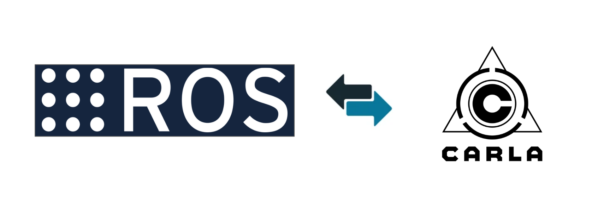

# ROS2 native interface



The CARLA simulator supports ROS2 natively from the server. To use ROS2 with CARLA, launch the CARLA simulator from the command line with the `--ros2` command line option:

```sh
./CarlaUnreal.sh --ros2
```

## Middleware (RMW)

The native connector can publish through any of three middlewares. Select one with the `--rmw=` option, which is only valid together with `--ros2`:

```sh
./CarlaUnreal.sh --ros2 --rmw=cyclonedds
```

Accepted values are `fastdds` (the default), `cyclonedds`, and `zenoh`. CycloneDDS and Zenoh are only available on Linux; on Windows only `fastdds` is supported. If the value is not recognized, or names a middleware that was not compiled into the binary, ROS2 is disabled for that session and an error is logged listing the available middlewares. The published topics and message formats are identical across all middlewares.

`--rmw=zenoh` is compatible with `rmw_zenoh_cpp` peers and requires a Zenoh router (`ros2 run rmw_zenoh_cpp rmw_zenohd`) running before the simulator starts. The session connects to `tcp/localhost:7447` by default; set `ZENOH_SESSION_CONFIG_URI` to point at a different rmw_zenoh config file, or `ZENOH_CONFIG_OVERRIDE` to patch individual keys.

## Sensor data

The CARLA server will broadcast sensor data for any spawned sensors for which ROS is enabled. To enable a sensor for ROS use the `enable_for_ros()` method of the sensor class:

```py
sensor = world.spawn_actor(sensor_blueprint, transform)
sensor.enable_for_ros()
```

Set the ROS topic name in the sensor blueprint prior to spawning (a random string name will be generated by default):

```py
bp = bp_lib.find('sensor.camera.rgb')
bp.set_attribute('ros_name', 'front_camera')
```

In this case the image data will be published to: `/carla/front_camera/image`. 

If the camera is parented to an actor, for example the ego vehicle, the topic name will also include the role name given to the vehicle: `/carla/ego/front_camera/image`.

See the [ROS2 sensors reference](ros2_native_sensors.md) for details about the message formats used for each sensor type.

## Control data

Controls may be sent to one ego vehicle:

```py
bp = bp.find("vehicle.lincoln.mkz_2020")
bp.set_attribute("ros_name", "ego")

ego = carla.spawn_actor(bp, spawn_point)
```

When the ego vehicle is spawned a subscriber will be created with ROS topic name: `/carla/ego/vehicle_control_cmd`. 

## CarlaEgoVehicleControl.msg

To send control messages, install the [ros-carla-msgs ROS package](https://github.com/carla-simulator/ros-carla-msgs/tree/master). The control message has the following fields:

| Field                                                                                                   | Type                                                                                                    | Description                                                                                             |
| ------------------------------------------------------------------------------------------------------- | ------------------------------------------------------------------------------------------------------- | ------------------------------------------------------------------------------------------------------- |
| `header`                                                                                                | [Header](https://docs.ros.org/en/melodic/api/std_msgs/html/msg/Header.html)                               | Time stamp and frame ID when the message is published.                                                  |
| `throttle`                                                                                              | float32                                                                                                 | Scalar value to cotrol the vehicle throttle: **[0.0, 1.0]**                                             |
| `steer`                                                                                                 | float32                                                                                                 | Scalar value to control the vehicle steering direction: **[-1.0, 1.0]** to control the vehicle steering |
| `brake`                                                                                                 | float32                                                                                                 | Scalar value to control the vehicle brakes: **[0.0, 1.0]**                                              |
| `hand_brake`                                                                                            | bool                                                                                                    | If **True**, the hand brake is enabled.                                                                 |
| `reverse`                                                                                               | bool                                                                                                    | If **True**, the vehicle will move reverse.                                                             |
| `gear`                                                                                                  | int32                                                                                                   | Changes between the available gears in a vehicle.                                                       |
| `manual_gear_shift`                                                                                     | bool                                                                                                    | If **True**, the gears will be shifted using `gear`.                                                    |

---


